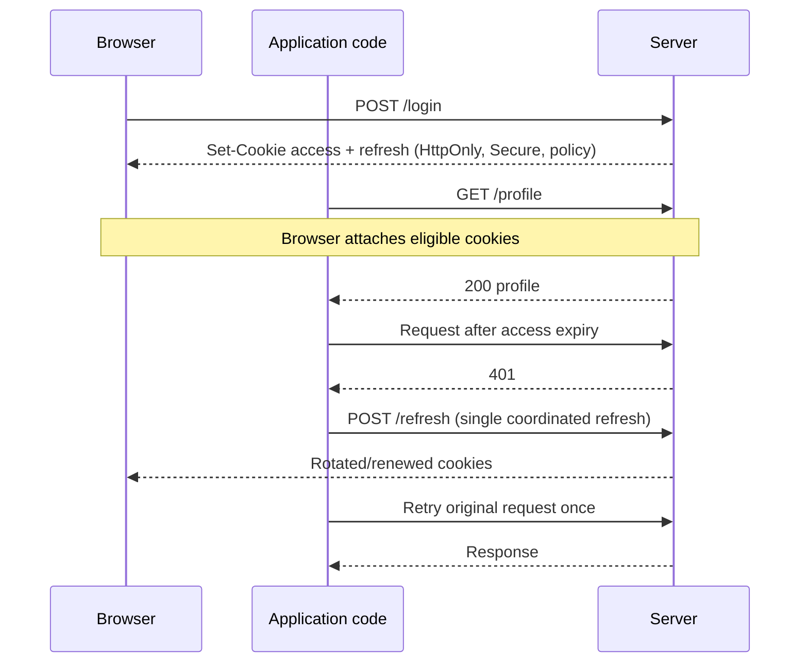
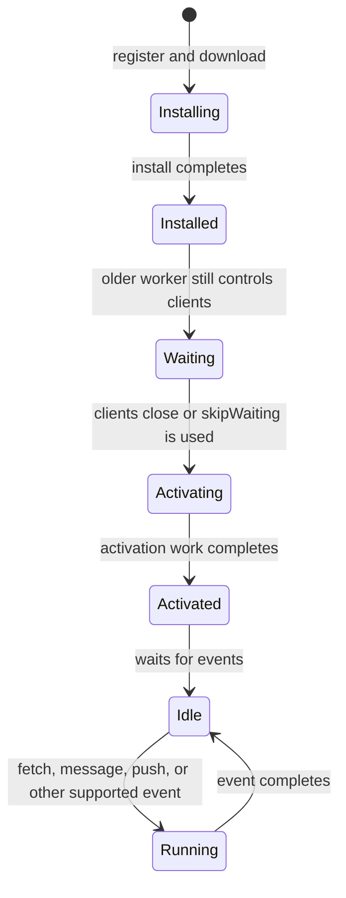

# JavaScript, Browser, and React Internals: Principal Engineer Interview Guide

> A single study guide for JavaScript execution, scope and closures, browser storage and workers, Web Vitals, and React rendering. It is organized around **why a mechanism exists, how it works, where it fits in production, and what can go wrong**.
>
> The browser and React internals described here are intentionally separated into stable platform behavior and implementation details that may evolve. Use the latter as mental models, not as promises from a public API.

## Contents

- [1. How to Use This Guide](#1-how-to-use-this-guide)
- [2. Runtime, Engine, and Execution Context](#2-runtime-engine-and-execution-context)
- [3. Event Loop and Asynchronous Work](#3-event-loop-and-asynchronous-work)
- [4. Hoisting, TDZ, and Lexical Scope](#4-hoisting-tdz-and-lexical-scope)
- [5. Closures, Async Lifetimes, and Memory](#5-closures-async-lifetimes-and-memory)
- [6. Values, Copies, and Prototypes](#6-values-copies-and-prototypes)
- [7. Browser Storage: Choosing the Right Boundary](#7-browser-storage-choosing-the-right-boundary)
- [8. Cookies, Authentication, and Request Security](#8-cookies-authentication-and-request-security)
- [9. Web Workers and Service Workers](#9-web-workers-and-service-workers)
- [10. Cache Storage and Offline Strategy](#10-cache-storage-and-offline-strategy)
- [11. Core Web Vitals and Performance Operations](#11-core-web-vitals-and-performance-operations)
- [12. React Rendering and Reconciliation](#12-react-rendering-and-reconciliation)
- [13. Fiber, Scheduling, and Concurrent UI](#13-fiber-scheduling-and-concurrent-ui)
- [14. Components, Effects, and Error Boundaries](#14-components-effects-and-error-boundaries)
- [15. Production Scenarios and Architecture Decisions](#15-production-scenarios-and-architecture-decisions)
- [16. Interview Drill Set](#16-interview-drill-set)
- [17. Final Revision Sheet](#17-final-revision-sheet)

---

## 1. How to Use This Guide

### A practical study loop

1. Read the section once for the mental model; do not memorize isolated slogans.
2. Trace the code examples by hand. Write down what is synchronous, what is queued, and which binding each identifier resolves to.
3. Answer each section's follow-up questions aloud. State assumptions before making a recommendation.
4. Revisit the production scenarios and explain the trade-off, failure mode, and measurement you would use.
5. Before an interview, use the final revision sheet to find weak areas rather than rereading every paragraph.

### Interview answer pattern

For an unfamiliar architecture question, a reliable answer structure is:

- **Requirement:** What user or business outcome matters?
- **Mechanism:** Which platform or React behavior enables it?
- **Trade-off:** What does it cost in latency, memory, security, complexity, or freshness?
- **Failure and recovery:** What happens offline, on retry, after deploy, or on stale state?
- **Evidence:** Which metric, log, test, or rollout signal would confirm the design works?

> **Must know:** Principal-level answers distinguish specification guarantees from common implementation details, and make the security and operational assumptions explicit.

---

## 2. Runtime, Engine, and Execution Context

### 2.1 The runtime is larger than the JavaScript engine

**Why:** JavaScript code needs more than an engine to interact with timers, networks, storage, or a document. The language is reused in browsers, Node.js, workers, and other hosts, each with different APIs and scheduling behavior.

**How:** The engine parses and executes JavaScript. A host runtime supplies capabilities such as timers, `fetch`, DOM APIs, file or network I/O, and an event loop. The engine's call stack runs JavaScript; the host handles many external operations and later schedules their results.

```text
Browser runtime
+-------------------------------------------------------+
| Host: DOM, timers, fetch, storage, event loop          |
|                                                       |
|  JavaScript engine                                    |
|  +----------------------+  +----------------------+   |
|  | Call stack           |  | Heap / managed memory|   |
|  +----------------------+  +----------------------+   |
|                                                       |
|  Task queues and microtask checkpoints                |
+-------------------------------------------------------+
```

The call stack and heap are useful teaching models, not an exhaustive list of engine internals. Garbage collection, JIT compilation, and host scheduling add more machinery.

**Where to use this model:** Diagnose a blocked UI, explain why a network request does not freeze JavaScript, or compare browser scheduling with Node.js scheduling. Do not assume the same host APIs or event-loop phases exist everywhere.

### 2.2 Compilation: JIT and AOT

JavaScript engines commonly interpret/execute code and compile hot paths with just-in-time (JIT) techniques. Ahead-of-time (AOT) compilation happens before program execution. These are broad implementation categories, not mutually exclusive labels for every language or toolchain: modern runtimes may combine parsing, bytecode, interpretation, profiling, and multiple compilation tiers.

**Why it matters:** JIT optimization can improve frequently executed code, but startup, warm-up, de-optimization, and runtime variability matter. Do not claim that JavaScript is “only interpreted” or that JIT automatically makes it faster than another language. Measure representative cold and warm workloads.

**Where to use this model:** Reason about startup versus steady-state performance, benchmark design, and why a microbenchmark may not represent user experience.

### 2.3 Call stack and execution contexts

A function call creates an execution context containing the state needed to evaluate that call: bindings, scope relationships, and `this` where applicable. The call stack tracks active nested calls in last-in, first-out order.

```js
function first() {
  second();
}

function second() {
  third();
}

function third() {}

first();
```

While `third` runs, the active calls are conceptually `third` → `second` → `first` → script. When `third` returns, execution resumes in `second`.

**Why a stack:** Nested calls must return to their caller in reverse order. A stack naturally represents that relationship.

**Important precision:** It is useful to say a function call adds a stack frame, but execution contexts are language-level/specification concepts, not necessarily literal heap objects laid out exactly as a diagram suggests. Individual statements are not each pushed as separate stack entries.

### 2.4 Synchronous execution and memory references

JavaScript executes one job at a time within a given agent/execution context. A long synchronous loop blocks that context from responding to input. Passing an object to a function does **not** deep-copy it, but JavaScript is still pass-by-value: the value being passed is a reference to the object.

```js
function update(user) {
  user.name = "Sam"; // mutates the object shared with the caller
}

const account = { name: "Lee" };
update(account);
```

A function can mutate the same object through its local parameter. Reassigning the parameter does not reassign the caller's variable.

```js
function replace(user) {
  user = { name: "New object" }; // only changes the local parameter
}
```

> **Avoid saying:** “Objects are passed by reference.” Better: “The object reference is passed by value; the caller and callee can both use that reference to mutate the same object.”

### 2.5 Execution-context lifecycle: an important correction

A function's active stack frame is removed when the call returns. That does **not** mean the browser's global environment disappears whenever the stack becomes empty. A browser document or module continues to exist between tasks, and its global/module bindings remain available for later work. A closure may keep some outer bindings reachable after a function returns.

Also, “execution context” and “lexical environment” are useful concepts for reasoning, but not two physical boxes whose exact allocation and lifetime can be inferred from a diagram. Engines may optimize storage as long as observable behavior follows the language rules.

### Review checklist

- [ ] Can I distinguish the engine from the host runtime?
- [ ] Can I trace nested calls and explain what the stack represents?
- [ ] Can I explain pass-by-value of an object reference without calling it pass-by-reference?
- [ ] Do I avoid claiming that the browser global context vanishes whenever the stack empties?

### Follow-up questions

1. Why can `fetch()` wait on network I/O while a CPU-heavy loop still blocks typing in the same tab?
2. If a function changes `user.name` and then assigns `user = {}`, which change can the caller observe, and why?
3. What differs between a browser's event loop and Node.js's event loop even when both use V8?

---

## 3. Event Loop and Asynchronous Work

### 3.1 What the event loop does

**Why:** JavaScript needs a way to coordinate synchronous code with timers, user input, rendering, and completed I/O without executing two pieces of JavaScript simultaneously in the same agent.

**How:** The host schedules work. In browsers, the event loop processes tasks from task sources and performs microtask checkpoints. Promise reactions and `queueMicrotask()` callbacks run as microtasks. Timers and many input events are tasks. The exact event loop is host-defined; “macrotask” is common informal vocabulary, while standards more often say “task.”

A useful simplified cycle is:

```text
Run current JavaScript to completion
        ↓
At a microtask checkpoint, run queued microtasks until empty
        ↓
The browser may get a rendering opportunity
        ↓
Select another task and repeat
```

Browsers have multiple task sources and rendering rules, so do not present this picture as a universal, exact scheduler. A microtask that continually queues another microtask can starve tasks and delay rendering.

### 3.2 Promise and timer ordering

```js
console.log("A");

setTimeout(() => console.log("B"), 0);

Promise.resolve().then(() => console.log("C"));

console.log("D");
```

Typical browser output:

```text
A
D
C
B
```

**Step by step:**

1. The current script runs synchronously: `A` prints.
2. `setTimeout` registers a timer with the host; it does not run its callback inline.
3. `.then(...)` schedules a promise reaction as a microtask.
4. The script continues and prints `D`.
5. At the microtask checkpoint, `C` prints.
6. Once eligible and selected, the timer task runs and prints `B`.

`setTimeout(fn, 0)` means “make this callback eligible after a delay floor,” not “run immediately.” Browser throttling, nested-timer clamping, and a busy thread can make it later.

### 3.3 More ordering rules worth knowing

- A Promise executor runs synchronously when `new Promise(executor)` is called. Its `.then` reaction runs asynchronously as a microtask.
- An `async` function runs synchronously until it reaches an `await` that suspends it. Its continuation is scheduled through promise-job/microtask machinery.
- `queueMicrotask(fn)` explicitly schedules a microtask.
- `MutationObserver` notifications are delivered through microtask processing in browsers.
- `localStorage.getItem()` and `setItem()` are synchronous APIs; `await` does not make them asynchronous.
- Browser DOM events are not all in one literal shared “macrotask queue”; task sources and scheduling rules matter.

### 3.4 Concurrency is not parallel execution

Within one JavaScript agent, JavaScript jobs do not run simultaneously. The host can run network or timer work while JavaScript is idle, and a browser can run separate worker agents. A worker can execute JavaScript on another thread, but it has its own execution context and communicates by messages rather than sharing ordinary mutable objects.

Use **concurrency** for overlapping work and progress over time; use **parallelism** for simultaneous execution on multiple processors/threads. Browser workers provide real parallel execution for suitable work, while the event loop coordinates asynchronous work on the main thread.

### Where to use this model

Use event-loop reasoning for UI freezes, ordering bugs, promise chains, timers, event handlers, storage calls, and worker boundaries. For production responsiveness, break up long tasks, move CPU-heavy work to a worker when justified, and avoid unbounded microtask chains.

### Common pitfalls

- Assuming a zero-delay timer runs before Promise callbacks.
- Calling JavaScript “asynchronous” without separating language execution from host scheduling.
- Assuming every browser callback uses the same queue or the same scheduling priority.
- Assuming moving a slow network call off the call stack also moves expensive JSON parsing or data transformation off the main thread.

### Review checklist

- [ ] Can I trace synchronous work, microtasks, and tasks in a short snippet?
- [ ] Can I explain why a Promise executor and its `.then` callback run at different times?
- [ ] Can I explain why `await localStorage.getItem(...)` is misleading?
- [ ] Do I know that a long task blocks rendering and input in its agent?

### Follow-up questions

1. What does this print, and why?

   ```js
   setTimeout(() => console.log("timer"));
   Promise.resolve().then(() => {
     console.log("first");
     queueMicrotask(() => console.log("nested microtask"));
   });
   console.log("sync");
   ```

2. Why can a chain that repeatedly queues microtasks make a page appear frozen even though each callback is short?
3. When does a web worker help with a large API response, and when would it merely move the bottleneck?

---

## 4. Hoisting, TDZ, and Lexical Scope

### 4.1 Hoisting is declaration instantiation, not code movement

**Why:** Before executing statements in a scope, JavaScript establishes bindings for declarations. This makes declaration order observable in specific ways and allows function declarations to be called before their textual location.

**How:** Think of each scope as having declarations set up before ordinary statements execute. The source text is not physically moved. The exact behavior depends on declaration type and context (script, module, function, block).

```js
console.log(score); // undefined
var score = 10;

sayHello(); // works
function sayHello() {
  console.log("Hello");
}
```

### 4.2 Declaration behavior

| Declaration                 | Binding behavior before its line                                                                            | Scope                                                                           | Typical early access result                                                                 |
| --------------------------- | ----------------------------------------------------------------------------------------------------------- | ------------------------------------------------------------------------------- | ------------------------------------------------------------------------------------------- |
| `var x`                     | Binding initialized to `undefined` when its function/script scope is instantiated                           | Function-scoped; top-level behavior differs between classic scripts and modules | Reads as `undefined`                                                                        |
| `let x`                     | Binding exists but is uninitialized until declaration executes                                              | Block-scoped                                                                    | `ReferenceError` in the TDZ                                                                 |
| `const x`                   | Same TDZ behavior; must be initialized at declaration                                                       | Block-scoped                                                                    | `ReferenceError` in the TDZ                                                                 |
| Function declaration        | Function binding is initialized during declaration instantiation                                            | Scope-dependent; block function details depend on strict/module semantics       | Usually callable before textual declaration                                                 |
| Function expression / arrow | The variable follows its own declaration rule; the function value is assigned only when that statement runs | Depends on `var`/`let`/`const`                                                  | `TypeError` if a `var` binding is still `undefined`; TDZ `ReferenceError` for `let`/`const` |

```js
run(); // TypeError: run is undefined, not a function
var run = function () {};

// With `let run = () => {}`, calling before initialization throws ReferenceError.
```

Arrow functions are not “never hoisted” as a standalone rule. The binding is established according to `var`/`let`/`const`; the assigned arrow function is not available until assignment executes.

### 4.3 Temporal Dead Zone

The TDZ is the period after entering a scope in which a lexical binding exists but cannot yet be accessed, ending when initialization occurs. It is a state/time window of a binding, not a separate physical memory region.

```js
{
  // `limit` is in its TDZ here
  // console.log(limit); // ReferenceError
  let limit = 5;
  console.log(limit); // 5
}
```

It is not safe to describe `let` and `const` as “not hoisted.” Their bindings are established for the scope, but remain uninitialized during the TDZ.

### 4.4 Shadowing and scope lookup

JavaScript resolves an identifier from the innermost applicable lexical scope outward. The first binding found wins.

```js
let rate = 10;

function getRate() {
  if (rate === undefined) {
    var rate = 6;
  }
  return rate;
}

console.log(getRate()); // 6
```

The `var rate` is function-scoped and shadows the outer `rate` throughout `getRate`. It is initialized to `undefined` before the condition runs, so the condition is true and the function returns `6`.

With `let` inside the block:

```js
let rate = 10;

function getRate() {
  if (rate === undefined) {
    let rate = 6;
  }
  return rate;
}

console.log(getRate()); // 10
```

The block-local `rate` does not exist in the condition or after the block. If no outer `rate` existed, the condition's reference would throw `ReferenceError`.

### 4.5 Lexical environment and lexical scoping

A lexical environment is a specification model for a scope's bindings and its link to an outer environment. **Lexical scope means the code's written location determines the scope chain**, not the function's call site.

```js
const label = "global";

function makeReader() {
  const label = "outer";
  return function read() {
    return label;
  };
}

const read = makeReader();
console.log(read()); // "outer"
```

The inner function's source location gives it access to `makeReader`'s environment. Calling it from another function would not change that lexical relationship.

**Why it matters:** It predicts name lookup, shadowing, closures, and common React stale-value behavior. It also makes code easier to reason about because a function's access to outer bindings is not dynamically changed by arbitrary callers.

### Review checklist

- [ ] Can I distinguish function declarations from function expressions?
- [ ] Can I explain the difference between `undefined` and an uninitialized TDZ binding?
- [ ] Can I reason about `var` function scope versus `let` block scope?
- [ ] Can I resolve a variable using the lexical chain instead of the call stack?

### Follow-up questions

1. What happens if a `let` variable is read in its own initializer, such as `let item = item`?
2. Why does `var` in a loop commonly cause callbacks to observe the same final index, while `let` usually gives each iteration a distinct binding?
3. How can classic script top-level `var` differ from top-level `var` in an ES module?

---

## 5. Closures, Async Lifetimes, and Memory

### 5.1 What a closure provides

A closure is a function together with the lexical bindings it can access from the scope where it was created. If the function remains reachable after the outer function returns, the required bindings remain available too.

```js
function createCounter() {
  let count = 0;
  return function increment() {
    count += 1;
    return count;
  };
}

const counter = createCounter();
console.log(counter()); // 1
console.log(counter()); // 2
```

**Why:** `increment` can still access the `count` binding. Returning the function ends the outer call; it does not invalidate the captured binding.

**How:** Closures retain access to bindings, not snapshots of primitive values. If a captured binding changes, a later closure call sees its current value. Engines may optimize what they retain; reason from observable behavior, not a claim that every local variable is literally kept in a heap cell.

### 5.2 Where closures appear in production

- Encapsulation: keep configuration or mutable state private behind methods.
- Callbacks: event listeners, timers, promise handlers, and subscriptions use lexical values.
- React: event handlers and effects close over values from the render that created them. A stale closure is often a handler/effect using an older render's value.
- Factories: build API clients or URL builders around stable configuration.

### 5.3 Loop capture

```js
for (var i = 0; i < 3; i += 1) {
  setTimeout(() => console.log(i), 0);
}
// Common result: 3, 3, 3
```

All callbacks read the same function-scoped `i`, after the loop has advanced it to `3`.

```js
for (let i = 0; i < 3; i += 1) {
  setTimeout(() => console.log(i), 0);
}
// 0, 1, 2
```

A `let` loop creates per-iteration bindings, so each callback reads its iteration's value.

### 5.4 Closure lifetime is not automatically a memory leak

A closure can keep data alive while it is reachable. That is normal behavior, not inherently a leak. A leak-like problem occurs when a reference remains reachable longer than the application needs it, such as a never-cleared subscription, an unbounded cache, or a timer retaining a large object graph.

A pending network request does **not** automatically mean an entire page's lexical environment is leaked. What remains reachable depends on the actual callback graph, retained values, and whether the request or listener can be cancelled or released. Navigating away in an SPA is not by itself proof of a leak.

**Production response:**

- Abort obsolete requests with `AbortController` when appropriate.
- Remove event listeners and unsubscribe from external stores.
- Clear timers and long-lived subscriptions on teardown.
- Avoid retaining large values in callbacks when a small identifier is sufficient.
- Confirm suspected leaks with heap snapshots and repeated navigation/profiling, not intuition alone.

```js
useEffect(() => {
  const controller = new AbortController();

  fetch(`/api/search?q=${encodeURIComponent(query)}`, {
    signal: controller.signal,
  })
    .then(handleResponse)
    .catch((error) => {
      if (error.name !== "AbortError") handleError(error);
    });

  return () => controller.abort();
}, [query]);
```

The request cleanup prevents obsolete work from continuing where possible. It does not replace handling server-side work that has already completed or other application-specific cancellation needs.

### 5.5 React stale closures

Each React render creates handlers/effects that observe that render's props and state. That is expected lexical behavior. A bug appears when a long-lived callback keeps using a value from an older render when the intended behavior requires the latest value.

Typical fixes depend on intent: include dependencies, use a functional state update, keep a subscription synchronized, or use a ref for mutable non-rendering state. Do not blindly omit dependencies to stop an effect from rerunning.

### Review checklist

- [ ] Can I explain a closure without saying the outer execution context remains on the call stack?
- [ ] Do I understand that closures retain access to bindings, not frozen copies?
- [ ] Can I tell normal retention from a genuine leak?
- [ ] Can I name the cleanup for a timer, listener, subscription, or request?

### Follow-up questions

1. A closure refers to one property of a very large object. Does that prove the entire object remains retained? What evidence would you collect?
2. Why can adding an empty dependency array to an effect create stale behavior rather than “fix” a rerender problem?
3. How would you distinguish an unbounded cache from a legitimate long-lived closure in a heap profile?

---

## 6. Values, Copies, and Prototypes

### 6.1 Shallow copy and nested references

Spread syntax and `Object.assign` copy own enumerable properties one level deep. Primitive property values are copied as values; object-valued properties copy a reference to the same nested object.

```js
const original = { name: "Ari", preferences: { color: "green" } };
const copy = { ...original };

copy.preferences.color = "blue";
console.log(original.preferences.color); // "blue"
```

To isolate nested state, choose a deliberate cloning or immutable-update strategy. A deep clone can be wasteful, fail on unsupported values, or erase important class semantics; it is not automatically the right answer.

### 6.2 `structuredClone` and JSON serialization

`structuredClone(value)` supports many built-in data types and cycles, including `Date`, `Map`, and `Set`. It does not clone every possible JavaScript value: functions and some host objects are not cloneable, and application-specific prototype/descriptor behavior should not be assumed to survive. It can also transfer supported transferable objects when requested, detaching the original resource.

`JSON.parse(JSON.stringify(value))` is only suitable for constrained JSON-compatible data:

- Object properties with `undefined`, functions, or symbols are omitted; in arrays, unsupported values are generally serialized as `null`.
- `Date` becomes a string.
- `Map`, `Set`, prototypes, and special values are not preserved as their original types.
- `BigInt` causes serialization to throw unless custom handling is added.
- Circular references throw `TypeError`.

Use a schema-aware serializer or an explicit domain copy when the data model requires it.

### 6.3 Prototypal lookup, shadowing, and deletion

Objects can delegate property lookup through a prototype chain. An own property shadows a property of the same name farther up the chain.

```js
const parent = { value: 1 };
const child = Object.create(parent);

child.value = 2;
console.log(child.value); // 2: own property

delete child.value;
console.log(child.value); // 1: found on parent
```

`delete` removes an own configurable property; it does not remove an inherited property. Assignment does not always create an own property: inherited accessors, non-writable properties, or proxies can change or reject the operation.

### 6.4 Shared prototypes versus per-instance fields

```js
function Item() {}
Item.prototype.kind = "shared";

const first = new Item();
const second = new Item();
first.kind = "local";

console.log(first.kind); // "local"
console.log(second.kind); // "shared"
```

Assignment created an own property on `first`, shadowing the prototype. By contrast, changing `Item.prototype.kind` changes the shared prototype lookup for instances without their own `kind`.

Class instance fields are different: each instance gets its own field value. Class methods are typically placed on the prototype.

### 6.5 Constructor/prototype chain example

```js
function A() {}
A.prototype.value = 10;

function B() {}
B.prototype = Object.create(A.prototype);
B.prototype.constructor = B;
B.prototype.value = 20;

const instance = new B();
console.log(instance.value); // 20
```

`B.prototype.value` shadows `A.prototype.value` for every `B` instance that does not define its own `value`. Restoring `.constructor` is conventional after replacing a constructor's prototype, though `.constructor` itself does not create the inheritance relationship.

### 6.6 Arrays inherited through a prototype

```js
const base = { items: [] };
const derived = Object.create(base);

derived.items.push("x");
console.log(base.items.length); // 1
```

`derived.items` resolves to the same inherited array. Mutating it changes shared state. Prefer instance-owned arrays for mutable per-instance data.

### Review checklist

- [ ] Can I explain shallow copy in terms of nested references?
- [ ] Do I know when structured cloning or JSON cloning loses information?
- [ ] Can I distinguish an own property from an inherited property?
- [ ] Do I check for shared mutable objects on prototypes?

### Follow-up questions

1. Why does deleting `child.value` reveal the parent value rather than making `child.value` undefined?
2. When is `structuredClone` unsuitable even though it handles circular references?
3. In an immutable React update, why is copying only the outer object insufficient if a nested object is then mutated?

---

## 7. Browser Storage: Choosing the Right Boundary

### 7.1 Storage selection is a product and security decision

Ask four questions before choosing storage:

1. Who needs to read it: JavaScript, the server, or both?
2. How long should it live, and how will it expire or be invalidated?
3. How large and structured is it?
4. What happens if it is stolen, stale, unavailable, or evicted?

Capacities are browser- and device-dependent. “5 MB” is a rough historical estimate for some APIs, not a portable production guarantee. Storage can be restricted, evicted, or unavailable under privacy settings and quota pressure.

### 7.2 Decision table

| Mechanism          | Good fit                                                   | Lifetime / scope                                                      | Key constraints                                                               |
| ------------------ | ---------------------------------------------------------- | --------------------------------------------------------------------- | ----------------------------------------------------------------------------- |
| Cookies            | Server-managed session or request metadata                 | Expiry configurable; attached to matching requests                    | Small; request overhead; flags and scope must be correct                      |
| `sessionStorage`   | Small, tab-scoped workflow state                           | Origin and browsing-context/tab scoped; usually ends with the tab     | Synchronous; JavaScript-readable; not a security vault                        |
| `localStorage`     | Small, non-sensitive preferences                           | Origin scoped and persistent until removed                            | Synchronous; blocks main thread; JavaScript-readable; no native per-entry TTL |
| IndexedDB          | Structured records, offline data, larger client datasets   | Origin scoped; persists subject to quota, eviction, and user clearing | Async; transactions and schema upgrades need care                             |
| Cache Storage      | HTTP request/response caching, often with a service worker | Origin scoped; developer-managed entries                              | Not a general object database; no automatic app-level expiry policy           |
| Browser HTTP cache | Normal network response reuse                              | Controlled primarily by HTTP caching rules and browser policy         | Not equivalent to Cache Storage; indirectly influenced via headers            |

Storage APIs are generally partitioned by origin (scheme, host, and port), subject to modern browser privacy partitioning. `https://app.example.com` and `https://api.example.com` are different origins. Cookies have different domain/path matching rules and must not be conflated with Web Storage's origin model.

### 7.3 `sessionStorage` and `localStorage`

**`sessionStorage`:** useful for a tab-local multi-step form or temporary workflow draft. It is synchronous and readable by page JavaScript, so do not treat it as secure storage. A new tab generally has a separate page session, although opener behavior can initially copy a session storage area in some circumstances.

**`localStorage`:** suitable for non-sensitive preferences such as theme or language. Reads and writes are synchronous and can block the main thread, so keep values small and avoid frequent large operations. It has no built-in TTL; store timestamps/schema versions or clear obsolete entries deliberately.

`storage` events can help notify other same-origin browsing contexts of changes, but they do not turn Web Storage into a transactional cross-tab database.

### 7.4 IndexedDB

IndexedDB is an asynchronous, transactional database API for structured client-side records. It supports object stores, indexes, and larger data than Web Storage, subject to browser quotas and eviction policy.

**Use it for:** offline drafts, sizable datasets, structured caches, or data that must not block the UI during routine reads/writes.

**Operational concerns:** plan schema version upgrades, transaction boundaries, quota failures, eviction, migration rollback, and compatibility with multiple open tabs. A wrapper such as Dexie can improve ergonomics; choose it for a concrete maintainability or feature benefit, not on the assumption that wrappers change the underlying storage guarantees.

### 7.5 Expiration, freshness, and schema versioning

Not all storage lacks expiry: cookies have `Expires`/`Max-Age`, and HTTP caching uses directives such as `Cache-Control`. For app-managed storage, freshness and cleanup are generally application responsibilities.

```js
const cached = {
  schemaVersion: 3,
  savedAt: Date.now(),
  value: {
    /* non-sensitive cached data */
  },
};

function isUsable(entry, maxAgeMs) {
  return entry?.schemaVersion === 3 && Date.now() - entry.savedAt <= maxAgeMs;
}
```

A TTL is not the same as a secure expiry. Check version compatibility, handle corrupted data, and define what to do when quota is exceeded. Cache only data the user is permitted to see and that is safe to persist on that device.

### 7.6 Media and large payloads

IndexedDB can store blobs, but that does not mean it is always the right home for large media. Consider browser HTTP caching, Cache Storage, CDN delivery, device quota, offline needs, and eviction. Storing only a URL does not make the media available offline; storing the media bytes does consume quota.

### Review checklist

- [ ] Can I choose storage from sensitivity, lifetime, size, and access needs?
- [ ] Do I avoid putting secrets in JavaScript-readable storage?
- [ ] Do I account for synchronous Web Storage calls blocking the main thread?
- [ ] Do I handle quota, eviction, stale schema, and browser privacy behavior?

### Follow-up questions

1. A product needs an offline draft that may contain personal information. How do you decide whether and how to persist it?
2. Why is IndexedDB a better fit than `localStorage` for a large searchable offline dataset?
3. What migrations and failure paths would you test before shipping a new IndexedDB schema?

---

## 8. Cookies, Authentication, and Request Security

### 8.1 Cookies are transport-attached storage, not a complete auth system

Cookies can be set by a server using `Set-Cookie` and are attached by the browser to matching requests. A cookie is not automatically inaccessible to JavaScript: `HttpOnly` is the flag that prevents page scripts from reading it through `document.cookie`.

| Attribute             | Purpose                                           | Important caveat                                                                           |
| --------------------- | ------------------------------------------------- | ------------------------------------------------------------------------------------------ |
| `HttpOnly`            | Prevents JavaScript from reading the cookie       | XSS may still issue authenticated requests from the victim's page                          |
| `Secure`              | Sends the cookie only over secure transport       | Use HTTPS in production; it does not fix application-level authorization                   |
| `SameSite`            | Controls cookie attachment in cross-site contexts | It is site-oriented, not simply same-origin; test real navigation and embedding flows      |
| `Expires` / `Max-Age` | Sets browser cookie lifetime                      | Server-side session validity and revocation still matter                                   |
| `Domain` / `Path`     | Limits where a cookie is sent                     | Use the narrowest appropriate scope; do not treat these as a replacement for authorization |

`SameSite=Lax` commonly permits cookies on same-site requests and certain top-level cross-site safe navigations, while blocking many cross-site subrequest and unsafe-method cases. `Strict` is more restrictive and can affect link-based entry flows. `None` allows cross-site use and requires `Secure` in modern browsers. Browser policies and third-party-cookie restrictions can still affect embedded flows.

For a host-only session cookie, a common hardening pattern is `Secure; HttpOnly; SameSite=Lax` with no broad `Domain`; the `__Host-` prefix has additional requirements in supporting browsers. Select flags based on the actual app flow and verify them in supported browsers.

### 8.2 CSRF and XSS are different threats

**CSRF:** the browser may attach the victim's cookie to a request initiated from another site. The attacker wants the browser to perform an action using ambient credentials. `SameSite` helps, but sensitive applications may also use CSRF tokens, origin checks, and careful request design.

**XSS:** attacker-controlled JavaScript runs in the application's origin. `HttpOnly` prevents direct token theft through cookie reads, but malicious script can often make authenticated requests and read responses accessible to the page. Prevent XSS with output encoding, safe rendering, dependency hygiene, and a robust Content Security Policy.

Do not say `SameSite=Lax` “rejects the request.” The browser may send the request without the cookie; the server must authenticate and authorize it.

### 8.3 Typical access/refresh flow



The browser attaches cookies; it does not automatically refresh tokens or retry requests. Client logic or a server-side session layer must coordinate refresh behavior.

**Production controls:**

- Keep access credentials short-lived where appropriate; protect refresh credentials and rotate them according to the server's session policy.
- Prevent refresh stampedes when many requests fail together; use one in-flight refresh and queue/retry safely.
- Retry at most once for a given unauthorized response; prevent loops.
- Handle refresh failure by clearing client state and requiring re-authentication.
- Enforce revocation, account disablement, absolute session limits, and authorization on the server.
- Make mutations idempotent or use idempotency keys where retries could duplicate work.
- For cross-origin requests, configure `credentials` and CORS deliberately; wildcard origins cannot be combined with credentialed CORS responses.

A “sliding session” may extend a session during activity, but no user should be promised an infinite session. Balance usability with absolute lifetime, risk signals, revocation, and product policy. A client-side timestamp is not the source of truth for session validity.

### Where to use this model

Use cookie and threat-model reasoning when designing login, embedded applications, cross-site integrations, refresh interceptors, and logout. Decide whether the product needs a server session, token-based design, or both; avoid treating storage choice alone as authentication architecture.

### Review checklist

- [ ] Can I distinguish CSRF from XSS and explain what each cookie flag mitigates?
- [ ] Do I know `HttpOnly` prevents reading but not all authenticated actions by injected script?
- [ ] Can I explain who performs token refresh and how retry loops are prevented?
- [ ] Does the server remain authoritative for expiry, revocation, and authorization?

### Follow-up questions

1. An app moves from same-site pages to a cross-site embedded checkout. Which cookie and CORS assumptions need to be revisited?
2. How would you prevent ten simultaneous `401` responses from triggering ten refresh requests?
3. If a cookie is `HttpOnly`, what can an XSS payload still do, and what additional controls reduce that risk?

---

## 9. Web Workers and Service Workers

### 9.1 Separate execution contexts

JavaScript is single-threaded **within an agent**, not globally across the entire browser. A page can communicate with worker contexts that execute independently and exchange messages. Ordinary objects are not shared by reference across these boundaries; data is structured-cloned or transferred, with specific shared-memory APIs as an advanced exception.

### 9.2 Web Worker

A Web Worker is a general-purpose worker started by a page, useful for CPU-heavy work such as parsing or transforming a large dataset. It cannot directly manipulate the DOM. It is normally tied to the owning page and is terminated when the page/worker lifecycle ends.

```js
// main.js
const worker = new Worker(new URL("./search-worker.js", import.meta.url), {
  type: "module",
});
worker.postMessage({ records, query });
worker.onmessage = ({ data }) => renderResults(data);
```

Workers add startup, serialization, memory, and coordination costs. Send only needed data; transfer large transferable buffers when suitable. They help when CPU work is substantial enough to offset those costs, not for ordinary short calculations.

### 9.3 Service Worker

A Service Worker is a browser-managed worker with an origin- and scope-based lifecycle. It can handle fetch and selected background events, coordinate caching/offline behavior, and participate in push workflows. It cannot access the page DOM or `window.localStorage`; it can use supported asynchronous APIs such as IndexedDB and Cache Storage.

It is not simply a “superset” of a Web Worker. They are distinct worker types with different ownership, lifecycle, and APIs. A service worker may be stopped by the browser when idle and restarted for an event; do not rely on it as a permanently running daemon.

**Registration requirements:** generally requires a secure context (HTTPS; localhost is treated as trustworthy for development), same-origin script, and appropriate scope.

### 9.4 Lifecycle and safe upgrades



A newly installed worker can wait until existing controlled clients release the old version. `skipWaiting()` asks to activate without waiting; `clients.claim()` lets an activated worker take control of eligible clients. Using them can cause a page and worker from different application versions to interact, so coordinate cache versions and message contracts carefully.

### 9.5 Messaging and push

A service worker communicates with pages through messages such as `postMessage`; the page receives the message and performs DOM work. The browser explicitly exposes other APIs for particular use cases, such as opening a window in supported notification flows.

Push requires user permission and a subscription flow with a push service and server. The browser wakes the service worker to handle an eligible event; the worker can show a notification. Permission UX, subscription rotation, delivery failure, and user opt-out are all production concerns.

### Where to use workers

- **Web Worker:** large CPU-bound transformations that would otherwise block interaction.
- **Service Worker:** offline navigation/assets, fetch interception, push, or background capabilities supported by the browser.
- **Neither:** small calculations or ordinary API calls that are already asynchronous and do not block the UI.

### Common pitfalls

- Expecting a worker to query or mutate the DOM.
- Assuming a service worker stays alive continuously.
- Treating service workers as a security boundary or backend replacement.
- Calling service workers a source of shared memory or synchronous parallel execution.
- Activating a new worker without considering old open tabs and cache compatibility.

### Review checklist

- [ ] Can I distinguish worker types, lifecycle, and use cases?
- [ ] Do I know that service-worker execution may be suspended between events?
- [ ] Can I explain message passing and serialization/transfer costs?
- [ ] Do I have an upgrade strategy for open tabs and old caches?

### Follow-up questions

1. A search page freezes while filtering 500,000 records. What would you measure before moving work to a worker?
2. What compatibility failure can occur if a new service worker activates while old clients are open?
3. Why is a service worker not a replacement for server-side authorization or durable background processing?

---

## 10. Cache Storage and Offline Strategy

### 10.1 Three different caches

| Layer              | Stores / controls                                             | Best mental model                                    |
| ------------------ | ------------------------------------------------------------- | ---------------------------------------------------- |
| Browser HTTP cache | HTTP responses according to headers and browser policy        | Browser-managed network optimization                 |
| Cache Storage API  | Explicit request/response entries managed by application code | Programmable cache, commonly used by service workers |
| IndexedDB          | Structured application records                                | Client-side database                                 |

Cache Storage is not the same thing as the browser's HTTP cache. Both may hold responses, but their controls, invalidation, and lookup behavior differ.

### 10.2 Common strategies

**Cache-first:** check cache, then fetch and populate on miss. Good for versioned static assets and relatively immutable resources. Ensure a new asset version can be fetched after deployment.

**Network-first:** try network, use cache on failure or timeout. Good when freshness matters but an offline fallback is valuable. Define a timeout and distinguish server errors from connectivity failure.

**Stale-while-revalidate:** return a cached response quickly and update it in the background. Good for content where a slightly stale response is acceptable. Decide how and when the UI learns that a newer response arrived.

These are strategies, not universal recipes. A “cache hit” can be incorrect if the key, authorization context, locale, or version is wrong.

### 10.3 Production cache design

- Version static assets with content hashes and use an explicit cache cleanup policy.
- Do not cache personalized responses under a key that can expose one user's data to another context.
- Respect `Cache-Control`, `Vary`, credentials, and privacy expectations; reason about `Cache-Control: no-store` for sensitive responses.
- Decide what to do with opaque cross-origin responses, quota failure, corrupted entries, and offline misses.
- Use explicit invalidation or versioning for API data whose schema changes.
- Treat local caches as disposable. The server remains the source of truth for authoritative mutable data.
- Do not cache auth secrets. Persisting already-visible content still has privacy implications on shared devices.

### 10.4 A layered cache architecture

A product may cache data on both server and client for different reasons. For example, a backend cache can reduce origin/database work, while a client cache improves perceived repeat-load speed. The contract must define freshness, invalidation, authorization, and reconciliation; duplicate caches without those policies create stale-data bugs.

### Review checklist

- [ ] Can I distinguish HTTP cache, Cache Storage, and IndexedDB?
- [ ] Can I choose among cache-first, network-first, and stale-while-revalidate based on freshness needs?
- [ ] Do I have a versioning, invalidation, and quota-failure plan?
- [ ] Have I considered user-specific data and shared-device privacy?

### Follow-up questions

1. Which cache strategy would you choose for a versioned JavaScript bundle versus a rapidly changing account balance?
2. How can a cache key accidentally leak personalized data across users or locales?
3. What should the app do when a stale-while-revalidate response is replaced while the user is actively editing that data?

---

## 11. Core Web Vitals and Performance Operations

### 11.1 What the Core Web Vitals measure

| Metric | User question                     | Good threshold (field assessment) |
| ------ | --------------------------------- | --------------------------------- |
| LCP    | When did the main content appear? | `<= 2.5 s`                        |
| INP    | How responsive were interactions? | `<= 200 ms`                       |
| CLS    | How visually stable was the page? | `<= 0.1`                          |

Thresholds are evaluated at the 75th percentile of page visits for field reporting, with mobile and desktop assessed separately in common reporting. Metrics and definitions can evolve; use current web.dev guidance for operational thresholds.

### 11.2 LCP: loading experience

LCP records the render time of the largest eligible content element in the viewport. Typical candidates include a hero image, large text block, or poster image. It is not necessarily the largest file or the biggest element in the whole DOM.

**Common causes:** slow server response, render-blocking resources, late client rendering, a delayed hero image, oversized images, or poor resource priority.

**Production levers:** improve server response, ensure the LCP resource is discoverable early, serve appropriately sized modern images, set dimensions, avoid lazy-loading the above-the-fold LCP image, reduce render-blocking work, and measure real-user data.

### 11.3 INP: interaction responsiveness

INP reflects interaction latency across a page lifecycle and includes input delay, event processing, and presentation delay until the next paint. Field INP is reported using a high percentile to represent consistently slow experiences rather than a single extreme event.

A slow API response does not automatically mean the interaction's INP lasts until the response arrives. If the UI can render prompt feedback, such as a loading state, the interaction may become responsive before the network work finishes. However, feedback does not excuse a long main-thread task: the browser must still get a chance to process and paint it.

**Common causes:** long JavaScript tasks, expensive event handlers, large synchronous render work, and main-thread contention.

**Levers:** acknowledge input promptly, split long tasks, virtualize large lists, move suitable CPU work to workers, reduce unnecessary rendering, and profile on representative devices. A worker helps CPU-bound work, not network latency itself.

### 11.4 CLS: visual stability

CLS measures unexpected layout movement and is a unitless score, not milliseconds. A simplified intuition is the impact of the affected viewport area multiplied by how far content moves; actual scoring uses defined layout-shift and session-window rules.

**Common causes:** images or ads without reserved dimensions, fonts that cause reflow, late banners, and content injected above existing content.

**Levers:** reserve space, size media, use stable fallbacks for fonts, and insert dynamic content in a way that does not unexpectedly push active content. Avoid treating every shift as bad: shifts caused by a direct user interaction can be treated differently by the metric.

### 11.5 Lab data versus field data

| Lab                                              | Field                                                               |
| ------------------------------------------------ | ------------------------------------------------------------------- |
| Controlled, repeatable, available before release | Real users, devices, networks, and behavior                         |
| Lighthouse and DevTools are common tools         | CrUX, RUM using `web-vitals`, and Search Console are common sources |
| Useful for diagnosis and regression tests        | Useful for actual user experience and business segmentation         |
| May not represent production variance            | Aggregated and delayed; can hide small cohorts                      |

Use both. Lab tests help isolate causes; field data tells you whether actual users experience the problem. RUM must respect privacy and data governance.

### 11.6 Performance as a release process

A mature process layers:

1. Local profiling and repeatable Lighthouse checks.
2. CI performance budgets or representative device/network testing for important routes.
3. Production RUM broken down by route, device, release, and relevant cohort.
4. Canary or progressive rollouts for risky changes, with rollback thresholds.
5. Post-release investigation connecting metrics to code changes and user outcomes.

Do not make “a Lighthouse score” the entire performance strategy. A good aggregate score can hide a slow route, a low-end device issue, or a regression in a small but important user group.

### 11.7 Why older page-load metrics were incomplete

- `DOMContentLoaded` indicates that the HTML document has been parsed and deferred scripts have run; it does not prove meaningful content is visible or that the page is responsive.
- The `load` event waits for dependent resources such as images and stylesheets; it can occur after the user already has useful content, and it does not directly measure interaction quality.
- “Page load time” is ambiguous and can include work the user never sees, such as below-the-fold images or analytics.

These metrics remain useful for specific diagnostics, but they do not replace user-centric measurements of loading, interaction responsiveness, and visual stability.

### Review checklist

- [ ] Can I define LCP, INP, and CLS and state their units/thresholds?
- [ ] Do I understand field versus lab data and their different uses?
- [ ] Can I connect an observed metric to a plausible rendering or network cause?
- [ ] Do I have a release-time and post-release measurement plan?

### Follow-up questions

1. A route has good Lighthouse scores but poor field INP on low-end Android devices. What evidence and fixes do you pursue?
2. Why can an image with no explicit dimensions increase CLS, and what else can shift layout?
3. How would you detect a performance regression that affects only one region or a small fraction of users?

---

## 12. React Rendering and Reconciliation

### 12.1 Rendering does not mean painting pixels

In React, rendering means evaluating components to determine the next UI description for current props and state. React then reconciles that description with prior work and, when necessary, commits host updates. In a browser renderer, commit work updates DOM nodes; the browser later performs style, layout, paint, and compositing as needed.

```text
Update scheduled
      ↓
Render: evaluate components and calculate next UI
      ↓
Reconcile: determine what should be preserved or changed
      ↓
Commit: apply required host changes and lifecycle/effect work
      ↓
Browser rendering pipeline paints when appropriate
```

A render can produce no DOM changes. React may batch updates, render more than once, or abandon render work. Therefore, “ten renders always mean one real DOM update” is not a guarantee; the number of renders and commits depends on scheduling and changes.

### 12.2 What the Virtual DOM means

“Virtual DOM” is an informal description of React's in-memory element/reconciliation model. A React element is not a copy of the browser DOM: it is a description of intended UI. React Native uses a different host renderer, which demonstrates that React's component model is not tied to browser DOM nodes.

Do not rely on a specific internal object shape. It is an implementation detail and can change across React versions.

### 12.3 Reconciliation and type identity

React compares the next element tree with prior rendered work. The reconciliation algorithm uses heuristics rather than computing a globally minimal edit script for arbitrary trees.

- Different element/component types at a position generally mean the prior subtree is replaced, and local component state is reset.
- The same type can often preserve the component/host instance and update changed props or children.
- Keys help React match sibling children by stable identity.

This is often described as linear-time reconciliation under practical assumptions. Do not claim a generic, exact `O(n)` bound for every possible tree/update or that React computes a mathematically minimal edit sequence.

### 12.4 Keys and list identity

Keys are stable identity hints among siblings. They help React preserve the right component state and host nodes across insertions, removals, and reorders. A key is not a command that prevents rendering.

```jsx
items.map((item) => <Row key={item.id} item={item} />);
```

Avoid array indexes when items can be inserted, removed, filtered, or reordered. Index keys can associate existing component state with the wrong logical item, cause unnecessary remounts/updates, or create subtle UI bugs. They may be acceptable for a truly static list whose ordering and membership never change.

Keys are only required to be unique among siblings, not globally. Changing a key intentionally remounts that subtree and resets its local state.

### 12.5 DOM work and React's performance value

React ultimately relies on renderer-specific host operations to apply changes; it does not make browser DOM mutation intrinsically faster than direct DOM APIs. Its benefit is structured state-to-UI orchestration and selective updates, alongside ecosystem and developer tooling. It also adds its own runtime and render/reconciliation costs.

Do not say “React is faster because it uses a virtual DOM.” Measure the actual application. Framework choice and performance depend on workload, implementation, rendering mode, and team needs.

### Where to use this model

Use reconciliation reasoning to diagnose state resets, incorrect list behavior, excessive component work, and DOM changes. Use the React Profiler and browser Performance panel to establish whether the bottleneck is React computation, JavaScript, layout, paint, network, or something else.

### Review checklist

- [ ] Can I distinguish component rendering, reconciliation, commit, and browser paint?
- [ ] Do I understand that render can be repeated or abandoned and should remain pure?
- [ ] Can I explain what keys solve without claiming they eliminate all rerenders?
- [ ] Can I explain React's value without claiming its DOM writes are inherently faster?

### Follow-up questions

1. Why can changing a component's type or key reset local state?
2. A list uses array indexes and supports filtering. What user-visible state bug could appear?
3. How would you tell whether a slow update is caused by React render work or browser layout/paint?

---

## 13. Fiber, Scheduling, and Concurrent UI

### 13.1 From synchronous stack work to Fiber

The historical Stack Reconciler performed reconciliation synchronously and could not pause midway through that work. Large updates could monopolize the main thread.

Fiber is React's internal architecture for representing work and scheduling it incrementally. A Fiber is an internal node in React's work representation, with relationships and metadata that support traversal and scheduling. It is not accurate to promise “exactly one fiber per component” in every implementation detail; internals are version-specific.

| Historical Stack Reconciler                                              | Fiber architecture                                                                 |
| ------------------------------------------------------------------------ | ---------------------------------------------------------------------------------- |
| Reconciliation work ran synchronously and could not yield midway         | Render work can be scheduled incrementally and may yield, restart, or be discarded |
| Large uninterrupted work could block the main thread                     | Scheduling can prioritize urgent updates and improve responsiveness                |
| It still aimed to reconcile UI descriptions and update the host renderer | The goal remains reconciliation; the scheduling and work representation changed    |

This is a historical comparison, not a public API contract. The browser still has finite main-thread time, and Fiber cannot make an expensive operation free.

### 13.2 Render phase and commit phase

The render/reconciliation phase calculates what the UI should become. In concurrent-capable React, render work may be paused, restarted, or discarded before commit. The commit phase applies a consistent set of changes and is not interrupted halfway through by React scheduling.

```text
Low-priority render work begins
        ↓
Urgent update arrives → React may pause/restart render work
        ↓
React completes a consistent render result
        ↓
Commit applies that result
```

Because render work can be repeated, component rendering must be pure: do not mutate external state, subscribe, or perform one-time side effects during render. Effects and event handlers are for side effects.

“Concurrent rendering” means React can coordinate and interrupt render work on the JavaScript thread. It does not mean a component tree is computed simultaneously on multiple CPU threads.

### 13.3 `startTransition`

Use a transition to mark a state update as non-urgent when an urgent update, such as typing into a controlled input, should remain responsive.

```jsx
import { startTransition, useState } from "react";

function SearchBox({ results }) {
  const [query, setQuery] = useState("");
  const [visibleQuery, setVisibleQuery] = useState("");

  function handleChange(event) {
    const nextQuery = event.target.value;
    setQuery(nextQuery); // urgent input state
    startTransition(() => {
      setVisibleQuery(nextQuery); // non-urgent result-view state
    });
  }

  return (
    <>
      <input value={query} onChange={handleChange} />
      <Results query={visibleQuery} results={results} />
    </>
  );
}
```

A transition does not make arbitrary synchronous CPU work inside its callback magically asynchronous. Keep expensive calculations in renderable work that React can schedule, break up truly long computation, or move suitable work to a worker. Controlled input updates should remain urgent.

### 13.4 `useDeferredValue`

`useDeferredValue` lets a part of the UI use a value that may lag behind the latest urgent value while React has higher-priority work to do.

```jsx
const [query, setQuery] = useState("");
const deferredQuery = useDeferredValue(query);

return (
  <>
    <input value={query} onChange={(event) => setQuery(event.target.value)} />
    <MemoizedResults query={deferredQuery} />
  </>
);
```

It is priority-based scheduling, not a fixed timer. It is not the same as debouncing: debounce waits for a time boundary and is often useful for reducing network requests; deferral prioritizes rendering. They can be combined when both goals are needed.

A deferred value does not make one giant synchronous calculation interruptible at arbitrary machine instructions. Keep each render unit reasonably bounded and profile the actual work.

### 13.5 What concurrent features do not guarantee

- They do not create multiple JavaScript threads for component rendering.
- They do not guarantee a fixed pause interval or exact scheduling order.
- They do not eliminate expensive work or poor algorithms.
- They do not make render-phase side effects safe.
- They do not mean every update should be marked low priority.

### Review checklist

- [ ] Can I explain Fiber as an internal work/scheduling architecture rather than a public API?
- [ ] Can I distinguish interruptible render work from commit work?
- [ ] Do I know concurrent rendering is not multi-threaded component execution?
- [ ] Can I choose between transition, deferral, debounce, and a worker based on the goal?

### Follow-up questions

1. Why must a component be safe to render more than once?
2. A search input is responsive but network traffic is excessive. Would you use a transition, debounce, or both?
3. Why might a 200 ms synchronous calculation still block input even if its state update is inside `startTransition`?

---

## 14. Components, Effects, and Error Boundaries

### 14.1 Why function components and Hooks became common

Function components and Hooks make it possible to reuse stateful behavior through custom Hooks and to keep related setup/cleanup logic close together. Class components often separated setup and teardown across lifecycle methods and required careful `this` handling.

This is not a claim that classes are unusable or that every class component should be rewritten. Migrate when there is a concrete maintenance or product benefit and tests can protect behavior.

### 14.2 Effects: synchronize with external systems

An effect is for synchronizing a component with something outside React: subscriptions, timers, browser APIs, or network interactions. Cleanup should release or invalidate the resource created by that effect.

```jsx
useEffect(() => {
  const connection = connectToRoom(roomId);
  connection.on("message", handleMessage);

  return () => {
    connection.off("message", handleMessage);
    connection.disconnect();
  };
}, [roomId, handleMessage]);
```

Dependencies reflect the values used by the effect. Omitting a dependency to suppress a rerun can create stale behavior. If a value should not trigger resynchronization, choose a design that expresses that intent, such as a ref or a stable external API, rather than hiding the dependency.

### 14.3 Error boundaries

Error boundaries provide a recovery boundary for render-time failures in descendant UI and can show a fallback instead of unmounting a larger portion of the application. They are useful around independently recoverable regions, route segments, and risky integration surfaces.

They are not a substitute for ordinary error handling. Handle expected network failures, validation errors, and event-handler failures at the appropriate layer. Error-boundary behavior does not catch every asynchronous failure or every error outside the protected descendant rendering path. Define logging, retry, and fallback behavior rather than showing a generic blank screen.

A production application may use both error boundaries and explicit error handling. The right boundary granularity depends on user recovery and product criticality.

### 14.4 Practical selection

- Use a custom Hook when it genuinely packages reusable stateful behavior.
- Keep render pure; put external synchronization in effects or event handlers.
- Return cleanup for subscriptions, timers, and listeners.
- Use error boundaries to isolate recoverable UI failures, not to conceal unhandled application logic.
- Measure before adding memoization; memoization has complexity and only helps when it avoids meaningful work.

### Review checklist

- [ ] Can I describe what belongs in an effect versus render or an event handler?
- [ ] Do effects include correct dependencies and cleanup?
- [ ] Do I know what an error boundary can and cannot recover from?
- [ ] Can I justify a class-to-function migration or a memoization change with evidence?

### Follow-up questions

1. A subscription is duplicated after a route change. How do you inspect effect dependencies and cleanup?
2. A button's async handler throws, but the route's error boundary does not show a fallback. Why might that be?
3. Where would you place error boundaries in a checkout flow, and what should the fallback allow the user to do?

---

## 15. Production Scenarios and Architecture Decisions

### 15.1 Search page with a large result set

**Goal:** keep typing responsive while showing useful results.

1. Measure input interaction latency and identify whether the bottleneck is network, rendering, or CPU computation.
2. Keep the controlled input update urgent.
3. Use a transition or deferred value for expensive result rendering when appropriate.
4. Debounce or cancel network requests if request volume is the problem; scheduling UI priority does not reduce network calls by itself.
5. Virtualize very large lists and use stable item keys.
6. Move truly CPU-heavy transformations to a worker if measurement justifies serialization and lifecycle costs.
7. Verify with field INP, React Profiler, and browser performance traces.

### 15.2 User navigates away during a request

**Goal:** prevent stale UI updates and unnecessary retained work.

1. Identify whether the request is still useful after navigation or query change.
2. Abort or supersede obsolete client work where the API supports it.
3. Unsubscribe from listeners and invalidate stale responses.
4. Ensure server mutations are idempotent or designed for retries if they can outlive the client.
5. Profile memory if retention is suspected; a pending request alone is not proof of a leak.

### 15.3 Offline-capable content feed

**Goal:** fast repeat loads with a useful offline state and safe freshness.

1. Define which content is safe and useful to persist on a shared device.
2. Use Cache Storage for suitable HTTP responses and/or IndexedDB for structured application records.
3. Select network-first or stale-while-revalidate based on freshness and offline expectations.
4. Version caches and data schemas; clean old versions during a controlled activation path.
5. Surface offline/stale state honestly and avoid silently overwriting newer user edits.
6. Treat cache misses, quota errors, eviction, and account logout as normal cases.

### 15.4 Authentication with cookie-backed sessions

**Goal:** protect credentials while keeping request behavior reliable.

1. Set secure cookie attributes on the server and keep authorization decisions server-side.
2. Model CSRF and XSS separately; add defenses appropriate to the application.
3. Coordinate one refresh request for concurrent `401` failures.
4. Retry safely and once; do not repeat non-idempotent mutations blindly.
5. Handle rotation, revocation, expiry, logout, multi-tab behavior, and offline failure.
6. Instrument auth failures without logging secrets or personal data.

### 15.5 Performance regression before full rollout

**Goal:** detect harm early and roll back quickly.

1. Establish route-level lab baselines and budgets.
2. Gate important regressions in CI with realistic device/network settings.
3. Roll out behind a flag or canary when risk warrants it.
4. Monitor field LCP, INP, and CLS by release, route, device, and cohort.
5. Define a rollback threshold and owner before release.
6. Investigate outliers without mistaking aggregate scores for universal user experience.

### 15.6 Architecture choice: client cache or backend cache?

There is no universal choice. Backend caches reduce repeated origin/database work and can enforce canonical freshness. Client caches improve repeat-load experience and offline resilience. Layering both is reasonable if the system defines ownership, authorization, invalidation, and reconciliation clearly.

Ask: what is authoritative, how stale may the view be, how is it invalidated, what is safe to retain, and how will conflicts be resolved?

### System design checklist

- [ ] What user goal and freshness requirement are we optimizing?
- [ ] What is authoritative: server, browser cache, or local database?
- [ ] What are the privacy, XSS, CSRF, and shared-device implications?
- [ ] What happens on offline, timeout, quota, eviction, stale schema, and retry?
- [ ] How are cancellation, concurrency, and duplicate operations handled?
- [ ] Which production metric or trace will prove the result?
- [ ] What is the rollout, rollback, and migration plan?

---

## 16. Interview Drill Set

Try to answer each prompt in two minutes, then expand into trade-offs if the interviewer asks.

### Medium

1. Trace the output of a script that combines synchronous logs, `Promise.then`, `queueMicrotask`, and `setTimeout`.
2. Explain why a function expression assigned to `var` is not callable before its assignment even though the variable is hoisted.
3. Explain the difference between a closure and a function that merely has local variables.
4. Compare `localStorage`, IndexedDB, and Cache Storage for a shopping app's preferences, offline drafts, and product images.
5. Explain why a list index is a poor key when rows can be reordered.
6. Explain why an immediate loading state can improve perceived responsiveness but does not fix a blocked main thread.
7. Explain what `HttpOnly` protects and what it does not protect.

### Hard / Principal-level

1. A user opens two tabs, logs out in one, and continues editing in the other. Design session invalidation and cross-tab behavior without trusting local storage as the auth authority.
2. A service worker update fixes a security issue, but many clients keep old tabs open. Describe activation, compatibility, cache migration, and rollback risks.
3. Your offline cache contains a stale object shape after a deployment. Design schema versioning and a safe fallback that does not lose a user's unsynced edits.
4. Field INP regresses only on low-end devices after a release, while Lighthouse on developer machines looks unchanged. Describe the diagnosis and rollout response.
5. A React transition is used around an expensive filter, but typing still freezes. Explain why and propose a staged fix.
6. A page shows memory growth after repeated route changes with pending requests and subscriptions. Explain how you would prove the retaining path and distinguish expected retention from a leak.
7. A stale-while-revalidate cache is used for a personalized feed. Identify cache-key, authorization, privacy, mutation, and freshness risks.
8. When would you choose a worker over incremental main-thread work, and how would you account for structured-clone cost and cancellation?
9. A product asks for an “infinite login session.” Propose a policy that balances refresh rotation, absolute expiry, revocation, risk, usability, and auditability.
10. A UI uses React and claims the Virtual DOM guarantees faster rendering than direct DOM code. Reframe the claim and propose a measurement plan.

### Short output exercises

**Exercise A**

```js
let value = 1;
function read() {
  console.log(value);
  let value = 2;
}
read();
```

Expected: `ReferenceError`. The local lexical binding shadows the outer binding and is still in its TDZ at the read.

**Exercise B**

```js
const base = { list: [] };
const view = Object.create(base);
view.list.push(1);
console.log(base.list);
```

Expected: `[1]`. Lookup finds the inherited shared array and mutates it.

**Exercise C**

```js
console.log("start");
Promise.resolve().then(() => console.log("promise"));
setTimeout(() => console.log("timer"), 0);
console.log("end");
```

Typical browser output: `start`, `end`, `promise`, `timer`.

---

## 17. Final Revision Sheet

### JavaScript execution and scope

- The engine executes JavaScript; the host supplies APIs and scheduling.
- The call stack tracks active nested execution; a returned function's frame is gone even if closures retain bindings.
- JavaScript passes values. For objects, the value is a reference; aliases can mutate the same object.
- Hoisting is declaration instantiation, not source-code movement.
- `var` is function-scoped and initialized to `undefined`; `let`/`const` bindings are in a TDZ until initialized.
- Lexical scope follows where code is written. Closures retain access to bindings, not snapshots.
- A closure is normal; a leak is unwanted reachable retention.

### Scheduling

- Synchronous JavaScript runs to completion within its agent.
- Promise reactions and `queueMicrotask` use microtask processing; timers and many events are tasks.
- Browser scheduling includes rendering opportunities and multiple task sources; avoid oversimplified queue claims.
- `setTimeout(fn, 0)` is not immediate. `localStorage` is synchronous.
- Workers can run JavaScript independently and message the page; service workers are event-driven and may be stopped while idle.

### Browser platform

- Choose storage by access boundary, sensitivity, lifetime, size, and consistency needs.
- Cookies attach to matching requests; `HttpOnly` blocks script reads, `Secure` requires secure transport, and `SameSite` affects cross-site sending.
- `SameSite` helps with CSRF but does not solve XSS. HttpOnly limits token theft but does not stop all actions by injected script.
- IndexedDB stores structured async data; Cache Storage stores request/response pairs; browser HTTP cache is a separate mechanism.
- Design expiry, invalidation, schema upgrades, quota handling, and logout behavior explicitly.
- A service worker can intercept fetch and use suitable async storage, but cannot access the page DOM or Web Storage APIs.

### Performance and React

- Core Web Vitals: LCP (loading), INP (interaction responsiveness), CLS (visual stability); know thresholds and field/lab distinctions.
- React render computes a UI description; reconciliation identifies work; commit applies host updates; browser layout and paint are separate.
- Keys identify siblings across renders; stable keys protect identity/state but do not guarantee zero rerendering.
- Fiber enables schedulable render work; concurrent rendering is not multi-threaded component execution.
- Render must be pure because React may retry or abandon it. Commit is not interrupted halfway through.
- Transitions/deferred values express rendering priority; debounce controls time/network cadence; workers handle suitable CPU-bound work.
- Measure before optimizing. Use field RUM, React Profiler, browser performance traces, and release controls together.

### Principal-level answer test

Before closing an interview answer, check whether you stated:

- [ ] The user or business requirement.
- [ ] The mechanism and its actual guarantee.
- [ ] The trade-off and at least one failure mode.
- [ ] The security, freshness, and lifecycle assumptions.
- [ ] How you would test, observe, and safely roll out the design.
