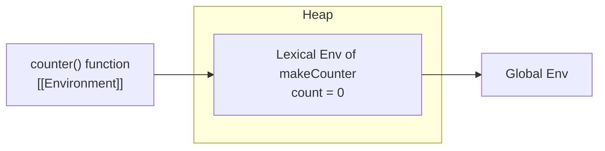
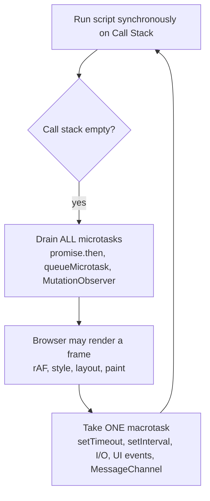
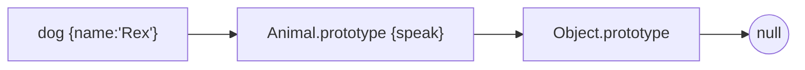
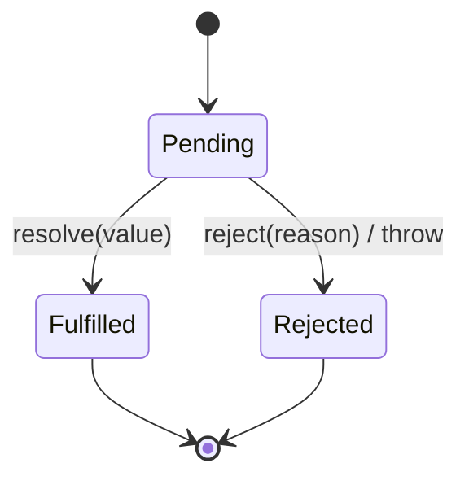
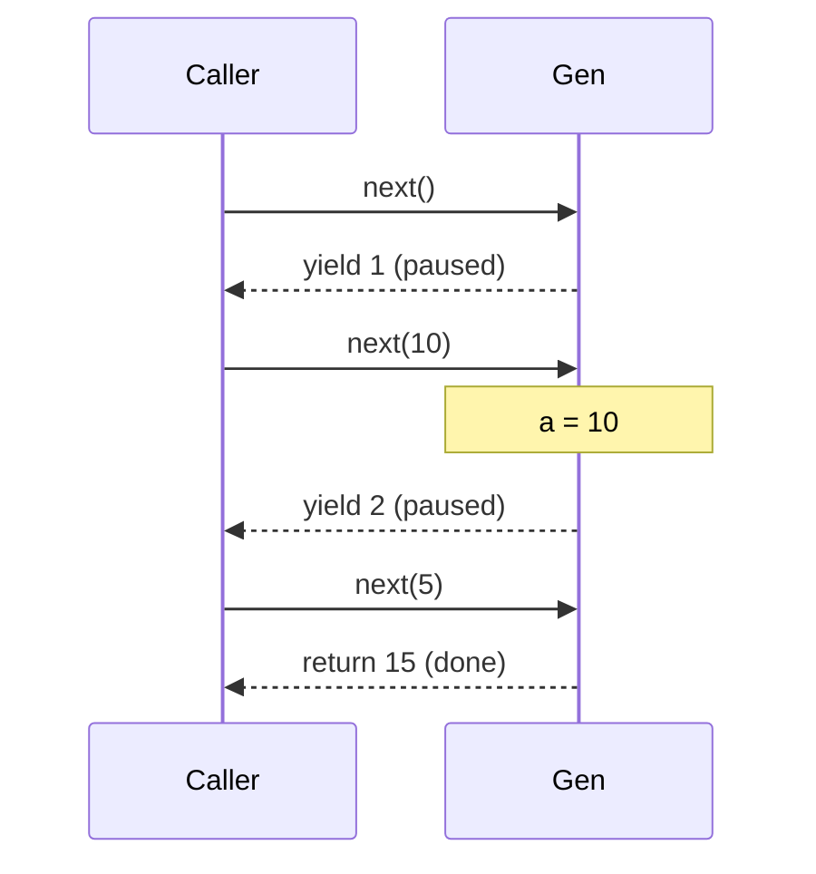
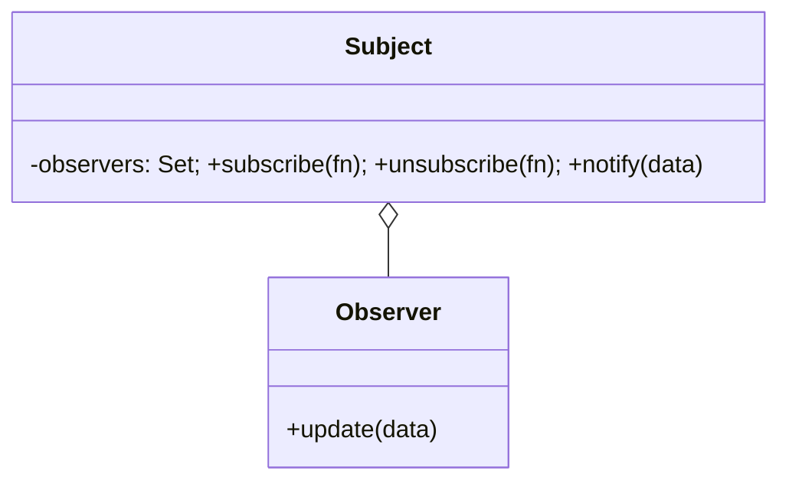
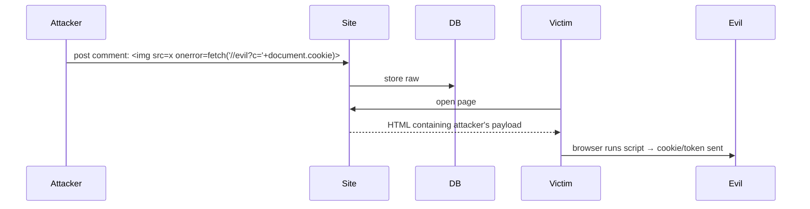
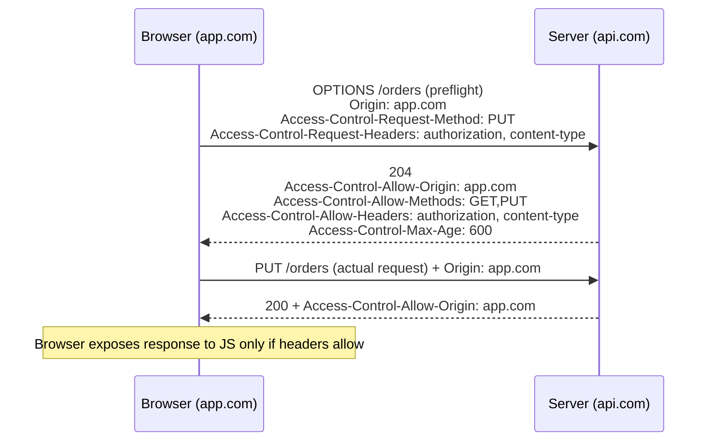
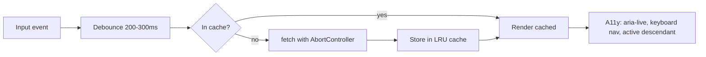

# JavaScript Interview Mastery Guide
### Principal-Engineer Edition: Study Once, Revise Fast

> **Source:** "JavaScript Interview Handbook" (50 Q&As, 12 sections), expanded with production scenarios, edge cases, coding-round material and system-design angles.
> **Audience:** Engineers preparing for product-based company interviews (SDE-2 / SDE-3 / Senior / Staff frontend and full-stack).
> **Style:** Easy English first, then the precise "bookish" definition, then production reasoning.

---

## How To Use This Document

Every concept (Q1 to Q50) follows the **same template**, so you always know where to look:

| Block | What it gives you |
|---|---|
| 📖 **Definition (bookish)** | The precise wording you say in an interview |
| 🗣️ **In simple English** | The intuition. If you can't say this, you don't know it yet |
| ❓ **Why it exists** | The problem it solves |
| ⚙️ **How it works** | Mechanics, step-by-step flow, diagrams |
| 📍 **Where to use** | Real production use cases |
| 💻 **Example** | Runnable code |
| 🧨 **Edge cases and pitfalls** | What separates senior from mid-level answers |
| ✅ **Best practices** | What to do in real code reviews |
| 🎯 **Follow-up deep dives** | The questions interviewers ask next, with answers |
| ⭐ **Must-know** | One-line takeaways to revise in the last 10 minutes |

Each section ends with a **Hard Interview Drill** and a **Review Checklist**.

**Suggested study plan**

| Day | Focus |
|---|---|
| 1 | Sections 1 and 5 (Core, Scope): closures, `this`, prototypes, hoisting |
| 2 | Sections 2 and 3 (Async, Functions): event loop, promises, debounce, curry |
| 3 | Sections 4, 6, 12 (Arrays/Objects, ES6+, Modern JS) |
| 4 | Sections 7, 8, 9 (Errors, Browser, Performance) |
| 5 | Sections 10, 11 (Patterns, Security) + Section 13 (Bonus gaps) |
| 6 | Section 14 (Coding round): write every utility from memory |
| 7 | Section 15 (Puzzles) + Master Question Bank + Cheat Sheet |

---

## Master Index

### Part A: Concepts
- [Section 1: Core JavaScript](#section-1-core-javascript)
  - [Q1. var, let and const](#q1-var-let-and-const)
  - [Q2. Hoisting](#q2-hoisting)
  - [Q3. Closures](#q3-closures)
  - [Q4. Loose and Strict Equality](#q4-loose-and-strict-equality)
  - [Q5. Event Loop](#q5-event-loop)
  - [Q6. Temporal Dead Zone](#q6-temporal-dead-zone)
  - [Q7. Creating Objects](#q7-creating-objects)
  - [Q8. Prototypal Inheritance](#q8-prototypal-inheritance)
  - [Q9. The this Keyword](#q9-the-this-keyword)
  - [Q10. call, apply and bind](#q10-call-apply-and-bind)
- [Section 2: Async JavaScript](#section-2-async-javascript)
  - [Q11. Promises](#q11-promises)
  - [Q12. Async and Await](#q12-async-and-await)
  - [Q13. Promise Combinators](#q13-promise-combinators)
  - [Q14. Callbacks and Callback Hell](#q14-callbacks-and-callback-hell)
- [Section 3: Functions](#section-3-functions)
  - [Q15. Function Declaration vs Expression](#q15-function-declaration-vs-expression)
  - [Q16. Currying](#q16-currying)
  - [Q17. Higher-Order Functions](#q17-higher-order-functions)
  - [Q18. Memoization](#q18-memoization)
  - [Q19. Debounce and Throttle](#q19-debounce-and-throttle)
- [Section 4: Arrays and Objects](#section-4-arrays-and-objects)
  - [Q20. map, filter and reduce](#q20-map-filter-and-reduce)
  - [Q21. Shallow Copy vs Deep Copy](#q21-shallow-copy-vs-deep-copy)
  - [Q22. Destructuring](#q22-destructuring)
  - [Q23. Spread and Rest](#q23-spread-and-rest)
  - [Q24. for-in vs for-of](#q24-for-in-vs-for-of)
- [Section 5: Scope and Execution](#section-5-scope-and-execution)
  - [Q25. Scope and Scope Chain](#q25-scope-and-scope-chain)
  - [Q26. Execution Context and Call Stack](#q26-execution-context-and-call-stack)
  - [Q27. IIFE](#q27-iife)
- [Section 6: ES6+ Features](#section-6-es6-features)
  - [Q28. Template Literals](#q28-template-literals)
  - [Q29. Default Parameters](#q29-default-parameters)
  - [Q30. Optional Chaining and Nullish Coalescing](#q30-optional-chaining-and-nullish-coalescing)
  - [Q31. Generators](#q31-generators)
  - [Q32. WeakMap and WeakSet](#q32-weakmap-and-weakset)
- [Section 7: Error Handling](#section-7-error-handling)
  - [Q33. Error Handling in JavaScript](#q33-error-handling-in-javascript)
  - [Q34. Custom Errors](#q34-custom-errors)
- [Section 8: Browser and DOM](#section-8-browser-and-dom)
  - [Q35. Event Delegation](#q35-event-delegation)
  - [Q36. Bubbling and Capturing](#q36-bubbling-and-capturing)
  - [Q37. Browser Storage](#q37-browser-storage)
  - [Q38. Virtual DOM](#q38-virtual-dom)
- [Section 9: Performance](#section-9-performance)
  - [Q39. Lazy Loading](#q39-lazy-loading)
  - [Q40. Tree Shaking](#q40-tree-shaking)
  - [Q41. Reflow and Repaint](#q41-reflow-and-repaint)
- [Section 10: Design Patterns](#section-10-design-patterns)
  - [Q42. Module Pattern](#q42-module-pattern)
  - [Q43. Observer Pattern](#q43-observer-pattern)
  - [Q44. Singleton Pattern](#q44-singleton-pattern)
- [Section 11: Security](#section-11-security)
  - [Q45. XSS](#q45-xss)
  - [Q46. CORS](#q46-cors)
- [Section 12: Modern JS Concepts](#section-12-modern-js-concepts)
  - [Q47. Symbols](#q47-symbols)
  - [Q48. Proxy and Reflect](#q48-proxy-and-reflect)
  - [Q49. Map vs Object](#q49-map-vs-object)
  - [Q50. Iterators and Iterables](#q50-iterators-and-iterables)

### Part B: Beyond the Notes (Gaps Principal Engineers Are Expected to Know)
- [Section 13: Bonus Concepts](#section-13-bonus-concepts)
  - [B1. Memory Management and Leaks](#b1-memory-management-and-leaks)
  - [B2. Node.js Event Loop Phases](#b2-nodejs-event-loop-phases)
  - [B3. ES Modules vs CommonJS](#b3-es-modules-vs-commonjs)
  - [B4. AbortController and Cancellation](#b4-abortcontroller-and-cancellation)
  - [B5. Web Workers and Offloading](#b5-web-workers-and-offloading)
  - [B6. Immutability and State Updates](#b6-immutability-and-state-updates)
  - [B7. Classes, Private Fields and Static Blocks](#b7-classes-private-fields-and-static-blocks)
  - [B8. Type Coercion Rules (Cheat Table)](#b8-type-coercion-rules-cheat-table)

### Part C: Interview Execution
- [Section 14: Coding Round, Write These From Memory](#section-14-coding-round-write-these-from-memory)
- [Section 15: Output Prediction Puzzles](#section-15-output-prediction-puzzles)
- [Section 16: Production Scenarios and Frontend System Design](#section-16-production-scenarios-and-frontend-system-design)
- [Section 17: Master Question Bank](#section-17-master-question-bank)
- [Section 18: Last-Day Cheat Sheet](#section-18-last-day-cheat-sheet)

---

## Top 15 "Never Miss" Topics (Highest Interview Frequency)

1. **Event loop**: microtask vs macrotask, output ordering
2. **Closures**: loops, private state, memory
3. **`this`**: four binding rules, arrow functions, lost context
4. **Prototype chain**: `class` is sugar, `Object.create`, `new` mechanics
5. **Promises**: states, chaining, error propagation, combinators
6. **async/await**: sequential vs parallel, error handling, `forEach` trap
7. **Debounce / throttle**: implement from scratch
8. **Deep clone**: `structuredClone`, JSON limits, circular refs
9. **Hoisting and TDZ**: `var` vs `let` in loops
10. **Currying / memoization / compose**: functional utilities
11. **Event delegation and bubbling**: performance and dynamic DOM
12. **XSS and CORS**: security reasoning
13. **Reflow / repaint / layout thrashing**: UI performance
14. **Memory leaks**: listeners, timers, closures, detached DOM
15. **Polyfills**: `bind`, `Promise.all`, `reduce`, `new`, `instanceof`

---

# PART A: CONCEPTS

---

## Section 1: Core JavaScript

> Variables, hoisting, closures, prototypes and the `this` keyword. This section is asked in **every** JS interview. Get it perfect.

---

### Q1. var, let and const

📖 **Definition (bookish)**
`var` declares a function-scoped (or global) variable that is hoisted and initialised to `undefined`. `let` and `const` declare block-scoped bindings that are hoisted but uninitialised until their declaration is evaluated (Temporal Dead Zone). `const` additionally forbids re-assignment of the binding.

🗣️ **In simple English**
- `var` = old style. Ignores `{ }` blocks, only respects functions.
- `let` = a variable you can change, lives inside its `{ }`.
- `const` = a name that can't be pointed at something else. The thing it points to can still change (if it's an object).

❓ **Why it exists**
`var` caused bugs: it leaked out of blocks, allowed silent redeclaration, and broke loop closures. ES6 added `let`/`const` to give predictable scoping.

⚙️ **How it works (comparison)**

| Feature | `var` | `let` | `const` |
|---|---|---|---|
| Scope | Function / global | Block | Block |
| Hoisted? | Yes, initialised `undefined` | Yes, **uninitialised (TDZ)** | Yes, **uninitialised (TDZ)** |
| Redeclare in same scope | ✅ allowed | ❌ SyntaxError | ❌ SyntaxError |
| Re-assign | ✅ | ✅ | ❌ TypeError |
| Becomes `window` property (global) | ✅ | ❌ | ❌ |
| Needs initial value | No | No | **Yes** |

📍 **Where to use**
- Default to `const`. Use `let` only when re-assignment is truly needed (counters, accumulators). **Never use `var`** in new code.
- Production reason: `const` communicates intent ("this binding never changes"), making code review and refactoring safer.

💻 **Example**
```js
function demo() {
  if (true) {
    var a = 1;     // function-scoped, leaks out of the if
    let b = 2;     // block-scoped
    const c = 3;   // block-scoped
  }
  console.log(a);          // 1
  // console.log(b);       // ReferenceError: b is not defined
}

const user = { name: "Asha" };
user.name = "Ravi";        // ✅ mutation is allowed
// user = {};              // ❌ TypeError: Assignment to constant variable

Object.freeze(user);       // shallow freeze
user.name = "X";           // silently ignored (throws in strict mode)
```

**Classic loop trap**
```js
for (var i = 0; i < 3; i++) setTimeout(() => console.log(i)); // 3 3 3
for (let i = 0; i < 3; i++) setTimeout(() => console.log(i)); // 0 1 2
```
Why: `var` has **one** `i` shared by all callbacks. `let` creates a **fresh binding per iteration**.

🧨 **Edge cases and pitfalls**
- `const` ≠ immutable. Only the *binding* is fixed.
- `Object.freeze` is **shallow**. Nested objects stay mutable. Deep freeze needs recursion.
- Top-level `var x` in a classic script creates `window.x`; `let x` does not (it lives in a separate declarative record).
- Redeclaring a function parameter with `let` in the function body → SyntaxError.

✅ **Best practices**
- ESLint: `no-var`, `prefer-const`.
- Declare close to first use, not at the top (reduces TDZ confusion and keeps scope small).

🎯 **Follow-up deep dives**
- **Q: What happens when you use `var` inside an `if` block? Does it leak?**
  A: Yes. `if` is not a function, so `var` attaches to the enclosing function (or global). `let/const` stay in the block.
- **Q: Why does `typeof undeclared` give `"undefined"` but `typeof tdzVar` throws?**
  A: An undeclared name has no binding at all, so `typeof` returns `"undefined"` safely. A TDZ variable *has* a binding that is uninitialised, and touching it throws `ReferenceError`.
- **Q: Can you make a truly immutable object?**
  A: `Object.freeze` recursively (deepFreeze), or use Immer / immutable data structures, or TypeScript `readonly` (compile-time only).

⭐ **Must-know:** `const` protects the variable, not the value. `let` in loops = per-iteration binding.

---

### Q2. Hoisting

📖 **Definition (bookish)**
Hoisting is the behaviour where, during the **creation phase** of an execution context, the engine registers declarations (variables, functions, classes) in the scope before executing code line by line.

🗣️ **In simple English**
Before JS runs your code, it reads through it once and notes down all the names you declared. So when it starts running, it already *knows* those names exist. Nothing is physically "moved up".

⚙️ **How it works**

```
Creation phase (compile):             Execution phase (run):
  var x      -> undefined               line 1: console.log(x) -> undefined
  function f -> full function body      line 2: x = 5
  let y      -> <uninitialised/TDZ>
```

| Declaration | Hoisted? | Value before its line |
|---|---|---|
| `var` | Yes | `undefined` |
| Function declaration | Yes (entire function) | the function itself |
| Function expression / arrow (`var f = ...`) | Only the `var` | `undefined` → calling = `TypeError: f is not a function` |
| `let` / `const` | Yes | TDZ → `ReferenceError` |
| `class` | Yes | TDZ → `ReferenceError` |
| `import` | Yes (hoisted to top of module) | available immediately |

💻 **Example**
```js
console.log(a);      // undefined
var a = 10;

sayHi();             // "hi" works, declaration fully hoisted
function sayHi() { console.log("hi"); }

sayBye();            // TypeError: sayBye is not a function
var sayBye = function () {};

console.log(z);      // ReferenceError (TDZ)
let z = 1;
```

**Priority rule:** function declarations win over `var` of the same name during hoisting.
```js
console.log(typeof foo); // "function"
var foo = 1;
function foo() {}
```

📍 **Where it matters in production**
- Reading code where helper functions are placed *below* the main logic (valid and common style).
- Debugging "x is not a function" errors caused by function expressions called early.
- Understanding why bundlers/transpilers keep import order stable.

🧨 **Edge cases**
- Function declarations inside blocks behave differently in sloppy vs strict mode (strict: block-scoped). Avoid them.
- Hoisting is **per scope**, not global. An inner `var` is hoisted to its function top only.

🎯 **Follow-up deep dives**
- **Q: Are function expressions hoisted like declarations?**
  A: No. Only the variable name is hoisted (as `undefined` if `var`, or TDZ if `let/const`). The function body is assigned when execution reaches that line.
- **Q: Does code physically move to the top?**
  A: No. It's a mental model. The engine creates bindings in the creation phase.
- **Q: What does this print?** `var x = 1; function f(){ console.log(x); var x = 2; } f();`
  A: `undefined`. The inner `var x` is hoisted inside `f` and shadows the outer one.

⭐ **Must-know:** `var` → `undefined`; `let/const/class` → TDZ; function declaration → fully usable.

---

### Q3. Closures

📖 **Definition (bookish)**
A closure is the combination of a function and the **lexical environment** in which it was declared. The function retains a live reference to variables of its outer scopes even after the outer function has returned.

🗣️ **In simple English**
A function carries a "backpack" containing the variables from where it was born. Wherever it travels, the backpack goes with it, and it holds the **real variables**, not copies.

❓ **Why it exists**
JS functions are first-class and scopes are lexical. For inner functions to work after the outer one ends, the engine must keep those variables alive.

⚙️ **How it works**


`makeCounter()` returns → its stack frame is popped, but the environment object stays in the heap because `counter` still references it.

💻 **Example: private state (module-style)**
```js
function makeCounter() {
  let count = 0;                 // private, nobody outside can touch it
  return {
    inc: () => ++count,
    dec: () => --count,
    value: () => count,
  };
}
const c = makeCounter();
c.inc(); c.inc();
console.log(c.value());          // 2
console.log(c.count);            // undefined, truly private
```

**Closure captures the variable, not the value**
```js
function test() {
  let x = 1;
  const show = () => console.log(x);
  x = 2;
  return show;
}
test()(); // 2, not 1
```

📍 **Where to use (production)**
- **Data privacy:** encapsulating state (stores, counters, API clients with tokens).
- **Factories / configuration:** `createLogger("auth")`, `createApi(baseUrl)`.
- **Debounce, throttle, memoize, once, curry**: all rely on closures.
- **Event handlers and React hooks:** `useState` setters and `useEffect` callbacks close over render-time values (the famous "stale closure" bug).
- **Module pattern:** pre-ES6 encapsulation.

🧨 **Edge cases and pitfalls**
- **Loop + var:** all closures share one variable (see Q1).
- **Memory leaks:** a closure keeps the *whole* outer environment alive (engines optimise, but don't rely on it). A long-lived listener closing over a huge array = leak.
- **Stale closure in React:**
```js
useEffect(() => {
  const id = setInterval(() => setCount(count + 1), 1000); // `count` frozen at 0!
  return () => clearInterval(id);
}, []);
// Fix: setCount(c => c + 1)
```
- Not every callback is a closure *in a meaningful sense*: a closure matters when the function uses outer variables after the outer scope has finished.

✅ **Best practices**
- Null out references to large objects when no longer needed.
- Always remove listeners/timers in cleanup.
- Prefer functional state updates (`setX(prev => ...)`) in hooks.

🎯 **Follow-up deep dives**
- **Q: How do you create private variables?** A: Closure (above), `WeakMap`, or ES2022 `#private` fields.
- **Q: What does this print?** `for (var i=0;i<3;i++){ setTimeout(()=>console.log(i),0) }` → `3 3 3`. Fix with `let`, or an IIFE: `(j => setTimeout(()=>console.log(j)))(i)`.
- **Q: Closures vs callbacks?** A callback is a *role* (a function passed to be called later). A closure is a *mechanism* (function + captured scope). A callback is often also a closure.
- **Q: Can closures cause memory leaks? How do you detect them?** Chrome DevTools → Memory → heap snapshot → compare snapshots, look at "Retained size" and "Detached DOM nodes".

⭐ **Must-know:** closures capture **variables by reference**; they power privacy, factories, and most functional utilities.

---

### Q4. Loose and Strict Equality

📖 **Definition (bookish)**
`==` (abstract equality) compares values after applying the Abstract Equality Comparison algorithm, which may coerce operand types. `===` (strict equality) returns `false` if types differ, else compares values without coercion.

🗣️ **In simple English**
`==` says "let me try to make them the same type, then compare". `===` says "same type AND same value, or no."

⚙️ **How `==` decides (simplified)**
```
Same type?            -> compare like ===
null == undefined     -> true (only with each other)
number vs string      -> string becomes number
boolean vs anything   -> boolean becomes number (true=1, false=0)
object vs primitive   -> object becomes primitive (valueOf / toString)
```

💻 **Example**
```js
5 == "5"            // true
5 === "5"           // false
null == undefined   // true
null === undefined  // false
null == 0           // false (null only equals undefined)
NaN == NaN          // false (!), use Number.isNaN or Object.is
[] == ![]           // true  ([] -> "" -> 0 ; ![] -> false -> 0)
"0" == false        // true
Object.is(NaN, NaN) // true
Object.is(0, -0)    // false (=== says true)
```

📍 **Where to use**
- Always `===` by default.
- The one accepted `==` idiom: `x == null` means "x is null **or** undefined". Many style guides allow it explicitly (ESLint `eqeqeq: ["error","always",{null:"ignore"}]`).
- `Object.is` for edge-accurate comparison (React uses it to compare state/deps).

🧨 **Pitfalls**
- Objects compare by **reference**: `{} === {}` is `false`.
- `typeof null === "object"` (historic bug).
- Sorting/comparing mixed types, form inputs (always strings!) vs numbers: `input.value === 5` is always false.

🎯 **Follow-ups**
- **Q: When is `==` intentionally useful?** `value == null` null-check shorthand; comparing API fields that may be number or numeric string (though better to normalise explicitly).
- **Q: Why does React use `Object.is`?** To handle `NaN` and `+0/-0` correctly when comparing hook deps/state.

⭐ **Must-know:** use `===`; know `null == undefined`, `NaN !== NaN`, objects compare by reference.

---

### Q5. Event Loop

📖 **Definition (bookish)**
The event loop is the runtime mechanism that coordinates the call stack, task queues (macrotasks) and microtask queue to enable non-blocking concurrency in single-threaded JavaScript. After each macrotask completes, it drains the entire microtask queue before the next macrotask (and before rendering in browsers).

🗣️ **In simple English**
JS has one worker (the call stack). Slow things (timers, network) are handed to the browser/Node. When they finish, their callbacks wait in a queue. The event loop is the **manager** who says: "Is the worker free? Okay, here's the next job." **VIP queue (microtasks: promises) always goes first.**

⚙️ **How it works**



```
 Call Stack        Web APIs / Node APIs          Queues
 ┌─────────┐      ┌────────────────────┐   ┌──────────────────────┐
 │ main()  │ ---> │ setTimeout timer   │-->│ Macrotask queue      │
 │ fn()    │      │ fetch (network)    │   │ (timers, I/O, events)│
 └─────────┘      │ DOM events         │   ├──────────────────────┤
                  └────────────────────┘   │ Microtask queue      │
                                           │ (promises, queueMic) │
        Event Loop: stack empty? -> microtasks first -> next macrotask
```

**Step-by-step execution flow**
```js
console.log("1: sync");
setTimeout(() => console.log("2: timeout"), 0);
Promise.resolve().then(() => console.log("3: promise"));
queueMicrotask(() => console.log("4: microtask"));
console.log("5: sync");
```
1. Script runs on the stack: prints `1: sync`.
2. `setTimeout` → handed to timer API; callback goes to **macrotask** queue when timer fires.
3. `.then` → callback queued in **microtask** queue immediately (promise already resolved).
4. `queueMicrotask` → microtask queue.
5. Prints `5: sync`. Stack empty.
6. Drain microtasks in order: `3: promise`, `4: microtask`.
7. Next macrotask: `2: timeout`.

**Output:** `1, 5, 3, 4, 2`

**async/await mapping**
```js
async function f() {
  console.log("a");
  await null;            // everything after await = microtask
  console.log("b");
}
f(); console.log("c");   // a c b
```

📍 **Where it matters in production**
- Why a heavy `for` loop **freezes the UI** (blocks the stack, no rendering).
- Chunking long work: `setTimeout`/`requestIdleCallback`/`scheduler.postTask`, or move to a Web Worker.
- Understanding why `Promise.then` chains can **starve** rendering if they enqueue endless microtasks.
- Node.js servers: one blocking CPU task delays *every* request.

🧨 **Edge cases and pitfalls**
- `setTimeout(fn, 0)` is **not immediate**: min delay is clamped (≈4ms after nesting 5 levels in browsers), and it runs after all microtasks.
- Timers are **not precise**. They're "at least N ms".
- A microtask that schedules another microtask forever **blocks** macrotasks and rendering.
- `await` in a loop yields to the microtask queue, **not** to rendering.
- Browser rendering opportunities occur between macrotasks (after microtasks), typically ~16.7ms at 60Hz.
- In Node: `process.nextTick` runs **before** promise microtasks; `setImmediate` runs in the check phase (see B2).

✅ **Best practices**
- Never run CPU-heavy loops on the main thread. Chunk or offload.
- Use `requestAnimationFrame` for visual updates, `queueMicrotask` for "after this sync code, before anything else".

🎯 **Follow-ups**
- **Q: Microtask vs macrotask queue?** Microtasks: promise reactions, `queueMicrotask`, MutationObserver. Macrotasks: timers, I/O, UI events, `MessageChannel`, `setImmediate`(Node). **All microtasks drain after each macrotask.**
- **Q: Is JS really single-threaded?** The JS *execution* is; the runtime (browser/Node) is multi-threaded (network, timers, file I/O via libuv thread pool). Workers give extra JS threads with message passing.
- **Q: Where does `requestAnimationFrame` fit?** Before paint, in the rendering step, not a macrotask or microtask.
- **Q: Predict:** `setTimeout(()=>console.log(1)); Promise.resolve().then(()=>setTimeout(()=>console.log(2))); Promise.resolve().then(()=>console.log(3));` → `3, 1, 2`.

⭐ **Must-know:** sync → all microtasks → (render) → one macrotask → repeat.

---

### Q6. Temporal Dead Zone

📖 **Definition (bookish)**
The TDZ is the time span between entering a scope (when the binding is created) and the evaluation of the `let`, `const` or `class` declaration (when it is initialised). Accessing the binding in this span throws a `ReferenceError`.

🗣️ **In simple English**
JS knows the name exists (hoisted) but says "don't touch it yet. It's not ready." The "dead zone" ends exactly at the line where you declare it.

💻 **Example**
```js
{
  // TDZ for `x` starts here
  // console.log(x);        // ReferenceError: Cannot access 'x' before initialization
  // typeof x;              // ALSO ReferenceError
  let x = 10;               // TDZ ends
  console.log(x);           // 10
}
```
**Subtle TDZ in default parameters**
```js
function f(a = b, b = 1) {}  // f() -> ReferenceError: b in TDZ
```
**It's about time, not position**
```js
function show() { console.log(v); }   // fine to define above
let v = 5;
show();                                // 5 works: v is initialised before call
// If show() ran before `let v`, it would throw.
```

❓ **Why it exists**
Catches use-before-define bugs early and makes `const` semantics sound (a `const` can't silently be `undefined` first).

📍 **Where it appears in production**
- Circular imports in ES modules: a module's `export const x` accessed before evaluation → TDZ ReferenceError.
- Class used before definition (`new Foo()` above `class Foo{}`).

🎯 **Follow-ups**
- **Q: Does `typeof` throw for TDZ variables?** Yes (unlike undeclared variables).
- **Q: TDZ applies to?** `let`, `const`, `class` (and parameters with defaults referencing later params).
- **Q: Is `let` hoisted?** Yes. If it weren't, an outer variable of the same name would be visible in the TDZ instead of throwing. That shadowing behaviour proves hoisting.

⭐ **Must-know:** hoisted but uninitialised; applies to `let`, `const`, `class`; `typeof` doesn't save you.

---

### Q7. Creating Objects

📖 **Definition (bookish)**
JavaScript provides multiple object-creation mechanisms: object literals, the `Object` constructor, `Object.create(proto)`, constructor functions invoked with `new`, ES6 `class`, and factory functions.

🗣️ **In simple English**
There are many ways to make an object. Pick based on whether you need **one object**, **many similar objects**, or a **specific prototype**.

💻 **Example**
```js
// 1. Literal: best for one-off objects
const a = { name: "A", hi() { return this.name; } };

// 2. Object constructor (avoid, literal is cleaner/faster)
const b = new Object(); b.name = "B";

// 3. Object.create: choose prototype explicitly
const proto = { hi() { return "hi " + this.name; } };
const c = Object.create(proto, { name: { value: "C", enumerable: true } });

// 4. Constructor function + new
function User(name) { this.name = name; }
User.prototype.hi = function () { return "hi " + this.name; };
const d = new User("D");

// 5. ES6 class (sugar over #4)
class Person { constructor(n) { this.name = n; } hi() { return "hi " + this.name; } }

// 6. Factory function: no `new`, closures for privacy, no `this` problems
const createUser = (name) => { let secret = 1; return { name, getSecret: () => secret }; };
```

⚙️ **What `new` does (4 steps), interviewers love this**
```js
function myNew(Ctor, ...args) {
  const obj = Object.create(Ctor.prototype);   // 1. new object linked to prototype
  const result = Ctor.apply(obj, args);        // 2. run constructor with this = obj
  return (result !== null && (typeof result === "object" || typeof result === "function"))
    ? result                                   // 3. constructor may return an object
    : obj;                                     // 4. else return the new object
}
```

🔍 **Object.create(null) vs `{}`**
| | `{}` | `Object.create(null)` |
|---|---|---|
| Prototype | `Object.prototype` | none |
| `obj.toString` | function | `undefined` |
| `'constructor' in obj` | true | false |
| Safe as dictionary | ❌ (prototype keys collide, `__proto__` risk) | ✅ |
| `console.log` | `{}` | `[Object: null prototype] {}` |

📍 **Where to use**
- Literal: config, DTOs. Class: domain models with shared methods. Factory: closures/private state, avoids `this` loss. `Object.create(null)`: hash maps for untrusted keys (prevents prototype pollution), or use `Map`.

🧨 **Pitfalls**
- Methods defined inside the constructor (`this.hi = function(){}`) create a **new function per instance**, which wastes memory. Put them on the prototype/class.
- Forgetting `new` with constructor functions: `this` becomes `globalThis`/`undefined`. Classes throw automatically.
- **Prototype pollution:** merging untrusted JSON with `__proto__` keys can modify `Object.prototype`.

🎯 **Follow-ups**
- **Q: `class` vs factory function?** Classes: shared methods on prototype (memory efficient), `instanceof`, inheritance. Factories: true privacy via closure, no `this` issues, composition over inheritance.
- **Q: Does arrow function work as constructor?** No (`TypeError: not a constructor`), because it has no `[[Construct]]` and no `prototype`.

⭐ **Must-know:** the 4 steps of `new`; `Object.create(null)` for dictionaries; class = sugar.

---

### Q8. Prototypal Inheritance

📖 **Definition (bookish)**
Every object has an internal `[[Prototype]]` link to another object (or `null`). Property lookup walks this chain until the property is found or `null` is reached. Inheritance in JS is **delegation** along this chain.

🗣️ **In simple English**
If an object doesn't have something, it asks its "parent object", then that object's parent, and so on. It's a chain of "ask the next one".

⚙️ **How it works**
```
 dog  ──[[Prototype]]──▶  Animal.prototype  ──▶  Object.prototype  ──▶  null
 {name}                    {speak()}              {toString, hasOwnProperty}
```


💻 **Example**
```js
function Animal(name) { this.name = name; }
Animal.prototype.speak = function () { return `${this.name} makes a sound`; };

function Dog(name) { Animal.call(this, name); }              // inherit instance props
Dog.prototype = Object.create(Animal.prototype);              // inherit methods
Dog.prototype.constructor = Dog;                              // fix constructor pointer
Dog.prototype.bark = function () { return "Woof"; };

const d = new Dog("Rex");
d.speak();                        // via chain
d.hasOwnProperty("speak");        // false
Object.getPrototypeOf(d) === Dog.prototype;   // true
d instanceof Animal;              // true

// Modern equivalent
class Animal2 { constructor(n){this.name=n;} speak(){ return `${this.name} makes a sound`; } }
class Dog2 extends Animal2 { bark(){ return "Woof"; } }
```

🔑 **Three confusing names**
| Name | What it is |
|---|---|
| `obj.__proto__` / `Object.getPrototypeOf(obj)` | the actual link of an instance |
| `Func.prototype` | the object that becomes the `[[Prototype]]` of instances made by `new Func()` |
| `obj.constructor` | convenience pointer, found via prototype |

📍 **Where to use**
- Share methods across thousands of instances without copying (memory efficient).
- Understand frameworks: React class components, Node `EventEmitter` inheritance, polyfills (`Array.prototype.myMap`).

🧨 **Pitfalls and edge cases**
- **Property shadowing:** writing `d.speak = ...` creates an own property; doesn't modify the prototype.
- **Shared mutable state on prototype:** `Dog.prototype.tricks = []` is shared by all dogs!
- **Mutating built-in prototypes** (`Array.prototype.foo`) is dangerous: breaks `for...in`, conflicts with future standards ("SmushGate").
- `__proto__` assignment is slow; use `Object.setPrototypeOf` sparingly; prefer `Object.create`.
- **Deep chains are slower** to look up; engines use inline caches, but monomorphic shapes matter.
- **Prototype pollution** (security): `merge({}, JSON.parse('{"__proto__":{"admin":true}}'))` can make every object `admin`. Mitigate: freeze `Object.prototype`, use `Object.create(null)`, validate keys, `structuredClone`, patched libs.

✅ **Best practices**
- Use `class`/`extends` for readability; keep chains shallow; prefer composition ("has-a") over deep inheritance.
- Use `Object.hasOwn(obj, key)` (modern) instead of `obj.hasOwnProperty`.

🎯 **Follow-ups**
- **Q: `Object.create` vs `new`?** `Object.create(p)` makes an object with prototype `p` **without running any constructor**. `new F()` also runs `F` to initialise.
- **Q: Is `class` a real class?** No. It's syntactic sugar over prototypes (with extras: TDZ, always strict, non-callable without `new`, non-enumerable methods).
- **Q: How does `instanceof` work?** Checks if `F.prototype` appears in the object's prototype chain (customisable via `Symbol.hasInstance`).

```js
function myInstanceOf(obj, Ctor) {
  let p = Object.getPrototypeOf(obj);
  while (p) { if (p === Ctor.prototype) return true; p = Object.getPrototypeOf(p); }
  return false;
}
```

⭐ **Must-know:** delegation chain; `class` is sugar; own vs inherited properties; prototype pollution.

---

### Q9. The this Keyword

📖 **Definition (bookish)**
`this` is a binding determined at **call time** (for non-arrow functions) by how the function is invoked. Arrow functions have no own `this`; they capture it lexically from the enclosing scope.

🗣️ **In simple English**
`this` = "who called me?" Look at the **left of the dot** when the function is called. Arrow functions don't ask. They use the `this` of the place where they were written.

⚙️ **The 4 rules + arrow (priority high → low)**

| # | Rule | Example | `this` |
|---|---|---|---|
| 1 | **`new`** binding | `new Foo()` | the new object |
| 2 | **Explicit** | `fn.call(obj)`, `apply`, `bind` | `obj` |
| 3 | **Implicit** (method call) | `obj.fn()` | `obj` |
| 4 | **Default** | `fn()` | `globalThis` (sloppy) / `undefined` (strict, modules, classes) |
| ★ | **Arrow** | `() => this` | lexical outer `this`, **cannot be overridden** by call/bind |

💻 **Example**
```js
const user = {
  name: "Asha",
  regular() { return this.name; },
  arrow: () => this?.name,                 // `this` of module/global, NOT user
  delayed() { setTimeout(function () { console.log(this?.name); }, 0); },   // lost
  delayedArrow() { setTimeout(() => console.log(this.name), 0); },          // "Asha"
};
user.regular();               // "Asha"
const f = user.regular;
f();                          // undefined/TypeError: lost `this` (default binding)
```

**Class method lost `this` (very common React bug)**
```js
class Btn {
  label = "OK";
  onClick() { console.log(this.label); }
  onClickArrow = () => console.log(this.label);   // class field: bound per instance
}
const b = new Btn();
setTimeout(b.onClick, 0);        // TypeError (this undefined)
setTimeout(b.onClickArrow, 0);   // "OK"
setTimeout(b.onClick.bind(b), 0);// "OK"
```

📍 **Where it matters**
- Event handlers (`this` = element that has the listener for regular functions, `currentTarget`).
- Passing methods as callbacks (`arr.map(obj.method)`, `promise.then(this.handle)`).
- Libraries: jQuery, Mocha (`this.timeout`), older React.

🧨 **Pitfalls**
- Arrow functions as **object methods** or **prototype methods**: wrong `this`.
- Arrow functions can't be used with `new`, have no `arguments`, no `super`.
- `bind` on an arrow function does nothing for `this`.
- Chained `bind`: the **first** `bind` wins; later binds can't change it. (But `new` on a bound function overrides.)
- Destructuring a method loses `this`: `const { regular } = user; regular();`

🎯 **Follow-ups**
- **Q: `this` in `setTimeout` regular callback vs arrow?** Regular: called by the timer with default binding (`globalThis` in browser sloppy mode, `Timeout` object in Node). Arrow: inherits from enclosing.
- **Q: `this` in a callback to `forEach`?** Default binding, unless you pass the 2nd argument `thisArg`.
- **Q: `this` at module top-level?** `undefined` in ES modules; `module.exports` in CommonJS; `window` in classic scripts.

⭐ **Must-know:** `new` > explicit > implicit > default; arrow = lexical; lost `this` when method is detached.

---

### Q10. call, apply and bind

📖 **Definition (bookish)**
`Function.prototype.call`, `.apply` and `.bind` allow explicit setting of `this`. `call(thisArg, a, b)` and `apply(thisArg, [a, b])` invoke immediately. `bind(thisArg, ...preset)` returns a **new function** with `this` (and optional leading arguments) permanently fixed.

🗣️ **In simple English**
- **call**: "run it now, as this object, args one by one."
- **apply**: "run it now, as this object, args in an array."
- **bind**: "give me a new function that will always use this object. Don't run it yet."

💻 **Example**
```js
function intro(greet, punct) { return `${greet}, I'm ${this.name}${punct}`; }
const p = { name: "Ravi" };

intro.call(p, "Hi", "!");        // "Hi, I'm Ravi!"
intro.apply(p, ["Hi", "!"]);     // same
const bound = intro.bind(p, "Hello");   // partial application
bound("?");                      // "Hello, I'm Ravi?"

// Borrowing methods
Math.max.apply(null, [3, 7, 2]);        // 7  (modern: Math.max(...arr))
Array.prototype.slice.call(arguments);  // array-like -> array (modern: Array.from / rest)
```

**Polyfill for `bind` (very common interview ask)**
```js
Function.prototype.myBind = function (ctx, ...preset) {
  const fn = this;
  if (typeof fn !== "function") throw new TypeError("myBind must be called on a function");
  function bound(...args) {
    // if used with `new`, ignore ctx
    return fn.apply(this instanceof bound ? this : ctx, [...preset, ...args]);
  }
  if (fn.prototype) bound.prototype = Object.create(fn.prototype);
  return bound;
};
```
**Polyfill for `call`**
```js
Function.prototype.myCall = function (ctx, ...args) {
  ctx = ctx ?? globalThis;
  const key = Symbol();          // avoid clobbering existing props
  ctx[key] = this;
  const result = ctx[key](...args);
  delete ctx[key];
  return result;
};
```

📍 **Where to use**
- Binding handlers in class components / event listeners.
- Partial application / presetting arguments (`bind(null, apiKey)`).
- Method borrowing from array-likes (`NodeList`, `arguments`).
- `apply` with `Math.max` in legacy code (spread replaced it).

🧨 **Pitfalls**
- `bind` creates a new function each time. In React render, this breaks `memo`/`PureComponent` equality and `removeEventListener` (you must keep the reference).
- `call(null)` in sloppy mode makes `this = globalThis`; in strict, `this = null`.
- Passing huge arrays to `apply` can exceed the argument limit (RangeError, ~100k+ args).

🎯 **Follow-ups**
- **Q: Can you rebind an already bound function?** No. `this` of the first `bind` is permanent (but `new` overrides it, and you can still preset more arguments).
- **Q: `bind` vs arrow function?** Arrow captures `this` at definition (lexical); `bind` sets it at bind-time explicitly and works on any function, including methods you don't own.
- **Q: `bound.name`?** `"bound intro"`; `bound.length` accounts for preset args.

⭐ **Must-know:** call (args list) / apply (array) / bind (returns function); be able to write `myBind`.

---

### 🔥 Section 1: Hard Interview Drill

1. **Explain why `let` in a `for` loop fixes the `setTimeout` problem at the spec level.**
   *Hint:* The spec creates a new lexical environment per iteration (CreatePerIterationEnvironment) and copies the value forward.
2. **What is the output?**
```js
var a = 1;
function f() { console.log(a); var a = 2; }
f();
```
   *Answer:* `undefined` (inner hoisted `a`).
3. **Implement `new` without using `new`, and explain what happens if the constructor returns a primitive.** *Primitive is ignored; object is returned.*
4. **Design a `once(fn)` utility.** Closure + flag; return cached result; mention `this` forwarding.
5. **A teammate wrote `arrow` methods on a prototype and `this` is `undefined`. Explain and fix.**
6. **Why can `Object.prototype` pollution turn into a security vulnerability in a Node API?** Merge utilities + user JSON → modify every object (privilege escalation / DoS). Fix: key blacklists, `Object.create(null)`, schema validation, `--disable-proto=delete`.
7. **Explain the full event-loop order:** `await`, `setTimeout`, `process.nextTick`, `setImmediate`, `requestAnimationFrame`.

### ✅ Section 1 Review Checklist
- [ ] I can explain `var/let/const` using scope, hoisting, TDZ and re-assignment
- [ ] I can draw the closure heap diagram and explain capture-by-reference
- [ ] I can predict output of mixed sync/promise/timeout code
- [ ] I can state the 4 `this` rules + arrow, in priority order
- [ ] I can implement `new`, `instanceof`, `bind`, `call` from scratch
- [ ] I know what prototype pollution is and how to prevent it
- [ ] I can explain why `class` is sugar and list its extras

---

## Section 2: Async JavaScript

> Promises, async/await, callbacks. This is where production bugs live: race conditions, unhandled rejections, wrong parallelism.

---

### Q11. Promises

📖 **Definition (bookish)**
A `Promise` is an object representing the eventual completion (fulfilment) or failure (rejection) of an asynchronous operation and its resulting value. It has three states: **pending**, **fulfilled**, **rejected**. Once settled, it is **immutable**.

🗣️ **In simple English**
A promise is a receipt. "I'll give you the result later." You can attach what to do on success (`.then`) or failure (`.catch`). It can only change once: pending → fulfilled **or** pending → rejected.

❓ **Why it exists**
Callbacks nested into "pyramid of doom", errors had no single path, and inversion of control (you hand your callback to someone else and trust them to call it once). Promises give composition, one error channel, and guaranteed single settlement.

⚙️ **How it works**

Key mechanics:
1. The **executor** `(resolve, reject) => {}` runs **synchronously** when you call `new Promise`.
2. `.then(onFul, onRej)` **always returns a new promise**; that's what allows chaining.
3. `.then` callbacks run **asynchronously as microtasks**, even if already resolved.
4. Returning a value → next promise fulfils with it. Returning a promise → next one **adopts** its state. Throwing → next promise rejects.
5. Rejection skips `.then`s until a `.catch` (or 2nd arg of a `.then`).

💻 **Example**
```js
const wait = (ms, v) => new Promise(res => setTimeout(() => res(v), ms));

fetch("/api/user")
  .then(r => { if (!r.ok) throw new Error(r.status); return r.json(); }) // fetch doesn't reject on 404!
  .then(user => fetch(`/api/orders/${user.id}`))   // return the promise, so chain waits
  .then(r => r.json())
  .catch(err => console.error("failed:", err))     // catches any error above
  .finally(() => hideSpinner());                   // runs either way, no args, passes value through
```

**Execution-order puzzle**
```js
new Promise(res => { console.log(1); res(); console.log(2); })
  .then(() => console.log(3));
console.log(4);
// 1 2 4 3   (executor sync; resolve doesn't stop the function; then = microtask)
```

**Minimal Promise (conceptual, what interviewers sometimes ask)**
```js
class MyPromise {
  #state = "pending"; #value; #handlers = [];
  constructor(executor) {
    const resolve = v => this.#settle("fulfilled", v);
    const reject  = r => this.#settle("rejected", r);
    try { executor(resolve, reject); } catch (e) { reject(e); }
  }
  #settle(state, value) {
    if (this.#state !== "pending") return;                 // settle only once
    if (state === "fulfilled" && value?.then) { value.then(v => this.#settle("fulfilled", v), r => this.#settle("rejected", r)); return; }
    this.#state = state; this.#value = value;
    queueMicrotask(() => this.#handlers.forEach(h => h()));
  }
  then(onF, onR) {
    return new MyPromise((resolve, reject) => {
      const run = () => {
        const cb = this.#state === "fulfilled" ? onF : onR;
        if (typeof cb !== "function") return (this.#state === "fulfilled" ? resolve : reject)(this.#value);
        try { resolve(cb(this.#value)); } catch (e) { reject(e); }
      };
      this.#state === "pending" ? this.#handlers.push(run) : queueMicrotask(run);
    });
  }
  catch(onR) { return this.then(undefined, onR); }
}
```

📍 **Where to use (production)**
- All I/O: HTTP (`fetch`), DB drivers, file system (`fs/promises`).
- Orchestration with combinators (Q13).
- Wrapping legacy callbacks: **promisification**.
```js
const readFileP = (path) => new Promise((res, rej) => fs.readFile(path, (e, d) => e ? rej(e) : res(d)));
// or util.promisify(fs.readFile)
```

🧨 **Edge cases and pitfalls**
- **Forgetting `return` in `.then`** → next `.then` gets `undefined` and chain doesn't wait.
- **Promise constructor anti-pattern:** wrapping an existing promise in `new Promise`. Just return it.
- **Nested `.then` (callback hell again):** flatten the chain.
- **`fetch` resolves on HTTP 404/500**. Only network failure rejects. Check `res.ok`.
- **Unhandled rejections:** Node ≥15 **crashes the process** by default. Browser fires `unhandledrejection`. Always `.catch` or `await` inside try/catch.
- `.catch(fn)` then `.then(...)`: the chain **recovers** after catch (returns fulfilled promise).
- `.then(a, b)` — `b` does **not** catch errors thrown in `a`; `.then(a).catch(b)` does.
- A promise **cannot be cancelled**. Use `AbortController` (B4) for fetch, or ignore stale results.
- Thenables (objects with `.then`) are assimilated, which can surprise you.

✅ **Best practices**
- Always return/await promises; always handle rejection at the boundary.
- Reject with `Error` objects, not strings (stack trace).
- Add timeouts: `Promise.race([task, timeout(5000)])`, plus abort the underlying request.
- Use `Promise.withResolvers()` (ES2024, check runtime support) instead of the "deferred" hack.

🎯 **Follow-ups**
- **Q: What's the difference between `Promise.all/race/allSettled/any`?** → see Q13.
- **Q: Does `resolve()` stop executing the executor?** No. Subsequent code still runs; only first settle counts.
- **Q: How do promises avoid "zalgo"?** `.then` callbacks are *always* async, so behaviour is consistent.
- **Q: What happens with `Promise.resolve(promise)`?** Returns the same promise if it's a native promise (identity preserved).

⭐ **Must-know:** executor is sync; `.then` returns new promise; callbacks are microtasks; always handle rejections.

---

### Q12. Async and Await

📖 **Definition (bookish)**
`async` functions always return a Promise. `await` suspends the async function until the awaited promise settles, then resumes with the value (or throws the rejection reason), without blocking the thread. It is syntactic sugar built on promises and (conceptually) generators.

🗣️ **In simple English**
`await` = "pause *this function only*, let everyone else run, come back when the result is ready." The code *reads* like synchronous code but doesn't block the browser/server.

⚙️ **How it works (flow)**
```js
async function main() {
  console.log("A");
  const x = await getData();   // function pauses here; control returns to caller
  console.log("B", x);         // resumed later as a microtask
}
main();
console.log("C");
// A, C, B
```
```mermaid
sequenceDiagram
  participant Caller
  participant main
  participant Loop as Event Loop
  Caller->>main: main()
  main->>main: log A
  main->>Loop: await getData() (suspend)
  main-->>Caller: returns pending Promise
  Caller->>Caller: log C
  Loop->>main: promise settled → resume (microtask)
  main->>main: log B
```
**Equivalent promise code**
```js
function main() { console.log("A"); return getData().then(x => console.log("B", x)); }
```

💻 **The #1 production performance bug: accidental sequential awaits**
```js
// ❌ Slow: total = t1 + t2 + t3
const user = await getUser();
const orders = await getOrders();
const prefs = await getPrefs();

// ✅ Fast: total = max(t1, t2, t3)   (independent calls)
const [user, orders, prefs] = await Promise.all([getUser(), getOrders(), getPrefs()]);
```

**`forEach` + async trap**
```js
items.forEach(async (it) => { await save(it); });   // ❌ forEach doesn't await; code continues immediately
console.log("done?");                                // prints before saves finish

for (const it of items) await save(it);              // ✅ sequential, preserves order
await Promise.all(items.map(save));                  // ✅ parallel (careful with 10k items!)
```

**Controlled concurrency (production must-have)**
```js
async function pool(tasks, limit = 5) {
  const results = []; let i = 0;
  const workers = Array.from({ length: limit }, async () => {
    while (i < tasks.length) { const idx = i++; results[idx] = await tasks[idx](); }
  });
  await Promise.all(workers);
  return results;
}
```

**Error handling**
```js
async function load() {
  try {
    const res = await fetch(url);
    if (!res.ok) throw new Error(`HTTP ${res.status}`);
    return await res.json();         // `return await` inside try so catch sees rejections
  } catch (e) {
    logger.error(e); throw e;        // rethrow or return fallback, never swallow silently
  } finally { cleanup(); }
}
```

**Retry with exponential backoff**
```js
async function retry(fn, { retries = 3, base = 200 } = {}) {
  for (let attempt = 0; ; attempt++) {
    try { return await fn(); }
    catch (e) {
      if (attempt >= retries) throw e;
      const delay = base * 2 ** attempt + Math.random() * 100;   // jitter avoids thundering herd
      await new Promise(r => setTimeout(r, delay));
    }
  }
}
```

📍 **Where to use**
Everywhere async logic is multi-step: API layers, Express/Koa handlers, DB transactions, tests, CLI scripts, SSR data loading.

🧨 **Edge cases and pitfalls**
- **`await` outside async:** `SyntaxError` in classic scripts and CommonJS. **Allowed at top-level of ES modules** (top-level await), which blocks dependents of that module until it resolves.
- **`return promise` vs `return await promise`** inside `try`: without `await`, `catch` will **not** catch the rejection.
- `await` of non-promise still yields one microtask tick.
- **Unhandled rejection** from a promise created but not awaited (fire-and-forget): add `.catch`.
- **Sequential `await` in loops** when independent → slow. **Parallel when dependent** → race/bug.
- **Race conditions** (stale responses): typeahead sends A then B; A returns later and overwrites B's result. Fix: AbortController or "latest request id" guard.
- `async` function throwing synchronously inside → still returns a **rejected promise**, never throws synchronously.
- Async constructors don't exist; use static factory `await Foo.create()`.

✅ **Best practices**
- Parallelise independent work; cap concurrency for large batches.
- Wrap boundary calls with timeout + abort + retry (idempotent only!).
- Centralise error handling (Express: wrapper or `express-async-errors`; Express 5 handles rejected promises natively).

🎯 **Follow-ups**
- **Q: What happens if you use `await` outside an async function?** SyntaxError (except top-level await in modules).
- **Q: How is async/await related to generators?** Babel/regenerator transpile `async` into a generator driven by a runner that calls `.next(value)` when each promise resolves.
- **Q: Does `await` block the thread?** No; it only suspends that function's continuation.
- **Q: Write `sleep` and timeout wrapper.**
```js
const sleep = ms => new Promise(r => setTimeout(r, ms));
const withTimeout = (p, ms) => Promise.race([p, new Promise((_, rej) => setTimeout(() => rej(new Error("timeout")), ms))]);
```

⭐ **Must-know:** parallelise with `Promise.all`; `forEach` doesn't await; `try/catch` + `return await`.

---

### Q13. Promise Combinators

📖 **Definition (bookish)**
Promise combinators take an iterable of promises and return a single promise whose outcome is derived from the inputs.

🗣️ **In simple English**

| Combinator | Plain-English meaning | Resolves when | Rejects when |
|---|---|---|---|
| `Promise.all` | "I need **everyone** to succeed" | all fulfil → array of values (in input order) | **first** rejection (fail-fast) |
| `Promise.allSettled` | "Tell me what happened to **everyone**" | all settle → `[{status, value/reason}]` | **never** |
| `Promise.race` | "First one to **finish** wins (good or bad)" | first fulfil | first reject |
| `Promise.any` | "First **success** wins" | first fulfil | all reject → `AggregateError` |

💻 **Example**
```js
const ok = (v, ms) => new Promise(r => setTimeout(() => r(v), ms));
const bad = (e, ms) => new Promise((_, r) => setTimeout(() => r(new Error(e)), ms));

await Promise.all([ok(1, 100), ok(2, 50)]);               // [1, 2]   order preserved, not completion order
await Promise.all([ok(1, 100), bad("x", 10)]);            // rejects "x" at 10ms (others keep running!)
await Promise.allSettled([ok(1, 10), bad("x", 5)]);
// [{status:"fulfilled",value:1},{status:"rejected",reason:Error("x")}]
await Promise.race([ok("slow", 500), bad("timeout", 100)]);  // rejects "timeout"
await Promise.any([bad("a", 10), ok("b", 50)]);           // "b"
await Promise.any([bad("a", 10), bad("b", 20)]);          // AggregateError {errors:[...]}
```

📍 **Where to use (production)**
| Scenario | Use |
|---|---|
| Dashboard loading user + orders + notifications (all needed) | `all` |
| Sending notifications to 50 channels; report which failed | `allSettled` |
| Request timeout wrapper | `race` |
| Fetch from primary + mirror CDN; take fastest successful | `any` |
| Batch import where partial success is OK | `allSettled` |

**Polyfill: `Promise.all` (frequently asked)**
```js
Promise.myAll = (iterable) => new Promise((resolve, reject) => {
  const arr = [...iterable]; const out = new Array(arr.length); let done = 0;
  if (arr.length === 0) return resolve(out);
  arr.forEach((p, i) => Promise.resolve(p).then(v => {
    out[i] = v; if (++done === arr.length) resolve(out);
  }, reject));
});
```

🧨 **Pitfalls**
- `Promise.all` **does not cancel** the others on failure. They keep running (side effects!).
- Empty array: `all([])` → resolves `[]`; `race([])` → **pending forever**; `any([])` → rejects `AggregateError`.
- Non-promise values are wrapped with `Promise.resolve`.
- `all` with 10,000 DB calls can exhaust connection pools → batch / concurrency limit.
- `race` doesn't cancel the loser. Pair with `AbortController`.

🎯 **Follow-ups**
- **Q: `race` vs `any`?** `race` settles with the first *settled* promise (even a rejection). `any` ignores rejections until all fail.
- **Q: How do you implement a timeout for `fetch` correctly?** `AbortSignal.timeout(ms)` or `AbortController` + `setTimeout`, so the request is truly cancelled, not just ignored.
- **Q: Which preserves order?** `all` and `allSettled` preserve **input order**, not completion order.

⭐ **Must-know:** all (fail-fast), allSettled (never rejects), race (first settled), any (first success / AggregateError).

---

### Q14. Callbacks and Callback Hell

📖 **Definition (bookish)**
A callback is a function passed as an argument to another function to be invoked later (synchronously or asynchronously). "Callback hell" is deeply nested callbacks that become unreadable, error-prone and hard to compose.

🗣️ **In simple English**
"When you're done, call this function." Fine for one step. With many steps, the code drifts right into a pyramid and every step needs its own error check.

💻 **Example**
```js
// Callback hell
getUser(id, (err, user) => {
  if (err) return handle(err);
  getOrders(user.id, (err, orders) => {
    if (err) return handle(err);
    getItems(orders[0].id, (err, items) => {
      if (err) return handle(err);
      render(items);
    });
  });
});

// Promise chain
getUser(id).then(u => getOrders(u.id)).then(o => getItems(o[0].id)).then(render).catch(handle);

// async/await
try { const u = await getUser(id); const o = await getOrders(u.id); render(await getItems(o[0].id)); }
catch (e) { handle(e); }
```

**Problems callbacks have (say these in the interview)**
1. **Readability / pyramid of doom**
2. **Error handling per level** (no single try/catch)
3. **Inversion of control:** you trust third-party code to call your callback once, with correct args, async
4. **Hard to run in parallel / compose**
5. **Zalgo:** sometimes sync, sometimes async → unpredictable ordering

**Node error-first convention:** `callback(err, result)`. Always check `err` first.

📍 **Where callbacks are still right**
- Event handlers (`addEventListener`), array methods (`map`, `filter`), streams, `setTimeout`.
- Callbacks that can fire **multiple times** (events). Promises settle only once.

🧨 **Pitfalls**
- **Callbacks are NOT always async:** `forEach`, `map`, `sort` use synchronous callbacks.
- Calling a callback twice (bug in error paths: forgetting `return`).
- Losing `this` in callbacks (Q9).
- Swallowed errors in async callbacks: a `throw` in a `setTimeout` callback **cannot** be caught by an outer `try/catch`.

```js
try { setTimeout(() => { throw new Error("x"); }, 0); } catch (e) { /* never runs */ }
```

🎯 **Follow-ups**
- **Q: Are callbacks always asynchronous?** No (`[1,2].forEach(cb)` is sync).
- **Q: How would you convert a callback API to a promise?** `new Promise` wrapper or `util.promisify`.
- **Q: How to fix callback hell without promises?** Named functions, modularisation, `async.js` library. Promises are the standard solution.

⭐ **Must-know:** callbacks ≠ always async; Promises give flat chaining + single error path + single settle.

---

### 🔥 Section 2: Hard Interview Drill

1. **Predict output:**
```js
console.log("start");
setTimeout(() => console.log("timeout"), 0);
Promise.resolve().then(() => console.log("p1")).then(() => console.log("p2"));
(async () => { console.log("a1"); await null; console.log("a2"); })();
console.log("end");
```
   *Answer:* `start, a1, end, p1, a2, p2, timeout`. (p1 and a2 queued in order; p2 queued after p1 runs.)
2. **Implement `Promise.allSettled`, `Promise.race`, `Promise.any`.**
3. **Implement `promisify`.**
```js
const promisify = fn => (...args) => new Promise((res, rej) => fn(...args, (e, v) => e ? rej(e) : res(v)));
```
4. **Typeahead shows results of a slower previous request. Explain and fix.** AbortController + debounce, or ignore responses not matching latest request token.
5. **Design a client for an unreliable API:** timeout + abort, retry with backoff + jitter (idempotent only), circuit breaker, dedupe in-flight requests (cache promise by key), concurrency limit.
6. **Why does `await` in a `for` loop serialise, and when is that actually desired?** Ordering dependencies, rate limits, DB transactions.
7. **What happens to an unhandled rejection in Node 18+?** Process exits with code 1 (`--unhandled-rejections=throw` default).

### ✅ Section 2 Review Checklist
- [ ] Draw promise state machine and explain "settled once"
- [ ] Explain why `.then` callbacks are microtasks and executor is sync
- [ ] Choose correct combinator for any scenario
- [ ] Explain `return` vs `return await` in `try`
- [ ] Write retry, timeout, concurrency-limit helpers
- [ ] List 3 sources of race conditions and fixes
- [ ] Explain `forEach(async ...)` bug

---

## Section 3: Functions

> Functions, currying, higher-order functions, memoization, debounce, throttle. The "utility-writing" part of JS interviews.

---

### Q15. Function Declaration vs Expression

📖 **Definition (bookish)**
A **function declaration** (`function f(){}`) is a statement whose name is hoisted along with its body. A **function expression** (`const f = function(){}` / arrow) is an expression evaluated at runtime and is only available after assignment.

🗣️ **In simple English**
Declaration: "this function exists from the start of the scope." Expression: "this function is created when the line runs."

💻 **Example**
```js
greet();                       // ✅ "hi"
function greet() { console.log("hi"); }

hello();                       // ❌ ReferenceError (const TDZ) / TypeError (var)
const hello = function () {};

// Named function expression: name visible only INSIDE the function (great for recursion & stack traces)
const fact = function f(n) { return n <= 1 ? 1 : n * f(n - 1); };
```

| Feature | Declaration | Expression | Arrow |
|---|---|---|---|
| Hoisted fully | ✅ | ❌ | ❌ |
| Own `this` | ✅ | ✅ | ❌ lexical |
| Own `arguments` | ✅ | ✅ | ❌ |
| Usable with `new` | ✅ | ✅ | ❌ |
| Can be a method w/ `super`/`this` use | ✅ | ✅ | ⚠️ not appropriate |
| Can be generator | ✅ `function*` | ✅ | ❌ |

📍 **Where to use**
- Declaration: top-level utilities, readable "helpers below main logic".
- `const` + arrow: callbacks, small pure functions, preserving `this`.
- Named expressions: better stack traces in production error monitoring.

🧨 **Pitfalls**
- Function declarations in `if` blocks: inconsistent legacy behaviour; use expressions.
- Arrow functions returning object literal need parentheses: `() => ({ a: 1 })`.
- Anonymous functions show as `anonymous` in stack traces (name inference helps for `const f = () => {}`).

🎯 **Follow-ups**
- **Q: What is an IIFE and when would you use one?** → Q27.
- **Q: Does `const f = () => {}` get a `name`?** Yes, `f` via name inference.

⭐ **Must-know:** declarations hoisted; expressions are not; arrows have no `this/arguments/new`.

---

### Q16. Currying

📖 **Definition (bookish)**
Currying transforms a function of arity *n* into a chain of *n* unary functions: `f(a, b, c)` → `f(a)(b)(c)`. Each call returns a function awaiting the next argument until all are supplied.

🗣️ **In simple English**
Instead of giving all ingredients at once, you give them **one at a time** and get a more specialised function after each step.

❓ **Why / Where**
- **Reuse & specialisation:** `const add10 = add(10)`.
- **Function composition & pipelines:** unary functions compose easily (Redux middleware `store => next => action`, Ramda, lodash/fp).
- **Config-first APIs:** `logger("auth")("login failed")`, `withAuth(token)(request)`.

💻 **Example**
```js
const add = a => b => c => a + b + c;
add(1)(2)(3);               // 6
const add1 = add(1);        // reusable partially applied function
add1(2)(3);                 // 6

// General-purpose curry (respects fn.length; allows (a,b)(c) style calls)
function curry(fn) {
  return function curried(...args) {
    return args.length >= fn.length
      ? fn.apply(this, args)
      : (...next) => curried.apply(this, [...args, ...next]);
  };
}
const sum3 = curry((a, b, c) => a + b + c);
sum3(1)(2)(3); sum3(1, 2)(3); sum3(1)(2, 3);   // all 6

// Infinite currying: sum(1)(2)(3)() => 6
const sum = a => b => b === undefined ? a : sum(a + b);
```
**Real-world**
```js
const fetchFrom = base => path => opts => fetch(base + path, opts).then(r => r.json());
const api = fetchFrom("https://api.example.com");
const getUsers = api("/users");
```

🔍 **Currying vs Partial Application**
| | Currying | Partial application |
|---|---|---|
| Result | always unary functions chain | function with **some** args fixed, takes the **rest** at once |
| Example | `f(1)(2)(3)` | `f.bind(null, 1)(2, 3)` |

🧨 **Pitfalls**
- `fn.length` ignores default and rest params (`(a, b = 1) => {}` has length 1), so auto-curry can misbehave.
- Over-currying hurts readability and stack traces; also tiny perf overhead (closures per call).
- Argument order matters: put "configuration" args first, "data" last (data-last style).

🎯 **Follow-ups**
- **Q: Currying vs partial application?** Above table.
- **Q: How is currying related to closures?** Each returned function closes over previously supplied args.
- **Q: Implement `compose`/`pipe`:**
```js
const pipe = (...fns) => x => fns.reduce((v, f) => f(v), x);
const compose = (...fns) => x => fns.reduceRight((v, f) => f(v), x);
```

⭐ **Must-know:** write `curry(fn)` using `fn.length` + closures; distinguish from partial application.

---

### Q17. Higher-Order Functions

📖 **Definition (bookish)**
A higher-order function (HOF) takes one or more functions as arguments, returns a function, or both. It is possible because functions are first-class values in JS.

🗣️ **In simple English**
Functions that work with other functions. `map`, `filter`, `setTimeout`, `addEventListener` are all HOFs.

💻 **Example**
```js
// Takes a function
[1, 2, 3].map(x => x * 2);

// Returns a function
const multiplyBy = n => x => x * n;
const double = multiplyBy(2);

// Both: decorator pattern
const withLogging = fn => (...args) => {
  console.time(fn.name);
  try { return fn(...args); } finally { console.timeEnd(fn.name); }
};
const timedSum = withLogging(function sum(a, b) { return a + b; });

// Production examples
const withRetry   = (fn, n) => async (...a) => { for (let i = 0;; i++) { try { return await fn(...a); } catch (e) { if (i >= n) throw e; } } };
const withAuth    = handler => (req, res) => req.user ? handler(req, res) : res.status(401).end();
const once        = fn => { let done = false, r; return (...a) => done ? r : (done = true, r = fn(...a)); };

// React: HOC  = component => enhancedComponent
```

**Composition**
```js
const compose = (...fns) => x => fns.reduceRight((acc, f) => f(acc), x);
const slugify = compose(s => s.replace(/\s+/g, "-"), s => s.toLowerCase(), s => s.trim());
slugify("  Hello World  ");   // "hello-world"
```

📍 **Where to use**
Cross-cutting concerns: logging, auth, caching, retry, validation, rate limiting, Express middleware, Redux middleware, React HOCs and hooks.

🧨 **Pitfalls**
- **Losing `this`** in wrappers: use `fn.apply(this, args)` inside a regular function.
- **Losing function metadata** (`name`, `length`).
- **Over-abstraction** (HOF pyramids) harms debugging; keep stack traces readable.
- `parseInt` with `map`: `["1","2","3"].map(parseInt)` → `[1, NaN, NaN]` (index is passed as radix!).

🎯 **Follow-ups**
- **Q: How would you compose multiple HOFs?** `compose`/`pipe` using `reduce`.
- **Q: HOF vs callback?** Callback = the function being passed; HOF = the function receiving/returning functions.

⭐ **Must-know:** functions as values; decorators/middleware are HOFs; `compose/pipe`.

---

### Q18. Memoization

📖 **Definition (bookish)**
Memoization caches the return value of a **pure** function keyed by its arguments so repeated calls with the same inputs skip recomputation.

🗣️ **In simple English**
"If someone asks the same question again, don't think. Look up the answer in your notebook."

💻 **Example**
```js
function memoize(fn, keyFn = (...args) => JSON.stringify(args)) {
  const cache = new Map();
  return function (...args) {
    const key = keyFn(...args);
    if (cache.has(key)) return cache.get(key);
    const result = fn.apply(this, args);
    cache.set(key, result);
    return result;
  };
}

const fib = memoize(n => n < 2 ? n : fib(n - 1) + fib(n - 2));
fib(80);   // instant; O(n) instead of O(2^n)
```

**Memoizing async calls (cache the *promise*, which also dedupes in-flight requests)**
```js
function memoizeAsync(fn) {
  const cache = new Map();
  return (key, ...args) => {
    if (!cache.has(key)) {
      const p = fn(...args).catch(err => { cache.delete(key); throw err; });  // don't cache failures
      cache.set(key, p);
    }
    return cache.get(key);
  };
}
```

**LRU / TTL variant**: evict least-recently-used when `cache.size > max`: `Map` preserves insertion order, so delete + set on every hit.

📍 **Where to use**
- Expensive pure computations (parsing, formatting, derived data): React `useMemo`, `React.memo`, Reselect selectors.
- Recursive DP (fibonacci, grid paths).
- API response caching with TTL; GraphQL dataloaders (batch + per-request cache).

🧨 **Edge cases and downsides**
- **Only for pure functions.** Time, randomness, I/O → wrong results.
- **Unbounded memory growth.** Use LRU/TTL, or `WeakMap` when the key is an object (auto GC).
- **Key generation cost:** `JSON.stringify` is slow and fails for functions/circular/`undefined`; `{a:1,b:2}` vs `{b:2,a:1}` produce different keys.
- **Reference equality for objects** (`Map` key): new object each call → never hits cache.
- Caching rejected promises permanently (see code above).
- Memoization adds overhead; trivially cheap functions get slower.
- Stale data: invalidate on changes.

🎯 **Follow-ups**
- **Q: Downsides?** Memory, key cost, purity requirement, staleness, cache invalidation complexity.
- **Q: Memoization vs caching?** Memoization is function-level, in-process, input-keyed. Caching is the general concept (Redis, CDN, HTTP).
- **Q: Memoization vs React `useMemo`?** `useMemo` caches only the **latest** value for deps (size-1 cache) per component instance.

⭐ **Must-know:** pure functions only; bound the cache; cache promises for async.

---

### Q19. Debounce and Throttle

📖 **Definition (bookish)**
**Debounce** delays invoking a function until `wait` ms have passed since the last call. **Throttle** ensures a function runs at most once per `wait` ms.

🗣️ **In simple English**
- **Debounce = elevator door.** It keeps waiting while people keep coming; closes after nobody arrives for a while. (*Run after the user stops.*)
- **Throttle = turnstile.** Lets one person per interval, no matter how many are waiting. (*Run at a steady pace while the user keeps going.*)

```
Events:     x x x x x . . . . x x . . . . . .
Debounce:                   ↑ (once, after silence)         ↑ 
Throttle:   ↑     ↑     ↑     ↑     ↑   (every N ms)
```

💻 **Debounce implementation (with leading option and cancel)**
```js
function debounce(fn, wait = 300, { leading = false } = {}) {
  let timer;
  function debounced(...args) {
    const callNow = leading && !timer;
    clearTimeout(timer);
    timer = setTimeout(() => {
      timer = null;
      if (!leading) fn.apply(this, args);
    }, wait);
    if (callNow) fn.apply(this, args);
  }
  debounced.cancel = () => { clearTimeout(timer); timer = null; };
  return debounced;
}
```
**Throttle implementation (leading + trailing)**
```js
function throttle(fn, wait = 100) {
  let last = 0, timer, lastArgs, lastThis;
  return function throttled(...args) {
    const now = Date.now(), remaining = wait - (now - last);
    lastArgs = args; lastThis = this;
    if (remaining <= 0) {
      clearTimeout(timer); timer = null;
      last = now; fn.apply(this, args);
    } else if (!timer) {                    // ensure the final call is not lost
      timer = setTimeout(() => {
        last = Date.now(); timer = null;
        fn.apply(lastThis, lastArgs);
      }, remaining);
    }
  };
}
```
**Usage**
```js
input.addEventListener("input", debounce(e => search(e.target.value), 300));
window.addEventListener("scroll", throttle(updateProgressBar, 100));
```

📍 **Where to use**
| Debounce | Throttle |
|---|---|
| Search-as-you-type | Scroll position tracking, infinite scroll check |
| Auto-save drafts | Window resize layout recalculation |
| Form validation | Mouse-move / drag handlers |
| Resize "final" size | Rate-limiting button clicks / API calls |
| | Game loops / analytics sampling |

🧨 **Pitfalls**
- **Recreating the debounced function on every render** (React): the timer state resets so it never debounces. Use `useMemo`/`useRef`/`useCallback`, or `useDebounce` hook.
- **Losing `this` and arguments:** use `fn.apply(this, args)`.
- **Debounced search + stale responses:** still need AbortController.
- **Last call lost** in naive throttle (no trailing).
- No cleanup on unmount → timer fires after component is gone. Call `.cancel()`.
- For visual work, prefer `requestAnimationFrame` throttling over fixed ms.
- Passive listeners / `IntersectionObserver` / `ResizeObserver` often replace scroll/resize throttles.

🎯 **Follow-ups**
- **Q: Which for real-time search and why?** Debounce: you only need the final query once the user pauses. (Throttle would fire intermediate, useless requests.)
- **Q: Which for infinite scroll?** Throttle (or IntersectionObserver, which is better).
- **Q: Debounce vs throttle vs `requestAnimationFrame`?** rAF = once per frame, aligned with rendering.
- **Q: Leading vs trailing edge?** Leading = fire immediately then ignore (good for button double-click protection). Trailing = fire after quiet period (search).

⭐ **Must-know:** implement both from scratch; debounce = after pause, throttle = steady rate.

---

### 🔥 Section 3: Hard Interview Drill
1. **Implement `curry` that supports placeholders (`_`).** *Track holes and fill positions.*
2. **Implement `memoize` with LRU (capacity N) and TTL.** `Map` for order; store `{value, expiresAt}`.
3. **Implement `once`, `after(n)`, `before(n)`, `partial`, `pipe`, `compose`.**
4. **Debounce with `immediate` + `cancel` + `flush`.** Keep last args; `flush` invokes pending call now.
5. **How would you throttle an async function so calls never overlap?** Serialize with a promise chain / queue.
6. **Why does `["1","2","3"].map(parseInt)` return `[1, NaN, NaN]`?** `map` passes `(value, index, array)`; `parseInt(value, radix)` receives index as radix.
7. **Explain function `length`, `name`, and how decorators can preserve them** (`Object.defineProperty`).

### ✅ Section 3 Review Checklist
- [ ] Explain declaration vs expression vs arrow incl. hoisting and `this`
- [ ] Write `curry`, `compose`, `pipe`, `once`, `memoize` without looking
- [ ] Explain memoization limits (purity, memory, keys)
- [ ] Write debounce (leading/trailing/cancel) and throttle
- [ ] Choose debounce vs throttle for 5 scenarios
- [ ] Explain the React "debounce inside render" bug

---

## Section 4: Arrays and Objects

> Map/filter/reduce, copying, destructuring, spread/rest, iteration. Daily bread of real code and a favourite of coding rounds.

---

### Q20. map, filter and reduce

📖 **Definition (bookish)**
`map` returns a new array by applying a function to each element (same length). `filter` returns a new array containing elements for which the predicate is truthy. `reduce` folds the array into a single accumulated value using a reducer `(acc, item, index, array)`. None of them mutate the source.

🗣️ **In simple English**
- **map** = transform every item.
- **filter** = keep some items.
- **reduce** = squash everything into one thing (number, object, array, string).

💻 **Example**
```js
const orders = [
  { id: 1, user: "a", amount: 100, status: "paid" },
  { id: 2, user: "b", amount: 250, status: "pending" },
  { id: 3, user: "a", amount: 50,  status: "paid" },
];

orders.map(o => o.amount);                              // [100, 250, 50]
orders.filter(o => o.status === "paid");                // 2 orders
orders.reduce((sum, o) => sum + o.amount, 0);           // 400

// Group by user (very common)
const byUser = orders.reduce((acc, o) => {
  (acc[o.user] ??= []).push(o);
  return acc;
}, {});
// Modern: Object.groupBy(orders, o => o.user)   (ES2024) / Map.groupBy

// Chain: total paid per user
const totals = orders
  .filter(o => o.status === "paid")
  .reduce((acc, o) => ({ ...acc, [o.user]: (acc[o.user] ?? 0) + o.amount }), {});
```
**Polyfills (commonly asked)**
```js
Array.prototype.myMap = function (cb, thisArg) {
  const out = new Array(this.length);
  for (let i = 0; i < this.length; i++) if (i in this) out[i] = cb.call(thisArg, this[i], i, this);
  return out;
};
Array.prototype.myReduce = function (cb, init) {
  let i = 0, acc = init;
  if (arguments.length < 2) {
    while (i < this.length && !(i in this)) i++;
    if (i >= this.length) throw new TypeError("Reduce of empty array with no initial value");
    acc = this[i++];
  }
  for (; i < this.length; i++) if (i in this) acc = cb(acc, this[i], i, this);
  return acc;
};
// map using reduce
const mapViaReduce = (arr, fn) => arr.reduce((acc, x, i) => (acc.push(fn(x, i, arr)), acc), []);
```

📍 **Where to use**
Data shaping for UI lists, API payload transforms, analytics aggregation, normalising data (`reduce` → `{[id]: item}`), building lookup maps.

🧨 **Pitfalls**
- `reduce` on an **empty array without initial value** → `TypeError`. **Always pass an initial value.**
- **O(n²) spread in reduce:** `({...acc, [k]: v})` copies the accumulator every iteration. For large arrays mutate the accumulator or use `Map`/`Object.fromEntries`.
- `map` used for side effects creates a wasted array. Use `forEach` / `for...of`.
- Multiple chained `filter().map().reduce()` iterate multiple times. Fine for small data; for hot paths use a single loop/`flatMap`/lazy iterators.
- `sort()` **mutates** and sorts **lexicographically** by default: `[10,2,1].sort()` → `[1,10,2]`. Use `(a,b)=>a-b` or `toSorted()` (ES2023, non-mutating).
- Sparse arrays: `map/forEach` skip holes.
- `arr.length = 0` clears an array **in place** (preserves references).

✅ **Best practices**
- Prefer immutable methods: `toSorted`, `toReversed`, `with`, `toSpliced` (ES2023).
- Know `flat`, `flatMap`, `find`, `findLast`, `some`, `every`, `includes`, `at`.

🎯 **Follow-ups**
- **Q: Implement `map` using `reduce`?** Shown above.
- **Q: `find` vs `filter()[0]`?** `find` short-circuits.
- **Q: `some/every` short-circuit?** Yes; `forEach/map` can't break early.
- **Q: How do you break out of `forEach`?** You can't (throw or use `for...of`/`some`).

⭐ **Must-know:** always give `reduce` an initial value; `sort` mutates; avoid O(n²) spreads.

---

### Q21. Shallow Copy vs Deep Copy

📖 **Definition (bookish)**
A **shallow copy** duplicates the top-level container; nested objects remain **shared references**. A **deep copy** recursively duplicates all nested structures so the copy and original share no mutable state.

🗣️ **In simple English**
Shallow: photocopy of the folder's cover; the papers inside are the same papers. Deep: photocopy every paper too.

⚙️ **Diagram**
```
original ─▶ { name, address ─▶ {city} }
shallow  ─▶ { name, address ──────────┘ }   (same address object!)
deep     ─▶ { name, address ─▶ {city'} }    (independent)
```

💻 **Example**
```js
const orig = { name: "A", address: { city: "Pune" }, tags: ["x"] };

const s1 = { ...orig };               // shallow
const s2 = Object.assign({}, orig);   // shallow
const s3 = [...arr]; const s4 = arr.slice();   // shallow (arrays)
s1.address.city = "Mumbai";           // orig.address.city is ALSO "Mumbai"

const d1 = structuredClone(orig);     // ✅ modern deep clone (Node 17+, all modern browsers)
const d2 = JSON.parse(JSON.stringify(orig));   // ⚠️ lossy
```

**What each method handles**
| Feature | spread/assign | `JSON` trick | `structuredClone` | lodash `cloneDeep` |
|---|---|---|---|---|
| Nested objects/arrays | shared ❌ | ✅ | ✅ | ✅ |
| `Date` | shared | → string ❌ | ✅ | ✅ |
| `Map`/`Set` | shared | → `{}` ❌ | ✅ | ✅ |
| `undefined` values | kept | dropped ❌ | ✅ | ✅ |
| Functions | kept (ref) | dropped ❌ | **throws** `DataCloneError` | kept by ref |
| Circular refs | n/a | **throws** ❌ | ✅ | ✅ |
| `NaN/Infinity` | kept | → `null` ❌ | ✅ | ✅ |
| Class instances (prototype) | lost proto (spread) | lost | **prototype lost** | preserved-ish |
| `BigInt` | ✅ | **throws** | ✅ | ✅ |
| Symbol keys | ✅ spread | dropped | dropped | ✅ |
| Getters/setters | evaluated | evaluated | evaluated | evaluated |

**Hand-written deepClone (interview version with circular handling)**
```js
function deepClone(value, seen = new WeakMap()) {
  if (value === null || typeof value !== "object") return value;     // primitives & functions by ref
  if (seen.has(value)) return seen.get(value);                       // circular
  if (value instanceof Date) return new Date(value);
  if (value instanceof RegExp) return new RegExp(value.source, value.flags);
  if (value instanceof Map) { const m = new Map(); seen.set(value, m); value.forEach((v, k) => m.set(deepClone(k, seen), deepClone(v, seen))); return m; }
  if (value instanceof Set) { const s = new Set(); seen.set(value, s); value.forEach(v => s.add(deepClone(v, seen))); return s; }
  const out = Array.isArray(value) ? [] : Object.create(Object.getPrototypeOf(value));
  seen.set(value, out);
  Reflect.ownKeys(value).forEach(k => { out[k] = deepClone(value[k], seen); });   // includes symbols
  return out;
}
```

📍 **Where to use**
- Redux/state updates (immutability): usually **structural sharing** (copy only changed path) beats deep clone.
- Snapshotting state for undo/redo; passing data to workers (`postMessage` uses structured clone).
- Test fixtures; avoiding accidental mutation of shared config.

🧨 **Pitfalls**
- Deep-cloning big objects on every update is a **performance** killer. Prefer immutable updates by path or Immer.
- Shallow copy bugs: mutating nested state in React → no re-render or phantom updates.
- `structuredClone` can't clone functions, DOM nodes, or preserve class prototypes.
- `Object.assign`/spread copy only **own enumerable** props.

🎯 **Follow-ups**
- **Q: Limitations of `JSON.parse(JSON.stringify())`?** Table above: loses functions/undefined/symbols, Dates→strings, Map/Set→{}, NaN→null, throws on circular & BigInt.
- **Q: Fastest correct modern approach?** `structuredClone` for data; Immer for state updates.
- **Q: How does Immer avoid deep copying?** Proxy-based copy-on-write: only modified paths are cloned (structural sharing).

⭐ **Must-know:** spread is shallow; `structuredClone` is the modern deep copy; know JSON trick failures.

---

### Q22. Destructuring

📖 **Definition (bookish)**
Destructuring assignment unpacks values from arrays (by position, via the iterator protocol) or properties from objects (by key) into distinct bindings, with support for defaults, renaming, nesting and rest.

🗣️ **In simple English**
Pull out the pieces you need in one line instead of `const a = obj.a; const b = obj.b;`.

💻 **Example**
```js
const user = { id: 7, name: "Asha", address: { city: "Pune", zip: "411001" }, roles: ["admin", "dev"] };

const { name, id } = user;                          // basic
const { name: userName } = user;                    // rename
const { age = 18 } = user;                          // default (only when undefined)
const { address: { city } } = user;                 // nested (note: `address` itself is NOT bound)
const { id: _id, ...rest } = user;                  // rest: everything except id
const [first, , third = "none", ...others] = ["a", "b", undefined, "d", "e"];
[a, b] = [b, a];                                    // swap without temp

// In function params (great for options objects)
function connect({ host = "localhost", port = 5432, ssl = false } = {}) { /* ... */ }

// Computed key
const key = "name"; const { [key]: value } = user;

// In loops / Map
for (const [k, v] of Object.entries(user)) {}
for (const { id, name } of users) {}

// API responses and React
const [state, setState] = useState(0);
```

📍 **Where to use**
Function options objects, React props/hooks, `Object.entries` loops, API response unpacking, ES module imports (`import { a } from`), swapping values, returning multiple values.

🧨 **Pitfalls**
- **Destructuring `null`/`undefined` throws** `TypeError`. `const {a} = null`. Use `= {}` default or `?.`.
- **Defaults trigger only for `undefined`**, not `null`, `0`, `""`.
- `{}` vs `[]`: objects by **name**, arrays by **position**.
- Statement starting with `{` is parsed as a block: `({ a, b } = obj);` needs parentheses.
- Nested destructuring that is too deep hurts readability and fails if intermediate is undefined (`{ a: { b } }` of `{}` throws).
- Destructuring a method loses `this`.
- Array destructuring works on **any iterable** (strings, Sets, Maps, generators), not just arrays.

🎯 **Follow-ups**
- **Q: What is the rest pattern?** `const { a, ...others } = obj` / `[x, ...tail] = arr`. Must be last; collects remaining own enumerable props.
- **Q: Can you destructure function return values?** Yes: `const [min, max] = getRange();`.
- **Q: Do defaults get evaluated lazily?** Yes, only if value is `undefined`.

⭐ **Must-know:** defaults only for `undefined`; throws on null; works on iterables.

---

### Q23. Spread and Rest

📖 **Definition (bookish)**
The `...` token is **spread** in expression contexts (expands an iterable or object's own enumerable properties) and **rest** in binding/parameter contexts (gathers remaining items into an array/object).

🗣️ **In simple English**
Same dots, opposite jobs. **Spread = unpack the box. Rest = pack the leftovers into a box.**

💻 **Example**
```js
// SPREAD (right side / call site)
const merged = [...a, ...b];
const copy = { ...obj, extra: 1, ...overrides };      // later keys win
Math.max(...nums);
const chars = [..."héllo"];                           // iterates by code point
const unique = [...new Set(arr)];

// REST (left side / parameter list)
function log(first, ...others) {}                     // others is a real array
const { a, ...remaining } = obj;
const [head, ...tail] = arr;
```

⚙️ **Rules**
- Rest must be **last**; only one per list.
- Array spread requires an **iterable**. Object spread works on any value (own enumerable props; primitives become `{}` or string index props).

📍 **Where to use**
Immutable updates (React/Redux), merging config, cloning arrays, variadic functions, forwarding arguments in HOFs (`(...args) => fn(...args)`), omitting properties.

🧨 **Pitfalls**
- **Shallow only** (not deep clone).
- Object spread order: `{...defaults, ...user}` → user wins; reversed → defaults override.
- Spreading a huge array into function args → `RangeError: Maximum call stack size exceeded`.
- `[...5]` → `TypeError: not iterable`; `{...5}` → `{}` (allowed).
- Spread **doesn't copy** non-enumerable properties, prototype, getters (it evaluates getters).
- Spreading in `reduce` accumulators → O(n²).
- Class instances: `{...instance}` yields a plain object (methods on prototype are gone).

🎯 **Follow-ups**
- **Q: Spread a non-iterable number?** Array/call spread → TypeError. Object spread → no error (empty).
- **Q: Rest parameters vs `arguments`?** Rest is a real array, works with arrows, only collects the leftovers.
- **Q: Spread vs `Object.assign`?** Spread defines properties; `Object.assign` invokes setters on the target.

⭐ **Must-know:** shallow only; context decides spread vs rest; order of merging matters.

---

### Q24. for-in vs for-of

📖 **Definition (bookish)**
`for...in` iterates over the **enumerable string-keyed property names** of an object, including inherited ones. `for...of` iterates over the **values produced by an iterable's iterator**.

🗣️ **In simple English**
- `for...in` → gives **keys** (names). Meant for objects.
- `for...of` → gives **values**. Meant for arrays, strings, Maps, Sets.

💻 **Example**
```js
const arr = ["a", "b"]; arr.extra = "x";
for (const i in arr) console.log(i);        // "0", "1", "extra"  (keys as STRINGS, includes custom props)
for (const v of arr) console.log(v);        // "a", "b"

const obj = { x: 1, y: 2 };
for (const k in obj) console.log(k, obj[k]);
// for (const v of obj) {}                  // TypeError: obj is not iterable
for (const [k, v] of Object.entries(obj)) {}   // ✅ the right way

for (const ch of "hi") {}                   // strings
for (const [k, v] of new Map([[1, 2]])) {}  // Maps
for await (const chunk of stream) {}        // async iterables (e.g., Node streams, paginated APIs)
```

| | `for...in` | `for...of` | `forEach` | classic `for` |
|---|---|---|---|---|
| Gives | keys (strings) | values | values, index | anything |
| Iterates inherited props | ✅ | n/a | n/a | n/a |
| Works on plain object | ✅ | ❌ | ❌ | ❌ |
| `break`/`continue` | ✅ | ✅ | ❌ | ✅ |
| `await` inside, sequential | ✅ | ✅ | ❌ | ✅ |

🧨 **Pitfalls**
- Using `for...in` on arrays: order not guaranteed in old engines, keys are strings, picks up prototype extensions and extra props.
- If you must `for...in` on objects, filter: `if (Object.hasOwn(obj, k))`.
- **Key order:** integer-like keys ascending first, then strings in insertion order, then symbols (not in `for...in`).
- `for...of` skips holes? No, it yields `undefined` for holes in arrays.

✅ **Best practice:** `Object.keys/values/entries` + `for...of`; for arrays use `for...of` or array methods.

🎯 **Follow-ups**
- **Q: Can you use `for...of` on a plain object? Why/why not?** No: objects lack `[Symbol.iterator]`. Add one, or use `Object.entries`.
- **Q: `for...of` + `await` vs `Promise.all`?** Sequential vs parallel.

⭐ **Must-know:** in = keys (incl. inherited), of = iterable values.

---

### 🔥 Section 4: Hard Interview Drill
1. **Implement `flatten(arr, depth)` without `flat`.** Recursion or stack iteration.
2. **Implement `groupBy`, `chunk`, `uniqueBy`, `zip`, `partition` using `reduce`.**
3. **Why is `reduce` with spread O(n²)? Rewrite for O(n).**
4. **Write `deepEqual(a, b)`** handling NaN, Dates, arrays, circular references.
5. **Merge two arrays of objects by `id`, preferring the later one.** `Map` keyed by id.
6. **A React list re-renders unexpectedly after "copying" state with spread. Explain.** Nested objects still same reference *or* new references every time → memo defeated. Use structural sharing.
7. **Remove duplicate objects from an array by multiple keys** with `Map` and composite key.

### ✅ Section 4 Review Checklist
- [ ] `map/filter/reduce` semantics, empty-array `reduce` error, polyfills
- [ ] Shallow vs deep copy; list 5 failures of JSON clone; know `structuredClone`
- [ ] Destructuring: defaults, rename, nested, rest, null error
- [ ] Spread vs rest by context; merge order
- [ ] `for...in` vs `for...of` and when plain objects need `Object.entries`
- [ ] `sort` mutation + lexicographic default

---

## Section 5: Scope and Execution

> How the engine finds variables and runs code. The foundation behind closures, hoisting and `this`.

---

### Q25. Scope and Scope Chain

📖 **Definition (bookish)**
Scope is the set of rules that determines where identifiers are visible. JS uses **lexical (static) scoping**: visibility is determined by where code is *written*, not where it is called. The **scope chain** is the linked list of lexical environments searched from the innermost scope outward to global.

🗣️ **In simple English**
A variable is visible in the place you wrote it and in everything nested inside. If JS can't find a name in the current box, it looks in the box around it, then the next, until the global box.

⚙️ **Types of scope**
| Scope | Created by | Declarations that respect it |
|---|---|---|
| Global | script top | `var`, functions (also `window` props in classic scripts) |
| Module | each ES module file | all (top-level is module-private) |
| Function | function call | `var`, `let`, `const`, params |
| Block | `{ }` (if, for, while, bare block) | `let`, `const`, `class` |
| Catch/with/eval | special | rarely used |


💻 **Example**
```js
const g = "global";
function outer() {
  const o = "outer";
  function inner() {
    const i = "inner";
    console.log(i, o, g);        // found via scope chain
  }
  inner();
}
```
**Lexical scope vs dynamic: the key demo**
```js
const x = "global";
function printX() { console.log(x); }
function wrapper() { const x = "local"; printX(); }
wrapper();   // "global": printX looks where it was DEFINED, not where it was called
```

📍 **Where it matters**
- Understanding closures (Q3), module isolation, avoiding global pollution, shadowing bugs, bundler scope hoisting.

🧨 **Pitfalls**
- **Accidental global:** assigning to an undeclared variable in sloppy mode creates a global (`x = 5`). `"use strict"` makes it `ReferenceError`.
- **Shadowing** hides outer variables (legal for `let` in an inner block; illegal for `let` re-declaring in same scope).
- `var` in a block leaks to function scope.
- Global `var` and function declarations become `window` properties → collision risk with third-party scripts.
- Scope lookup performance: deep chains are slower in theory; engines optimise.

🎯 **Follow-ups**
- **Q: What is lexical scope?** Scope fixed by source position at write time; functions remember where they were defined.
- **Q: Block scope with `var` in loops?** `var` ignores block; use `let`.
- **Q: What is module scope?** Top-level of an ES module is private; need `export` to share.

⭐ **Must-know:** lexical scoping; scope chain lookup; `var` function-scoped vs `let/const` block-scoped.

---

### Q26. Execution Context and Call Stack

📖 **Definition (bookish)**
An **execution context (EC)** is the abstract environment in which code is evaluated. Types: **Global EC** (once), **Function EC** (per call), **Eval EC**. Each EC has a **LexicalEnvironment**, a **VariableEnvironment**, and a **ThisBinding**. The **call stack** is a LIFO structure that tracks active ECs.

🗣️ **In simple English**
Every time JS runs a function, it makes a fresh "workspace" containing the function's variables, who `this` is, and a link to the outer workspace. The stack is a pile of these workspaces: newest on top; when a function ends, its workspace is removed.

⚙️ **Two phases of each EC**
1. **Creation phase:** create environment record, hoist declarations (`var`=undefined, functions=body, `let/const`=uninitialised), set `this`, link outer environment.
2. **Execution phase:** run code line by line, assign values.

**Step-by-step stack flow**
```js
function a() { b(); }
function b() { c(); }
function c() { console.log("c"); }
a();
```
```
Step:  1        2       3        4          5        6       7
Stack: [Global] [Global [Global [Global    [Global  [Global [Global]
                  a]      a       a          a        a ]
                          b]      b          b]
                                  c]  (log)  pop c    pop b   pop a
```
**Stack overflow**
```js
function recurse() { recurse(); }
recurse();   // RangeError: Maximum call stack size exceeded
```
Fix: iteration, trampolining, or breaking recursion with `setTimeout`/microtask (not tail-call optimisation. Only Safari implements TCO).

📍 **Where it matters**
- Reading stack traces; debugging recursion/performance in DevTools (call stack panel); explaining closures, hoisting, `this`.
- Deep recursion on large trees/JSON → stack overflow → use explicit stack/queue.

🧨 **Pitfalls**
- Call stack ≠ event loop. Stack is **synchronous execution tracking**; event loop schedules async callbacks onto the stack when it's empty.
- Async functions *resume* in a new stack (the original stack is gone; async stack traces are reconstructed by DevTools).
- Long synchronous task = stack stays occupied → UI freezes.

🎯 **Follow-ups**
- **Q: What gets created during creation vs execution phase?** Creation: environments, hoisting, `this`, scope chain link. Execution: assignment, function calls, expression evaluation.
- **Q: Max stack depth?** Engine/memory dependent (~10k–15k frames in V8 typically).
- **Q: Call stack vs heap?** Stack: execution frames and primitive locals (conceptually); heap: objects, closures' environments.

⭐ **Must-know:** two phases; LIFO stack; stack overflow; stack ≠ event loop.

---

### Q27. IIFE

📖 **Definition (bookish)**
An Immediately Invoked Function Expression is a function expression that is defined and executed in one statement, creating a private function scope.

🗣️ **In simple English**
"Create a function and run it right now, once, in its own private room."

💻 **Example**
```js
(function () {
  const secret = "hidden";
  console.log("runs now");
})();

(() => { /* arrow IIFE */ })();
!function () { /* works too, but less readable */ }();

// With return value / module pattern
const counter = (function () {
  let n = 0;
  return { inc: () => ++n, get: () => n };
})();

// Async IIFE (pre top-level await, scripts, CommonJS)
(async () => {
  const data = await fetchData();
  console.log(data);
})().catch(console.error);
```
**Why the parentheses?**
`function(){}()` at statement start parses as a *declaration* (missing name → SyntaxError). Wrapping `( ... )` forces an *expression*.

📍 **Where to use today**
- **Async IIFE** in CommonJS/scripts where top-level `await` isn't available.
- One-time initialisation that shouldn't leak variables (inline `<script>` snippets, analytics tags, bookmarklets).
- Creating closures in `var`-based legacy loops.
- Library UMD wrappers.
- Initialising a `const` with complex logic (instead of `let` + `if/else`):
```js
const config = (() => { if (isProd) return prodCfg; return devCfg; })();
```

🧨 **Pitfalls**
- Missing semicolon before an IIFE can cause "x is not a function" (previous line + `(` merges into a call). Start with `;(function(){})()` in unsafe concatenation.
- Arrow IIFE `this` is lexical.
- Unhandled rejection with async IIFE: always `.catch`.
- With ES modules + block scope, IIFEs are mostly unnecessary. A plain `{ }` block works for scoping `let/const`.

🎯 **Follow-ups**
- **Q: With ES6 modules, when would you still use an IIFE?** Async bootstrap in non-module contexts, inline scripts, conditional initialisation of `const`, legacy bundles.
- **Q: IIFE vs block scope?** Block scoping with `let/const` covers most privacy needs; IIFE still gives return values and function-scope for `var`.

⭐ **Must-know:** syntax with parens; async IIFE; module pattern foundation.

---

### 🔥 Section 5: Hard Interview Drill
1. **Predict:**
```js
var x = 1;
function f() { console.log(x); if (false) { var x = 2; } }
f();
```
   *Answer:* `undefined` (inner `x` hoisted to function scope).
2. **Explain what the engine does, phase by phase, for `var a = 1; function f(){ return a; } f();`**
3. **How would you convert deep recursion into iteration to avoid stack overflow?** Explicit stack array; for async-ish recursion use trampoline.
4. **Explain why lexical scoping makes closures possible and how that differs from dynamic scoping (Bash, old Lisp).**
5. **What's the difference between scope and context (`this`)?** Scope = variable visibility (lexical, static); context = `this` (dynamic, call-site).

### ✅ Section 5 Review Checklist
- [ ] List scope types; draw scope chain
- [ ] Explain lexical scope with the `printX` example
- [ ] Describe creation vs execution phase
- [ ] Draw call stack for nested calls; explain overflow
- [ ] Explain IIFE parentheses and 3 modern uses
- [ ] Distinguish stack, heap, event loop

---

## Section 6: ES6+ Features

> Template literals, default params, optional chaining, nullish coalescing, generators, WeakMap/WeakSet.

---

### Q28. Template Literals

📖 **Definition (bookish)**
Template literals are backtick-delimited string literals supporting multi-line text and embedded expressions `${expr}`. A **tagged template** passes the string segments and interpolated values to a function that can process them.

🗣️ **In simple English**
Backtick strings where you can put variables and expressions inside `${ }`, and write multi-line text naturally. Tagged templates let a function take control of how the string is built.

💻 **Example**
```js
const name = "Asha", n = 3;
const msg = `Hi ${name}, you have ${n * 2} new ${n === 1 ? "item" : "items"}.
This is a second line.`;

// Tagged template
function highlight(strings, ...values) {
  return strings.reduce((out, s, i) => out + s + (values[i] !== undefined ? `<b>${values[i]}</b>` : ""), "");
}
highlight`Hello ${name}, you owe ${100}`;   // "Hello <b>Asha</b>, you owe <b>100</b>"

// String.raw: no escape processing (regex, Windows paths)
String.raw`C:\new\table`;                    // "C:\new\table"
```
**Safe SQL via tagged template (production idea)**
```js
const sql = (strings, ...vals) => ({ text: strings.reduce((a, s, i) => a + "$" + i + s), values: vals });
const q = sql`SELECT * FROM users WHERE id = ${userId} AND role = ${role}`;
// { text: "SELECT * FROM users WHERE id = $1 AND role = $2", values: [...] }  → parameterised, injection-safe
```

📍 **Where tagged templates are used in real projects**
- **styled-components / emotion:** CSS-in-JS: ``styled.div`color: ${p => p.color};` ``
- **GraphQL:** ``gql`query { user { id } }` `` (Apollo)
- **lit-html:** HTML templates; **sql-template-tag / Slonik**: safe SQL; i18n libraries; `dedent`; `String.raw`.

🧨 **Pitfalls**
- Using `'` or `"` instead of backticks → no interpolation.
- Interpolating untrusted data into HTML/SQL/shell is injection risk, template literal ≠ escaping.
- Whitespace/indent preserved in multi-line strings.
- Objects interpolate as `[object Object]`; use `JSON.stringify`.
- Tagged template `strings` array is frozen and **cached per call site** (same array identity each time), which libraries exploit for caching.

🎯 **Follow-ups**
- **Q: Where are tagged templates used?** styled-components, Apollo `gql`, lit, safe SQL builders.
- **Q: What does a tag function receive?** `(stringsArray, ...values)` and `strings.raw`.

⭐ **Must-know:** backticks + `${}`; tagged = function call with split strings.

---

### Q29. Default Parameters

📖 **Definition (bookish)**
Default parameter values initialise a parameter when the argument is `undefined` (omitted or explicitly `undefined`). Defaults are expressions **evaluated at call time**, in their own parameter scope, left to right.

🗣️ **In simple English**
"If the caller doesn't give me this, use this value instead."

💻 **Example**
```js
function greet(name = "Guest", greeting = `Hello`) { return `${greeting}, ${name}`; }
greet();             // "Hello, Guest"
greet(undefined);    // "Hello, Guest"   ← undefined triggers default
greet(null);         // "Hello, null"    ← null does NOT trigger default

// Evaluated per call (not once at definition)
function addItem(item, list = []) { list.push(item); return list; }
addItem(1); addItem(2);          // each gets a fresh []  (unlike Python's mutable default trap)

// Can reference earlier params and call functions
function f(a, b = a * 2, c = compute()) {}

// Required parameter trick
const required = (n) => { throw new Error(`${n} is required`); };
function mustHave(id = required("id")) {}

// Options object pattern
function createServer({ port = 3000, host = "0.0.0.0" } = {}) {}
```

📍 **Where to use**
Optional config, backwards-compatible API changes, replacing `x = x || default` (which wrongly overrides `0`, `""`, `false`).

🧨 **Pitfalls**
- `null` doesn't trigger default; use `??` inside: `name = name ?? "Guest"`.
- **TDZ between params:** `function f(a = b, b) {}` → error.
- Using defaults changes `fn.length` (counts params before the first default).
- Parameter scope vs body scope: closures in defaults can't see body variables.
- `arguments` doesn't reflect defaults and is not linked to params when defaults exist.

🎯 **Follow-ups**
- **Q: Does `null` trigger a default?** No, only `undefined`.
- **Q: Evaluated when?** At each call where needed (lazy), not at declaration.

⭐ **Must-know:** only `undefined` triggers; evaluated per call; can use earlier params.

---

### Q30. Optional Chaining and Nullish Coalescing

📖 **Definition (bookish)**
**Optional chaining** `?.` short-circuits an access/call chain and returns `undefined` if the left operand is `null` or `undefined`. **Nullish coalescing** `??` returns its right operand only if the left is `null` or `undefined`.

🗣️ **In simple English**
- `a?.b` = "if `a` exists, give `a.b`; otherwise just `undefined`, no crash."
- `a ?? b` = "use `a`, unless it's null/undefined, then use `b`." (Unlike `||`, **0, "", false are kept**.)

💻 **Example**
```js
user?.address?.city;            // no TypeError if address missing
user.getName?.();               // call only if the method exists
arr?.[0];                       // optional index
cache?.get(key) ?? fetchIt();

const port = config.port ?? 3000;      // 0 stays 0
const bad  = config.port || 3000;      // 0 becomes 3000 ❌

// Logical assignment (ES2021)
opts.retries ??= 3;     // assign only if null/undefined
opts.name ||= "anon";   // assign if falsy
opts.flag &&= check();  // assign if truthy

// Short-circuits the ENTIRE rest of the chain
user?.profile.address.city;     // if user is null → undefined (doesn't evaluate .profile...)
```

| `??` vs `\|\|` | value `0` | `""` | `false` | `null` | `undefined` |
|---|---|---|---|---|---|
| `v \|\| 'D'` | 'D' | 'D' | 'D' | 'D' | 'D' |
| `v ?? 'D'` | **0** | **""** | **false** | 'D' | 'D' |

📍 **Where to use**
Reading API responses with optional fields, config defaults, feature flags, DOM queries (`document.querySelector(".x")?.focus()`), optional callbacks (`onChange?.(value)`).

🧨 **Pitfalls**
- **Overusing `?.` hides bugs**: a required field being missing should fail loudly (validate at boundaries instead).
- Can't mix `??` with `||`/`&&` without parentheses → SyntaxError.
- `?.` can't be on the left of assignment: `a?.b = 1` is a SyntaxError.
- `?.` only checks `null/undefined`; `a?.b` when `a` is `0` → `undefined` (no error) but `a` isn't "missing".
- Returns `undefined` (not `null`) when short-circuiting. Watch strict comparisons to `null`.
- `delete a?.b` is allowed.

🎯 **Follow-ups**
- **Q: `??` vs `||`?** `||` treats all falsy as missing; `??` only null/undefined.
- **Q: How does `?.` short-circuit?** The whole chain after it is skipped, including function-call arguments.

⭐ **Must-know:** `??` keeps `0/""/false`; don't overuse `?.`; parentheses when mixing with `||`.

---

### Q31. Generators

📖 **Definition (bookish)**
A generator function (`function*`) returns a **generator object** (both an iterator and an iterable). Its body executes lazily; each `next(arg)` resumes until the next `yield`, producing `{ value, done }`. The function's state is preserved between yields.

🗣️ **In simple English**
A function that can **pause** in the middle (`yield`) and **resume** later, remembering where it was. It hands out values one at a time, only when asked.

⚙️ **Execution flow**
```js
function* gen() {
  console.log("start");
  const a = yield 1;          // pause, give out 1
  console.log("got", a);
  const b = yield 2;
  return a + b;
}
const it = gen();       // nothing printed! (lazy)
it.next();              // logs "start" → { value: 1, done: false }
it.next(10);            // logs "got 10" → { value: 2, done: false }
it.next(5);             // → { value: 15, done: true }
```


💻 **Example: lazy infinite sequence & pagination**
```js
function* naturals() { let n = 1; while (true) yield n++; }
function* take(n, it) { let i = 0; for (const v of it) { if (i++ >= n) return; yield v; } }
[...take(5, naturals())];   // [1,2,3,4,5]

// Async generator: paginate an API lazily
async function* fetchAllPages(url) {
  let next = url;
  while (next) {
    const res = await fetch(next); const { items, nextUrl } = await res.json();
    yield* items;
    next = nextUrl;
  }
}
for await (const item of fetchAllPages("/api/items")) { /* process one at a time, can break early */ }

// Make an object iterable
const range = { from: 1, to: 3, *[Symbol.iterator]() { for (let i = this.from; i <= this.to; i++) yield i; } };
[...range];  // [1,2,3]
```
**async/await under the hood (how generators relate)**
```js
function run(genFn) {
  const it = genFn();
  return new Promise((resolve, reject) => {
    function step(method, arg) {
      let r; try { r = it[method](arg); } catch (e) { return reject(e); }
      if (r.done) return resolve(r.value);
      Promise.resolve(r.value).then(v => step("next", v), e => step("throw", e));
    }
    step("next");
  });
}
run(function* () { const user = yield fetchUser(); return user.name; });   // `yield` ≈ `await`
```

📍 **Where to use**
- Lazy evaluation of large/infinite data (don't build full arrays).
- Streaming/pagination with async generators; Node streams are async iterable.
- State machines, custom iterators (tree traversal), `redux-saga` (effects as yields), test-friendly flows, coroutine-style control.

🧨 **Pitfalls**
- **Nothing runs until `.next()`**: lazy by design.
- A generator is **single-use**: once done, it won't restart.
- `return()` / `throw()` methods; `finally` blocks run when you `break` out of `for...of` (cleanup via `return()`).
- `yield` can only appear directly in the generator function (not in nested callbacks like `forEach`).
- First `.next(value)` argument is ignored.
- `yield*` delegates to another iterable.

🎯 **Follow-ups**
- **Q: How do generators relate to async/await?** `await` ≈ `yield` of a promise inside a driver (co/regenerator).
- **Q: Why use generators instead of arrays?** Memory efficiency, laziness, early termination.

⭐ **Must-know:** pause/resume; lazy; `yield*`; async generators + `for await`.

---

### Q32. WeakMap and WeakSet

📖 **Definition (bookish)**
`WeakMap` is a collection of key/value pairs whose **keys are objects (or non-registered symbols) held weakly**: if no other reference to the key exists, the entry becomes eligible for garbage collection. `WeakSet` is the same for values. They are **not enumerable**, have **no `size`**, and no `clear`.

🗣️ **In simple English**
A Map that **doesn't keep its keys alive**. When the object is gone from the rest of your program, its entry vanishes automatically. You can attach extra data to objects without causing memory leaks.

⚙️ **Why not a normal `Map`?**
```
Map:      map ──strong──▶ keyObj      (keyObj can never be GC'd while map exists → leak)
WeakMap:  map ──weak────▶ keyObj      (keyObj GC'd when no other refs → entry disappears)
```

💻 **Example**
```js
// 1. Metadata for DOM nodes/objects without leaks
const meta = new WeakMap();
function track(el) { meta.set(el, { clicks: 0 }); }
// When el is removed from DOM and unreferenced → metadata is collected automatically.

// 2. True private data (pre-#private)
const priv = new WeakMap();
class Account { constructor(b) { priv.set(this, { balance: b }); } get balance() { return priv.get(this).balance; } }

// 3. Memoization keyed by object
const cache = new WeakMap();
const compute = obj => { if (!cache.has(obj)) cache.set(obj, expensive(obj)); return cache.get(obj); };

// 4. WeakSet: "have I seen this object?" (cycle detection, one-time init)
const visited = new WeakSet();
function walk(node) { if (visited.has(node)) return; visited.add(node); node.children.forEach(walk); }
```

| | `Map` | `WeakMap` |
|---|---|---|
| Keys | any | **objects / non-registered symbols only** |
| Strong refs to keys | yes | **no** |
| Iterable / `size` / `clear` | yes | **no** |
| Use for | general dictionaries | metadata, private data, caches tied to object lifetime |

📍 **Where to use (production)**
- Per-object metadata (DOM nodes, React elements, request objects).
- Memoization caches that shouldn't leak.
- Library internals: private state, `Immer` drafts, dependency tracking (Vue 2/3 uses `WeakMap` for reactive target → deps).
- Detecting circular references (deepClone/deepEqual).

🧨 **Pitfalls**
- Can't iterate/inspect size (GC timing is non-deterministic and engines hide it).
- Primitive keys throw `TypeError` (`weakMap.set("a", 1)`).
- Don't expect immediate cleanup. GC runs when it wants.
- **Value strongly references key** inside the same WeakMap → still collectable (ephemeron semantics), but a value referencing the key from *outside* keeps it alive.
- Related: `WeakRef` + `FinalizationRegistry` for caches/cleanup callbacks; use sparingly (non-deterministic).

🎯 **Follow-ups**
- **Q: When would you choose WeakMap over Map?** When the lifetime of the data should follow the lifetime of the key object and you don't need to enumerate.
- **Q: Why no `size`?** Entries disappear at GC time; exposing size would leak GC non-determinism.
- **Q: WeakMap vs `#private` fields?** `#private` is cleaner; WeakMap works for third-party objects you don't own.

⭐ **Must-know:** weak keys, non-iterable, no size; metadata and leak-free caches.

---

### 🔥 Section 6: Hard Interview Drill
1. **Write a lazy `map/filter/take` pipeline with generators and explain memory benefits.**
2. **Implement `async` runner with generators (above) and explain error propagation (`throw`).**
3. **Why is `a?.b ?? c` safe but `a?.b || c` sometimes wrong?** Falsy-but-valid values.
4. **Build a tagged template `html` that escapes interpolated values to prevent XSS.**
5. **Explain a memory leak caused by using `Map` for per-DOM-node data, and the fix.**
6. **Default param puzzle:** `function f(a, b = () => a) { var a = 2; return b(); } f(1)` → `1` (param scope separate from body `var`).

### ✅ Section 6 Review Checklist
- [ ] Tagged templates: 3 real libraries, write a custom tag
- [ ] Defaults: `undefined` vs `null`, per-call evaluation
- [ ] `?.`/`??`/`??=` semantics and syntax limits
- [ ] Generators: flow of `next(value)`, lazy, `yield*`, async generators
- [ ] WeakMap/WeakSet: use cases and constraints
- [ ] Relationship: generators ↔ async/await ↔ iterators

---

## Section 7: Error Handling

> Custom errors, try/catch, async error propagation. What makes systems debuggable in production.

---

### Q33. Error Handling in JavaScript

📖 **Definition (bookish)**
JS signals failures by **throwing** values (ideally `Error` objects). Synchronous code handles them with `try / catch / finally`. Asynchronous failures surface as **rejected promises** (handled with `.catch` or `try/await`), or via error callbacks / `error` events. Unhandled failures trigger global handlers.

🗣️ **In simple English**
Something breaks → JS "throws" an error. You "catch" it where you can do something useful (retry, show a message, log it). If nobody catches it, the program (or the promise chain) fails loudly.

⚙️ **Flow**
```mermaid
flowchart TD
  A[throw / rejection] --> B{Caught nearby?}
  B -- yes --> C[Handle: recover, retry, wrap, log]
  B -- no --> D[Bubble up call stack / promise chain]
  D --> E{Global handler?}
  E -- yes --> F["window.onerror / unhandledrejection<br/>process.on('uncaughtException' / 'unhandledRejection')"]
  E -- no --> G[Crash (Node) / console error (browser)]
```

💻 **Example**
```js
// Sync
try { JSON.parse("{bad"); }
catch (err) {
  if (err instanceof SyntaxError) handleBadInput(err);
  else throw err;                  // rethrow what you can't handle
} finally { releaseLock(); }       // ALWAYS runs

// Async
async function load() {
  try { return await api.get(); }
  catch (e) { throw new Error("Load failed", { cause: e }); }   // ES2022: preserve root cause
}
api.get().catch(handle);

// Global safety nets (log + alert, don't "recover" silently)
window.addEventListener("error", e => report(e.error));
window.addEventListener("unhandledrejection", e => report(e.reason));
process.on("unhandledRejection", (reason) => { logger.fatal(reason); process.exit(1); });
process.on("uncaughtException",  (err)    => { logger.fatal(err);    process.exit(1); });
```

**`finally` semantics (interview favourite)**
```js
function f() { try { return "try"; } finally { return "finally"; } }
f();   // "finally": finally's return overrides
```

**Errors that `try/catch` can NOT catch**
```js
try { setTimeout(() => { throw new Error("x"); }); } catch {}     // ❌ async, different stack
try { Promise.reject(new Error("x")); } catch {}                  // ❌ not awaited
try { await Promise.reject(new Error("x")); } catch {}            // ✅ awaited
```

📍 **Where to use (production patterns)**
- **API boundary:** convert low-level errors to typed domain errors, map to HTTP status codes.
- **Express/Koa:** central error middleware `(err, req, res, next)`.
- **React:** Error Boundaries (class `componentDidCatch` / `getDerivedStateFromError`) for render errors. They don't catch event handlers or async errors.
- **Monitoring:** Sentry/Datadog with release tags and source maps; attach context (userId, requestId).
- **Resilience:** retries (idempotent only), timeouts, circuit breakers, fallbacks.
- **Resource cleanup:** `finally` / `using` (explicit resource management).

🧨 **Pitfalls**
- **Swallowing errors:** empty `catch {}`. Always log or rethrow.
- Throwing strings/objects: no stack trace → `throw new Error("msg")`.
- `try/catch` around huge blocks hides which line failed; keep it tight.
- **Operational vs programmer errors:** operational (network down, validation) → handle/recover; programmer errors (TypeError, bug) → crash fast and fix. Don't "recover" from corrupted state.
- Rethrowing with `throw e` is fine (stack preserved); creating a new Error loses original unless `cause` is used.
- `await` missing → rejections escape `try/catch`.
- `Promise.all` rejects with only the **first** error. Use `allSettled` to see all.
- Performance: `try/catch` is cheap in modern engines.
- Don't use exceptions for normal control flow (e.g., "not found").

✅ **Best practices**
1. Throw `Error` subclasses with codes. 2. Handle at the layer with enough context. 3. Never leak internal stack traces to clients. 4. Structured logging (JSON). 5. Include correlation IDs.

🎯 **Follow-ups**
- **Q: Throw `Error` vs string?** `Error` captures stack, supports `instanceof`, `cause`, `name`. Strings have none, so monitoring and debugging are poor.
- **Q: How to catch errors from `async` code in Express 4?** Wrap handlers `(req,res,next)=>fn(req,res,next).catch(next)`. Express 5 does it natively.
- **Q: Difference between `onerror` and `unhandledrejection`?** The first handles uncaught synchronous exceptions/resource errors; the second handles promise rejections without handlers.
- **Q: Does `finally` run after `return`?** Yes; and it can override.

⭐ **Must-know:** try/catch can't catch un-awaited async errors; never swallow; use `cause`.

---

### Q34. Custom Errors

📖 **Definition (bookish)**
Custom error types are subclasses of `Error` that add semantic `name`, machine-readable `code`, and context fields, enabling `instanceof`-based branching and richer telemetry.

🗣️ **In simple English**
Give your errors **names and extra info** (like `ValidationError` with the field name) so code can react differently to different failures and logs are clear.

💻 **Example**
```js
class AppError extends Error {
  constructor(message, { code = "APP_ERROR", status = 500, cause, details } = {}) {
    super(message, { cause });
    this.name = this.constructor.name;      // ← without this, logs show just "Error"
    this.code = code;
    this.status = status;
    this.details = details;
    Error.captureStackTrace?.(this, this.constructor);   // V8: cleaner stack (omits constructor frame)
  }
  toJSON() { return { name: this.name, code: this.code, message: this.message, details: this.details }; }
}
class ValidationError extends AppError { constructor(field, msg) { super(msg, { code: "VALIDATION", status: 400, details: { field } }); } }
class NotFoundError extends AppError { constructor(what) { super(`${what} not found`, { code: "NOT_FOUND", status: 404 }); } }

// Usage
try { await createUser(input); }
catch (e) {
  if (e instanceof ValidationError) return res.status(400).json(e);
  if (e instanceof NotFoundError)  return res.status(404).json(e);
  throw e;                                  // unknown → bubble to central handler
}
```
**Preserve stack when re-throwing / wrapping**
```js
try { await db.query(sql); }
catch (err) { throw new AppError("DB query failed", { code: "DB_ERROR", cause: err }); }   // original stack kept in err.cause
// Or simply `throw err` (the same object keeps its original stack)
```

📍 **Where to use**
HTTP APIs (status mapping), domain-driven services, SDKs/libraries (`PaymentDeclinedError`), validation layers, retry policies (`if (err.retryable)`), cross-service error codes.

🧨 **Pitfalls**
- **Forgetting `this.name`** → logs show `Error`.
- Old ES5 transpilation (Babel) broke `instanceof` for `extends Error`; modern targets are fine.
- **`instanceof` fails across realms** (iframes, multiple bundle copies, serialisation over network). Use `err.code` / `err.name` for cross-boundary checks.
- `JSON.stringify(error)` yields `{}` since `message`/`stack` are non-enumerable. Add `toJSON`.
- Putting secrets/PII in error messages that get logged.
- Too many error classes → prefer a few classes + `code` strings.
- Stack trace is captured at construction, not at throw.

🎯 **Follow-ups**
- **Q: How do you preserve the stack trace when re-throwing?** `throw err` (unchanged), or wrap with `new Error(msg, { cause: err })`; never `throw new Error(err.message)`, which loses it.
- **Q: `Error.captureStackTrace`?** V8-only; sets `.stack`, optionally hiding frames above the given function.
- **Q: `AggregateError`?** Wraps multiple errors (`Promise.any`).

⭐ **Must-know:** `extends Error`, set `name`, add `code`, use `cause`, `instanceof` limits.

---

### 🔥 Section 7: Hard Interview Drill
1. **Design an error-handling strategy for a Node REST API.** Typed errors → async wrapper → central middleware → status mapping → logging with requestId → hide internals → metrics → process-level handlers + graceful shutdown.
2. **What does this print?**
```js
function f() { try { throw new Error("a"); } catch (e) { return "catch"; } finally { console.log("finally"); } }
console.log(f());   // finally, catch
```
3. **Why can't Error Boundaries catch errors in event handlers? How do you handle those?** Boundaries catch during render/lifecycle; handlers run outside React's render, so use try/catch + state.
4. **How do you handle partial failures in a batch of 1,000 API calls?** `allSettled` + retry failures + report.
5. **How do you avoid crashing the whole Node process on one bad request while not hiding programmer errors?** Per-request error handling; for unknown/uncaught state → log, graceful shutdown, let orchestrator restart.

### ✅ Section 7 Review Checklist
- [ ] Sync vs async error paths; what `try/catch` can't catch
- [ ] `finally` override behaviour
- [ ] Build a custom error hierarchy with `code`, `cause`, `toJSON`
- [ ] Global handlers (browser + Node) and their purpose
- [ ] Operational vs programmer errors
- [ ] Never swallow; always preserve context

---

## Section 8: Browser and DOM

> Event delegation, bubbling/capturing, browser storage, virtual DOM.

---

### Q35. Event Delegation

📖 **Definition (bookish)**
Event delegation is a technique where a single event listener is attached to a common ancestor instead of to each descendant. It relies on **event bubbling**: the handler inspects `event.target` to determine which descendant triggered the event.

🗣️ **In simple English**
Instead of hiring a receptionist for every room (listener per item), hire **one at the building entrance** who asks "which room is this for?" Works even for rooms built later.

💻 **Example**
```js
// ❌ N listeners; new items won't have one
document.querySelectorAll("li").forEach(li => li.addEventListener("click", onClick));

// ✅ 1 listener, handles dynamic children
list.addEventListener("click", (e) => {
  const item = e.target.closest("li[data-id]");     // closest() handles clicks on nested children (icons, spans)
  if (!item || !list.contains(item)) return;
  console.log("clicked", item.dataset.id);
});

// Action routing pattern
toolbar.addEventListener("click", e => {
  const btn = e.target.closest("[data-action]"); if (!btn) return;
  ({ save, delete: del, share }[btn.dataset.action])?.(btn);
});
```
**Flow**
```
click on <span> inside <li> inside <ul>
 capture:  window → document → ul → li → span
 target:   span
 bubble:   span → li → ul (✓ delegated handler runs here) → document → window
```

📍 **Where to use (production)**
- Large lists/tables (thousands of rows), chat messages, todo apps, menus.
- Dynamically rendered content (no re-binding after DOM updates).
- Memory & startup optimisation: fewer listeners = less memory and faster mount.
- React itself delegates: since React 17 listeners attach to the **root container**, not `document`.

🧨 **Pitfalls**
- **`event.target` vs `event.currentTarget`:** `target` = deepest clicked element (could be an inner `<svg>`), `currentTarget` = element the listener is attached to. Use `closest()`.
- **Events that don't bubble:** `focus`, `blur`, `mouseenter`, `mouseleave`, `load`, `scroll` (on elements). Use `focusin/focusout`, `mouseover/mouseout`, or capture phase.
- **`stopPropagation()` in children breaks delegation** (and analytics listeners higher up).
- Heavy logic in a high-frequency delegated handler (`mousemove`) → throttle.
- Shadow DOM retargets `event.target`; use `event.composedPath()`.
- Delegating at `document` for everything → accidental handler for unrelated elements; attach to the nearest stable container.

✅ **Best practices**
- Use `data-*` attributes to identify actions/items. Attach to the closest stable ancestor. Clean up with `AbortController` signal: `addEventListener("click", fn, { signal })`.

🎯 **Follow-ups**
- **Q: Difference between bubbling and capturing?** → Q36.
- **Q: Which events don't bubble and what do you do?** Above.
- **Q: Downsides of delegation?** Slightly more logic per event; breaks if propagation is stopped; `target` ambiguity.

⭐ **Must-know:** one listener on parent + `closest()`; relies on bubbling; works for dynamic nodes.

---

### Q36. Bubbling and Capturing

📖 **Definition (bookish)**
DOM events propagate in three phases: **capturing** (window → target's parent), **target**, then **bubbling** (target's parent → window). Listeners run in the bubbling phase by default; pass `{ capture: true }` (or `true`) to listen during capture.

🗣️ **In simple English**
A click is like a drop falling through layers. First it **goes down** from the top to the clicked element (capture), then **floats back up** (bubble). You can listen on the way down or on the way up.

⚙️ **Diagram**
```
              window
                │  ① CAPTURE (down)
             document
                │
              <div>   ← listener (capture:true) fires here on the way down
                │
              <button>  ② TARGET
                │
              <div>   ← normal listener fires here on the way up
                │  ③ BUBBLE (up)
             document
              window
```

💻 **Example**
```js
parent.addEventListener("click", () => console.log("parent bubble"));
parent.addEventListener("click", () => console.log("parent capture"), true);
child.addEventListener("click", () => console.log("child"));
// click child → "parent capture", "child", "parent bubble"

// Options
el.addEventListener("click", handler, { once: true, passive: true, capture: false, signal: ctrl.signal });

// Control
e.stopPropagation();           // stop moving to next element in path
e.stopImmediatePropagation();  // also stop other listeners on same element
e.preventDefault();            // cancel default browser action (link nav, form submit, checkbox toggle)
```

🔑 **stopPropagation vs preventDefault**
| | Stops event travelling? | Stops browser default action? |
|---|---|---|
| `stopPropagation()` | ✅ | ❌ |
| `preventDefault()` | ❌ | ✅ (if cancelable) |
| `return false` (inline handler) | jQuery: both; native `onclick`: only preventDefault | |

📍 **Where to use**
- Capture: intercept events before children (modals closing on outside click, global shortcuts, analytics, focus traps).
- Bubble: delegation, component-level handlers.
- `passive: true` for touch/scroll/wheel listeners: tells the browser you won't call `preventDefault`, so scrolling stays smooth. (Chrome treats these as passive by default on window/document/body.)

🧨 **Pitfalls**
- Using `stopPropagation` as a quick fix → breaks other handlers (e.g., outside-click detection, analytics). Prefer checking `event.target`.
- `removeEventListener` must receive the **same function reference and same capture flag**.
- `preventDefault()` on a `passive` listener is ignored (+ console warning).
- Event order for the **target itself** (capture vs bubble listeners) historically follows registration order in some browsers; modern spec runs capture first.
- `e.stopPropagation()` in React synthetic events vs native listeners behave differently (React root delegation).
- `event.eventPhase` can tell you the phase.

🎯 **Follow-ups**
- **Q: `stopPropagation` vs `preventDefault`?** Table above.
- **Q: How would you detect a click outside a dropdown?** Listen on `document` (capture or bubble) and check `!dropdown.contains(e.target)`.
- **Q: Why `passive: true`?** Allows scrolling thread to proceed without waiting for JS → better scroll performance.

⭐ **Must-know:** capture → target → bubble; default is bubble; `stopPropagation` ≠ `preventDefault`.

---

### Q37. Browser Storage

📖 **Definition (bookish)**
Browsers provide several client-side storage mechanisms: **cookies**, **localStorage**, **sessionStorage**, **IndexedDB**, **Cache API** (service workers). Web Storage and IndexedDB are scoped by **origin**; cookies by domain/path.

🗣️ **In simple English**
Places to keep data in the user's browser. Pick based on: how long, how big, should the server see it, and how secure.

| | Cookies | localStorage | sessionStorage | IndexedDB |
|---|---|---|---|---|
| Capacity | ~4 KB each | ~5 MB | ~5 MB | Hundreds of MB+ (quota) |
| Lifetime | `Expires/Max-Age` or session | Until cleared | Tab/window session | Until cleared |
| Sent to server automatically | **Yes, every request** | No | No | No |
| Accessible from JS | Yes unless `HttpOnly` | Yes | Yes | Yes |
| API | `document.cookie` (awkward) | sync `getItem/setItem` | sync | async, transactional, structured data |
| Shared across tabs | Yes | Yes (+ `storage` event) | **No** (per tab) | Yes |
| Available in Web Workers | n/a | **No** | **No** | **Yes** |
| Typical use | Auth session, server-readable prefs | UI preferences, non-sensitive cache | Wizard state, one-tab data | Offline apps, large data, PWA |

💻 **Example**
```js
localStorage.setItem("theme", "dark");
const theme = localStorage.getItem("theme") ?? "light";
localStorage.setItem("user", JSON.stringify(user));          // only strings stored
const u = JSON.parse(localStorage.getItem("user") ?? "null");

window.addEventListener("storage", e => { /* fires in OTHER tabs when localStorage changes */ });

// Secure cookie, set by SERVER:
// Set-Cookie: sid=abc123; HttpOnly; Secure; SameSite=Lax; Path=/; Max-Age=3600
```
**Cookie attributes**
| Attribute | Purpose |
|---|---|
| `HttpOnly` | JS can't read it → mitigates token theft via XSS |
| `Secure` | Sent only over HTTPS |
| `SameSite=Strict/Lax/None` | CSRF defence (cross-site sending rules); `None` requires `Secure` |
| `Domain/Path` | Scope |
| `Max-Age/Expires` | Lifetime |
| `__Host-` prefix | Enforces Secure + Path=/ + no Domain |

📍 **Where to use**
- Session auth: **HttpOnly Secure SameSite cookie**.
- Theme/language/feature-hint flags: localStorage.
- Multi-step form draft in a tab: sessionStorage.
- Offline-first / large cached datasets (email client, maps): IndexedDB (via `idb`, Dexie).
- Static asset caching: Cache API + Service Worker.

🧨 **Pitfalls and security**
- **localStorage is readable by any JS on the page → XSS steals tokens.** HttpOnly cookies are safer for auth tokens.
- But cookies are vulnerable to **CSRF** → use `SameSite`, CSRF tokens, custom headers.
- Storage is **synchronous** → blocks main thread with large reads/writes.
- Only strings → serialise; `JSON.parse` can throw on corrupted data → try/catch.
- `QuotaExceededError`, Safari private mode, user disabled storage → always wrap in try/catch.
- Cookies bloat every request (performance + bandwidth).
- Never store passwords, PII, long-lived tokens in Web Storage.
- Storage is per-**origin** (protocol + host + port): `http` vs `https`, `www` vs apex differ.
- Third-party cookies are being restricted/phased out by browsers.
- Data can be cleared by users/browsers (ITP evicts script-written storage after 7 days of inactivity on Safari). Treat it as a **cache, not a database**.

✅ **Recommended auth architecture:** short-lived access token in memory + refresh token in `HttpOnly; Secure; SameSite` cookie; rotate refresh tokens; CSP to reduce XSS.

🎯 **Follow-ups**
- **Q: Security implications of tokens in localStorage?** Any XSS (including compromised third-party script) can exfiltrate it; no expiry/HttpOnly protection.
- **Q: Cookies vs localStorage for auth?** HttpOnly cookie (XSS-safe, CSRF-exposed) vs localStorage (CSRF-immune, XSS-exposed). Prefer cookie + SameSite + CSRF defences.
- **Q: How do tabs sync?** `storage` event, `BroadcastChannel`, `SharedWorker`.

⭐ **Must-know:** table of differences; `HttpOnly/Secure/SameSite`; never store sensitive tokens in localStorage.

---

### Q38. Virtual DOM

📖 **Definition (bookish)**
The virtual DOM (VDOM) is a lightweight in-memory tree of plain JS objects describing the UI. On state change, the framework builds a new VDOM tree, **diffs** it against the previous one (**reconciliation**), and applies the minimal set of real DOM mutations.

🗣️ **In simple English**
Touching the real DOM is expensive. So React first draws the page "on paper" (cheap JS objects), compares the new paper with the old paper, and then changes **only the differences** on the real page.

⚙️ **Flow**


🔑 **React's reconciliation heuristics (O(n) instead of O(n³))**
1. **Different element types** → tear down old subtree, build new (`<div>` → `<span>` remounts, state lost).
2. **Same type** → keep the DOM node, update changed attributes/props, recurse into children.
3. **Lists need stable `key`s** → match children by key, not by index (keys let React move instead of recreate).
4. Components compared by **type identity** (defining a component inside another component = new type every render → remount every time).

💻 **Example (why keys matter)**
```jsx
// ❌ index as key: reorder/insert breaks state of inputs, causes wrong reuse
items.map((it, i) => <Row key={i} item={it} />);
// ✅ stable unique id
items.map(it => <Row key={it.id} item={it} />);
```
```jsx
// ❌ Nested component definition → new type each render → remounts & loses state
function Parent() { const Child = () => <input />; return <Child />; }
```

📍 **Where it matters in production**
- Writing performant React: `React.memo`, `useMemo`, `useCallback`, key stability, state colocation, list virtualisation (`react-window`).
- React Fiber: incremental, interruptible rendering → concurrent features (transitions, Suspense).
- Understanding "why did my component re-render" (new object/array/function props defeat memoisation).

🧨 **Pitfalls and honest trade-offs**
- **VDOM is not "always faster."** It's an abstraction cost; hand-tuned direct DOM updates can beat it. Its value is **declarative programming + good-enough performance**. Svelte/Solid compile to fine-grained updates **without** a VDOM.
- Rendering ≠ DOM update. A component can "render" (VDOM work) without DOM changes.
- Huge lists still need virtualisation; diffing 10k nodes is expensive.
- Mutating state directly → React can't detect change.
- Index keys, random keys (`Math.random()`) → defeat reconciliation.
- Layout/paint costs remain regardless of VDOM.
- Shadow DOM ≠ Virtual DOM.

🎯 **Follow-ups**
- **Q: What is React's reconciliation algorithm and heuristics?** Above (type comparison, keys, same-level diff).
- **Q: Why does React need keys?** Identity across renders for list items, enabling reorder without remount.
- **Q: VDOM vs real DOM vs Shadow DOM?** Real DOM = browser tree; VDOM = framework's JS copy for diffing; Shadow DOM = browser feature for style/DOM encapsulation (Web Components).
- **Q: When is direct DOM faster?** Simple, infrequent updates; animations via CSS/WAAPI; canvas/WebGL.

⭐ **Must-know:** diff → patch; keys; type change = remount; VDOM isn't magically faster.

---

### 🔥 Section 8: Hard Interview Drill
1. **Build a delegated, accessible dropdown/menu where items are added dynamically.** Delegation, `closest`, keyboard handlers, `aria-*`, cleanup via `AbortController`.
2. **A `click` handler on a modal's backdrop never fires; clicking inside the modal closes it. Why?** Propagation/target checks: handler on backdrop receives bubbled click from content. Check `e.target === e.currentTarget`.
3. **Design client storage for an offline-capable notes app.** IndexedDB (data), Cache API (assets), localStorage (small prefs), sync queue, conflict resolution, quota handling, eviction.
4. **Explain cookie `SameSite` Lax vs Strict vs None with a CSRF example.**
5. **Why do inputs in a list lose focus/state after sorting?** Keys by index or unstable keys.
6. **How does React 18 batch updates and what role does the scheduler play?** Automatic batching; lanes/priorities; interruptible rendering.

### ✅ Section 8 Review Checklist
- [ ] Explain delegation with `closest()` and the non-bubbling events
- [ ] Draw the 3 event phases; use capture, `once`, `passive`, `signal`
- [ ] Compare cookies / localStorage / sessionStorage / IndexedDB in a table
- [ ] State secure auth storage architecture
- [ ] Explain reconciliation heuristics and keys
- [ ] Explain when VDOM isn't faster

---

## Section 9: Performance

> Lazy loading, tree shaking, reflow/repaint. Core Web Vitals thinking.

---

### Q39. Lazy Loading

📖 **Definition (bookish)**
Lazy loading defers loading of non-critical resources (code, images, data, components) until they are needed (viewport entry, route navigation, user interaction), reducing initial payload and time-to-interactive.

🗣️ **In simple English**
Don't carry everything on day one. Load what the user sees **now**; fetch the rest **when they get there**.

💻 **Example**
```html
<!-- Native image/iframe lazy loading -->

<!-- Critical hero image: DON'T lazy load; prioritise it -->

```
```js
// Code splitting with dynamic import()
button.addEventListener("click", async () => {
  const { renderChart } = await import("./chart.js");   // separate chunk, loaded on demand
  renderChart(data);
});

// React
const Settings = React.lazy(() => import("./Settings"));
<Suspense fallback={<Spinner />}><Settings /></Suspense>

// Route-level splitting (best ROI)
const routes = [{ path: "/reports", component: () => import("./pages/Reports") }];

// IntersectionObserver for custom lazy loading
const io = new IntersectionObserver((entries, obs) => {
  entries.forEach(en => {
    if (!en.isIntersecting) return;
    en.target.src = en.target.dataset.src;
    obs.unobserve(en.target);
  });
}, { rootMargin: "200px" });                     // start loading before it enters viewport
document.querySelectorAll("img[data-src]").forEach(img => io.observe(img));
```
**Hints**
```html
<link rel="preload" href="/hero.webp" as="image">     <!-- needed NOW -->
<link rel="prefetch" href="/next-page.js">            <!-- probably needed LATER (idle) -->
<link rel="preconnect" href="https://api.example.com">
```

📍 **Where to use**
- Route-based code splitting; heavy components (charts, editors, maps, PDF viewers, modals).
- Below-the-fold images/videos/iframes; infinite lists; third-party widgets (chat, analytics: load after interaction/idle).
- Data lazy loading: pagination, infinite scroll, on-demand API calls.

🧨 **Pitfalls**
- **Lazy-loading above-the-fold/LCP content** → hurts Largest Contentful Paint.
- **Layout shift (CLS):** lazy images without `width/height` or aspect-ratio → page jumps.
- Waterfalls: lazy component that then triggers data fetch → delay. Prefetch on hover/idle, preload data in route loader.
- Too many tiny chunks → request overhead (HTTP/2 mitigates, but still tune).
- Loading states/failure states (chunk load error after deploy → handle with retry/refresh).
- SEO: ensure crawlable content isn't hidden behind JS-only triggers.
- Accessibility: placeholders, focus management.

✅ **Best practices:** measure with Lighthouse / WebPageTest / RUM (LCP, INP, CLS); set performance budgets; split by route first, then by heavy feature; prefetch likely-next routes.

🎯 **Follow-ups**
- **Q: Intersection Observer and lazy loading?** Async API reporting element visibility relative to viewport/ancestor without scroll listeners (no main-thread polling); load asset when `isIntersecting`.
- **Q: Lazy loading vs prefetch vs preload?** Lazy = on demand; preload = high priority now; prefetch = low priority later.
- **Q: How do you handle a failed dynamic import after a new deployment?** Catch error → retry/force reload; keep old chunks for a time (immutable hashed assets, don't delete).

⭐ **Must-know:** `import()`, `React.lazy`, `loading="lazy"`, IntersectionObserver; never lazy-load LCP.

---

### Q40. Tree Shaking

📖 **Definition (bookish)**
Tree shaking is dead-code elimination performed by bundlers (Rollup, webpack, Vite/esbuild) that removes **unused exports** by statically analysing ES module `import`/`export` graphs, so only used code ships.

🗣️ **In simple English**
Shake the dependency "tree" and the dead leaves (code you never import) fall off the bundle.

⚙️ **Why only ESM?**
ES module imports/exports are **static** (top-level, string-literal paths), so a tool can know at build time what is used. `require()` is a dynamic function call (can be conditional/computed), so it's hard to analyse.

💻 **Example**
```js
// utils.js
export const add = (a, b) => a + b;
export const unused = () => console.log("never imported");   // removed from bundle

// app.js
import { add } from "./utils.js";
add(1, 2);

// ❌ pulls whole lodash (CJS) ~70KB
import _ from "lodash"; _.debounce(fn, 200);
// ✅ ESM build + named import
import { debounce } from "lodash-es";
```
**package.json for libraries**
```json
{
  "name": "my-lib",
  "type": "module",
  "sideEffects": false,
  "module": "./dist/index.mjs",
  "exports": { ".": { "import": "./dist/index.mjs", "require": "./dist/index.cjs" } }
}
// or list only files with side effects:  "sideEffects": ["*.css", "./src/polyfills.js"]
```

⚙️ **Steps a bundler performs**
1. Build module graph from entry. 2. Mark which exports are used (`usedExports`). 3. Check `sideEffects` flags to know if an unused *module* can be dropped entirely. 4. Minifier (Terser/esbuild) removes the now-dead code. 5. Optionally **scope hoisting** (concatenate modules).

📍 **Where to use**
Automatic in production builds; matters most for **libraries** (design systems, utility libs) and big dependencies (icons, date libs, lodash).

🧨 **Pitfalls**
- **Side effects block removal:** top-level code that runs on import (polyfills, CSS imports, registering globals) can't be dropped safely. Mark `sideEffects` accurately: wrong `false` can **delete CSS/polyfills** you need.
- **Barrel files** (`index.js` re-exporting everything) can defeat shaking or slow builds; import from specific paths.
- **Babel config converting ESM → CommonJS** before bundling kills tree shaking (`modules: false`).
- Class/static members and object property access are harder to prune than functions.
- Tree shaking happens in **production mode** (dev builds keep code).
- `/*#__PURE__*/` annotations tell minifiers a call has no side effects.
- Dynamic `import()` creates split points, not shaking, although they combine well.
- Large default exports of objects (`export default { a, b, c }`) can't be partially shaken. Use named exports.
- Analyse with `webpack-bundle-analyzer`, `rollup-plugin-visualizer`, `source-map-explorer`.

🎯 **Follow-ups**
- **Q: How do you mark a module as side-effect free?** `"sideEffects": false` (or an array of files that do have side effects) in `package.json`.
- **Q: Tree shaking vs code splitting?** Shaking removes unused code; splitting defers used-but-not-immediately-needed code.
- **Q: Why doesn't CommonJS tree-shake?** Dynamic `require` / `module.exports` can't be statically analysed.

⭐ **Must-know:** ESM-only, static analysis, `sideEffects`, named imports from ESM builds.

---

### Q41. Reflow and Repaint

📖 **Definition (bookish)**
The browser rendering pipeline: **Style → Layout (reflow) → Paint → Composite**. **Reflow** (layout) recomputes geometry (size/position) of elements. **Repaint** redraws pixels when visual styles change without geometry changes. **Compositing** combines GPU layers.

🗣️ **In simple English**
- **Reflow:** "Everything may need to move or resize. Recalculate the blueprint." Expensive, cascades to children/siblings/parents.
- **Repaint:** "Same blueprint, just recolour." Cheaper.
- **Composite:** "Slide a pre-painted sticker around on the GPU." Cheapest.

⚙️ **Pipeline**
```
JS → Style recalculation → Layout (reflow) → Paint → Composite (GPU)
                              ▲ expensive      ▲ medium    ▲ cheap

Property cost:
 width/height/margin/top/left/font-size  → Layout + Paint + Composite
 color/background/box-shadow/visibility  → Paint + Composite
 transform/opacity (own layer)           → Composite only  ✅ for animations
```
| Triggers reflow | Triggers only repaint | Compositor only |
|---|---|---|
| width, height, padding, margin, border, display, position, top/left, float, font-size, text content, adding/removing DOM nodes, window resize | color, background, outline, border-radius, box-shadow, visibility | `transform`, `opacity` (with `will-change`/own layer) |

*Rule: reflow always causes repaint; repaint doesn't always need reflow.*

💻 **Layout thrashing (the production killer)**
```js
// ❌ read-write-read-write forces synchronous layout EACH iteration
items.forEach(el => {
  const w = el.offsetWidth;          // READ  → forces layout
  el.style.width = (w + 10) + "px";  // WRITE → invalidates layout
});

// ✅ batch reads, then batch writes
const widths = items.map(el => el.offsetWidth);              // all reads
items.forEach((el, i) => { el.style.width = (widths[i] + 10) + "px"; });   // all writes

// ✅ Animate with transform/opacity, not top/left
el.style.transform = `translateX(${x}px)`;

// ✅ Batch DOM insertions
const frag = document.createDocumentFragment();
rows.forEach(r => frag.appendChild(createRow(r)));
table.appendChild(frag);                 // one reflow

// ✅ Toggle class instead of many inline style changes
el.classList.add("expanded");

// ✅ Schedule visual work
requestAnimationFrame(() => { /* writes here */ });
```
**Properties that force sync layout when read:** `offsetWidth/Height/Top/Left`, `clientWidth/Height`, `scrollTop/Height`, `getBoundingClientRect()`, `getComputedStyle()` (for layout-dependent values), `innerText`.

📍 **Where it matters in production**
- Smooth animations (60fps = 16.7ms/frame), sticky headers, drag & drop, large tables, infinite scroll, virtual lists.
- INP/Jank issues in dashboards with frequent updates.
- Use DevTools **Performance** panel (look for purple "Recalculate Style/Layout", "Forced reflow" warnings) and the **Layers/Rendering** tools (Paint flashing).

🧨 **Pitfalls**
- **Layout thrashing** (above).
- Overusing `will-change` / `translateZ(0)` → too many GPU layers → memory pressure.
- Animating `width/height/top/left/margin`.
- Images without dimensions → layout shift.
- Deep DOM trees and expensive selectors increase style/layout cost.
- Changing a class on `<body>` invalidates huge subtrees → scope changes locally.
- `display: none` removes from layout (reflow on change); `visibility: hidden` keeps layout (repaint only).

✅ **Best practices:** batch reads/writes (FastDOM pattern); `transform/opacity` animations; `content-visibility: auto` and `contain: layout paint` for isolating work; virtualise long lists; set explicit image sizes; use `ResizeObserver` rather than polling dimensions.

🎯 **Follow-ups**
- **Q: What CSS properties trigger compositing instead of reflow?** `transform`, `opacity` (and `filter` in some cases) when promoted to their own layers.
- **Q: What is layout thrashing and how to avoid it?** Interleaved reads/writes forcing repeated synchronous layout → batch reads then writes / rAF.
- **Q: `display:none` vs `visibility:hidden` vs `opacity:0`?** Layout removed / layout kept, no paint / layout+paint kept, still interactive & composited.

⭐ **Must-know:** pipeline order; transform/opacity for animation; batch reads before writes.

---

### 🔥 Section 9: Hard Interview Drill
1. **Your product page has LCP of 5s. Walk through diagnosis and fixes.** Measure (Lighthouse + RUM) → identify LCP element → preload/priority, optimise image (AVIF/WebP, sizing, CDN), reduce render-blocking CSS/JS, SSR/streaming, avoid lazy on LCP, cut JS via splitting/tree shaking, cache headers.
2. **A bundle has grown to 3 MB. How do you reduce it?** Analyze → remove duplicates (dedupe versions) → ESM + tree shaking → code split by route → replace heavy libs (moment → date-fns/dayjs) → lazy load → compression (brotli) → budget in CI.
3. **Make a 10,000-row table scroll smoothly.** Virtualisation, fixed row heights, delegation, avoid layout thrashing, `content-visibility`, memoised rows, pagination server-side.
4. **Why does adding `will-change: transform` everywhere harm performance?** Layer explosion → GPU memory & compositing cost.
5. **Explain Core Web Vitals (LCP, INP, CLS) and one fix for each.**
6. **What is the difference between `defer`, `async`, and module scripts?** `defer`: parallel download, execute after parse in order; `async`: execute ASAP, unordered; `type=module`: deferred by default.

### ✅ Section 9 Review Checklist
- [ ] Lazy load images, components, routes, data (+ when NOT to)
- [ ] Explain `preload/prefetch/preconnect`
- [ ] Explain tree shaking requirements and `sideEffects`
- [ ] Draw rendering pipeline; classify CSS properties by cost
- [ ] Demonstrate fix for layout thrashing
- [ ] Name Core Web Vitals and fixes

---

## Section 10: Design Patterns

> Module, Observer, Singleton. Know the pattern, the JS-idiomatic version, and the trade-offs.

---

### Q42. Module Pattern

📖 **Definition (bookish)**
The Module pattern uses a function scope (typically an IIFE) and closures to create **private state** and expose a **public API**. The **Revealing Module** variant defines everything privately and returns an object that "reveals" chosen members.

🗣️ **In simple English**
Keep the messy details **inside a closed room** and hand out only a few doors (public methods).

💻 **Example**
```js
// Classic module (IIFE + closure)
const Cart = (function () {
  const items = [];                           // private
  function total() { return items.reduce((s, i) => s + i.price * i.qty, 0); }   // private helper
  function add(item) { items.push(item); }
  function count() { return items.length; }
  return { add, count, total };               // revealing: expose only what's needed
})();
Cart.add({ price: 10, qty: 2 }); Cart.total();   // 20;  Cart.items → undefined

// Modern ES module (file = module, exports = public API)
// cart.js
const items = [];
export const add = item => items.push(item);
export const total = () => items.reduce((s, i) => s + i.price * i.qty, 0);
// app.js
import { add, total } from "./cart.js";
```
**ES modules vs the Module pattern**
| | IIFE Module pattern | ES Modules |
|---|---|---|
| Privacy | closure | file scope (non-exported) |
| Dependencies | manual (globals / passed args) | explicit `import` graph |
| Static analysis / tree shaking | ❌ | ✅ |
| Loading | script order matters | async, parallel, cached once |
| Strict mode | opt-in | always |
| Circular deps | N/A | supported via live bindings (TDZ risks) |
| Testing | harder (global singleton) | easier (mock imports) |

📍 **Where to use**
- Legacy codebases and inline scripts; UMD library wrappers.
- Conceptually still everywhere: any factory returning an API with private closure state (`createStore`, custom hooks, services).

🧨 **Pitfalls**
- Attaching everything to `window` defeats the pattern.
- Singleton-by-default (one instance forever), tough to test/reset.
- Revealing pattern: public references to private functions → overriding public method doesn't affect internal calls.
- ES module **live bindings**: imported variables reflect updates in the exporter but are read-only to the importer.
- ES module cycles can read uninitialised bindings (TDZ).

🎯 **Follow-ups**
- **Q: How do ES6 modules improve on the Module pattern?** Native syntax, static dependency graph, tree shaking, async loading, strict mode, no global namespace, tooling support.
- **Q: How do ES modules keep privacy?** Non-exported bindings are inaccessible. `#private` fields give per-class privacy.

⭐ **Must-know:** closure-based privacy; revealing module; ES modules replaced it.

---

### Q43. Observer Pattern

📖 **Definition (bookish)**
The Observer pattern defines a **one-to-many dependency**: a *subject* maintains a list of *observers* and notifies them automatically when its state changes.

🗣️ **In simple English**
YouTube channel (subject) and subscribers (observers). Upload a video → all subscribers are notified. Subscribers can unsubscribe any time.

⚙️ **Structure**

```
Subject ──notify──▶ Observer A
        ──notify──▶ Observer B     (subject knows observers directly)
```

💻 **Example: EventEmitter (frequently asked to implement)**
```js
class EventEmitter {
  #events = new Map();
  on(name, fn) {
    if (!this.#events.has(name)) this.#events.set(name, new Set());
    this.#events.get(name).add(fn);
    return () => this.off(name, fn);              // return unsubscribe → easy cleanup
  }
  off(name, fn) { this.#events.get(name)?.delete(fn); }
  once(name, fn) { const w = (...a) => { this.off(name, w); fn(...a); }; return this.on(name, w); }
  emit(name, ...args) {
    [...(this.#events.get(name) ?? [])].forEach(fn => {      // copy: handlers may unsubscribe during emit
      try { fn(...args); } catch (e) { console.error(e); }   // one bad observer must not break others
    });
  }
}
const bus = new EventEmitter();
const unsub = bus.on("order:created", o => sendEmail(o));
bus.emit("order:created", { id: 1 });
unsub();
```
**React cleanup**
```js
useEffect(() => { const off = store.subscribe(setState); return off; }, []);   // unsubscribe on unmount
```

🔑 **Observer vs Pub/Sub**
| | Observer | Pub/Sub |
|---|---|---|
| Coupling | Subject **knows** observers | Publishers/subscribers **don't know** each other |
| Mediator | none | **Broker / event bus / channel** |
| Typical | DOM events, `addEventListener`, MobX, RxJS | Redis Pub/Sub, Kafka, SNS, `postMessage`, window events bus |
| Sync/async | usually sync | often async, can cross process boundaries, filters by topic |

📍 **Where to use**
- DOM events; Node `EventEmitter` (streams, HTTP server); Redux `store.subscribe`; React context/state libs; WebSocket message handlers; MutationObserver / IntersectionObserver / ResizeObserver; RxJS Observables; Vue/MobX reactivity; real-time dashboards; analytics hooks; plugin systems.

🧨 **Pitfalls**
- **Memory leaks / stale callbacks** if observers aren't removed on unmount. Always return an unsubscribe.
- **Cascading updates** and hard-to-trace flows (A triggers B triggers C), with implicit control flow → debugging difficulty.
- **Ordering and re-entrancy:** observers modifying subject during notify → infinite loops; iterate a copy.
- **Error isolation:** one throwing observer kills the rest unless guarded.
- **Sync notifications blocking** the emitter; consider microtask batching.
- Node `EventEmitter` warns after 10 listeners (`MaxListenersExceededWarning`, usually a leak signal); `emit('error')` with no listener **throws**.
- Over-eventing = spaghetti; prefer explicit data flow for core logic.

🎯 **Follow-ups**
- **Q: Observer vs Pub/Sub?** Table above.
- **Q: How do you avoid memory leaks with observers?** Unsubscribe on teardown, `WeakRef`, `AbortSignal` for listeners, lifecycle hooks.
- **Q: Observer vs Promise?** Promise = one value, once. Observer = zero-to-many events over time.

⭐ **Must-know:** implement `on/off/once/emit`; unsubscribe; Observer ≠ Pub/Sub.

---

### Q44. Singleton Pattern

📖 **Definition (bookish)**
The Singleton pattern ensures a class/module has **exactly one instance** and provides a global access point to it.

🗣️ **In simple English**
"There should be only one of this thing." (One config, one DB connection pool, one logger, one store.)

💻 **Example**
```js
// 1. ES module singleton (idiomatic): modules are evaluated once and cached
// db.js
class Database { constructor(url) { this.url = url; /* open pool */ } query(sql) {} }
export const db = new Database(process.env.DB_URL);       // every importer gets the same instance
// anywhere: import { db } from "./db.js";

// 2. Class-based (classic)
class Config {
  static #instance;
  constructor() {
    if (Config.#instance) return Config.#instance;
    this.values = {}; Config.#instance = this;
  }
  static get() { return Config.#instance ??= new Config(); }
}
Config.get() === Config.get();   // true

// 3. Lazy singleton via closure
const getLogger = (() => { let inst; return () => inst ??= createLogger(); })();

// 4. Make immutable if shared
export const settings = Object.freeze({ apiUrl: "/api" });
```

📍 **Where to use**
DB/Redis connection pools, loggers, configuration, feature-flag client, analytics SDK, app-wide store (Redux), caches, thread-pool-like shared resources.

🧨 **Pitfalls (why it's called an anti-pattern in some contexts)**
- **Hidden global state / hidden dependencies**: any code can reach and mutate it; hard to reason about.
- **Testing pain:** state leaks between tests; hard to mock/reset. Prefer **dependency injection** (pass the instance in).
- **Tight coupling** to a concrete implementation.
- **Concurrency/initialisation order** issues (async init: await a promise, not a half-initialised object).
- **"Singleton" isn't guaranteed across**: multiple bundles/copies of a package (different versions in `node_modules`), micro-frontends, SSR across requests (**shared module state leaks between users on the server!**), Jest module registry, Node cluster/workers (separate processes), HMR re-evaluation.
- Node's `require` cache is keyed by resolved filename: symlinks/duplicates can produce 2 instances.
- Violates single responsibility (manages its own lifecycle + business logic).

✅ **Best practices**
- Singleton for **stateless or read-only** shared services, or infrastructure (pools).
- Keep mutable global state minimal; inject dependencies (`createApp({ db, logger })`).
- On the **server**, per-request state must NOT live in module-level singletons.

🎯 **Follow-ups**
- **Q: Why is Singleton an anti-pattern in some contexts?** Global mutable state, hidden coupling, testability, concurrency/SSR leakage.
- **Q: Are ES modules singletons?** Yes per module instance in a given realm/bundle: cached after first evaluation.
- **Q: How would you test code using a Singleton?** Inject or mock module (`jest.mock`), expose `reset()` for tests only, or restructure to DI.

⭐ **Must-know:** ES modules = natural singleton; watch SSR/shared-state leaks and testability.

---

### 🔥 Section 10: Hard Interview Drill
1. **Implement a typed Pub/Sub with wildcards (`user.*`), once, priority and async handlers.**
2. **Implement a tiny `createStore(reducer)` (Redux-like) with `subscribe`, `dispatch`, `getState`.**
```js
function createStore(reducer, state) {
  const subs = new Set();
  return {
    getState: () => state,
    dispatch(a) { state = reducer(state, a); subs.forEach(f => f()); },
    subscribe(f) { subs.add(f); return () => subs.delete(f); },
  };
}
```
3. **A Node SSR app shows user A's data to user B. Why?** Module-level singleton storing per-request state. Fix: create per-request instances/context (AsyncLocalStorage).
4. **Compare the Factory, Strategy, Decorator, Proxy and Facade patterns with JS examples.** (Be ready with one sentence + example each.)
5. **How does the Module pattern relate to closures and why did it become unnecessary?**

### ✅ Section 10 Review Checklist
- [ ] Write module (IIFE + ES) examples; compare features
- [ ] Implement EventEmitter from memory
- [ ] Distinguish Observer vs Pub/Sub
- [ ] Explain singleton in ES modules and its failure scenarios
- [ ] Explain DI as the alternative

---

## Section 11: Security

> XSS and CORS, the two most-misunderstood browser security topics.

---

### Q45. XSS

📖 **Definition (bookish)**
Cross-Site Scripting (XSS) is an injection vulnerability where an attacker causes a victim's browser to execute attacker-controlled script in the context of a trusted origin, enabling session theft, request forgery in the user's name, keylogging, UI redress, and data exfiltration.

🗣️ **In simple English**
The website accidentally treats **user text as code**. If a comment contains `<script>steal()</script>` and the site prints it as HTML, every visitor runs the attacker's script **as if the site wrote it**.

⚙️ **Types**
| Type | Where payload lives | Example |
|---|---|---|
| **Stored (persistent)** | saved in DB (comment, profile, filename) and served to every viewer | malicious `` in a comment |
| **Reflected** | in request (URL/query/form) and echoed in the response immediately | `/search?q=<script>…</script>` link sent to victim |
| **DOM-based** | client JS reads an untrusted source and writes to a dangerous sink; **server never sees it** | `innerHTML = location.hash.slice(1)` |



💻 **Vulnerable vs safe**
```js
// ❌ Vulnerable sinks
el.innerHTML = userInput;
document.write(userInput);
el.insertAdjacentHTML("beforeend", userInput);
eval(userInput); new Function(userInput); setTimeout("code string");
a.href = userUrl;                       // "javascript:alert(1)"
<div dangerouslySetInnerHTML={{ __html: userHtml }} />   // React escape hatch

// ✅ Safe
el.textContent = userInput;                          // treats as text
const a = document.createElement("a"); a.href = safeUrl(userUrl);
function safeUrl(u) { try { const x = new URL(u, location.origin); return ["http:", "https:", "mailto:"].includes(x.protocol) ? x.href : "#"; } catch { return "#"; } }

// If you MUST render user HTML (rich text): sanitise with an allow-list library
import DOMPurify from "dompurify";
el.innerHTML = DOMPurify.sanitize(userHtml);
```

🛡️ **Defence in depth (what a principal engineer lists)**
1. **Contextual output encoding** (HTML body, attribute, JS, URL, CSS each need different escaping). Use template engines/frameworks that auto-escape (React, Vue, Angular do by default).
2. **Avoid dangerous sinks**; prefer `textContent`, `setAttribute` for safe attributes, `createElement`.
3. **Sanitise rich HTML** with DOMPurify (allow-list), on server and/or client.
4. **Content Security Policy (CSP):** `script-src 'self' 'nonce-…'` (or `strict-dynamic`), no `unsafe-inline`/`unsafe-eval`, `object-src 'none'`, `base-uri 'none'`.
5. **Trusted Types** (`require-trusted-types-for 'script'`) blocks raw strings from reaching sinks.
6. **Cookies:** `HttpOnly` (JS can't read session cookie), `Secure`, `SameSite`.
7. **Validate input** (allow-list) at boundaries: helps but is **not** a substitute for output encoding.
8. **Subresource Integrity** for third-party scripts; minimise third-party JS (supply-chain XSS).
9. `X-Content-Type-Options: nosniff`; correct `Content-Type`; `rel="noopener"` on `target=_blank`.
10. Regular dependency audits; avoid `eval`.

```
Content-Security-Policy: default-src 'self'; script-src 'self' 'nonce-r4nd0m'; object-src 'none'; base-uri 'none'; frame-ancestors 'none'
```

📍 **Where it matters**
Comment/chat systems, profile pages, search results, markdown/rich text editors, admin dashboards viewing user-generated data, email templates, error pages echoing URLs, SSR + hydration data (`<script>window.__DATA__=${JSON.stringify(data)}</script>` must escape `</script>` and `<!--`).

🧨 **Pitfalls and edge cases**
- "We sanitise on input" → wrong place; **encode on output** for the right context.
- Blacklist/regex filtering of `<script>` is bypassable (``, `<svg onload>`, `javascript:` URLs, event-handler attributes, mutation XSS).
- React isn't immune: `dangerouslySetInnerHTML`, `href={userUrl}`, SSR script injection, third-party libs.
- `textContent` vs `innerHTML`: **textContent is equally fast and safe** (notes' point). `innerText` triggers layout.
- JSON in HTML: `JSON.stringify` doesn't escape `<` → use serialize-javascript.
- Markdown renderers allow raw HTML by default in some libs.
- Even HttpOnly doesn't stop XSS from making **authenticated requests as the user** (session riding). It only prevents token theft.
- CSP is mitigation, not a fix; misconfigured (`unsafe-inline`) = useless.

🎯 **Follow-ups**
- **Q: Stored vs reflected XSS?** Stored persists server-side and hits many users; reflected is a crafted link/request echoed back, affecting whoever clicks.
- **Q: DOM XSS: how is it different?** Entirely client-side data flow (source → sink); server logs show nothing.
- **Q: Why `textContent` over `innerHTML`?** No HTML parsing → no script execution; same speed.
- **Q: XSS vs CSRF?** XSS = attacker runs code **on** your origin. CSRF = attacker tricks the browser into sending a request **to** your origin from another site. XSS defeats CSRF defences.

⭐ **Must-know:** 3 types; output encoding; `textContent`; CSP + HttpOnly; DOMPurify; avoid dangerous sinks.

---

### Q46. CORS

📖 **Definition (bookish)**
Cross-Origin Resource Sharing is a W3C/WHATWG mechanism using HTTP headers that lets a server declare which **other origins** may read its responses via browser scripts, relaxing the **Same-Origin Policy** (SOP). An **origin** = scheme + host + port.

🗣️ **In simple English**
By default a browser lets a page read responses **only from its own site**. If `app.com` wants to read from `api.com`, `api.com` must say "I allow app.com" via headers. **The browser enforces it. The server isn't "blocked", the browser just won't hand the response to the script.**

⚙️ **Origins**
```
https://app.com:443/page
  ├─ https://app.com/other       ✅ same origin
  ├─ http://app.com              ❌ scheme differs
  ├─ https://api.app.com         ❌ host differs
  └─ https://app.com:8443        ❌ port differs
```

⚙️ **Simple vs Preflighted requests**

- **Simple requests** (no preflight): methods `GET/HEAD/POST`, only "safe" headers, `Content-Type` ∈ {`application/x-www-form-urlencoded`, `multipart/form-data`, `text/plain`}.
- **Preflight (OPTIONS)** is triggered by: methods like `PUT/PATCH/DELETE`, custom headers (`Authorization`, `X-Request-Id`), `Content-Type: application/json`, etc.

🔑 **Key headers**
| Header | Meaning |
|---|---|
| `Access-Control-Allow-Origin` | Allowed origin (`https://app.com` or `*`) |
| `Access-Control-Allow-Methods` / `-Headers` | Allowed methods / request headers (preflight) |
| `Access-Control-Allow-Credentials: true` | Allow cookies/Authorization; **cannot be combined with `*` origin** |
| `Access-Control-Expose-Headers` | Response headers JS may read |
| `Access-Control-Max-Age` | Cache preflight result |
| `Vary: Origin` | **Required** when echoing different origins, to avoid CDN cache poisoning |

💻 **Example (Express)**
```js
const allow = new Set(["https://app.com", "https://admin.app.com"]);
app.use((req, res, next) => {
  const o = req.headers.origin;
  if (o && allow.has(o)) {                           // exact allow-list match, never reflect blindly
    res.setHeader("Access-Control-Allow-Origin", o);
    res.setHeader("Vary", "Origin");
    res.setHeader("Access-Control-Allow-Credentials", "true");
    res.setHeader("Access-Control-Allow-Headers", "Content-Type, Authorization");
    res.setHeader("Access-Control-Allow-Methods", "GET,POST,PUT,PATCH,DELETE");
    res.setHeader("Access-Control-Max-Age", "600");
  }
  if (req.method === "OPTIONS") return res.sendStatus(204);
  next();
});
// Client with cookies:
fetch("https://api.com/me", { credentials: "include" });
```

📍 **Where it matters**
SPAs calling separate API domains, microservices behind gateways, CDN-hosted assets (fonts need CORS), third-party embeds/widgets, local dev (`localhost:3000` → `localhost:8080`: use a dev proxy instead of `*`).

🧨 **Pitfalls and misconceptions**
- **CORS is NOT server security.** `curl`, Postman, other servers ignore it. It only protects *users' browsers*. Don't treat it as authentication/authorization.
- **CORS is not CSRF protection.** A "simple" cross-origin POST (e.g., form) is still **sent** and may cause side effects. Only reading the response is blocked. Use CSRF tokens / `SameSite` cookies.
- **`Access-Control-Allow-Origin: *` on authenticated endpoints** is a vulnerability (and `*` + credentials is rejected by browsers). Never reflect `Origin` without allow-listing, and never allow `null` origin.
- Missing `Vary: Origin` → CDN serves wrong CORS headers to other origins.
- CORS errors often **hide real server errors**: a 500 or redirect without CORS headers looks like a CORS failure. Check the Network tab.
- Preflight must return 2xx **without** redirect and must not require auth.
- Preflight adds latency → `Max-Age`, or simplify requests, or use same-origin proxy/BFF.
- `no-cors` mode produces **opaque responses** (can't read); doesn't "fix" CORS.
- Wildcards: `Allow-Headers: *` doesn't cover `Authorization` in credentialed mode.
- Cookies + cross-site requires `SameSite=None; Secure` and third-party cookie policies may block.

✅ **Best practices**
- Allow-list exact origins; minimal methods/headers; short-lived tokens; prefer same-origin (reverse proxy `/api` → backend) to avoid CORS entirely; log blocked origins.

🎯 **Follow-ups**
- **Q: What is a preflight request and when is it triggered?** Browser-sent `OPTIONS` to ask permission before a "non-simple" request: custom headers, methods other than GET/HEAD/POST, JSON content type.
- **Q: Why `Allow-Origin: *` with credentials fails?** Spec forbids it; must specify exact origin + `Allow-Credentials: true`.
- **Q: Does CORS prevent CSRF?** No.
- **Q: Fix a CORS error in dev vs prod?** Dev: proxy (Vite/webpack devServer). Prod: proper server headers or same-origin gateway.

⭐ **Must-know:** browser-enforced; preflight triggers; credentials rules; not a security boundary for servers; `Vary: Origin`.

---

### 🔥 Section 11: Hard Interview Drill
1. **Review this code for vulnerabilities:** `res.send("<h1>Hello " + req.query.name + "</h1>")` → reflected XSS; encode output / use template engine; set CSP.
2. **Your React app renders CMS HTML with `dangerouslySetInnerHTML`. How do you make it safe?** DOMPurify allow-list, restrict attributes/URLs, CSP, Trusted Types, sanitize at both save and render, isolate in sandboxed iframe if needed.
3. **Explain CSRF and how SameSite, tokens, and CORS relate.**
4. **API at `api.example.com` must be consumed by `app.example.com` with cookies. Specify every header and cookie flag required.**
5. **Why does a failing preflight appear in Network tab but your server logs show a 404?** Route doesn't handle `OPTIONS`.
6. **Explain mutation XSS and why custom regex sanitisers fail.**
7. **How would you defend against supply-chain script compromise?** SRI, CSP, self-host, minimise 3rd parties, lockfiles, dependency scanning, sandbox iframes.

### ✅ Section 11 Review Checklist
- [ ] Name 3 XSS types with examples; list 5 dangerous sinks
- [ ] Explain defence-in-depth stack (encoding, CSP, HttpOnly, sanitiser, Trusted Types)
- [ ] Define origin; simple vs preflighted request
- [ ] Write correct CORS headers for credentialed requests
- [ ] State what CORS does *not* protect
- [ ] Differentiate XSS vs CSRF

---

## Section 12: Modern JS Concepts

> Symbols, Proxy, Map vs Object, iterators and the iterable protocol.

---

### Q47. Symbols

📖 **Definition (bookish)**
`Symbol` is a primitive type whose values are **unique and immutable**. `Symbol("desc")` always returns a new unique value; `Symbol.for(key)` returns a shared symbol from the **global registry**. Symbols are used as property keys that cannot collide with string keys, and well-known symbols hook into language behaviour.

🗣️ **In simple English**
A guaranteed-one-of-a-kind label. Even two symbols with the same description are different. Perfect for adding "hidden" keys to objects without clashing with existing names.

💻 **Example**
```js
const a = Symbol("id"), b = Symbol("id");
a === b;                       // false
Symbol.for("app.id") === Symbol.for("app.id");   // true (global registry)
Symbol.keyFor(Symbol.for("x"));                  // "x"
a.description;                 // "id"

const ID = Symbol("id");
const user = { name: "A", [ID]: 123 };
user[ID];                      // 123
Object.keys(user);             // ["name"]            (symbols skipped)
JSON.stringify(user);          // '{"name":"A"}'      (symbols skipped)
for (const k in user) {}       // only "name"
Object.getOwnPropertySymbols(user);   // [Symbol(id)]  → NOT truly private
Reflect.ownKeys(user);                // ["name", Symbol(id)]
```

🧩 **Well-known symbols (customise language behaviour)**
```js
// Symbol.iterator → make object iterable
const range = { *[Symbol.iterator]() { yield 1; yield 2; } };

// Symbol.toPrimitive → control type conversion
const money = { amount: 5, [Symbol.toPrimitive](hint) { return hint === "string" ? `$${this.amount}` : this.amount; } };
`${money}`; +money;           // "$5", 5

// Symbol.hasInstance → custom instanceof
class Even { static [Symbol.hasInstance](n) { return n % 2 === 0; } }
2 instanceof Even;            // true

// Symbol.toStringTag → Object.prototype.toString output
class X { get [Symbol.toStringTag]() { return "X"; } }   // "[object X]"
// Also: Symbol.asyncIterator, Symbol.species, Symbol.isConcatSpreadable
```

📍 **Where to use**
- Collision-free metadata keys on objects you don't own (libraries/plugins/polyfills): e.g., `Symbol("internal")`.
- Defining **enum-like constants** (`const STATUS = { OK: Symbol("ok") }`), though string literals/TS unions are more common and serialisable.
- Protocols: iteration, async iteration, coercion, custom `instanceof`.
- Framework internals: React uses `Symbol.for("react.element")` to mark elements (also protected against JSON-injected fake elements, since JSON can't contain symbols).

🧨 **Pitfalls**
- **Not private**: discoverable via `getOwnPropertySymbols`/`Reflect.ownKeys`. Use `#private` for real privacy.
- `Symbol.for()` is **global** (shared across realms/iframes). Using it for a "private" key defeats the purpose (notes' mistake).
- Not serialised by JSON; symbol-keyed props are dropped by `structuredClone`. (Object spread and `Object.assign` **do** copy enumerable own symbol properties.)
- No implicit string conversion: `"" + sym` → `TypeError` (use `sym.toString()` / `.description`).
- Symbols can be **WeakMap keys** (non-registered ones, ES2023).
- Symbol-keyed props don't show up in `Object.keys`, so debugging can be confusing.

🎯 **Follow-ups**
- **Q: Are Symbol keys included in `JSON.stringify` output?** No.
- **Q: `Symbol()` vs `Symbol.for()`?** Unique local vs shared global registry.
- **Q: How do symbols give you "private" members?** They avoid accidental collisions but are not secure privacy.

⭐ **Must-know:** unique primitives; skipped by JSON/`Object.keys`; well-known symbols; not truly private.

---

### Q48. Proxy and Reflect

📖 **Definition (bookish)**
A `Proxy` wraps a **target** object and intercepts fundamental operations (property get/set/has/delete, function call/construct, `ownKeys`, etc.) through a **handler** object with **traps**. `Reflect` provides default implementations of those operations as methods mirroring the traps.

🗣️ **In simple English**
A **bodyguard** standing in front of an object. Every time someone reads/writes/deletes a property, the bodyguard sees it first and can log it, block it, validate it, or change the answer. `Reflect` = "do the normal thing".

⚙️ **Flow**
```
code ──get/set──▶ [ Proxy ] ──trap──▶ handler.get/set ──Reflect.get/set──▶ target
```

💻 **Example**
```js
// 1. Validation
const person = new Proxy({}, {
  set(t, prop, value, receiver) {
    if (prop === "age" && (!Number.isInteger(value) || value < 0)) throw new TypeError("Invalid age");
    return Reflect.set(t, prop, value, receiver);     // MUST return true (or truthy) on success
  },
});
person.age = 30;      // ok
// person.age = -1;   // TypeError

// 2. Default values / safe access
const withDefaults = (obj, d) => new Proxy(obj, { get: (t, k, r) => k in t ? Reflect.get(t, k, r) : d });

// 3. Reactive system (how Vue 3 works, simplified)
function reactive(target, onChange) {
  return new Proxy(target, {
    get(t, k, r) { track(t, k); const v = Reflect.get(t, k, r); return typeof v === "object" && v ? reactive(v, onChange) : v; },
    set(t, k, v, r) { const ok = Reflect.set(t, k, v, r); trigger(t, k); onChange?.(k, v); return ok; },
    deleteProperty(t, k) { const ok = Reflect.deleteProperty(t, k); trigger(t, k); return ok; },
  });
}

// 4. Logging / profiling / API client builder
const api = new Proxy({}, { get: (_, name) => (...args) => fetch(`/api/${name}`, { method: "POST", body: JSON.stringify(args) }) });
api.getUsers();     // POST /api/getUsers

// 5. Function traps
const traced = new Proxy(fn, { apply(t, thisArg, args) { console.log("call", args); return Reflect.apply(t, thisArg, args); } });

// 6. Negative array index
const neg = arr => new Proxy(arr, { get: (t, k, r) => Reflect.get(t, typeof k === "string" && /^-\d+$/.test(k) ? t.length + +k : k, r) });
```
**Common traps:** `get`, `set`, `has` (`in`), `deleteProperty`, `ownKeys` (`Object.keys`), `getOwnPropertyDescriptor`, `defineProperty`, `getPrototypeOf`, `apply`, `construct`.

📍 **Where to use**
- Reactivity (Vue 3, MobX), immutable drafts (**Immer**), validation, access control, logging/audit, mocking/testing, lazy loading/virtual objects, API client generation, deprecation warnings, schema-aware config objects.
- `Proxy.revocable(target, handler)` for revocable access capabilities.

🧨 **Pitfalls**
- **`set` trap must return `true`**; returning falsy throws `TypeError` in strict mode.
- **Invariants:** a proxy can't lie about non-configurable, non-writable properties (throws TypeError).
- **`this` / internal slots:** built-ins like `Map`, `Set`, `Date`, and **private `#fields`** break through a proxy (`TypeError: incompatible receiver`). Bind methods: `get(t,k){ const v=Reflect.get(t,k,t); return typeof v==="function" ? v.bind(t) : v }`.
- **Performance:** every access goes through traps. Avoid in hot paths.
- **Identity:** `proxy !== target`; `WeakMap` keyed by target won't match the proxy.
- Always forward with `Reflect` and `receiver` to preserve getters/inheritance semantics.
- Can't be polyfilled (needs engine support). No IE.
- Debugging proxies is harder (DevTools show handler/target).
- Infinite recursion if a trap accesses the proxy itself instead of the target.

🎯 **Follow-ups**
- **Q: How does Reflect work alongside Proxy?** Same method names as traps; use `Reflect.get/set/...` inside traps to perform the default behaviour correctly (with `receiver`), returning booleans consistently instead of throwing.
- **Q: Proxy vs `Object.defineProperty` reactivity (Vue 2 vs 3)?** `defineProperty` must wrap each known property up front: can't detect added/deleted keys or array index changes. Proxy intercepts everything, including new keys, lazily.
- **Q: Can you proxy a class instance with private fields?** Not directly. Methods accessing `#x` through the proxy `this` fail; bind to target.

⭐ **Must-know:** traps + Reflect; `set` returns true; reactivity and validation use cases; costs.

---

### Q49. Map vs Object

📖 **Definition (bookish)**
`Map` is a keyed collection that holds key-value pairs where **keys can be any value**, preserving **insertion order**, with built-in `size` and iteration. A plain `Object` is a general-purpose record whose keys are **strings or Symbols** and which inherits from `Object.prototype`.

🗣️ **In simple English**
- **Object** = a record/struct with known fields (`{ name, age }`).
- **Map** = a true dictionary/lookup table with unknown or dynamic keys, frequent add/remove.

| | `Object` | `Map` |
|---|---|---|
| Key types | string / symbol (numbers become strings) | **any** (objects, functions, NaN, primitives) |
| Order | integer-like keys ascending first, then strings by insertion | **pure insertion order** |
| Size | `Object.keys(o).length` (O(n)) | `map.size` (O(1)) |
| Iteration | `for...in`, `Object.entries` | directly iterable (`for...of`, `.forEach`, `.keys()`) |
| Default keys / prototype | inherits `toString`, `constructor`, `__proto__` → collisions | none |
| Frequent add/delete performance | slower, de-optimises (dictionary mode) | **optimised** for it |
| Serialisation | `JSON.stringify` native | manual: `[...map]` / `Object.fromEntries(map)` |
| Syntax | literal, `.` access, destructuring | `get/set/has/delete` |
| Key equality | string compare | **SameValueZero** (`NaN` equals `NaN`; `+0` equals `-0`) |
| Safe for untrusted keys | ❌ (prototype pollution) unless `Object.create(null)` | ✅ |

💻 **Example**
```js
const m = new Map();
const keyObj = { id: 1 };
m.set(keyObj, "meta").set("a", 1).set(NaN, "nan");
m.get(keyObj);            // "meta"
m.size;                   // 3
for (const [k, v] of m) {}
const obj = Object.fromEntries(new Map([["a", 1]]));    // Map → Object
const map = new Map(Object.entries({ a: 1 }));          // Object → Map

// Count word frequency (Map)
const freq = new Map();
for (const w of words) freq.set(w, (freq.get(w) ?? 0) + 1);

// Object as dictionary gotcha
const o = {}; o["constructor"];       // function Object()  → bogus "hit"
"toString" in o;                      // true
// Safe: Object.create(null) or Map; also Object.hasOwn(o, k)

// Grouping
Map.groupBy(users, u => u.role);      // ES2024
```

📍 **Where to use**
- **Map:** caches (LRU), counters, memoization, object-keyed metadata, dynamic lookups with user-provided keys, ordered registries, graph adjacency, indexing by id.
- **Object:** fixed-shape records, JSON payloads, options/config, props, React state shapes, when you need literal syntax/serialisation/destructuring.

🧨 **Pitfalls**
- `JSON.stringify(map)` → `{}`. Must convert.
- Using objects as keys in an Object → `"[object Object]"` collision.
- Map keys that are objects compare by **reference**; `m.get({id:1})` misses.
- Object key order surprise: `{b:1, 2:1, a:1, 1:1}` → keys `1, 2, b, a`.
- Map holds strong refs → leaks; use `WeakMap` for object-lifetime data.
- Redux/React state: Maps/Sets break the "plain serialisable" convention and need special handling in immutability helpers/devtools.
- Mutating Map during iteration: deleting is safe; adding entries during `forEach` will be visited.

🎯 **Follow-ups**
- **Q: When would you choose WeakMap over Map?** Q32: lifetime tied to key objects, no enumeration needed.
- **Q: Implement an LRU cache.**
```js
class LRU {
  constructor(max) { this.max = max; this.m = new Map(); }
  get(k) { if (!this.m.has(k)) return undefined; const v = this.m.get(k); this.m.delete(k); this.m.set(k, v); return v; }
  set(k, v) { this.m.delete(k); this.m.set(k, v); if (this.m.size > this.max) this.m.delete(this.m.keys().next().value); }
}
```
- **Q: Why is Map faster for frequent additions/deletions?** Hash-table based with stable shape; objects with many dynamic keys fall into slower "dictionary mode" and deletes (`delete obj.k`) hurt hidden-class optimisations.

⭐ **Must-know:** any-type keys, order, size, no prototype collisions; use Map for dynamic dictionaries.

---

### Q50. Iterators and Iterables

📖 **Definition (bookish)**
The **iterable protocol**: an object is iterable if it implements `[Symbol.iterator]()` returning an **iterator**. The **iterator protocol**: an object with a `next()` method returning `{ value, done }`. Language features (`for...of`, spread, destructuring, `Array.from`, `Promise.all`, `new Map/Set`) consume iterables.

🗣️ **In simple English**
- **Iterable** = "I can give you a way to walk through my items." (has `Symbol.iterator`)
- **Iterator** = "the walker": each `next()` gives the next item and tells if finished.

```
iterable ──[Symbol.iterator]()──▶ iterator ──next()──▶ {value:1, done:false}
                                            ──next()──▶ {value:2, done:false}
                                            ──next()──▶ {value:undefined, done:true}
```

💻 **Example**
```js
// Manual
const it = [10, 20][Symbol.iterator]();
it.next();   // { value: 10, done: false }
it.next();   // { value: 20, done: false }
it.next();   // { value: undefined, done: true }

// Custom iterable (class-style)
class Range {
  constructor(from, to) { this.from = from; this.to = to; }
  [Symbol.iterator]() {
    let cur = this.from; const end = this.to;
    return {
      next: () => cur <= end ? { value: cur++, done: false } : { value: undefined, done: true },
      return() { console.log("cleanup"); return { done: true }; },   // called on early exit (break/throw)
    };
  }
}
[...new Range(1, 3)];                 // [1,2,3]
for (const n of new Range(1, 5)) { if (n > 2) break; }   // triggers return() → "cleanup"

// Simplest: generator
class Range2 { constructor(a, b) { this.a = a; this.b = b; } *[Symbol.iterator]() { for (let i = this.a; i <= this.b; i++) yield i; } }

// Async iterable
const stream = { async *[Symbol.asyncIterator]() { yield 1; await sleep(10); yield 2; } };
for await (const x of stream) {}
```
**Iterator helpers (ES2025, check support):** `it.map().filter().take(5).toArray()`. Lazy chaining on iterators.

**Built-in iterables:** Array, String (by code point), Map, Set, TypedArray, `arguments`, NodeList, generators, `Map.prototype.entries()`.
**Not iterable:** plain objects, numbers, **array-likes** (`{0:'a', length:1}`) unless they implement `Symbol.iterator`. Convert with `Array.from`.

📍 **Where to use**
- Custom collections (trees, linked lists, graphs, paginated data), lazy sequences, streaming data (async iterators for Node streams, `ReadableStream`, SSE, DB cursors), making your classes work with `for...of`/spread/destructuring.

🧨 **Pitfalls**
- **Iterable vs iterator:** many iterators are *also* iterable (return `this` from `[Symbol.iterator]`). Generators are both. An array is iterable but **not** an iterator (no `next`).
- **Array-like vs iterable:** `length` + indices ≠ iterable. `Array.from` accepts both.
- Iterators are **stateful and one-shot**: reusing a consumed iterator yields nothing. Iterables can create fresh iterators on each `for...of`.
- `return()` cleanup: forgetting it leaks resources (open files, cursors).
- Spreading an infinite iterator hangs/crashes.
- Mutating the collection during iteration → unexpected behaviour.
- `for...in` ≠ iteration protocol.

🎯 **Follow-ups**
- **Q: Iterable vs iterator?** Iterable provides an iterator via `[Symbol.iterator]()`; iterator has `next()`.
- **Q: Make a plain object iterable?** Add `*[Symbol.iterator]() { yield* Object.entries(this); }`.
- **Q: How does destructuring `const [a,b] = x` work?** Calls `x[Symbol.iterator]()` and pulls values with `next()`; calls `return()` if it stops early.
- **Q: How does `for await...of` differ?** Uses `Symbol.asyncIterator` and awaits each `next()` result.

⭐ **Must-know:** two protocols; generators implement both; array-like ≠ iterable; `return()` cleanup.

---

### 🔥 Section 12: Hard Interview Drill
1. **Implement a reactive `ref/watch` system with Proxy (dependency tracking with WeakMap → Map → Set).**
2. **Implement an iterable linked list, a tree in-order traversal with generators, and a `zip` for iterables.**
3. **Why does Vue 3 prefer Proxy to `Object.defineProperty`?** Dynamic keys, arrays, performance, laziness.
4. **When would you use `Symbol.toPrimitive` and what are the 3 hints?** `"string"`, `"number"`, `"default"`.
5. **Convert a nested `Map` of `Map`s to JSON and back.** Custom `replacer`/`reviver` with `{ __type: "Map", value: [...entries] }`.
6. **Explain why `[...obj]` fails but `{...obj}` works.**

### ✅ Section 12 Review Checklist
- [ ] Symbols: uniqueness, registry, well-known symbols, not private
- [ ] Proxy: 5 traps, `Reflect`, invariants, limitations, use cases
- [ ] Map vs Object table from memory; SameValueZero
- [ ] Iterator vs iterable protocols; custom iterator with `return()`
- [ ] Async iterators / `for await`

---

# PART B: BEYOND THE NOTES

---

## Section 13: Bonus Concepts

> The handbook doesn't cover these, but senior interviews at product companies regularly probe them.

---

### B1. Memory Management and Leaks

📖 **Definition (bookish)**
JS uses automatic garbage collection (mark-and-sweep, generational in V8). An object is collectable when it's **unreachable** from GC roots (globals, active stack frames, etc.). A **memory leak** is memory that is still reachable but no longer needed.

🗣️ **In simple English**
JS cleans up things nobody can reach any more. A leak happens when you **accidentally keep a reference** to something you're done with.

**Top 7 leak sources in production**
| # | Leak | Fix |
|---|---|---|
| 1 | Event listeners never removed (esp. on `window`/`document`) | `removeEventListener`, `AbortController`, framework cleanup |
| 2 | `setInterval`/`setTimeout` never cleared | `clearInterval` in cleanup |
| 3 | Closures retaining large objects | null out, narrow scope |
| 4 | Detached DOM nodes still referenced in JS | drop references; `WeakRef`/`WeakMap` |
| 5 | Unbounded caches / global arrays / `Map` | LRU, TTL, `WeakMap` |
| 6 | Subscriptions (Redux, RxJS, WebSocket) not unsubscribed | unsubscribe on unmount |
| 7 | Accidental globals (`x = 1` without declaration) | `"use strict"`, lint |

```js
// Leak: component unmounts but listener keeps `this` (and its DOM) alive
class Widget {
  constructor(el) { this.el = el; this.onResize = () => this.layout(); window.addEventListener("resize", this.onResize); }
  destroy() { window.removeEventListener("resize", this.onResize); this.el = null; }   // ✅
}
// Modern cleanup with AbortController
const ctrl = new AbortController();
window.addEventListener("resize", onResize, { signal: ctrl.signal });
ctrl.abort();    // removes all listeners registered with this signal
```
**Detecting:** Chrome DevTools → Memory → take heap snapshot → perform action → snapshot again → compare "Objects allocated between snapshots"; check **Detached HTMLElement**; Performance monitor shows JS heap growth; Node: `--inspect`, `process.memoryUsage()`, heap snapshots, `clinic`/`0x`.

⭐ **Must-know:** leak = unwanted reachability; listeners/timers/caches/detached DOM; use heap-snapshot diffing.

---

### B2. Node.js Event Loop Phases

```
   ┌───────────────────────────┐
┌─▶│ timers (setTimeout/Interval)│
│  └─────────────┬─────────────┘
│  ┌─────────────▼─────────────┐
│  │ pending callbacks          │
│  └─────────────┬─────────────┘
│  ┌─────────────▼─────────────┐
│  │ idle, prepare              │
│  └─────────────┬─────────────┘      incoming:
│  ┌─────────────▼─────────────┐      ┌───────────┐
│  │ poll (I/O callbacks)       │◀─────┤ connections│
│  └─────────────┬─────────────┘      └───────────┘
│  ┌─────────────▼─────────────┐
│  │ check (setImmediate)       │
│  └─────────────┬─────────────┘
│  ┌─────────────▼─────────────┐
└──┤ close callbacks            │
   └───────────────────────────┘
 Between EVERY callback: process.nextTick queue, then promise microtasks.
```
- Order of priority between phases' callbacks: `process.nextTick` → promise microtasks → timers/poll/check phases.
- `setTimeout(fn,0)` vs `setImmediate(fn)` from the main module: **non-deterministic**. Inside an I/O callback, `setImmediate` always first.
- libuv **thread pool** (default 4) handles `fs`, `dns.lookup`, `crypto`, `zlib`; network I/O uses OS async primitives.
- **CPU-bound work blocks everything** → `worker_threads`, child processes, job queues.
- Don't recursively call `process.nextTick` (starves I/O).

⭐ **Must-know:** phases list; `nextTick` > promises > timers; thread pool; never block the loop.

---

### B3. ES Modules vs CommonJS

| | CommonJS (`require`) | ES Modules (`import`) |
|---|---|---|
| Loading | synchronous | asynchronous, static analysis first |
| Syntax position | anywhere (dynamic) | top-level only (static); dynamic `import()` for lazy |
| Exports | **copy** of `module.exports` value | **live bindings** |
| Tree shaking | ❌ | ✅ |
| `this` at top | `module.exports` | `undefined` |
| `__dirname` | ✅ | ❌ (use `import.meta.url`) |
| Top-level `await` | ❌ | ✅ |
| Cycles | partial exports at time of require | bindings live; TDZ issues |
| Caching | `require.cache` | module map (singleton per URL) |

```js
// live binding demo
// counter.js
export let count = 0; export const inc = () => count++;
// main.js
import { count, inc } from "./counter.js"; inc(); console.log(count);   // 1 (CJS would give 0 - copied value)
```
**Interop pains:** `import cjs from "cjs-lib"` gives `module.exports`; named imports from CJS may fail; dual-package hazard (two instances of a library → broken singletons / `instanceof`). Use `"exports"` map in `package.json`.

⭐ **Must-know:** static vs dynamic; live bindings; singleton caching; tree shaking needs ESM.

---

### B4. AbortController and Cancellation

📖 Promises can't be cancelled; `AbortController` is the standard **cancellation signal** for `fetch`, streams, event listeners, and your own async code.

```js
// Typeahead: cancel previous request
let ctrl;
async function search(q) {
  ctrl?.abort();
  ctrl = new AbortController();
  try {
    const res = await fetch(`/search?q=${encodeURIComponent(q)}`, { signal: ctrl.signal });
    render(await res.json());
  } catch (e) { if (e.name !== "AbortError") throw e; }     // aborts are expected, ignore
}

// Timeout
await fetch(url, { signal: AbortSignal.timeout(5000) });
// Combine signals
AbortSignal.any([userSignal, AbortSignal.timeout(5000)]);

// Make your own function cancellable
function sleep(ms, { signal } = {}) {
  return new Promise((res, rej) => {
    if (signal?.aborted) return rej(signal.reason);
    const t = setTimeout(res, ms);
    signal?.addEventListener("abort", () => { clearTimeout(t); rej(signal.reason); }, { once: true });
  });
}
```
Use in: React `useEffect` cleanup (avoid setState after unmount / stale responses), route changes, rate-limited UIs, server request cancellation propagation.

⭐ **Must-know:** abort ≠ fail; handle `AbortError`; always pair with race/timeout patterns.

---

### B5. Web Workers and Offloading

- JS main thread = rendering + input + your code. Work > ~50ms is a "long task" → hurts INP.
- **Web Worker:** separate thread; communicates via `postMessage` (structured clone; use **Transferable** objects like `ArrayBuffer` to avoid copying; `SharedArrayBuffer` + `Atomics` for shared memory, requires cross-origin isolation).
- No DOM access. Good for: parsing huge JSON/CSV, image processing, crypto, search indexing, diffing, WASM.
```js
// main.js
const w = new Worker(new URL("./worker.js", import.meta.url), { type: "module" });
w.postMessage({ data: bigArray });
w.onmessage = e => render(e.data);
// worker.js
self.onmessage = e => self.postMessage(heavy(e.data.data));
```
- Others: Service Workers (network proxy/offline/push), Worklets, `scheduler.postTask`, `requestIdleCallback`, chunking with `await scheduler.yield()`.
- Node: `worker_threads`, `cluster`, child processes.

⭐ **Must-know:** offload CPU-heavy tasks; message passing; transferables.

---

### B6. Immutability and State Updates

```js
// Update nested state immutably (structural sharing)
const next = { ...state, user: { ...state.user, address: { ...state.user.address, city: "Pune" } } };
// Arrays
const added = [...list, item];
const removed = list.filter(x => x.id !== id);
const updated = list.map(x => x.id === id ? { ...x, done: true } : x);
const sorted = list.toSorted(cmp);     // ES2023, non-mutating
// With Immer
import { produce } from "immer";
const next2 = produce(state, d => { d.user.address.city = "Pune"; });
```
Why: change detection by reference (`===`) in React/Redux/memo; time-travel debugging; avoids shared-mutation bugs; safe concurrency. Cost: allocation; mitigated by structural sharing (unchanged branches keep references).

⭐ **Must-know:** reference equality drives re-rendering; never mutate state in place.

---

### B7. Classes, Private Fields and Static Blocks

```js
class Account {
  #balance = 0;                       // truly private (hard privacy, engine-enforced)
  static #count = 0;                  // private static
  static { Account.registry = new Map(); }   // static init block (ES2022)
  constructor(b) { this.#balance = b; Account.#count++; }
  get balance() { return this.#balance; }
  deposit(n) { if (n <= 0) throw new RangeError("positive only"); this.#balance += n; return this; }
  #audit() {}                          // private method
  static isAccount(o) { return #balance in o; }   // brand check (ES2022)
}
class Savings extends Account { constructor(b, r) { super(b); this.rate = r; } }   // must call super() before `this`
```
Key facts: class bodies are strict; methods non-enumerable; calling class without `new` throws; **TDZ** for classes; `super` resolution via `[[HomeObject]]`; fields initialise **before** constructor body in base classes (after `super()` returns in derived); arrow-function class fields are per-instance (memory cost, but bound `this`); `Object.freeze` doesn't freeze private fields; `JSON.stringify` ignores private fields; proxies can't see private fields.

⭐ **Must-know:** `#private`, static blocks, `super` rules, class = sugar over prototypes.

---

### B8. Type Coercion Rules (Cheat Table)

| Expression | Result | Why |
|---|---|---|
| `"5" + 1` | `"51"` | `+` with a string → concatenation |
| `"5" - 1` | `4` | `-` forces numbers |
| `[] + {}` | `"[object Object]"` | both → strings |
| `true + 1` | `2` | boolean → number |
| `null + 1` / `undefined + 1` | `1` / `NaN` | `Number(null)=0`, `Number(undefined)=NaN` |
| `[] == false` | `true` | `[]→""→0`, `false→0` |
| `"b" + "a" + +"a" + "a"` | `"baNaNa"` | `+"a"` is NaN |
| `typeof null` | `"object"` | historic bug |
| `typeof NaN` | `"number"` | |
| `0.1 + 0.2` | `0.30000000000000004` | IEEE-754 floats; use integers (cents) / `toFixed` / `Number.EPSILON` |
| `[1,2,3] + ""` | `"1,2,3"` | `toString` |
| `Number("")` / `Number(" ")` | `0` | |
| `parseInt("08px")` | `8` | stops at first invalid char |
| `Math.max()` / `Math.min()` | `-Infinity` / `Infinity` | |
| `9007199254740993` | `9007199254740992` | beyond `Number.MAX_SAFE_INTEGER`; use `BigInt` |

**Falsy values (8):** `false, 0, -0, 0n, "", null, undefined, NaN`. Everything else is truthy, including `[]`, `{}`, `"0"`, `"false"`.
**Primitives (7):** string, number, bigint, boolean, undefined, null, symbol. Everything else is an object (pass-by-sharing: references are copied by value).

---

# PART C: INTERVIEW EXECUTION

---

## Section 14: Coding Round, Write These From Memory

> For each: understand the idea in one sentence, then write it. Practice on a blank editor with a timer (15 min each).

### 14.1 `once`, `sleep`, `retry`, `timeout`
```js
const once = fn => { let called = false, result; return function (...a) { if (!called) { called = true; result = fn.apply(this, a); } return result; }; };
const sleep = ms => new Promise(r => setTimeout(r, ms));
```
(`retry` in Q12, `withTimeout` in Q12.)

### 14.2 Flatten array (any depth)
```js
const flatten = (arr, depth = Infinity) =>
  depth > 0 ? arr.reduce((acc, x) => acc.concat(Array.isArray(x) ? flatten(x, depth - 1) : x), []) : arr.slice();
// iterative (no stack overflow)
function flattenIter(arr) { const stack = [...arr], out = []; while (stack.length) { const x = stack.pop(); Array.isArray(x) ? stack.push(...x) : out.push(x); } return out.reverse(); }
```

### 14.3 Deep equal
```js
function deepEqual(a, b, seen = new WeakMap()) {
  if (Object.is(a, b)) return true;
  if (typeof a !== "object" || typeof b !== "object" || !a || !b) return false;
  if (seen.get(a) === b) return true; seen.set(a, b);
  if (Object.getPrototypeOf(a) !== Object.getPrototypeOf(b)) return false;
  if (a instanceof Date) return a.getTime() === b.getTime();
  const ka = Reflect.ownKeys(a), kb = Reflect.ownKeys(b);
  return ka.length === kb.length && ka.every(k => Object.hasOwn(b, k) && deepEqual(a[k], b[k], seen));
}
```

### 14.4 Promise utilities
```js
Promise.myAllSettled = iter => Promise.all([...iter].map(p => Promise.resolve(p).then(
  value => ({ status: "fulfilled", value }), reason => ({ status: "rejected", reason }))));
Promise.myRace = iter => new Promise((res, rej) => [...iter].forEach(p => Promise.resolve(p).then(res, rej)));
Promise.myAny = iter => new Promise((res, rej) => {
  const arr = [...iter], errs = new Array(arr.length); let n = 0;
  if (!arr.length) return rej(new AggregateError([], "All promises were rejected"));
  arr.forEach((p, i) => Promise.resolve(p).then(res, e => { errs[i] = e; if (++n === arr.length) rej(new AggregateError(errs, "All promises were rejected")); }));
});
// Run tasks sequentially
const sequence = tasks => tasks.reduce((p, t) => p.then(acc => t().then(r => [...acc, r])), Promise.resolve([]));
```

### 14.5 Promise pool with concurrency limit and order preserved
(See Q12 `pool`.) Follow-up: add retry per task, fail-fast option, progress callback, abort signal.

### 14.6 Event emitter, LRU cache, createStore
(See Q43, Q49, Section 10 drill.)

### 14.7 `get` / `set` by path
```js
const get = (obj, path, def) => {
  const keys = Array.isArray(path) ? path : path.replace(/\[(\d+)\]/g, ".$1").split(".").filter(Boolean);
  let cur = obj; for (const k of keys) { if (cur == null) return def; cur = cur[k]; }
  return cur === undefined ? def : cur;
};
get({ a: [{ b: 5 }] }, "a[0].b");   // 5
```

### 14.8 `new`, `instanceof`, `bind`, `call`, `apply`
(See Q7, Q8, Q10.)

### 14.9 Curry / compose / pipe / partial
(See Q16, Q17.)

### 14.10 Debounce / throttle with cancel & flush
(See Q19.)

### 14.11 `Array.prototype` polyfills: `map`, `filter`, `reduce`, `forEach`, `flat`
(See Q20; for `filter`, copy `map` structure and push when predicate is truthy.)

### 14.12 Memoize with LRU + TTL
```js
function memoizeLRU(fn, { max = 100, ttl = Infinity } = {}) {
  const c = new Map();
  return (...args) => {
    const k = JSON.stringify(args), now = Date.now(), hit = c.get(k);
    if (hit && hit.exp > now) { c.delete(k); c.set(k, hit); return hit.v; }
    const v = fn(...args);
    c.delete(k); c.set(k, { v, exp: now + ttl });
    if (c.size > max) c.delete(c.keys().next().value);
    return v;
  };
}
```

### 14.13 Observable-style `pipe` for event streams / simple `Observable`
```js
class Observable {
  constructor(sub) { this._sub = sub; }
  subscribe(next) { return this._sub({ next }) ?? (() => {}); }
  map(f) { return new Observable(o => this.subscribe(v => o.next(f(v)))); }
  filter(p) { return new Observable(o => this.subscribe(v => p(v) && o.next(v))); }
}
const clicks = new Observable(o => { const h = e => o.next(e); document.addEventListener("click", h); return () => document.removeEventListener("click", h); });
```

### 14.14 Chunk, unique, groupBy, zip, partition
```js
const chunk = (a, n) => Array.from({ length: Math.ceil(a.length / n) }, (_, i) => a.slice(i * n, i * n + n));
const uniqBy = (a, f) => [...new Map(a.map(x => [f(x), x])).values()];
const groupBy = (a, f) => a.reduce((m, x) => ((m[f(x)] ||= []).push(x), m), {});
const zip = (...arrs) => Array.from({ length: Math.min(...arrs.map(a => a.length)) }, (_, i) => arrs.map(a => a[i]));
```

### 14.15 Deep clone, `structuredClone` fallback
(See Q21.)

### 14.16 Virtual DOM in 30 lines (diff idea)
```js
const h = (type, props, ...children) => ({ type, props: props || {}, children: children.flat() });
function render(v) {
  if (typeof v === "string") return document.createTextNode(v);
  const el = document.createElement(v.type);
  Object.entries(v.props).forEach(([k, val]) => k.startsWith("on") ? el.addEventListener(k.slice(2).toLowerCase(), val) : el.setAttribute(k, val));
  v.children.forEach(c => el.appendChild(render(c)));
  return el;
}
function patch(parent, oldV, newV, idx = 0) {
  const child = parent.childNodes[idx];
  if (!oldV) return parent.appendChild(render(newV));
  if (!newV) return parent.removeChild(child);
  if (typeof oldV !== typeof newV || (typeof newV === "string" && oldV !== newV) || oldV.type !== newV.type)
    return parent.replaceChild(render(newV), child);
  if (typeof newV !== "string") {
    const n = Math.max(oldV.children.length, newV.children.length);
    for (let i = 0; i < n; i++) patch(child, oldV.children[i], newV.children[i], i);
  }
}
```
(Props diffing and keys omitted; mention them.)

---

## Section 15: Output Prediction Puzzles

Cover each answer with your hand; predict, then check.

**P1.**
```js
console.log(typeof undeclared, typeof null, typeof NaN, typeof [], typeof function(){});
```
→ `"undefined" "object" "number" "object" "function"`

**P2.**
```js
console.log(1);
setTimeout(() => console.log(2), 0);
Promise.resolve().then(() => console.log(3));
process.nextTick?.(() => console.log(4));
console.log(5);
```
→ Node: `1 5 4 3 2`. Browser (no nextTick): `1 5 3 2`.

**P3.**
```js
const obj = { a: 1, getA() { return this.a; } };
const g = obj.getA;
console.log(obj.getA(), g());
```
→ `1`, then `undefined` (sloppy script) or `TypeError` (strict/module/class).

**P4.**
```js
let a = { n: 1 }; let b = a; a.n = 2; a = { n: 3 };
console.log(b.n, a.n);
```
→ `2 3` (reassigning `a` doesn't affect `b`).

**P5.**
```js
console.log([] + [], [] + {}, [1,2] + [3]);
```
→ `""`, `"[object Object]"`, `"1,23"`

**P6.**
```js
function f() { return
  { ok: true } }
console.log(f());
```
→ `undefined` (ASI inserts `;` after `return`).

**P7.**
```js
for (var i = 0; i < 3; i++) { setTimeout(() => console.log(i), 0); }
for (let j = 0; j < 3; j++) { setTimeout(() => console.log(j), 0); }
```
→ `3 3 3 0 1 2`

**P8.**
```js
const p = Promise.reject(new Error("x"));
p.catch(() => console.log("caught"));
p.then(() => console.log("then"));
```
→ `caught`; `then` never runs; and the second chain produces an **unhandled rejection** (the `.then` derived promise rejects with no handler).

**P9.**
```js
console.log(0.1 + 0.2 === 0.3, 0.1 + 0.2, Math.abs(0.3 - (0.1 + 0.2)) < Number.EPSILON);
```
→ `false 0.30000000000000004 true`

**P10.**
```js
async function a() { console.log(1); await b(); console.log(2); }
async function b() { console.log(3); }
a(); console.log(4);
```
→ `1 3 4 2`

**P11.**
```js
const arr = [1, 2, 3];
arr.length = 1; arr[3] = 9;
console.log(arr, arr.length);
```
→ `[1, <2 empty items>, 9] 4`

**P12.**
```js
console.log([10, 9, 1].sort(), ["b", "a"].sort().reverse(), [3, 1, 2].sort((a, b) => b - a));
```
→ `[1, 10, 9]`, `["b","a"]`, `[3,2,1]`

**P13.**
```js
var x = 1;
(function () { console.log(x); var x = 2; })();
```
→ `undefined`

**P14.**
```js
const o = { name: "o", arrow: () => this?.name, fn() { return [1].map(() => this.name); } };
console.log(o.arrow(), o.fn());
```
→ `undefined ["o"]` (module/Node file: arrow's `this` is `{}` / `undefined`).

**P15.**
```js
console.log(Promise.resolve(1) == 1, null ?? "d", 0 ?? "d", 0 || "d", "" ?? "d");
```
→ `false "d" 0 "d" ""`

**P16.**
```js
const s = new Set([1, 1, "1", NaN, NaN, {}, {}]);
console.log(s.size);
```
→ `5` (`1`, `"1"`, `NaN`, `{}`, `{}`).

**P17.**
```js
let x = 0;
const inc = () => x++;
console.log(inc(), inc(), x, ++x);
```
→ `0 1 2 3`

**P18.**
```js
console.log(((a, b = a * 2) => [a, b])(1), ((...r) => r.length)(1, 2, 3), (function () { return arguments.length; })(1, 2));
```
→ `[1,2] 3 2`

---

## Section 16: Production Scenarios and Frontend System Design

### 16.1 Typeahead / Autocomplete (classic frontend system design)

**Discuss:** debounce, cancel stale requests, response-order guard, client LRU cache, minimum chars, highlight match (escape HTML → XSS!), keyboard & screen-reader support, error/empty/loading states, server: prefix index/trie/search service, rate limiting, CDN caching of popular prefixes, analytics.

### 16.2 Infinite scroll feed
`IntersectionObserver` sentinel (not scroll handlers) → fetch next page with cursor pagination → virtualise (windowing) → dedupe items by id → preserve scroll on back navigation → skeleton loaders → abort on route change → memory cap → image lazy loading with fixed aspect ratio (CLS).

### 16.3 Resilient API client (SDK-quality)
Base URL + interceptors (auth, request ID), timeout via `AbortSignal.timeout`, retries (idempotent methods, exponential backoff + jitter, honour `Retry-After`), in-flight request de-duplication (cache promise by key), 401 → single-flight token refresh (queue waiting requests), typed errors (`NetworkError`, `HttpError{status}`), circuit breaker, observability (latency, error rate), cancellation.

```js
let refreshing;                                     // single-flight refresh
async function authedFetch(url, opts) {
  let res = await fetch(url, withToken(opts));
  if (res.status === 401) {
    refreshing ??= refreshToken().finally(() => (refreshing = null));
    await refreshing;
    res = await fetch(url, withToken(opts));
  }
  return res;
}
```

### 16.4 Performance debugging playbook ("page is slow/janky")
1. **Measure** (don't guess): Lighthouse, WebPageTest, Chrome Performance panel, RUM (web-vitals library).
2. Classify: *network* (waterfall, TTFB, payload), *JS* (long tasks, bundle size), *rendering* (layout/paint), *memory* (heap growth).
3. Fix in order of ROI: reduce bytes → defer non-critical → cache (HTTP caching, CDN, service worker) → reduce main-thread work (split, workers, memoise, virtualise) → fix layout thrash → prioritise LCP resource.
4. Prevent regression: performance budgets in CI, bundle-size checks.

### 16.5 Memory-leak hunt in a long-lived SPA
Reproduce with repeated navigation → heap snapshots diff → find retainers chain → typical culprits: listeners, timers, subscriptions, closures in module-level caches, detached DOM → fix and add automated leak test (Puppeteer + heap measure).

### 16.6 Design a client-side rate limiter / request queue
Token bucket in closure; queue with `Promise` resolvers; priority; cancellation; backpressure; jitter.
```js
function rateLimit(fn, perSecond) {
  const queue = []; let tokens = perSecond;
  setInterval(() => { tokens = perSecond; drain(); }, 1000);
  function drain() { while (tokens > 0 && queue.length) { tokens--; const { args, res, rej } = queue.shift(); fn(...args).then(res, rej); } }
  return (...args) => new Promise((res, rej) => { queue.push({ args, res, rej }); drain(); });
}
```

### 16.7 Micro-frontends / shared module concerns
Singletons across bundles (React duplicated → hooks break), Module Federation shared scope, CSS isolation, event bus contracts, versioning, global error handling per app.

### 16.8 Node API under load
Never block the loop; stream large responses; connection pooling; backpressure; timeouts everywhere; graceful shutdown (`SIGTERM` → stop accepting → drain → close pools → exit); central error handling; `AsyncLocalStorage` for request context; avoid module-level per-request state.

### 16.9 Observability on the frontend
Error tracking (Sentry) + source maps; `window.onerror`/`unhandledrejection`; breadcrumbs; web-vitals to analytics; release health; feature flags with kill-switch; session replay (mind PII).

### 16.10 Security checklist for any web feature
Output encoding/CSP (XSS), SameSite + CSRF tokens, strict CORS allow-list, HttpOnly Secure cookies, input validation server-side, rate limiting, dependency audit/SRI, no secrets in client bundle, least privilege.

---

## Section 17: Master Question Bank

### 🟢 Medium (must answer fluently)
1. Difference between `var/let/const`, TDZ, hoisting? (Q1, Q2, Q6)
2. Explain closures with a practical example and a leak scenario. (Q3, B1)
3. `==` vs `===`, `Object.is`. (Q4)
4. Explain the event loop; order for `setTimeout`, promise, `await`. (Q5)
5. `this` rules; arrow vs regular; fix lost `this`. (Q9)
6. `call`/`apply`/`bind`; write `bind`. (Q10)
7. Promise states; chaining; `.catch` placement; `finally`. (Q11)
8. `async/await` vs promises; error handling; parallel vs sequential. (Q12)
9. `Promise.all/allSettled/race/any`. (Q13)
10. Debounce vs throttle; implement. (Q19)
11. Shallow vs deep copy; JSON clone problems. (Q21)
12. Destructuring, spread, rest. (Q22, Q23)
13. `for...in` vs `for...of`. (Q24)
14. Event delegation; bubbling vs capturing. (Q35, Q36)
15. localStorage vs sessionStorage vs cookies. (Q37)
16. What is CORS / preflight? (Q46)
17. XSS types and prevention. (Q45)
18. `??` vs `||`, `?.`. (Q30)
19. `map/filter/reduce`. (Q20)
20. Prototype chain and `class`. (Q8)

### 🟠 Hard (differentiators)
1. Walk through what the engine does for `var a = 1; function f(){}; f()` creation/execution phases. (Q26)
2. Implement `Promise.all`, `allSettled`, `any`, and a concurrency pool. (Q13, Q12)
3. Implement `curry` with placeholders; `compose` async functions.
4. Design a typeahead with cancellation, caching, and a11y. (16.1)
5. Explain microtask starvation and how to chunk long tasks.
6. Why can a Proxy break `Map`/private fields? How do you fix it? (Q48)
7. Compare Observer vs Pub/Sub; build a typed event bus with unsubscribe and error isolation. (Q43)
8. Show layout thrashing and fix it; explain compositor-only properties. (Q41)
9. How does tree shaking actually work and what breaks it? (Q40)
10. Your SSR app leaks data between users. Diagnose. (Q44)
11. Design a secure auth token storage strategy for an SPA + API on another subdomain. (Q37, Q46)
12. Explain React reconciliation, keys, and why defining components inside components is harmful. (Q38)
13. Prototype pollution: exploit, impact, mitigation. (Q8)
14. How do generators power `async/await` and `redux-saga`? (Q31)
15. How do you find and fix a memory leak in production? (B1)
16. ES modules vs CommonJS: live bindings, cycles, dual-package hazard. (B3)
17. Explain structured clone vs JSON vs deep-clone libraries including edge cases. (Q21)
18. Why does `await` in a loop run slowly; when is it correct; limit concurrency. (Q12)
19. Implement a reactive system with Proxy + effect tracking. (Q48)
20. Explain Node event loop phases and where `setImmediate`, `nextTick`, `Promise` run. (B2)

### 🔴 Rapid-fire (one-liners)
- `typeof null`? `"object"`. Why? Historic bug.
- Is JS pass-by-value? Primitives by value; objects by **sharing** (reference copied by value).
- What's `NaN === NaN`? `false`; use `Number.isNaN`/`Object.is`.
- `[] == false`? `true`.
- Can `const` arrays be mutated? Yes (`push`).
- Is `setTimeout` accurate? No: minimum delay, delayed by busy stack.
- What does `async` function return? A Promise (always).
- What does `await` do with non-promises? Wraps in resolved promise, still yields.
- Does `forEach` wait for async callbacks? No.
- Are arrow functions hoisted? No (like any `const`/`var` expression).
- Can you `new` an arrow function? No.
- How to make an object truly immutable? Deep freeze or immutable libs.
- Why `Object.hasOwn`? Safer than `hasOwnProperty` (works on null-prototype objects).
- `Array.isArray` vs `instanceof Array`? `isArray` works across realms.
- Pure function? Same input → same output, no side effects.
- What's `use strict` change? `this` undefined in functions, no implicit globals, errors on silent failures.
- Difference between `null` and `undefined`? Intentional empty vs not assigned.
- Block-level function declarations? Avoid.
- `Symbol.iterator` purpose? Defines default iteration.
- When is `==` OK? `x == null`.
- `defer` vs `async` script? Ordered after parse vs asap unordered.

---

## Section 18: Last-Day Cheat Sheet

```
EVENT LOOP     sync → ALL microtasks (promise.then, queueMicrotask, await continuation)
               → (render: rAF, style, layout, paint) → ONE macrotask (timer, I/O, UI event) → repeat
               Node: nextTick > promise microtasks > timers > poll > setImmediate

THIS           new > call/apply/bind > obj.method() > default(globalThis|undefined) ; arrow = lexical

HOISTING       var=undefined | function decl=full | let/const/class=TDZ | func expr = var only

CLOSURE        function + live reference to outer variables (not copies). Use: privacy, factories, memo.

PROMISES       executor sync; then → new promise; callbacks microtask; settle once; return in .then
               all(fail-fast) allSettled(never rejects) race(first settled) any(first success|AggregateError)

ASYNC          await = pause this fn only; parallelize with Promise.all; forEach ignores await;
               return await inside try; always handle rejection; AbortController to cancel

COPY           spread/assign = shallow ; structuredClone = deep (no functions/DOM; loses prototypes)
               JSON clone loses undefined/functions/Date/Map/Set/circular

OBJECTS        prototype chain delegation; class = sugar; Object.create(null) for dictionaries
               prototype pollution via __proto__ merge

ARRAYS         reduce needs initial value; sort mutates & is lexicographic; toSorted (ES2023)

?? vs ||       ?? only null/undefined ; || any falsy.   Defaults only trigger for undefined.

WEAK*          WeakMap/WeakSet: object keys, weak, no iteration/size → metadata & leak-free caches

DOM            delegation = 1 listener + closest(); phases capture→target→bubble
               stopPropagation ≠ preventDefault ; passive:true for scroll/touch

STORAGE        cookie (4KB, sent to server, HttpOnly/Secure/SameSite) ; localStorage 5MB sync, XSS-exposed
               sessionStorage per tab ; IndexedDB async big data. Auth: HttpOnly cookie (+CSRF defence)

RENDERING      style → layout(reflow) → paint → composite ; animate transform/opacity
               batch reads then writes (no layout thrashing)

PERF           lazy: import(), React.lazy, loading=lazy (not LCP) ; tree shaking: ESM + sideEffects:false
               virtualise long lists ; measure first (LCP, INP, CLS)

PATTERNS       Module=closure/ESM ; Observer: subject knows observers ; Pub/Sub: broker decouples
               Singleton: ES module cached; beware SSR/test/bundle duplicates → prefer DI

SECURITY       XSS: stored/reflected/DOM → encode output, textContent, CSP, DOMPurify, HttpOnly, Trusted Types
               CORS: browser-enforced SOP relaxation; preflight for non-simple; not CSRF protection,
               never `*` with credentials; Vary: Origin

MODERN         Symbol unique (not private) ; Proxy traps + Reflect (set must return true)
               Map: any keys, ordered, size ; Iterable (Symbol.iterator) → iterator (next → {value,done})
```

### Final 10-Minute Pre-Interview Routine
1. Read the **Cheat Sheet** above out loud.
2. Re-derive the **event loop output** for 2 puzzles (Section 15 P2, P10).
3. Write `debounce`, `bind`, `Promise.all`, `deepClone` from memory.
4. Recite the four `this` rules, TDZ definition, closure definition.
5. Prepare one **story** each for: a performance win, a production bug you debugged (leak/race/XSS), and a trade-off you made.

### How to Answer Any Concept Question (Framework)
1. **Define** it in one plain sentence.
2. **Why** it exists (the problem).
3. **Show** a tiny example (≤8 lines).
4. **Where** you used / would use it in production.
5. **Pitfall + edge case** (this signals seniority).
6. **Trade-off** or alternative.

---

> **Good luck.** If you can explain each Q in the template above (definition → simple English → why → how → where → pitfalls), you are prepared for product-company JavaScript rounds.

*Source material: "JavaScript Interview Handbook" by Ankita Budhia, expanded and restructured for deep preparation.*
