# System Design Deep-Dive Notes (Staff / Principal Level)

**Topics:** News Feed (Facebook / Instagram / X) · Google Docs (collaborative editing) · WhatsApp (end-to-end encryption) · ChatGPT (GenAI streaming chat)
**Source:** Two recorded cohort sessions (1–2 Aug 2026), cleaned, corrected, and extended for senior/staff interviews at product-based companies.

> **How to read this document**
> - **Session:** what the instructor taught.
> - **Staff+ addition:** what a staff/principal interviewer expects on top of it (extra depth, trade-offs, corrections).
> - **WHY** blocks: the reasoning you should be able to say out loud. Interviewers hire for reasoning, not recall.
> - Diagrams are **Mermaid** (render in GitHub, VS Code, Obsidian, Notion code blocks) or ASCII.

---

## Table of Contents

0. [Interview Framework (use it for every problem)](#0-interview-framework)
1. [News Feed](#1-news-feed-facebook--instagram--x)
   - 1.1 Requirements · 1.2 Architecture · 1.3 CSR vs SSR · 1.4 Infinite scroll & pagination · 1.5 Asset upload/download · 1.6 CDN · 1.7 WebP · 1.8 Virtualization · 1.9 Link sharing & preview · 1.10 Cheat-sheet
2. [Google Docs: Concurrent Editing](#2-google-docs-concurrent-editing)
   - 2.1 Problem · 2.2 Locking · 2.3 OT · 2.4 Differential Sync · 2.5 CRDT · 2.6 Choosing · 2.7 Rich text storage · 2.8 Version history · 2.9 Add-ons · 2.10 Cheat-sheet
3. [WhatsApp: End-to-End Encryption](#3-whatsapp-end-to-end-encryption)
4. [ChatGPT / GenAI Chat: Streaming UI](#4-chatgpt--genai-chat-streaming-ui)
5. [Cross-Cutting Master Table](#5-cross-cutting-master-table)
6. [Rapid-Fire Q&A and Self-Test](#6-rapid-fire-qa-and-self-test)
7. [Engineering Mindset (career notes from the sessions)](#7-engineering-mindset)
8. [Concept Coverage Checklist](#8-concept-coverage-checklist)

---

## 0. Interview Framework

Use the same skeleton for every system, so you never freeze.

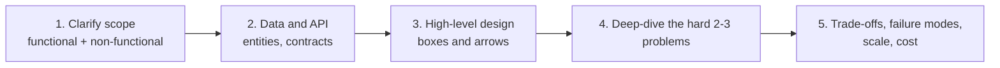

**WHY this order:** requirements decide the architecture (a feed with SEO needs SSR; a private feed does not). Deep-dives are where staff-level candidates separate themselves, so spend 60% of time there.

**Non-functional checklist** (the instructor's point: *they are mostly the same across products; pick the ones that matter and justify them*):

| NFR | Question to ask yourself |
|---|---|
| Performance | What is the latency budget? What is cached where? |
| Scalability | Read-heavy or write-heavy? Fan-out? |
| Availability / consistency | Can the user see stale data? For how long? |
| Accessibility, i18n / l10n | Screen readers, RTL, locale formats |
| Responsiveness | Mobile web vs desktop vs native |
| Security | Authn/z, long-lived sessions, encryption |
| Cost | CDN egress, storage, third-party vendor bills |

**Product-company lens:** every decision should connect to **user experience, revenue (ads / engagement), reliability, or cost**. Say that sentence explicitly.

---

## 1. News Feed (Facebook / Instagram / X)

### 1.1 Requirements

**Functional (collected in session):**
- Render the feed (the core), infinite scroll
- Create / view / edit / delete a post (text, image, audio, video)
- Like, comment, share; links and @mentions
- Notifications
- Feed customization: recommendations
- Ads (the revenue engine)
- Search, chat, settings
- Share + **link preview** (treated as its own requirement)
- Support long-lived sessions (authN / authZ)

**Non-functional (collected in session):**
- Fast load, caching
- Accessibility, responsiveness
- Globalization and localization
- **Virtualization** (a student's addition; correct, it is a performance NFR for long lists)

**Anatomy of one feed item:** content (text / image / video / audio) + three actions (like, comment, share). Others (save, report) are extensions.

> **Staff+ addition: clarifying questions to ask the interviewer**
> - Chronological or ranked feed? (Changes pagination design, see 1.4.)
> - Are we designing the web client only, or the whole backend?
> - Is the feed public (SEO needed) or login-gated?
> - Expected scale (DAU, posts per second), and how real-time must new posts be?

### 1.2 High-Level Architecture

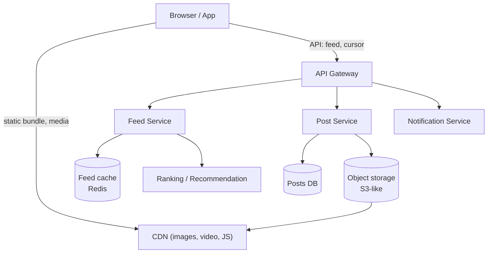

> **Staff+ addition (backend context interviewers may probe):**
> - **Fan-out on write** (push the post ID into followers' feed caches when posted): fast reads, expensive for celebrities with millions of followers.
> - **Fan-out on read** (assemble feed at request time): cheap writes, slow reads.
> - **Hybrid** (what large products do): push for normal users, pull for celebrities, merge at read time.
> - Ranked feeds mean the order is **not** stable, which matters for pagination (1.4).

### 1.3 Rendering: Client-Side vs Server-Side

**The question:** "When I open my feed, CSR or SSR?"

**Session answer (after discussion with students who said CSR, SSR, hybrid):**

| Type of page | Strategy | WHY |
|---|---|---|
| **Public** pages: creator profile, trending, public post, shared link | **SSR** | Crawlers must see content (SEO). More search hits means more traffic, which means more ads, which means revenue. |
| **Private / personal** pages: *my* home feed, settings | **CSR** | Not indexable anyway, so SEO is irrelevant. Rendering is offloaded to the client, which saves server CPU. After the first boot, navigation is fast because no server round-trip per view. |
| Whole product | **Hybrid** | No single mode fits a complete application. |

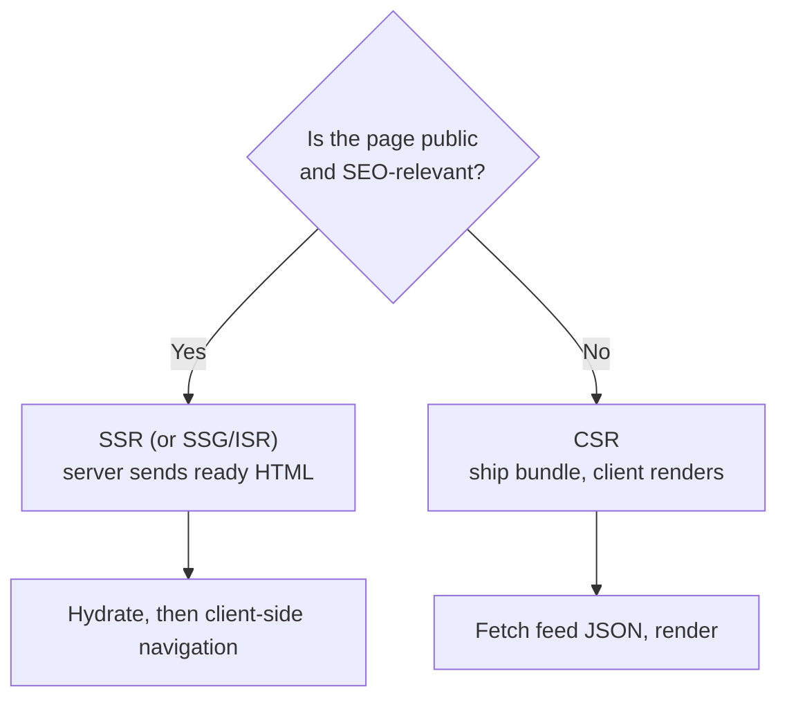

**Definitions to say crisply:**
- **CSR:** server sends a JS bundle plus an empty shell; the browser builds the page. Slow first paint, fast afterwards.
- **SSR:** server sends rendered HTML (e.g., Next.js); fast first paint and SEO-friendly; costs server compute.

> **Staff+ addition**
> - CSR's weakness is a slow first load. Mitigate: app shell + skeleton, `<link rel="preload">` for the first feed API call, route-level code splitting, HTTP caching of the bundle.
> - Modern middle ground: **streaming SSR / React Server Components** (HTML arrives in chunks), and **ISR / edge caching** for public pages.
> - Hydration cost is real; for a personal feed, skipping SSR avoids paying it twice.

### 1.4 Infinite Scroll and Pagination (the core problem)

Infinite scroll = fetch the next batch as the user nears the end. Two families:

| | **Index / offset pagination** | **Cursor pagination** |
|---|---|---|
| Client sends | `page=1&size=10` (or `offset=10&limit=10`) | `cursor=<opaque token>&limit=10` |
| Server logic | Skip `page*size` rows | Continue *after* the item the cursor identifies |
| Good for | Slow-changing data (e-commerce listings, admin tables) | Fast-changing data (social feeds, chat, logs) |
| Weakness | Duplicates / skipped items when data shifts | Cannot jump to arbitrary page N |

#### The failure of index pagination (draw this in the interview)

New posts are inserted at the **top**, so everything shifts down.

```
Time T1: user requests page 0            Time T2: 10 new posts arrive
 DB (newest first)                        DB (newest first)
 ┌───────────────┐                        ┌───────────────┐
 │ posts 1..10   │ ← page 0 (sent)        │ NEW 11..20    │ ← now page 0
 │ posts 11..20  │ ← page 1               │ posts 1..10   │ ← now page 1  (client already has these!)
 │ posts 21..30  │ ← page 2               │ posts 11..20  │ ← now page 2
 └───────────────┘                        └───────────────┘

User scrolls, asks for page 1 → receives posts 1..10 AGAIN (duplicates).
Opposite case (deletes) → items get SKIPPED.
```

Mitigation if stuck with it: client dedupes by post ID. That patches symptoms; it does not fix skipped items.

#### Cursor-based pagination

Client stores no page number. It sends back the **cursor** the server gave in the previous response. The cursor is an **opaque, agreed-upon token**: "a contract between client and server." The server decodes it to know where this client left off.

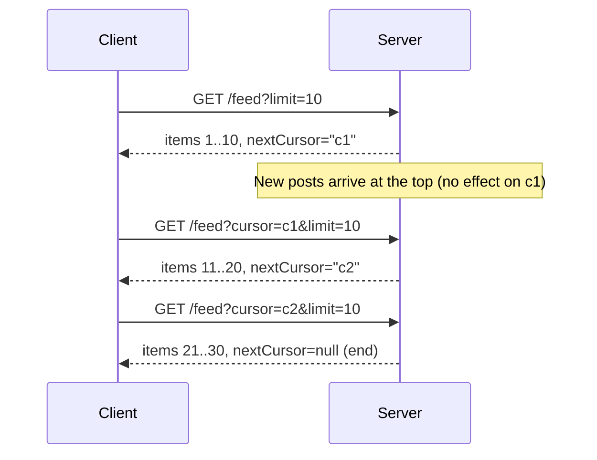

**What can a cursor contain?** (Session: "it can be anything both sides agree on")
- Simplest: the **last post ID** → "give me items older than this."
- Richer: `{startId, endId}` of what was already served.
- Production: base64url-encoded JSON, e.g. `{"ts":1722500000,"id":9981}`, often **signed/encrypted** so clients cannot tamper.

> **Staff+ addition: how it is really implemented (keyset pagination)**
> ```sql
> -- Offset: O(offset) work, the DB still scans and discards skipped rows
> SELECT * FROM posts ORDER BY created_at DESC LIMIT 10 OFFSET 100000;
>
> -- Keyset (what a cursor decodes to): index seek, constant cost
> SELECT * FROM posts
> WHERE (created_at, id) < (:last_created_at, :last_id)
> ORDER BY created_at DESC, id DESC
> LIMIT 10;
> ```
> - **WHY a tie-breaker (`id`)?** Many rows can share a timestamp; without a unique second key you skip or repeat rows.
> - **Ranked/recommended feeds:** order is computed, not stored. Typical solution: the server materializes a ranked list of IDs per session (Redis), and the cursor points *into that snapshot*. This keeps the order stable while the user scrolls.
> - **New posts:** show a "N new posts" pill instead of auto-inserting at the top. Auto-insert causes layout jump and breaks the user's scroll position.
> - Response shape: `{ items, nextCursor, hasMore }`. Handle API failure with an inline retry; handle end-of-list with an "all caught up" message (both mentioned in session).

**When to use which (interview answer):**
- Index/offset: data changes rarely, user needs "go to page 7", total counts matter (e-commerce, admin).
- Cursor: data is append-heavy at the head, consistency while scrolling matters (feeds, chat, notifications).

#### When to fetch the next page: the threshold (prefetch)

- Don't wait for the very end, or the user sees a spinner. Trigger at about **70–80% scrolled** (session's number).
- Some apps pre-download the first few pages up front.
- **Tools:** React Native `FlatList` has `onEndReachedThreshold`; web uses `IntersectionObserver` on a sentinel element.

```js
// Web: sentinel + IntersectionObserver (rootMargin gives the "80%" early trigger)
useEffect(() => {
  const io = new IntersectionObserver(([e]) => {
    if (e.isIntersecting && hasMore && !loading) loadNext(cursor);
  }, { rootMargin: "0px 0px 800px 0px" }); // start fetching 800px before the end
  io.observe(sentinelRef.current);
  return () => io.disconnect();
}, [cursor, hasMore, loading]);
```

> **Staff+ nuance:** `onEndReachedThreshold` is measured in *visible-lengths* (0.5 = half a screen from the end), not a percentage of total content. Say that if asked about API details.
> Also guard against **duplicate in-flight requests** (`loading` flag / request cancellation) and dedupe by ID.

### 1.5 Asset Optimization: Uploading

Problem: "upload a 10 MB image efficiently."

**Step 0: client-side limits (always).** Cap size (e.g., 10 MB for images) before sending anything. **WHY:** protects bandwidth, storage, and servers from abuse and accidents.

**Step 1: how to send the bytes:** multipart/form-data file stream, or Base64 (simple but about **33% larger**, so avoid for big media).

**Step 2: chunking.** Split 10 MB into ten 1 MB requests and send them **concurrently**.

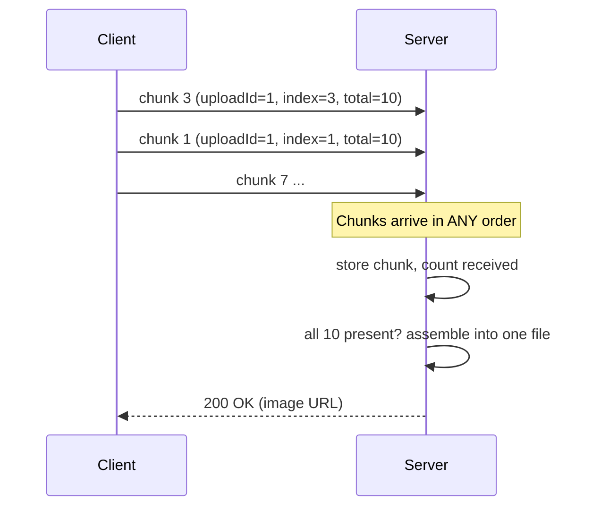

**Why chunk?** Parallel transfer can be faster, and a failure only costs one chunk (retry just that part), not the whole 10 MB.

**Costs and problems (the session's list; know each):**
1. **Chunk loss / partial failure.** Single upload is success-or-fail. Chunked upload can *partially* fail.
2. **Order not guaranteed.** The server must be slightly **stateful**: track `imageId`, `chunkIndex`, `totalChunks`. It cannot treat any chunk as "the last one."
3. **Assembly overhead.** The backend must check on every arrival "do I have all chunks?" and then stitch them into one file.
4. **Zombie chunks.** 8 of 10 chunks stored, 2 never arrive. The client gets an error, but 8 orphan chunks occupy storage with no parent. Needs a **cleanup job** (e.g., nightly: delete chunks with no completed image after a TTL). Store in-progress chunks in a temp "chunk table".

> **Staff+ addition: production-grade version**
> - **Direct-to-object-storage with presigned URLs** (S3 multipart upload): the file never passes through your app servers. **WHY:** app servers stay stateless and cheap.
> - Use an explicit **`initiate → upload parts → complete`** protocol instead of "check on every chunk." The `complete` call carries a manifest (part numbers + checksums); the server assembles once.
> - **Resumable uploads** (tus protocol, S3 multipart): on reconnect, ask which parts exist and send only the missing ones.
> - Per-chunk **checksums** for integrity; retry only failed chunks with **exponential backoff + jitter**.
> - **Cap concurrency** (about 3–6 parallel parts): unlimited parallelism congests the user's own uplink.
> - **Lifecycle rule** to auto-abort incomplete multipart uploads (S3 `AbortIncompleteMultipartUpload`) instead of a hand-written cron.
> - Client-side **resize/compress** images before upload; show **progress**; scan for malware and strip EXIF server-side; videos are transcoded **asynchronously** after upload.
>
> **Trade-off sentence for the interview:** "Chunking adds server state and cleanup work; for a social product where 99% of uploads succeed and users are on flaky mobile networks, the better UX and resumability are worth that overhead."

### 1.6 Asset Optimization: Downloading (CDN)

**Approach:** the main server stores only a **reference** (e.g., image ID) to the media; the media itself lives on a **CDN**. Clients fetch directly from the CDN, never touching the app server.

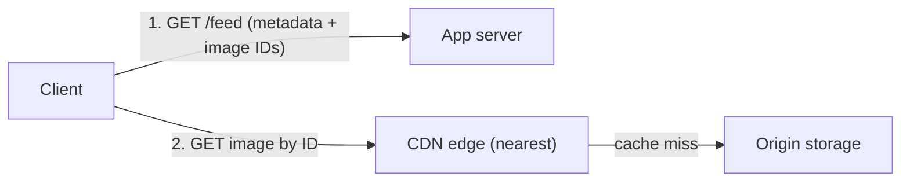

**WHY a CDN (answers from the room + instructor):**
- **Geographic proximity:** edge servers are near users, so lower latency.
- **Offload:** the main server is freed from serving heavy bytes; the CDN's *only* job is delivery.
- **Cacheable static content.**
- **Specialized optimizations**, which is the big one (below).

**On-the-fly transformation via URL params (session example):**
`/1234.png?width=200&height=200&radius=round`
The CDN returns exactly the variant requested. Variants can be **pre-generated** (session: "100–300 variations per upload") or generated on first request and cached.

**Adaptive delivery:** pick quality by **device capability and network speed** (slow network → smaller, more compressed image; fast → high-res). One upload → many outputs.

> **Critical point from the session:** *"Having a CDN alone will not make your application fast."* A CDN offloads the main server; the speed-ups come from **techniques on top of it** (resizing, format choice, quality negotiation, caching headers).

> **Staff+ addition**
> - **Pre-generate vs on-demand:** pre-generating many variants costs storage and encode time for images nobody views; on-demand costs a first-request penalty. Common answer: on-demand + cache at edge (first viewer pays, everyone after is a hit).
> - **Cache correctness:** include transform params in the cache key; use **content-hashed immutable URLs** with `Cache-Control: public, max-age=31536000, immutable` so you never need invalidation.
> - **Origin shield** prevents a cache-miss stampede from hitting storage.
> - Client side: ``, `<picture>` (AVIF/WebP/JPEG fallback), `loading="lazy"`, reserve `width/height` or `aspect-ratio` (prevents **CLS**), blur-hash/LQIP placeholders, `Accept` header negotiation for format.
> - Metrics to cite: **LCP, CLS, INP** (Core Web Vitals).

### 1.7 WebP

Google-proposed image format, **smaller files than JPEG/PNG at similar quality**, supported by all modern browsers.

- **Session intuition:** most pixels in an image are similar to their neighbors (e.g., a white background), so instead of storing every pixel you store information about the repeated/similar regions, and the browser reconstructs the image.
- **Slightly more precise (Staff+):** WebP lossy mode uses **predictive coding** (predict each block from already-decoded neighbors, store only the *difference*), then quantizes and entropy-codes the residuals. Lossless mode uses spatial prediction plus transforms. Same idea as the session's intuition, with the real mechanism named. **AVIF** compresses even better but encodes slower.
- **WHY it matters:** image-heavy products (feeds, e-commerce) are dominated by image bytes. Fewer bytes means faster LCP and lower CDN egress bills.

### 1.8 Virtualization (windowed lists)

**Problem:** render 100s of posts with `.map()` and the DOM/RAM grows without bound → jank, memory pressure, slow search/filter.

**Solution:** render only what is on screen (plus a small buffer). As a card leaves the viewport its component is **recycled/replaced** by the next item.

```
 Without virtualization            With virtualization
 ┌────────────┐                    ┌────────────┐  ← spacer (empty height, keeps scrollbar correct)
 │ post 1     │ all 500 in DOM     ├────────────┤
 │ post 2     │                    │ post 41    │ ┐
 │ ...        │                    │ post 42    │ │ visible window
 │ post 500   │                    │ post 43    │ │ (+ overscan)
 └────────────┘                    │ post 44    │ ┘
 Memory grows forever              ├────────────┤  ← spacer
                                   └────────────┘  ~constant memory
```

| Pros | Cons |
|---|---|
| Near-constant DOM nodes and memory | Repaint / re-mount cost while scrolling; fast flings can show blank areas |
| Smooth on low-end devices | Variable-height items (posts differ!) need measurement/caching |
| Cheaper filter/search on big lists | Browser Ctrl+F and screen readers don't see off-window items |

**Session's rule:** use a virtualized list whenever you render a large list, especially if you also search/filter it. Libraries: any is fine (`react-window`, `react-virtuoso`, `@tanstack/virtual`, RN `FlatList`).

> **Staff+ addition**
> - Keep an **overscan buffer** (a few items above and below) to avoid blank flashes.
> - **Scroll restoration** when navigating back to the feed (store index + offset).
> - Memoize item components; keep item DOM light (lazy-load media inside items).
> - Lighter alternative: CSS `content-visibility: auto`.
> - Accessibility trade-off: use `aria-setsize` / `aria-posinset`, and keep keyboard navigation working. Mention this to show you remembered the accessibility NFR.

### 1.9 Link Sharing and Link Preview

**Question (asked in a real tech-giant team-fit round):** "Users share post links all the time. How do you make opening a shared link fast?"

**Why it is hard:** the normal journey is *load the whole app → boot → parse URL param → fetch post → render*. A huge product bundle makes the one thing the visitor wants (the post) the last thing to appear. Visitors arriving from a link are impatient, unlike a user who deliberately opened their feed.

**Answer 1: ship a slim entry point for permalinks.**
- Separate, small bundle (route-level code splitting or **micro-frontend**) that does only: render this post (like a mini video/image player).
- When the user navigates elsewhere (Home, Settings), **lazy-load the rest** to become the full app.
- Server can **render the page for such URLs** (SSR), then client takes over.

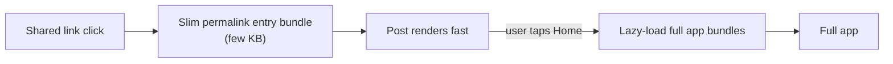

**Answer 2: SEO-friendly, human-readable URLs (slugs).**
- Bad: `/post?id=1234`, deep journeys like `/user?id=1234` → `/place?id=5678`. Crawlers cannot infer meaning from numeric IDs.
- Good: `/users/john-doe-1234/places/bengaluru-5678` (name **plus** ID is fine).
- This was a real question at **Apollo.io**: nested user journey, how should URL params look for SEO? Answer: put readable names in the path.
- **WHY:** crawlers rank pages partly by URL keywords, and humans trust readable links.

**Answer to a student's question: how do WhatsApp/Instagram show a preview card?** (The instructor deferred this.)
- Chat apps do not run your app. Their **link-unfurl bot** fetches the URL's HTML and reads **Open Graph / Twitter Card meta tags** (`og:title`, `og:image`, `og:description`).
- **Most such bots do not execute JavaScript**, so those tags must be in the **initial HTML**, meaning SSR/prerender for public post routes. This is another reason public pages are SSR.

**Student question: stale previews.** "Preview shows 5 likes; opened 4 hours later it's 40."
- Preview is a snapshot (acceptable trade-off). On actual open, the page loads fresh data.
- With SSR the preview can be near real-time; if you cache HTML at the edge use short TTL / `stale-while-revalidate`, and fetch volatile counts (likes) client-side after load.

### 1.10 News Feed Cheat-Sheet

| Problem | Technique | WHY | Trade-off |
|---|---|---|---|
| Rendering mode | Hybrid: SSR public, CSR private | SEO vs server cost | Two code paths |
| Infinite scroll | Cursor pagination | Stable under inserts | No random page jump |
| Next-page trigger | ~80% / `IntersectionObserver` | Hide latency | Over-fetching |
| Big uploads | Chunked/multipart + resumable | Parallel, retry per part | State + zombie cleanup |
| Media delivery | CDN + transforms + WebP/AVIF | Latency, offload, bytes | Vendor cost; build vs buy |
| Long lists | Virtualization | Bounded memory | Blank flashes, a11y |
| Fast shared links | Slim bundle + SSR + OG tags + slug URLs | First impression, SEO, previews | More build complexity |

**Recommended reading from the session:** GreatFrontEnd articles on *News Feed* and *Type-ahead* system design.

---
## 2. Google Docs: Concurrent Editing

*This also applies to online code editors (CodeSandbox-style), Figma, Notion: anywhere several people edit one artifact live.*

### 2.1 The Problem

Two users edit the same document at the same time, possibly on the same line.

- Alice appends " World" after "Hello".
- Bob appends "!!!" after "Hello".
- Someone presses Enter and line 2 becomes line 3 while another person is typing on line 2.

Requirement: **everyone sees everyone's edits quickly, and all copies end up identical (convergence)**, without making users take turns.

### 2.2 Naive Solution: Locking (and why it is rejected)

Give each user a time slice (e.g., 30 s of exclusive edit rights, round-robin).

- Easy to build, no conflicts.
- **Rejected because** Google's product vision is *conversation-like*: you can speak/type any time, not wait your turn. With 12 users and 30 s slots you wait 5+ minutes. Locking destroys the collaboration feel.

*(Locking is still the right answer for low-concurrency, correctness-first cases such as optimistic locking on a database row. Say so.)*

### 2.3 Transport

Use **WebSockets**: edits are sent as the user types (debounced), and the server broadcasts to all collaborators, so communication is **bidirectional and continuous**. Server work is effectively **serialized per document** (operations are handled one at a time even if they "arrive at the same moment": microsecond differences exist).

### 2.4 Technique 1: Operational Transformation (OT)

**Idea:** clients send **operations** ("insert text X at position P"). The server is the referee: if another operation was applied first and shifted positions, it **transforms** the incoming operation so it still means what the user intended.

**Session example.** Document `Hello` (positions 0–4, length 5).

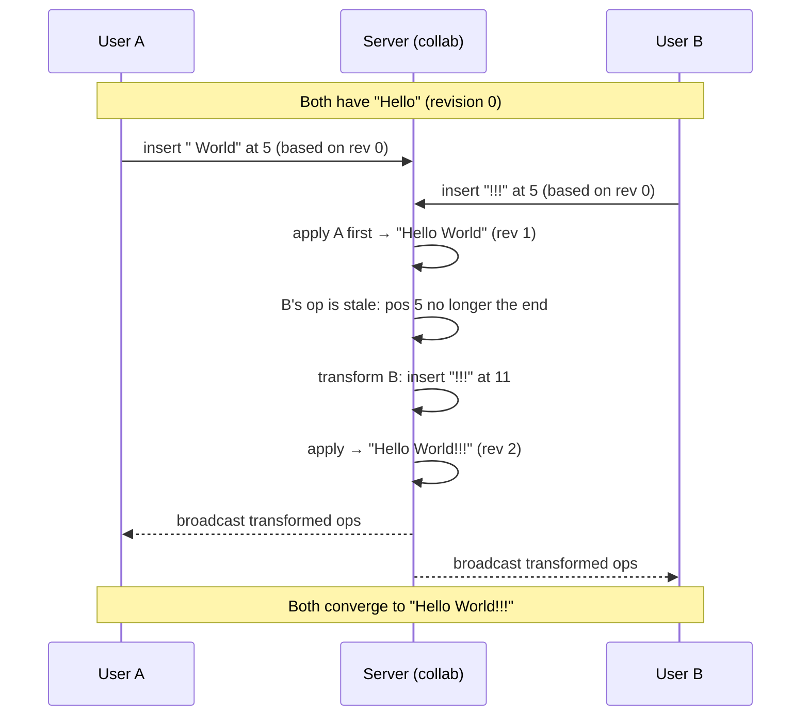

**Key points to say:**
- **Server order wins.** Whichever operation reaches the server first is applied first (no "intelligence"). If B's packet is delayed by network latency, B's text may land before A's. Result differs, but it is *consistent for everyone*.
- "Right vs wrong" doesn't exist here. Two people edited the same spot; the system must resolve it *deterministically*. If a user dislikes the result, they edit again.
- Similar to a **race condition** (two people marking the same to-do complete: one wins, the other gets an error). OT differs: it tries to *merge* both intents rather than reject one.
- Works for **everything renderable**, not just text: tables, images, embedded media. Text is just the simplest to explain.
- Google doesn't officially publish its internals; OT is the classic, **publicly documented** algorithm (Google Wave / Docs lineage) and the safe interview answer. The algorithm itself is public.

> **Staff+ addition: what an interviewer drills into**
> ```js
> // Transform an incoming insert (B) against an insert (A) that was already applied.
> function transformInsert(b, a) {
>   if (a.pos < b.pos || (a.pos === b.pos && a.siteId < b.siteId)) {
>     return { ...b, pos: b.pos + a.text.length };   // shift right
>   }
>   return b;                                        // unaffected
> }
> ```
> - **Tie-break on equal positions** (here `siteId`) is mandatory; otherwise replicas diverge.
> - Each op carries the **base revision** it was made against; the server transforms it against every op committed since that revision. That's how it detects "stale".
> - **Client side:** clients apply their own edits **optimistically** (instant typing), keep a queue of un-acked ops, and transform incoming server ops against that queue. Without this, typing would lag by one round trip.
> - Insert/delete/format all need transform rules, which is why OT's **complexity grows with the number of operation types**. This is the real reason "actual implementation is harder than the example."
> - Needs a **central server** and works best with a **small number of simultaneous editors**.

**Scalability question raised in the session: "What if 4,000 people open and edit one doc?"**
- Algorithm correctness doesn't break, but the *human result becomes gibberish*: it's a product-level, not system-level, problem (like setting your phone to the wrong timezone and being surprised by order times).
- **Do** ask the interviewer for limits (max concurrent editors, max characters), but as **safeguards** (rate limiting, max doc size, max editors), not as the thing that makes your design work. Same reasoning as capping characters in a type-ahead box so one user can't send 1M characters.
- Practical: many people can *view*, few can *edit*; the limit protects server and sanity.

### 2.5 Technique 2: Differential Synchronization ("diff-sync")

*(The instructor re-explained this on day 2 because day 1 was unclear; this is the clean version.)*

**Idea:** instead of sending an operation ("insert at 5"), the client sends the **whole updated document** (or its diff). The server **diffs** it against its copy and **patches** its own copy, then diffs against every other client and sends them only their difference.

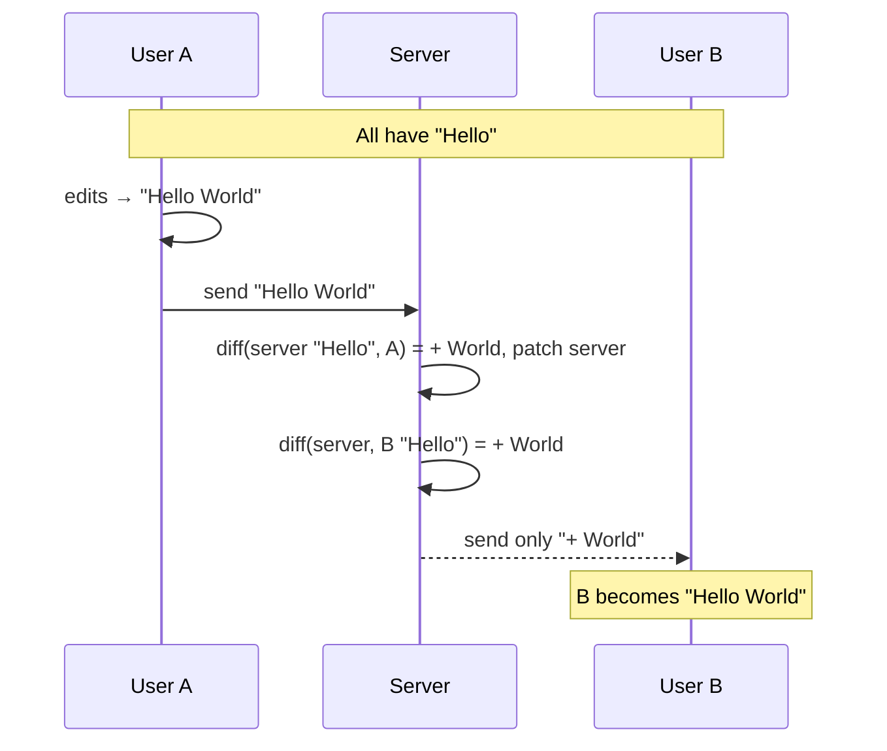

**The weakness (say this explicitly):** if B concurrently sent `Hello!!!`, the server compares it with the current "Hello World" and the result depends on arrival order; the later one effectively **overwrites** parts of the earlier. Without extra machinery it is **last-writer-wins**.

**When to use:** documents that are **rarely edited**, e.g., wikis (Wikipedia, internal office wiki pages). It is simple. In practice it is combined with other techniques.
**When NOT to use:** constantly edited, truly concurrent documents (Google Docs).

**Differences vs OT (session summary):** OT says *where and what* to change (`insert X at 5`); diff-sync says *what the document looks like now*, and the server reconciles the difference.

> **Staff+ addition:** Neil Fraser's original Differential Synchronization keeps a **shadow copy** per client and runs a diff/patch loop in both directions with fuzzy patching, so it does handle concurrent edits better than the simplified version taught here. For interviews, give the session's version and mention that.

### 2.6 Technique 3: CRDT (Conflict-free Replicated Data Type)

**Idea:** make the data structure itself so that concurrent edits **can always be merged without transformation, in any order**.

**How (session version):**
1. Every **character has a unique ID** (not just a position). Positions shift when text is inserted; IDs do not.
2. Every client (user/instance) also has a **client ID**.
3. An edit is "insert W *after character-ID 5*," not "insert W at position 5."
4. If two clients insert at the *same* anchor, a **deterministic rule** orders them (e.g., smaller client ID first; could be weighted, e.g., document owner gets priority). Every replica applies the same rule, so all converge.
5. **No transformation needed**: operations stay valid because they reference stable IDs.

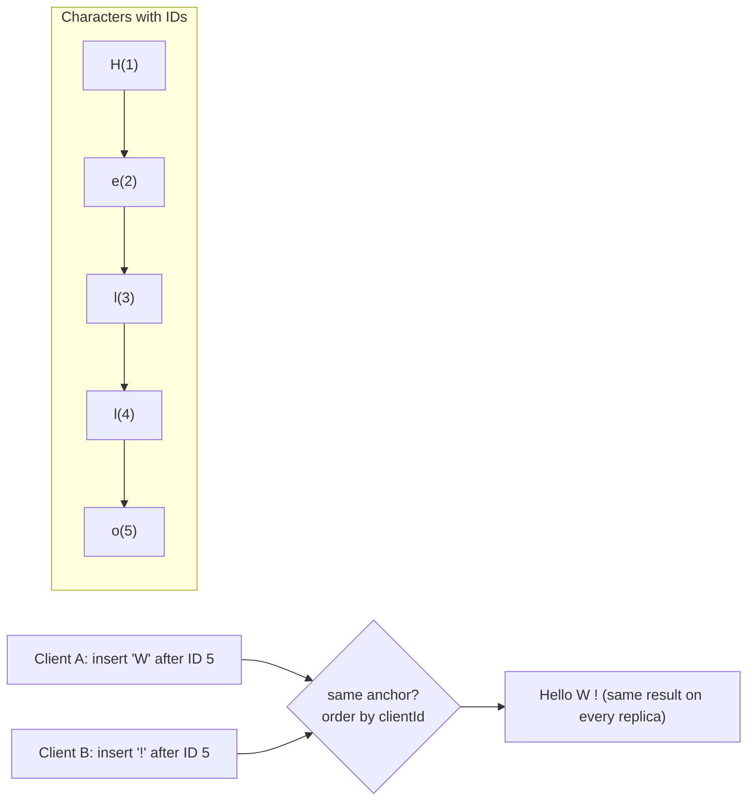

**Network model:** because ops are order-independent, clients can talk **directly (peer-to-peer, e.g., WebRTC)** with no central referee, broadcasting each change to all peers. Different regions → trivial; same region → priority rule decides. The server is still synced **periodically** to keep a canonical copy and for persistence/new joiners.

**Who uses it (per session):** Figma and Notion-style thick clients.
**Advantages:** less server load, offline/peer friendly. **Costs:** extra metadata per character, P2P connectivity complexity (WebRTC infrastructure), harder to reason about.

> **Staff+ additions / corrections**
> - A CRDT is *not* defined by "no server." Many production systems run CRDTs **with** a server (Yjs/Automerge over WebSocket). The server relays and persists but doesn't have to arbitrate. Figma's multiplayer is publicly described as server-centric and CRDT-*inspired*, not pure P2P. Say "CRDT removes the need for transformation; it *permits* serverless."
> - Properties that make it work: operations are **commutative, associative, idempotent** → *strong eventual consistency*.
> - Deleted characters are kept as **tombstones**, so memory grows until garbage-collected/compacted.
> - Well-known sequence CRDT families: **RGA, Logoot/LSEQ, Yjs's YATA**.
> - Instructor's own note: nobody in the room has implemented these. Interviews expect the **concept and trade-offs**, not the algorithm.

### 2.7 Choosing a Technique (and the UDP/TCP angle)

| | **OT** | **CRDT** | **Diff-Sync** |
|---|---|---|---|
| Unit of change | Operation (type, position) | Op on unique char ID | Document / diff |
| Central server needed | **Yes** (arbiter) | No (optional) | Yes |
| Handles heavy concurrent editing | Yes (small group) | Yes | **No** (last-writer-wins) |
| Offline / P2P | Hard | **Natural** | Poor |
| Complexity | Transform functions per op pair | ID + ordering + tombstones | Simple |
| Typical use | Google Docs-style docs | Figma, Notion-style, Yjs apps | Wikis, rarely-edited pages |

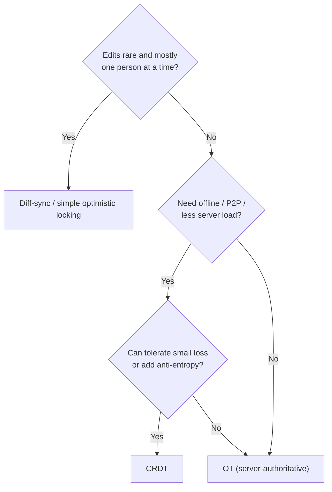

**Session reasoning (loss tolerance):** Real-time P2P channels often ride on **UDP** (the instructor said "Unified Datagram Protocol"; the correct name is **User Datagram Protocol**): delivery is not guaranteed, unlike **TCP**.
- A design tool (Figma) can tolerate a lost fragment: it is visual and the state is re-synced soon.
- A text document (or Notion) **cannot** lose characters; use a server-governed approach (OT) where every change is acknowledged.
- Rule: *"If even a small piece of information cannot be lost → OT. If small loss is acceptable, you want less server overhead and concurrency → CRDT."*

> **Staff+ caveat:** WebRTC data channels (SCTP over UDP) can be configured **reliable and ordered**, and real CRDT systems add **state-vector sync / anti-entropy** so missed updates are repaired. So "UDP means lossy" is a *default behavior*, not an unavoidable property. Use the session's reasoning but show you know this.

**Interview minimum (instructor):** know **OT** well with an example. Mention CRDT and diff-sync with their differences for bonus marks.

### 2.8 Storing and Rendering Rich Text

**Problem:** bold, underline, strikethrough, tables, images, indentation cannot be saved as plain characters. You must persist *structure + style* and reproduce it exactly on any client.

**Core idea (session):** client and server agree on a **shared document language/schema**. Server stores it; client knows how to render it. No magic.

**Option A: JSON document model**
```json
{
  "type": "doc",
  "content": [
    { "type": "paragraph", "children": [
        { "text": "Hello ", "bold": true },
        { "text": "world", "underline": true } ] },
    { "type": "table", "rows": [ [ { "text": "A1" }, { "text": "B1" } ] ] },
    { "type": "image", "src": "cdn/abc.webp", "width": 400, "height": 300 }
  ]
}
```
- Only **explicit** styles need storing; implicit defaults can be omitted (smaller payloads).

**Option B: Markdown**: `**bold**`, `# Heading`, tables as pipes; any Markdown renderer displays it. Instructor demo: exporting the Notion page to `.md` and seeing headings, bullets, tables as plain text.

**Option C: custom/other formats**: any format you and the client understand. A student cited TinyMCE and RTF-style markers (`\b` for bold, `\n` newline). Use a minimal custom format if you only need a few dynamic features.

> **Staff+ addition**
> - Industry formats: **ProseMirror/Tiptap JSON**, **Slate**, **Quill Delta** (`[{insert:"Hi", attributes:{bold:true}}]`), **Google's internal model**. Formatting changes become **operations too** (OT "retain with attributes"), so *formatting is also concurrently editable*.
> - **Schema versioning**: documents live for years; add a `schemaVersion` and write migrations.
> - **Security:** never inject stored rich text with `innerHTML` unsanitized. Sanitize (DOMPurify) or render from the structured model to avoid **XSS**.

### 2.9 Version History

**Need:** "Show me the doc as of 4:45 PM", and see who changed what.

**Naive:** `(docId, versionId)` → server sends the full document. **Problem:** documents are big; changes are tiny.

**Better (session):** send only the **differences/operations** per version, the same technique as live editing (OT/CRDT-style ops), and the client replays them to render that version. Version history is a **second use of the concurrent-editing machinery**, just displayed historically.

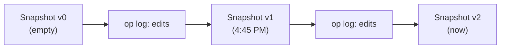

> **Staff+ addition:** store **periodic snapshots plus the operation log**; to reconstruct revision *N* load the nearest snapshot and replay ops after it. WHY: pure replay from the start is O(history); pure snapshots waste storage. **Restoring** an old version should *append a new revision* (never rewrite history), preserving audit trails. Compact/coalesce old ops; support named versions.

### 2.10 Add-ons / Extensions

**Question:** Docs has add-ons (index/table-of-contents, PDF tools, fancy tables). It's a web app, so how do they plug in?

**Session answer:** an add-on **cannot give the product a capability the product doesn't already have**. It *uses* capabilities the platform **exposes** and packages them conveniently. Analogies: Bootstrap vs hand-written CSS; Redux vs React's own state APIs; VS Code extensions.

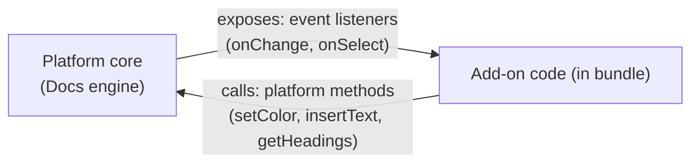

- **Not backend HTTP APIs necessarily**: they are methods/listeners exposed *inside* the app.
- Example: highlight every `// TODO` orange → add-on **listens** for line changes, detects `#todo`, **calls** the "change color" method.
- The bundle the user downloads next time includes the add-on's code.
- **Risk:** two add-ons doing conflicting things to the same text produce unintended effects.
- **Why platforms do this:** the owner lacks bandwidth to build every feature; a third-party ecosystem adds value (and creators earn money, e.g., Shopify/Excel/Docs extensions at $1–$5).

> **Staff+ addition: design concerns**
> - **Sandboxing** (iframes with restricted permissions, Web Workers, or server-side script runtimes like Apps Script) so a bad add-on cannot read or corrupt unrelated data.
> - **Permission scopes** (OAuth) and user consent; marketplace review.
> - **Stable, versioned extension API** (breaking it breaks every add-on).
> - Ordering/conflict policy, performance budgets (an add-on must not block typing), and rate limits.

### 2.11 Google Docs Cheat-Sheet

- Locking = simple but kills real-time feel.
- **OT** = send operations; server orders and transforms; needs central server; best for docs.
- **CRDT** = unique IDs + deterministic tie-break; no transformation; P2P/offline friendly; metadata and tombstones.
- **Diff-sync** = send whole/diff; server patches; weak under heavy concurrency; fine for wikis.
- Rich text = agreed schema (JSON/Markdown/Delta); formatting is also an operation.
- Version history = snapshots + op replay.
- Add-ons = expose platform events/methods + sandbox + permissions.
- Limits (editors, chars) = **safeguards**, not design crutches.

---

## 3. WhatsApp: End-to-End Encryption

*Instructor framing: encryption is an **ingredient** you can drop into any recipe. If any design question touches security or privacy (chat, payments, health data), reuse this.*

*The web-client angle was the point of the session; messaging backend (queues, delivery receipts, presence) was covered in earlier sessions.*

### 3.1 Goal

**End-to-end encryption (E2EE):** only the sender and the intended recipient can read a message. **Even the WhatsApp server cannot decrypt it**, so it merely relays ciphertext.

### 3.2 Key Pairs (asymmetric cryptography)

When a user registers, the app generates two linked keys:

| Key | Who holds it | Used for |
|---|---|---|
| **Public key** | Uploaded to and stored on the server; anyone can fetch it | **Encrypting** messages *to* this user |
| **Private key** | **Only on the user's device**, never shared | **Decrypting** messages sent to this user |

**WHY asymmetric:** the sender needs to encrypt for a recipient they have never exchanged a secret with. Public keys can be distributed openly; only the private key can reverse the lock.

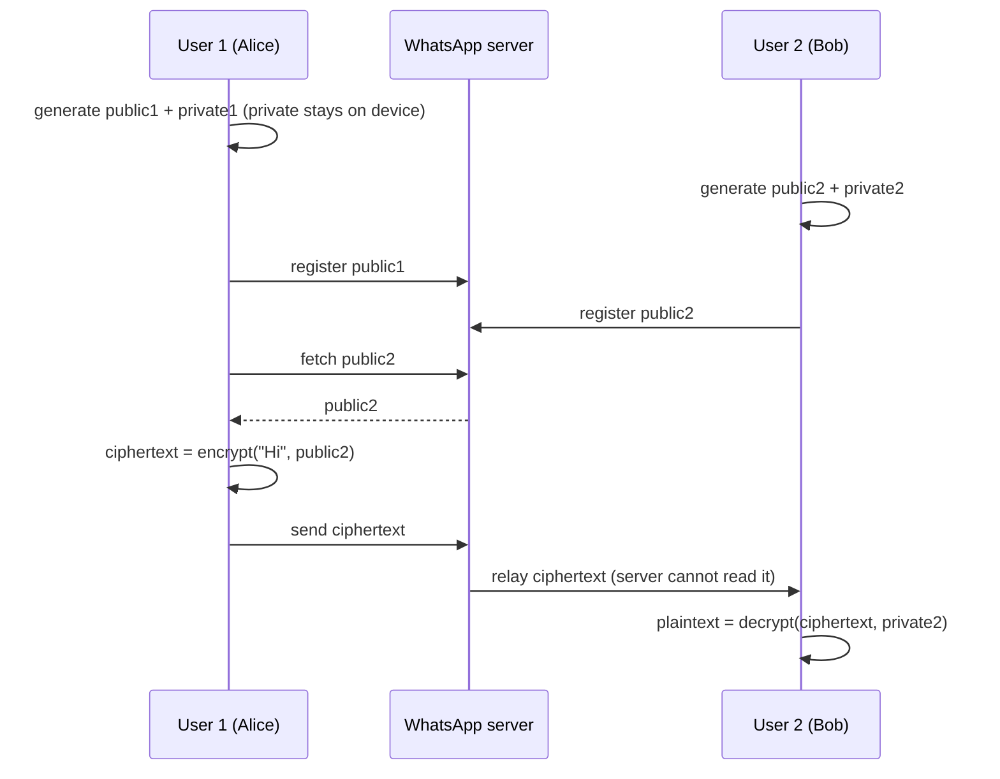

**Rules to remember (session):**
- **Encrypt with the receiver's public key; decrypt with the receiver's own private key.**
- Alice **cannot decrypt her own sent message** (she doesn't have Bob's private key). Apps keep a local plaintext copy.
- Reply direction uses Alice's public key / Alice's private key.
- Private key storage: platform secure storage: **iOS Keychain**, **Android Keystore** (hardware-backed). *(The session said "Keychain / Shared Preferences" for Android; plain SharedPreferences is not secure. Use the **Android Keystore**, or `EncryptedSharedPreferences` backed by it.)*

### 3.3 Toy Example Shown in Session

Not real crypto; it only illustrates "public lock, private unlock."

```js
const encrypt = (text, key) => [...text].map(ch => ch.charCodeAt(0) + key);        // public key = 7
const decrypt = (codes, key) => String.fromCharCode(...codes.map(n => n + key));   // private key = -7

encrypt("Hello Bob", 7);              // [79,108,115,115,118,39,73,118,105]  unreadable
decrypt(encrypt("Hello Bob", 7), -7); // "Hello Bob"
```

> **Staff+ addition: how real systems differ**
> - In real RSA/ECC you **cannot derive the private key from the public key** (hard math problem). In the toy, `-7` is trivially derivable, so it demonstrates the *flow*, not the security.
> - Real systems use **hybrid encryption**: asymmetric crypto only to agree on/protect a **symmetric session key** (AES-GCM); the message body is encrypted with that fast symmetric key. **WHY:** asymmetric ops are slow and size-limited.
> - WhatsApp uses the **Signal Protocol** (X3DH key agreement + **Double Ratchet**): a new key per message gives **forward secrecy** (a leaked key doesn't expose past messages) and post-compromise recovery. Public pre-keys are uploaded to the server so you can message someone who is offline.
> ```js
> // Hybrid sketch (Node): AES-GCM for payload, RSA-OAEP to wrap the AES key
> const aesKey = crypto.randomBytes(32), iv = crypto.randomBytes(12);
> const c = crypto.createCipheriv("aes-256-gcm", aesKey, iv);
> const body = Buffer.concat([c.update("Hello Bob"), c.final()]), tag = c.getAuthTag();
> const wrapped = crypto.publicEncrypt({ key: bobPublicPem, oaepHash: "sha256" }, aesKey);
> // send { wrapped, iv, tag, body }; Bob unwraps with his private key, then AES-decrypts
> ```

### 3.4 WhatsApp Web: "Private key is only on the phone... so how does the browser read my chats?"

**The puzzle posed in session:** if the private key never leaves the phone, how does scanning a QR code let Web continue the conversation?

**Session's model (key-transfer design):**

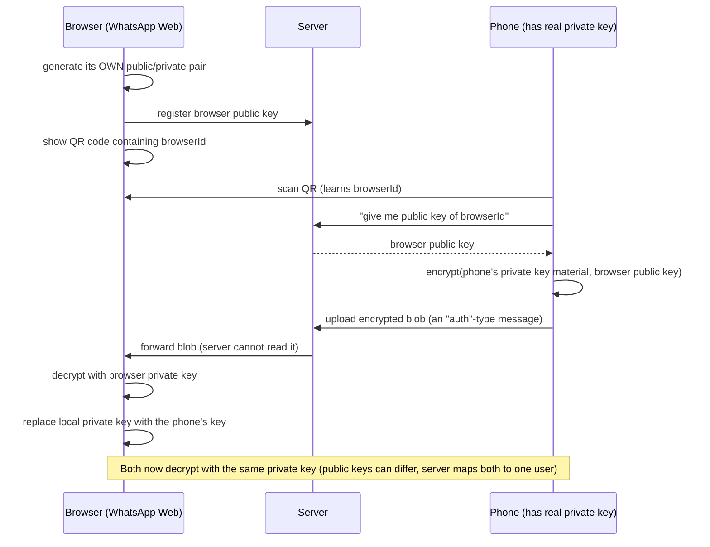

Highlights:
- Browser starts with its own throwaway pair so there is a **secure channel to receive the secret**.
- The transfer is just **another encrypted message**, with a distinct message type ("auth") so the client knows to treat it as a key, not chat text.
- The server stores/forwards but **cannot read** it (encrypted to the browser's public key).
- If the web session is **logged out/killed**, the key disappears from the browser; it stays on the phone.
- The server keeps a **user ↔ devices map** so one incoming message is delivered to every linked device.

**Where can the browser keep the key?** Session: "secured cookies like JWT." 

> **Staff+ correction:** do **not** put an E2EE private key in a cookie: cookies are **automatically sent to the server on every request**, which would defeat end-to-end encryption. Use **IndexedDB with a non-extractable `CryptoKey`** (WebCrypto), so JS can *use* the key but cannot *export* it. HttpOnly cookies are right for *session tokens*, not for E2EE keys.

> **Staff+ addition: what WhatsApp actually does (multi-device, publicly documented in its security whitepaper):** each linked device has **its own identity keys**; the private key is **not copied**. The sender encrypts the message **separately for each of the recipient's devices (and own other devices)**; the QR code only authenticates linking. This avoids ever moving a long-term private key. Mention both the *teaching model* (shared key) and the *production model* (per-device keys, fan-out encryption). It shows depth.

### 3.5 "Is it *truly* end-to-end?" (the discussion)

Instructor's reasoning (opinion/speculation, not verified facts):
- The architecture **explains how it can work**, but users **cannot audit the closed-source client**. A client that wanted to leak keys or plaintext could.
- Observation: heavy targeted spam/ads make some people doubt. Two theories floated: (1) the company could decrypt for internal use, (2) it doesn't read content but derives signals from **encrypted data/metadata** to train models.
- Student's concern: "server holds the private key in version 2": **No**, it forwards the key *encrypted for the browser*, so the server cannot read it.

> **Staff+ framing (how to say it in an interview)**
> - E2EE protects **message content**; it does **not** hide **metadata** (who talks to whom, when, group membership, IP, device info). That metadata alone is valuable.
> - Residual trust points: client code integrity, **cloud backups** (unencrypted by default unless user enables encrypted backups), key-change warnings, and the server's public-key directory being honest (**key transparency / safety-number verification** mitigates a malicious server swapping keys, the classic MITM on E2EE).
> - Don't assert what WhatsApp does or doesn't do internally; assert what the **design guarantees** and **what you'd need to verify**.

### 3.6 Cheat-Sheet

- Public key encrypts, private key decrypts; private never leaves device; server stores only public keys.
- Store private keys in Keychain / Keystore (native), non-extractable WebCrypto key (web).
- Multi-device: either transfer encrypted key material (teaching model) or per-device keys with sender fan-out (production).
- Real systems: hybrid encryption + Signal Protocol; forward secrecy.
- Be honest about limits: metadata, backups, unauditable clients, key transparency.

---

## 4. ChatGPT / GenAI Chat: Streaming UI

*Common newer interview question: "Design the chat interface of ChatGPT."*

### 4.1 Requirements

**Functional (from session):**
- Chat interface (prompt box + send, scrolling conversation)
- **Continuous streamed response** (text appears progressively)
- Multi-format responses: text, **code**, **images**, etc.
- Chat history **and search** of history
- Uploads: image / audio / video (to ask questions about them)
- **Model selection** and mode (normal vs deep research)
- Integration with **plugins**

**Non-functional:** low **time-to-first-token (TTFT)** perceived latency, responsiveness, reliability under long responses, accessibility, scalability.

The instructor's focus: **the chat interface and streaming**; history/search are "straightforward," and uploads reuse **chunked/multipart upload** (Section 1.5).

### 4.2 Request/Response Model: why **SSE** (Server-Sent Events), not WebSocket

Flow: the client sends **one POST** (prompt text, optionally files/images/voice). After that the client **only listens**; it never needs to send more on that connection. The server (LLM) generates **tokens** and pushes whatever is ready **without waiting for the full answer**.

| | **Server-Sent Events** | **WebSocket** | **Long polling** |
|---|---|---|---|
| Direction | Server → client | Bidirectional | Request/response loop |
| Fits chat-token streaming | **Yes** (one-way stream) | Overkill | Laggy, wasteful |
| Transport | Plain HTTP (proxies, auth, CDN friendly) | Upgraded protocol | HTTP |
| Auto-reconnect | Built in (`EventSource`) | You build it | You build it |
| Use when | Streaming outputs, notifications | Collaborative editing, games, true two-way chat | Legacy |

**WHY not WebSocket here:** "there's no dedicated pipe required": the client isn't sending anything back during generation. SSE is simpler, works with standard HTTP infrastructure, and is cheaper to operate. (Contrast with Google Docs (Section 2), where both sides talk continuously, so WebSocket.)

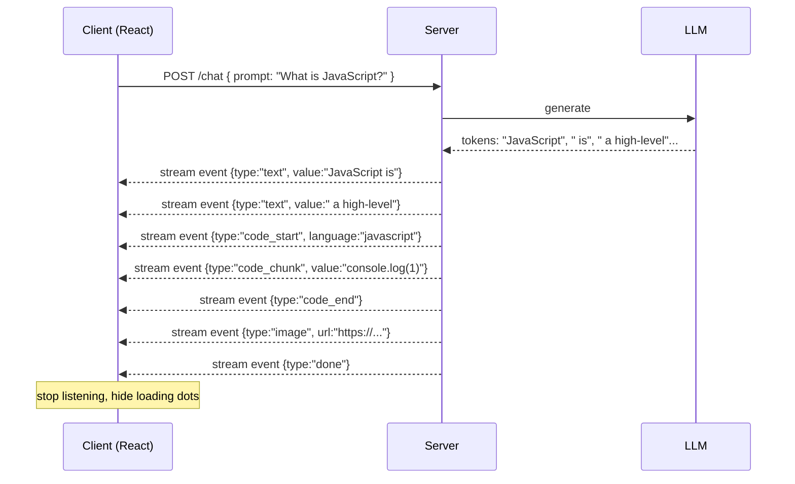

### 4.3 The "magic" is a client–server contract

Seeing text, code, and images in one answer feels magical, but there is **no magic: the server emits typed events the client has agreed to understand**, and the client maps each type to a UI component.

| Event | Client behavior |
|---|---|
| `text` chunk | Append to current paragraph |
| `code_start {language}` | Open a code block component with that language/styling |
| `code_chunk` | Append to that code block |
| `code_end` | Close the block |
| `image {url}` | Render an `` |
| `done` | Stop listening, finalize message |

If the server sent something the client doesn't understand, it **cannot render it**. (Same principle as the rich-text schema in Section 2.8.)

**Client pipeline (session):** `stream → event parser → message model → React components (paragraph / code block / image) → incremental render`. The animated "…" shows data hasn't arrived yet; as chunks come, the UI **keeps incrementing**.

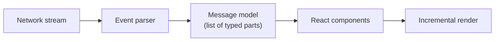

### 4.4 Code Sketches

**Server (SSE wire format):**
```
HTTP/1.1 200 OK
Content-Type: text/event-stream
Cache-Control: no-cache
Connection: keep-alive

data: {"type":"text","value":"JavaScript is"}

data: {"type":"code_start","language":"javascript"}

data: {"type":"done"}

```
(Each event ends with a blank line.)

**Client (fetch streaming, because `EventSource` supports only GET and the prompt needs POST):**
```js
const ctrl = new AbortController();               // "Stop generating" button calls ctrl.abort()
const res = await fetch("/chat", {
  method: "POST",
  headers: { "Content-Type": "application/json" },
  body: JSON.stringify({ prompt, model }),
  signal: ctrl.signal,
});
const reader = res.body.getReader();
const decoder = new TextDecoder();
let buffer = "";
while (true) {
  const { value, done } = await reader.read();
  if (done) break;
  buffer += decoder.decode(value, { stream: true });
  let idx;
  while ((idx = buffer.indexOf("\n\n")) !== -1) {       // one complete SSE event
    const raw = buffer.slice(0, idx).replace(/^data: /, "");
    buffer = buffer.slice(idx + 2);
    dispatch(JSON.parse(raw));                          // update message model → React re-renders
  }
}
```

### 4.5 Staff+ Depth (what separates answers)

- **Render performance:** tokens arrive faster than the display needs. **Batch updates** (e.g., flush buffered tokens once per `requestAnimationFrame`) instead of a re-render per token; memoize completed message blocks so only the *last* block re-renders.
- **Incremental Markdown/code parsing:** half-written Markdown (an unclosed code fence) flickers; use a streaming-safe parser and treat the in-progress block specially.
- **Auto-scroll with user override:** stick to bottom while streaming, but stop if the user scrolls up; show a "jump to latest" button.
- **Cancellation:** `AbortController` closes the stream; the server must **detect disconnect and stop the model**, which saves expensive GPU time (a *cost* argument).
- **Resilience:** network drops mid-answer. Give each message an ID and let the client **resume** from the last event index (SSE `Last-Event-ID` pattern) or refetch the persisted message; show a partial answer plus a retry control.
- **Infra gotchas:** reverse proxies/CDNs may **buffer** responses and kill the streaming effect (disable buffering for that route, e.g., `X-Accel-Buffering: no`); long-lived connections need sensible timeouts; HTTP/1.1 limits ~6 connections per host (HTTP/2 multiplexing helps).
- **Persistence:** save the finished message as an ordered list of typed parts (text/code/image) so history renders with the same components. Index history for **search** server-side.
- **Uploads:** use chunked/presigned upload (1.5); send file IDs, not bytes, in the chat POST.
- **Model selector / deep-research mode:** just fields in the request; deep research is long-running, so consider async jobs + progress events.
- **Plugins / tools:** extend the event vocabulary: `tool_call`, `tool_result`, so the UI can show "searching…" cards (same contract idea).
- **Security:** sanitize rendered Markdown/HTML (**XSS** via model output); treat model output as untrusted.
- **Accessibility:** announce updates with a *throttled* `aria-live="polite"` region (announcing every token is unusable).

### 4.6 Cheat-Sheet

- POST once; response streams over **SSE** (one-way); WebSocket not needed.
- Tokens → typed events → message model → React components → incremental render.
- The "…" indicator = no data yet; `done` event ends the stream.
- Multi-format output works because of an **agreed event schema**.
- Perf: batch renders, memoize finished blocks. Cost: abort stops generation. Infra: disable proxy buffering.

---

## 5. Cross-Cutting Master Table

| Pattern | Where it appeared | Core idea | WHY | Trade-off |
|---|---|---|---|---|
| Hybrid rendering | Feed | SSR public, CSR private | SEO vs server cost | Complexity |
| Cursor over offset | Feed, history, chat | Opaque bookmark | Stable under writes | No random access |
| Prefetch threshold | Feed, chat history | Fetch at ~80% | Hide latency | Wasted fetches |
| Chunking | Uploads (feed, ChatGPT) | Split, parallelize, retry parts | Speed + resilience | State, zombie cleanup |
| CDN + transforms | Media | Edge delivery, variants | Latency, offload, bandwidth | Cost, cache invalidation |
| Virtualization | Feed, chat | Render window only | Bounded memory | Blank flashes, a11y |
| Shared schema/contract | Rich text, chat events, cursor, QR auth message | Agreed format both sides understand | Decouples client/server | Versioning burden |
| WebSocket vs SSE | Docs vs ChatGPT | Two-way vs one-way | Right tool, less infra | Reconnect logic |
| OT / CRDT / diff-sync | Docs | Merge concurrent edits | Convergence without locks | Complexity, server/metadata cost |
| Asymmetric crypto | WhatsApp | Public encrypts, private decrypts | Secure with strangers | Key management, metadata leaks |
| Extension API | Docs add-ons | Platform exposes hooks | Ecosystem without core bloat | Security, API stability |
| Build vs buy | CDN/image service | Own the hot path | Cost at scale | Maintenance |

---

## 6. Rapid-Fire Q&A and Self-Test

**Q1. Why is cursor pagination better for feeds?**
Inserts at the head shift offsets, causing duplicates/skips; a cursor identifies a *position in the data*, not an index, so it is stable. Cost: no jump-to-page-N.

**Q2. Offset pagination at scale?**
`OFFSET n` scans and discards n rows (O(n)); keyset uses an index seek (O(log n) + limit).

**Q3. What is in a cursor?**
Anything client and server agree on: last ID, or (timestamp, ID), encoded and ideally signed; for ranked feeds, a pointer into a server-side snapshot.

**Q4. SSR or CSR for the home feed?**
CSR for the personal feed (no SEO need, offloads server). SSR for public/SEO pages and shareable links. Hybrid overall.

**Q5. How do you upload a 10 MB image reliably?**
Size limit; chunk (or S3 multipart via presigned URLs); upload parts in parallel with capped concurrency; retry failed parts; `complete` call to assemble; lifecycle rule to clean abandoned parts.

**Q6. Chunk-upload downsides?**
Order not guaranteed, server must track state, assembly cost, partial failure, zombie chunks.

**Q7. Why a CDN, and why isn't it enough?**
Edge proximity and offloading the origin; but real wins come from resizing, modern formats, adaptive quality, and cache headers.

**Q8. Why WebP/AVIF?**
Predictive coding makes files smaller than JPEG/PNG → faster loads, lower egress cost.

**Q9. What is virtualization and its cost?**
Render only visible items (+overscan); memory stays flat. Costs: remount/repaint, variable heights, accessibility/Ctrl+F.

**Q10. Make a shared link open fast?**
Slim permalink bundle (code-split/micro-frontend), SSR for the permalink route, lazy-load the rest, readable slug URLs, edge-cache HTML briefly, fresh counts fetched client-side.

**Q11. How do chat apps show link previews?**
A crawler fetches the URL's HTML and reads Open Graph tags; most don't run JS, so tags must be server-rendered.

**Q12. Why not just lock the document?**
Kills real-time collaboration; fine only for low-concurrency, correctness-first cases.

**Q13. Explain OT in 30 seconds.**
Clients send ops tagged with a base revision; the server applies them in arrival order and transforms stale positions (insert at 5 → 11) so every replica converges; clients apply optimistically and transform against pending ops.

**Q14. OT vs CRDT?**
OT: positions + central transformation. CRDT: unique IDs + deterministic ordering, no transformation, server optional. OT is simpler to reason about for server-authoritative docs; CRDT suits offline/P2P at the cost of metadata.

**Q15. When diff-sync?**
Rarely-edited content such as wikis; not for heavy concurrent editing (last-writer-wins).

**Q16. How do you store rich text?**
Agreed structured schema (JSON/ProseMirror/Delta) or Markdown; formatting is metadata/ops; version the schema; sanitize on render.

**Q17. How do you build version history?**
Snapshots + operation log; reconstruct by replaying; restore by appending a new revision.

**Q18. How do add-ons work?**
They consume platform-exposed events and methods, run sandboxed, with scoped permissions, and cannot exceed what the platform API exposes.

**Q19. Explain E2EE in a chat app.**
Key pair per user/device; public key on server; sender encrypts with recipient's public key; only recipient's device private key decrypts; hybrid encryption + Signal protocol in practice; metadata isn't protected.

**Q20. How does WhatsApp Web get access?**
Teaching model: browser generates its own pair, phone scans QR, encrypts key material to the browser's public key and sends it via the server. Production: per-device keys with sender fan-out.

**Q21. Why SSE instead of WebSocket for ChatGPT?**
One-way stream after a single POST; plain HTTP; auto-reconnect; simpler/cheaper.

**Q22. How does one ChatGPT answer show text + code + image?**
Typed streaming events (`text`, `code_start`, `code_chunk`, `image`, `done`) mapped to React components via an agreed schema.

**Q23. How do you stop a runaway generation?**
Client aborts the fetch; server detects the closed connection and cancels the model run.

**Self-test (answer aloud, no notes):**
1. Draw the duplicate-post problem and fix it with a cursor.
2. Walk through "Hello" + "World" + "!!!" under OT with revisions.
3. Explain why a CRDT needs no transformation.
4. Sketch the WhatsApp Web pairing flow and name what the server can/cannot see.
5. Describe the streaming pipeline from token to pixel and three performance fixes.

---

## 7. Engineering Mindset

From the instructor's stories, useful for behavioral and "impact" rounds at product companies:

- **Own a cost-saving, user-visible problem nobody assigned.** A Swiggy staff/principal engineer noticed the company paid a third-party vendor heavily for on-the-fly image resizing at huge scale. He built an **in-house image-transformation service in roughly 3–4 months** (about 5–6 years ago, per the instructor), saved a large amount yearly, and was promoted quickly. The lesson: *pick intuitive, high-leverage problems, quantify the savings, ship.* (Ties directly to Section 1.6: CDN/image services are a classic build-vs-buy.)
- **Growth quote:** people who do what everyone else does stay where everyone else stays.
- **Add-on/extension ecosystems can be a business** for individual developers (Section 2.10).
- **Interview prep advice:** don't treat real interviews as practice (callbacks are scarce); finish the assignments, get the resume reviewed, then apply. Building a **target-company list** and reaching out to people at those companies for referrals was highlighted as high-yield effort.
- **When asked about trade-offs, quantify:** "reduces image bytes ~30%," "saves X in egress." Product companies like numbers.

---

## 8. Concept Coverage Checklist

| Concept discussed in sessions | Section |
|---|---|
| Feed functional / non-functional requirements | 1.1 |
| CSR vs SSR vs hybrid (public vs private) | 1.3 |
| Infinite scroll, index vs offset vs cursor, duplicates problem | 1.4 |
| Cursor/hash as client–server contract, 80% threshold, FlatList, virtualized list props | 1.4 |
| Upload: size limit, stream/Base64, chunking, parallelism, order, state, zombie chunks | 1.5 |
| CDN, transformations, adaptive quality, build-vs-buy story | 1.6, 7 |
| WebP | 1.7 |
| Virtualization pros/cons | 1.8 |
| Link sharing, slim bundle, micro-frontend, slug URLs (Apollo.io), previews, staleness | 1.9 |
| Locking approach, OT, diff-sync, CRDT, comparison, UDP vs TCP reasoning | 2.2–2.7 |
| Concurrency limits and safeguards | 2.4 |
| Rich text storage (JSON, Markdown, custom) | 2.8 |
| Version history | 2.9 |
| Add-ons | 2.10 |
| WhatsApp E2EE, key storage, WhatsApp Web key transfer, is-it-truly-E2EE | 3 |
| ChatGPT requirements, SSE vs socket, typed streaming events, React rendering | 4 |
| Reading: GreatFrontEnd News Feed & Type-ahead | 1.10 |
| Cohort logistics (placement support, referral process, AI mock-interview clone, NPS survey) | Intentionally omitted (non-technical); career takeaways in 7 |

*End of notes. Revision tip: do the Section 6 self-test with a whiteboard, then re-read only the **Staff+ addition** blocks the day before an interview.*
