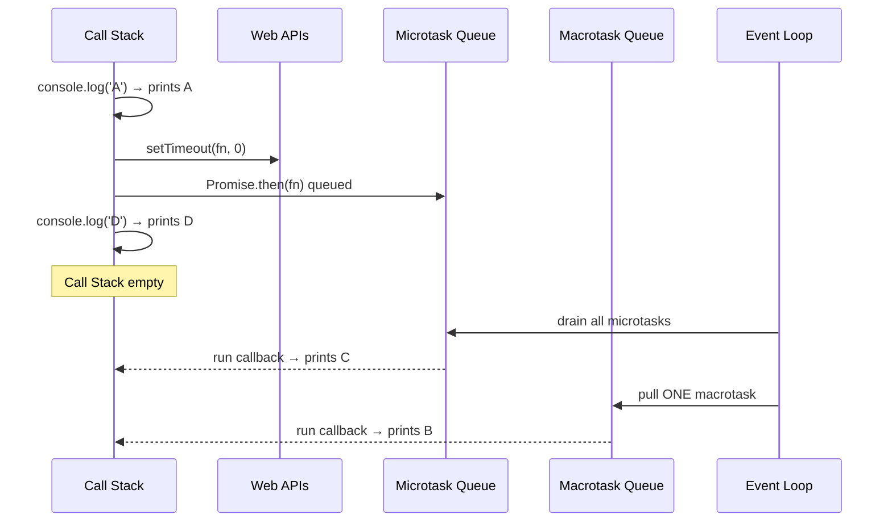
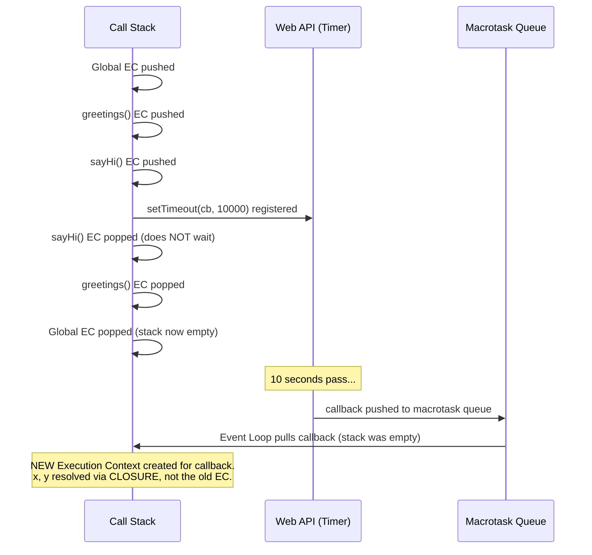

# JavaScript Runtime Internals — Interview Revision Notes

### Call Stack · Web APIs · Event Loop · Execution Context

> Source: Live cohort session (JS fundamentals, 3–5+ YOE bar). Rewritten and expanded as staff-level interview prep — every concept, every "gotcha" raised in the live Q&A, and the reasoning _behind_ each rule (not just the rule itself).

---

## 0. The Big Picture (memorize this diagram first)

```
┌───────────────────────────────────────────────────────────────────┐
│                        JavaScript RUNTIME                          │
│   (the full environment — browser, Node.js, Deno, embedded, etc.)  │
│                                                                     │
│   ┌───────────────────────────┐   ┌─────────────────────────────┐ │
│   │        JS ENGINE           │   │     HOST / BROWSER APIs      │ │
│   │  (V8, JavaScriptCore, ...) │   │  setTimeout, fetch, DOM,     │ │
│   │                             │   │  geolocation, localStorage,  │ │
│   │  ┌───────────┐ ┌─────────┐ │   │  MutationObserver...         │ │
│   │  │ Call Stack│ │  Heap   │ │   └───────────────┬──────────────┘ │
│   │  │  (LIFO)   │ │(objects)│ │                   │                │
│   │  └─────┬─────┘ └─────────┘ │                   ▼                │
│   └────────┼───────────────────┘        ┌─────────────────────┐    │
│            │  ▲                          │   Callback Queues    │   │
│            │  │  pulled in by            │  Microtask | Macro   │   │
│            │  └──────────────────────────┤        Task          │   │
│            ▼                             └─────────────────────┘    │
│      ┌──────────────┐                              ▲                │
│      │  EVENT LOOP   │──────────────────────────────┘                │
│      │ (an algorithm)│  "is call stack empty? what runs next?"      │
│      └──────────────┘                                                │
└───────────────────────────────────────────────────────────────────┘
```

**One-line mental model:** _The JS Engine only knows how to execute code that is sitting on its Call Stack. Everything else — timers, network calls, DOM events, storage — is somebody else's problem (the host), and the Event Loop is the referee that decides when that "somebody else's" work is allowed back onto the stack._

---

## 1. JavaScript the Language — Core Facts

- **Definition to have ready in an interview:** _"JavaScript is a single-threaded, interpreted (or Just-In-Time compiled) programming language with functions as first-class members."_
- **Single-threaded + synchronous by default** — this is a language-level property, not a browser property.
- **All asynchronous behavior (`setTimeout`, `fetch`, promises' underlying mechanics, etc.) comes from the _host runtime_ (browser or Node), not from the JS language spec itself.**
  - This is the single most misquoted fact in interviews — people say "JS is asynchronous." It isn't. The **environment around it** is.

### 1.1 JIT vs AOT Compilation

|               | Ahead-of-Time (AOT)                                                    | Just-In-Time (JIT)                    |
| ------------- | ---------------------------------------------------------------------- | ------------------------------------- |
| When compiled | Before execution starts — whole codebase analyzed upfront              | During execution — compiled as needed |
| Used by       | Large parts of Angular, Java, C++-style languages                      | JavaScript engines (V8, etc.)         |
| Pros          | Errors/type/memory issues caught before running; can be more optimized | Faster startup, no full-program wait  |
| Cons          | Slower to start (must scan everything first)                           | Some errors only surface at runtime   |

---

## 2. The JS Engine: Memory Heap + Call Stack

The JS Engine (V8 for Chrome/Node, JavaScriptCore for Safari, Chakra — legacy IE) has exactly **two** core structures:

### 2.1 Memory Heap

- An **unstructured region of memory** (practically, backed by RAM) where **objects, arrays, functions, and closures** are allocated.
- Because JS doesn't talk to hardware directly (unlike C++/Java), you can't reason precisely about _where_ something lives — you only know it's "somewhere in the heap."

### 2.2 Senior-level insight: pass-by-reference, not pass-by-value for objects

> A very common (and _wrong_) code-review comment: _"Don't pass this large object into a utility function — it'll be expensive."_

**Why it's wrong:** Objects and arrays are **not copied** when passed as function arguments — only a **reference** is passed. Transforming a huge object inside a utility function and returning it costs you a pointer-pass, not a deep copy. You should **not** be shy about passing large objects to utilities for transformation.

- This same reasoning is _why_ objects/arrays in JS are **shallow-copied by default**, while primitives (number, string, boolean) are **deep-copied** by default — copying large reference types deeply, by default, would be memory-expensive, and JS was designed under browser memory constraints.

### 2.3 Call Stack — LIFO execution

- Executes code in **Last-In-First-Out** order.
- **Only one thing executes at a time** (single thread ⇒ no parallel execution, ever, inside the JS engine).

**Interview favorite: "Why is it called a Stack? Why not a Queue or a Linked List?"**

```
Given:  function A() calls function B()

Call Stack over time:
 t0        t1          t2            t3         t4
[ ]      [A]         [A]           [A]        [ ]
                     [B]        (B returns, popped)
                                (A returns, popped)
```

- Functions are called in a **chronological, nested order** — A calls B, B might call C. The engine needs to know **which function to return control to** once the innermost one finishes. A stack (LIFO) is the _only_ structure that naturally preserves "resume where I left off" semantics for nested calls.
- If it were a queue (FIFO) instead, execution order would invert — the _last_ statement queued would run _first_, which breaks how every mainstream language expects code to run.

**Golden rule to repeat in interviews:** _"Nothing sits and waits inside the call stack. As soon as something is pushed, it executes immediately — there is no blocking/waiting queue behavior inside the stack itself."_

---

## 3. Host / Web APIs — The Engine's "Outsourcing Team"

- Provided by the **browser** (or Node's C++ bindings), **not** by the JS engine.
- Examples: `setTimeout`, `setInterval`, `fetch`, DOM APIs, `geolocation`, `localStorage`, `MutationObserver`.
- **Why offload work at all?** The JS engine's _only_ job is to **execute code**. Anything beyond pure execution — timers, network I/O, persistent storage, DOM manipulation — is handled by the host environment.

### 3.1 The trap: not all Web APIs are asynchronous!

**Interview pop quiz asked in the session:** _"Which of these Web APIs is actually synchronous?"_ → Answer: **`localStorage` (`setItem` / `getItem`)**.

```js
// Anti-pattern seen in real React codebases:
await localStorage.setItem("token", value); // ❌ WRONG
const token = await localStorage.getItem("token"); // ❌ WRONG
```

- `localStorage` is **synchronous** by spec. `await`-ing it in React (or anywhere) is a no-op that just makes the code misleading — it does not make it "more async" or "safer."
- **Exception:** libraries like `AsyncStorage` (React Native / React) **wrap** storage and genuinely **return a Promise** — those legitimately deserve `await`.
- **Quick self-check technique:** put a `console.log` on the very next line after the call. If the value is already available synchronously, it's sync. If not, it's async.

**Why is a _synchronous_ API still routed through Web APIs at all?**
Because it's not really "sync vs async routing" — it's "can the JS engine's execution model handle this, or does it need host support (timers, persistence, network, hardware)?" Anything beyond pure computation is offloaded to the host, sync or not.

---

## 4. Callback Queues: Microtask vs Macrotask

When a Web API finishes its work, it doesn't jump straight back onto the call stack — it places a **callback** into one of two queues.

|          | Microtask Queue                                                                                               | Macrotask Queue (a.k.a. Task Queue)                                 |
| -------- | ------------------------------------------------------------------------------------------------------------- | ------------------------------------------------------------------- |
| Priority | **Higher**                                                                                                    | **Lower**                                                           |
| Contains | `Promise.then/.catch/.finally`, `async/await` continuations, `queueMicrotask()`, `MutationObserver` callbacks | `setTimeout`, `setInterval`, DOM events (click, scroll, mouseover…) |
| Drained  | **Fully** (all of it) before moving on                                                                        | **One task at a time**                                              |

### 4.1 `MutationObserver` — a quick aside

Instead of _polling_ the DOM to check if something changed, `MutationObserver` **watches** for DOM mutations and fires a callback (into the microtask queue) when a change actually happens. Classic use case: a third-party chat widget injects a button into your page asynchronously — you don't poll for its existence, you _observe_ for it.

### 4.2 `queueMicrotask()`

A rarely-used escape hatch: lets you explicitly push an arbitrary function straight into the microtask queue, without needing a Promise.

---

## 5. The Event Loop

### 5.1 Two equally valid ways to define it (know both — interviewers accept either)

1. **Structural definition:** _"The Event Loop is the mechanism that coordinates the Call Stack, the Microtask Queue, the Macrotask Queue, and the Web APIs."_
2. **Algorithmic definition (the sharper answer):** _"The Event Loop is an algorithm that continuously checks: is the call stack empty? If yes, what should be pulled in next?"_

> The Event Loop is **not part of the JS Engine**. It is a capability offered by the **host** (browser, Node.js, etc.). Different hosts implement it differently:
>
> - Chrome's event loop ≠ Node.js's event loop (even though both may use the V8 engine underneath).
> - Safari, Deno, embedded runtimes — each free to implement their own, as long as they follow the ECMAScript rules for **what must be true** (e.g., hoisting, microtask-before-macrotask ordering), not **how** it's implemented.

### 5.2 The Execution Order Algorithm (memorize exactly)

```
LOOP forever:
  1. Run everything currently on the Call Stack until it is empty.
  2. Once Call Stack is empty → drain the ENTIRE Microtask Queue
     (run all pending microtasks, even new ones added while draining).
  3. Take exactly ONE task from the Macrotask Queue → push to Call Stack → run it.
  4. Go back to step 1.
```

**Why not run all macrotasks at once, the way we drain all microtasks?**
Because the Call Stack is reserved for high-priority/synchronous work. If the engine burned through the _entire_ macrotask queue in one shot, a new high-priority synchronous event arriving mid-drain would be starved — stuck waiting behind a potentially huge backlog. Draining one macrotask at a time keeps the loop responsive.

**Why give microtasks full-drain priority over macrotasks at all?**
There's no deep philosophical "why" here (the instructor was explicit about this) — it's a **priority decision** baked into the spec: promises are heavily used for API calls / product-critical async flows, so they're treated as higher priority than timers/DOM events by design.

### 5.3 Full Worked Example (the classic interview trace)

```js
console.log("A"); // sync
setTimeout(() => {
  console.log("B");
}, 0); // → Web API → macrotask queue
Promise.resolve().then(() => {
  console.log("C");
}); // → microtask queue
console.log("D"); // sync
```

**Trace:**

```
Call Stack: console.log('A')  →  prints A   (sync, executes immediately)
Call Stack: setTimeout(...)   →  registered with Web API, callback goes to MACRO queue
Call Stack: Promise.resolve().then(...) → callback goes to MICRO queue
Call Stack: console.log('D')  →  prints D   (sync)
--- Call Stack now empty ---
Drain microtask queue → prints C
Take 1 macrotask → prints B
```

**Output: `A D C B`**



### 5.4 `setTimeout(fn, 0)` does **not** mean "run immediately"

Even with a `0ms` delay, `setTimeout` is still treated as **asynchronous** by the engine — it _always_ goes to the Web API → macrotask queue → and only re-enters the call stack once it's empty **and** the microtask queue is drained. This is why `setTimeout(fn, 0)` is a common trick to defer work until "after everything currently queued has run" (e.g., waiting for a component to finish mounting in React before starting some processing).

### 5.5 Does `setTimeout` skip the Call Stack and go straight to the queue?

**No — a subtle but important detail.** Every line of code, including `setTimeout(...)` itself, **first enters the Call Stack**. The JS engine evaluates it, recognizes _"I can't handle this myself"_, and **only then** offloads the actual timer/callback registration to the Web API. It never bypasses the stack entirely.

> Rule: **The JS engine only ever executes what's on the Call Stack.** It doesn't "peek" into the microtask/macrotask queues and decide to run things early — no matter how many items pile up there (even 100 pending promises), nothing executes until it's pulled onto the stack by the Event Loop.

### 5.6 One Event Loop per Tab

- Each browser tab gets its **own independent Event Loop instance** — not one shared loop across all open tabs.
- **Why:** isolation. If one tab's app is poorly architected and slow, it shouldn't be able to starve or slow down a different tab.
- _(Advanced note from the session: a single tab **can**, in some cases, involve multiple event-loop-like mechanisms — e.g., around push notifications / service workers — but the default mental model is one loop per tab.)_

### 5.7 Why doesn't the JS Engine just own the Event Loop?

Because **JavaScript is host-agnostic** — the same JS engine (or the language spec) is designed to run in many completely different environments: browsers, Node.js, Deno, embedded systems, etc., many of which have **no concept of a DOM or "Web APIs"** at all (Node has no `document`, no browser event loop).

- Each host therefore supplies its **own** APIs and its **own** Event Loop implementation.
- V8 can be reused across Chrome and Node, but the **Event Loop is swapped out** per host — engine ≠ event loop.

### 5.8 Concurrency vs Parallelism — a distinction interviewers love to probe

|                 | Parallel                                                                              | Concurrent                                                                                                    |
| --------------- | ------------------------------------------------------------------------------------- | ------------------------------------------------------------------------------------------------------------- |
| Definition      | Multiple things literally executing **at the same instant** (e.g., 4 threads in Java) | Multiple things **appearing** to make progress together by interleaving, without truly running simultaneously |
| Possible in JS? | **No** — only one thread executes JS code, ever                                       | **Yes** — this is exactly what the Event Loop enables                                                         |

- I/O-intensive work (network calls) and memory-intensive work (writing to `localStorage`) _can_ happen "alongside" JS execution because they're offloaded to the host, not the CPU-bound single thread — but **two pieces of JS code itself never execute at the same literal instant.**
- **Correct phrasing for an interview:** _"JavaScript executes things concurrently, not in parallel."_

### 5.9 JS Engine vs Event Loop — Comparison Table

|                             | JS Engine                | Event Loop                          |
| --------------------------- | ------------------------ | ----------------------------------- |
| Lives inside                | JS Runtime               | Browser/Host Runtime                |
| Owns Call Stack?            | Yes                      | No                                  |
| Executes JavaScript?        | Yes                      | No                                  |
| Controls timing/scheduling? | No                       | **Yes** — decides _when_ things run |
| Responsibility              | Execute JS               | Schedule what gets executed next    |
| Can be written in           | Any language (C++, etc.) | Any language, host-specific         |

---

## 6. Execution Context — The Real Unit of Execution

> **Key correction of a common misconception:** individual statements (`console.log('A')`, etc.) do **not** literally get pushed onto the Call Stack one by one. What actually gets pushed is an **Execution Context**.

### 6.1 Definition

**Execution Context (EC)** = the environment in which a block of JS code is evaluated and executed. Think of it as a **"box" or object** containing everything needed to run that block: variable references, function references, scope chain, and the value of `this`.

- **At any given moment, only ONE Execution Context is "active."**
- The active EC always sits at the **top** of the Call Stack.
- The Call Stack, physically, holds **references/pointers** to Execution Contexts (which themselves live in memory) — not raw code.

### 6.2 Types of Execution Context

| Type                                 | Created                                                | Scope                                                           |
| ------------------------------------ | ------------------------------------------------------ | --------------------------------------------------------------- |
| **Global Execution Context (GEC)**   | Once, when the script/realm starts executing           | One per page/window/realm — sits at the **bottom** of the stack |
| **Function Execution Context (FEC)** | Every time **any** function is _called_ (not declared) | New one per call; pushed on top, popped when function returns   |

- Files (`1.js`, `2.js`, ... `10.js`) are a **human/logical convenience only**. The browser typically treats everything needed to run a page as **one realm** — there is normally just **one** Global Execution Context per realm, regardless of how many files you wrote your code in.

### 6.3 Two Phases of Every Execution Context

```
┌─────────────────────────┐        ┌─────────────────────────┐
│   1. MEMORY CREATION     │  --->  │   2. CODE EXECUTION       │
│      PHASE                │        │      PHASE                 │
│                           │        │                           │
│ • var → hoisted, set to  │        │ • Code runs line by line │
│   `undefined`             │        │ • Variables get real      │
│ • function declarations  │        │   values                  │
│   fully hoisted           │        │ • Functions get invoked  │
│ • let/const → hoisted but │        │                           │
│   NOT initialized (TDZ)   │        │                           │
│ • `this` binding resolved │        │                           │
└─────────────────────────┘        └─────────────────────────┘
```

**Why split into two phases at all? (This is a deep, senior-level "why")**

> JavaScript was originally designed to run **inside browsers**, which have historically had **limited, contended memory**. The Memory Creation phase exists as an upfront check: _"can this block of code even be allocated the memory it needs?"_ before any actual execution happens.
>
> This is also **why** you sometimes see a tab hang/crash — the browser couldn't allocate enough memory for that realm of code to safely execute.
>
> This same "be memory-conscious" design philosophy is why arrays/objects are shallow-copied by default (see §2.2) — deep-copying large reference types by default would multiply memory pressure.

### 6.4 Order of Creation = Order of Invocation

```js
function first() {
  second();
}
function second() {
  third();
}
function third() {
  /* ... */
}
first();
```

```
Call Stack (top → bottom):
┌───────────┐
│  third()  │  ← most recently pushed, executes first (LIFO)
├───────────┤
│ second()  │
├───────────┤
│  first()  │
├───────────┤
│  Global   │  ← always at the bottom
└───────────┘
```

Global EC is always created first and sits at the base; each Function EC is created and stacked in the exact order functions are **invoked**, not declared.

### 6.5 Execution Context ≠ Call Stack (a distinction interviewers explicitly probe)

- **Execution Context** = the actual "object"/structure in memory containing scope, variables, `this`.
- **Call Stack** = the LIFO structure holding **references (pointers)** to these Execution Contexts, plus the _order_ in which they must resume.
- Physically: _"Each stack frame points to one execution context, which contains references to scope, variables, and instructions."_ The main thread walks these pointers to execute code.

### 6.6 Built-in functions don't always get their own Execution Context

`console.log`, `Math.max`, `Math.min`, and similar built-ins are typically **already known/optimized by the engine** — engines like V8 generally execute them without spinning up a full, separate Function Execution Context the way they would for a user-defined function. (This is engine-implementation-dependent, but true for common engines like V8.)

### 6.7 The Trickiest Scenario: Async Callback + Closures + EC Lifecycle

This is the deepest, most interview-relevant scenario from the session. Walk through it slowly:

```js
let y = 10; // global

function greetings() {
  sayHi();
}

function sayHi() {
  let x = 10; // local
  setTimeout(() => {
    console.log(x, y);
  }, 10000); // 10s delay
}

greetings();
```

**Question asked live: "Does `sayHi`'s Execution Context wait around for the 10-second timer to finish?"**

❌ **No.** Here's the precise sequence:

1. `greetings()` is called → its FEC is pushed.
2. `greetings()` calls `sayHi()` → `sayHi`'s FEC is pushed on top.
3. Inside `sayHi`, `setTimeout(...)` is evaluated. The engine can't handle timers itself, so it registers the callback with the **Web API** and immediately moves on — it does **not** block.
4. `sayHi()` finishes executing its own body (nothing left to do) → its FEC is **popped off the stack immediately**. It does **not** wait 10 seconds.
5. `greetings()` also finishes → popped.
6. Eventually the **Global Execution Context** is also cleared once the stack is fully empty (a majority of the live class incorrectly guessed the Global EC "stays" until the timer fires — **it does not**).

**Follow-up, even more interesting question: "If the Global EC is gone, how does the callback still access `x` and `y` 10 seconds later?"**

✅ **Closures.** When the `setTimeout` callback was created, it formed a **closure** over the variables it references (`x`, `y`) — it captured **references** to those bindings, independent of whether the original Execution Context that created them is still on the stack.

- When the 10-second timer completes and the callback is finally pulled back onto the (now-empty) Call Stack, the engine spins up a **brand-new Execution Context** for that callback (and, if needed, a fresh Global EC) — it does **not** reuse or "reawaken" the old, already-destroyed one.
- The closure is what bridges the gap between "the EC that created these variables is long gone" and "the callback can still read them."



**Why this matters for interviews:** this question tests whether a candidate actually understands that Execution Contexts are _ephemeral_ and _closures_ — not "the stack staying alive" — are the real mechanism preserving variable access across async boundaries.

### 6.8 Multi-file / Multi-realm Variable Resolution

**Brain-teaser posed in the session:** _"If `1.js`, `2.js`, and `3.js` all declare a variable named `A`, and there's only ONE Global Execution Context for the whole realm — how does it keep them distinct?"_

- **Not** by renaming (`A_1js`, `A_2js`) — that's a common but incorrect guess.
- **Not** by creating a separate EC per file — files aren't runtime boundaries (see §6.2).
- **Correct mental model:** JS resolves variables by **memory reference**, not by name string. `A` in `1.js` and `A` in `2.js` simply point to different memory locations under the hood — the "name" `A` is just a human-facing label; the engine doesn't have a collision problem because it never resolves by name-as-string across a shared namespace the way you might fear.
- **Reality check:** in practice, this scenario (two _genuinely global_ same-named variables from different files colliding) usually indicates a bug or is prevented by module scoping (ES Modules give each file its own module scope) — but the underlying "engine resolves via reference, not by string identity" principle is the actual interview-worthy insight.

### 6.9 Variable Resolution Order (Scope Chain, quick recap)

```
Look for variable "x":
  1. Check current Function Execution Context first.
  2. If not found → walk up to the Global Execution Context.
  3. If still not found → ReferenceError.
```

---

## 7. Quick-Reference Summary Table

| Concept                    | One-liner                                                                                                                                         |
| -------------------------- | ------------------------------------------------------------------------------------------------------------------------------------------------- |
| JS Engine                  | Executes JS. Has Call Stack + Heap only.                                                                                                          |
| Call Stack                 | LIFO. Holds Execution Contexts. Nothing waits inside it — it executes immediately.                                                                |
| Memory Heap                | Unstructured memory (≈RAM) for objects/functions/closures.                                                                                        |
| Web/Host APIs              | Browser-provided capabilities (timers, DOM, storage, network) — not part of the JS engine.                                                        |
| Microtask Queue            | Higher priority. Promises, async/await, queueMicrotask, MutationObserver. Fully drained each cycle.                                               |
| Macrotask Queue            | Lower priority. setTimeout, setInterval, DOM events. One item processed per cycle.                                                                |
| Event Loop                 | An _algorithm_ (not a JS engine feature) that checks: stack empty? → drain microtasks → run one macrotask → repeat. Host-specific implementation. |
| Execution Context          | The real thing pushed to the call stack — a "box" with scope, variables, `this`. Two phases: memory creation (hoisting) then execution.           |
| Closures                   | The mechanism that lets async callbacks retain variable access after their creating EC is destroyed.                                              |
| Concurrency vs Parallelism | JS is concurrent (interleaved via event loop), never truly parallel (single thread).                                                              |

---

## 8. Rapid-Fire Interview Q&A (straight from the live session)

**Q: Is JavaScript asynchronous?**
A: No — the _language_ is single-threaded and synchronous by design. Asynchrony is a capability of the host (browser/Node), not the language spec.

**Q: Why is the call stack a stack and not a queue?**
A: Because function calls are inherently nested/chronological (A calls B calls C); a stack (LIFO) is the only structure that naturally supports "resume the caller once the callee finishes."

**Q: Does `setTimeout(fn, 0)` execute immediately?**
A: No. It's still routed through the Web API → macrotask queue, and only runs once the call stack is empty and all microtasks are drained.

**Q: Does everything (even `setTimeout`) first pass through the Call Stack?**
A: Yes. Even async APIs are first evaluated on the stack; the engine detects it can't handle them and offloads to the Web API from there.

**Q: How many Event Loops exist per browser tab?**
A: One per tab by default (isolation, so one slow tab can't degrade another).

**Q: Why doesn't the JS Engine include the Event Loop itself?**
A: Because JS is host-agnostic — it runs in browsers, Node, Deno, embedded devices, etc., many without any "Web API"/DOM concept. Each host supplies its own event loop implementation.

**Q: Is JavaScript execution parallel?**
A: Never. It's concurrent (interleaved via the event loop on a single thread), not parallel (which requires multiple threads executing simultaneously, e.g. Java).

**Q: What actually gets pushed onto the call stack — statements or something else?**
A: Execution Contexts, not raw statements. A group of top-level statements with no function wrapper is itself treated as (part of) one execution context.

**Q: Are objects/arrays deep-copied or shallow-copied by default in JS?**
A: Shallow-copied (objects/arrays); primitives are effectively deep-copied since they're copied by value. This ties back to the same memory-conscious design as the two-phase execution context.

**Q: When a function containing a `setTimeout` finishes running (before the timer fires), does its Execution Context wait around?**
A: No — it's popped off the stack immediately. The eventual timer callback gets a **brand-new** Execution Context when it fires, and relies on a **closure** to still access the original scope's variables.

**Q: Does the Global Execution Context also get cleared before all async work resolves?**
A: Yes — most people in the live poll guessed wrong here. The Global EC is cleared as soon as the stack is empty; a fresh one is created if/when needed again, and closures bridge the gap for variable access.

**Q: Do built-in functions like `console.log` create their own Execution Context?**
A: Generally no in engines like V8 — they're optimized/pre-known by the engine and executed without the overhead of a full Function Execution Context.

---

## 9. What to Say Out Loud in an Interview (elevator-pitch versions)

- _"JavaScript is single-threaded and synchronous by design; its asynchronous behavior comes entirely from the host environment — the browser's Web APIs and event loop — not from the language itself."_
- _"The call stack only ever executes Execution Contexts, never raw statements directly, and nothing in the call stack waits — it runs the moment it's pushed."_
- _"The event loop's job, in one sentence, is: once the call stack is empty, drain the entire microtask queue, then pull exactly one macrotask, and repeat."_
- _"JS is concurrent, not parallel — one thread, but I/O and timer work is offloaded to the host so the single thread isn't blocked."_
- _"Closures are what let an async callback still reach variables from a scope whose Execution Context was already destroyed."_
