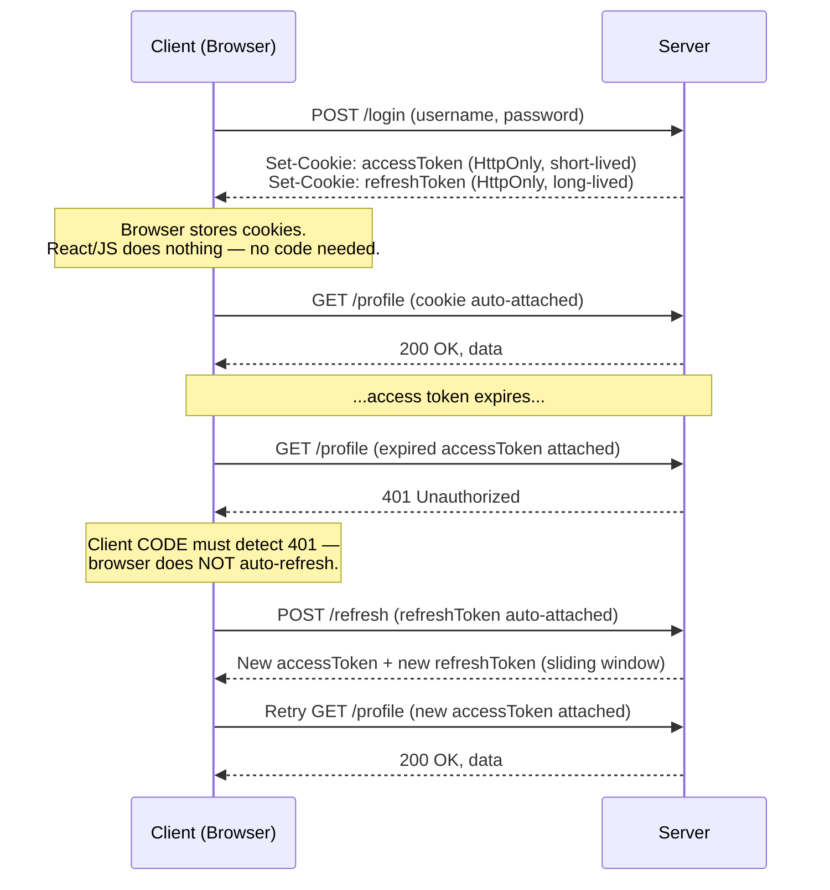
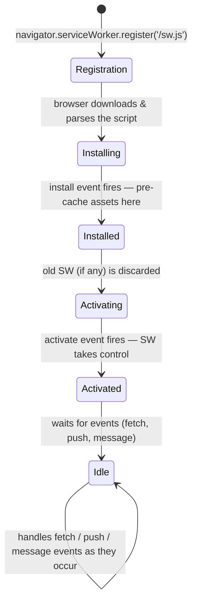
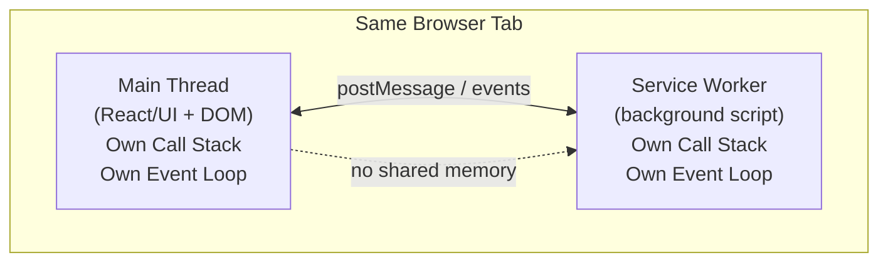

# JavaScript Deep Dive #3 — Interview Revision Notes
### Browser Storage · Cookies & Auth · Service Workers · Web Workers · Cache Storage · Prototypal Inheritance & Copy Semantics

> Continuation of the JS internals series. This session shifts from "how JS executes" to "what the browser platform gives you" — the four storages, background scripts, and the quiz that tests whether you *actually* understand references vs copies. Written for a product-company interview bar: every answer includes the **why**, the **production trade-off**, and the **debugging angle**.

---

## 0. The Big Picture — Where Everything Lives

```
┌────────────────────────────────────────────────────────────────────┐
│                              BROWSER                                 │
│                                                                        │
│  ┌───────────────────────────┐    ┌────────────────────────────┐   │
│  │        MAIN THREAD          │    │      SERVICE WORKER          │   │
│  │  (Tab: React/JS + DOM)      │◄──►│  (background script,         │   │
│  │  Own Call Stack + Event Loop│ msg │   own Call Stack + Event Loop)│  │
│  └──────────┬──────────────────┘    └───────────┬──────────────────┘   │
│             │                                     │                    │
│   ┌─────────▼─────────┐                 ┌────────▼─────────┐         │
│   │  Cookies            │                 │  Cache Storage     │         │
│   │  Session Storage     │                 │  (HTTP req/res      │         │
│   │  Local Storage        │                 │   pairs — HTML,     │         │
│   │  IndexedDB             │                 │   JS, CSS, images)  │         │
│   └─────────────────────┘                 └────────────────────┘         │
│                                                                        │
│  Service Worker CANNOT touch: Cookies, Session Storage,               │
│  Local Storage, IndexedDB directly through the same APIs the         │
│  main thread uses (different execution context) —                    │
│  it CAN reach IndexedDB via its own async APIs, but not localStorage/ │
│  sessionStorage (those are explicitly synchronous & window-bound).   │
└────────────────────────────────────────────────────────────────────┘
```

**One-line mental model:** *Every storage mechanism exists to answer one question — "how long should this data live, who should be able to read it, and how big can it get?" Pick the storage by answering those three questions, not by habit.*

---

## 1. Why Client-Side Storage Exists At All

> Modern web apps need to store data on the client for **authentication, preferences, caching, and session continuity** — network round-trips for every tiny read are too slow, and some features (offline mode, "remember me," draft forms) are fundamentally impossible without local persistence.

The browser offers **four primary storages**, each solving a different point on the (size × lifetime × security × sync-vs-async) trade-off space:

| Storage | Size | Lifetime | Sent to server automatically? | Sync/Async |
|---|---|---|---|---|
| **Cookies** | ~4KB | Configurable (session or persistent) | **Yes**, every matching request | Sync (browser-managed) |
| **Session Storage** | ~5MB | Until tab closes | No | Sync |
| **Local Storage** | ~5–10MB | Until explicitly cleared | No | Sync |
| **IndexedDB** | Large (hundreds of MB+) | Until explicitly cleared | No | **Async** |
| **Cache Storage** *(bonus 5th)* | Large | Until explicitly cleared | No | **Async** |

---

## 2. Cookies — The Only Storage the Server Can Fully Control

### 2.1 Core idea
> *"The whole point of a cookie, in one line, is: it's storage that your API can set, and your web application/JavaScript does not have access to."*

This is **the entire reason cookies exist as a separate mechanism** — every other storage (session, local, IndexedDB) is directly readable/writable by JavaScript running on the page, which means an XSS attack that injects malicious JS can steal or manipulate it. A cookie marked `HttpOnly` **structurally cannot** be touched by page JavaScript, because the browser enforces that boundary at a lower level than the DOM/JS engine.

### 2.2 Flags — know each one's *purpose*, not just its name

| Flag | What it does | Why it matters |
|---|---|---|
| `HttpOnly` | JS **cannot** read/write this cookie (`document.cookie` won't show it) | Neutralizes the most common outcome of an XSS attack — even if attacker JS runs on your page, it can't exfiltrate the auth cookie |
| `Secure` | Cookie is only sent over HTTPS | Prevents a network-level eavesdropper from reading the cookie over plain HTTP |
| `SameSite` | Controls whether the cookie is attached on **cross-site** requests | Primary defense against CSRF (see §2.4) |
| `Max-Age` / `Expires` | Browser auto-deletes the cookie after this time | Cookies are the *only* storage where **expiry is handled by the browser itself** — you don't need to manually clean them up like local/session storage |

### 2.3 `SameSite` — the property almost everyone sets without understanding

```
┌──────────────────────────────────────────────────────────────────┐
│  SameSite = Strict                                                 │
│  → Cookie sent ONLY when navigation originates from the SAME site. │
│  → Open your banking app in Tab 1, open it again in Tab 2 by       │
│    clicking a link — you will NOT be logged in.                    │
│  → Use case: banking, admin dashboards, highly sensitive actions.  │
├──────────────────────────────────────────────────────────────────┤
│  SameSite = Lax   (the common default for most B2C apps)          │
│  → Cookie sent on same-site navigation AND top-level cross-site    │
│    navigation (e.g., clicking a link from Gmail/Google search).    │
│  → Cookie NOT sent on cross-site POST/PUT/DELETE (this is what     │
│    blocks CSRF via forged forms).                                  │
│  → Use case: YouTube/Google-style apps — click a shared link,      │
│    you stay logged in. Usability > paranoid security.              │
├──────────────────────────────────────────────────────────────────┤
│  SameSite = None                                                    │
│  → Cookie sent in ALL cases, same-site or cross-site.               │
│  → Use case: public content, no session risk (e.g., a public       │
│    user manual, embeddable widgets).                                │
└──────────────────────────────────────────────────────────────────┘
```

### 2.4 CSRF, explained with the exact mechanism `SameSite=Lax` blocks

**Attack setup:**
```html
<!-- Hosted on malicious.com -->
<form action="https://example.com/transfer" method="POST">
  <input type="hidden" name="to" value="attacker" />
  <input type="hidden" name="amount" value="10000" />
</form>
<script>document.forms[0].submit();</script>
```

- The victim is already logged into `example.com` in another tab.
- They visit `malicious.com`, whose script auto-submits a hidden form that POSTs to `example.com/transfer`.
- **Without `SameSite` protection:** the browser would normally attach `example.com`'s cookies to *any* request going to `example.com`, regardless of which page initiated it — so the transfer would succeed using the victim's real session.
- **With `SameSite=Lax` (or `Strict`):** the browser recognizes this POST request originated from a **different origin** (`malicious.com`, not `example.com`) and **does not attach the cookie**. The request reaches the server with no auth cookie → backend rejects it as unauthenticated.

> **Key clarification worth stating explicitly in an interview:** the browser doesn't "reject the request" — the request still fires. What's missing is the **cookie**. The *server* is what ultimately rejects it (401/403) because there's no valid session attached.

### 2.5 Cookie-based Auth Flow — Access Token + Refresh Token (asked constantly in interviews)



### 2.6 Critical production insight: "the browser does not refresh tokens for you"
> *"Server issues tokens, browser stores cookies. React/JS does nothing for normal requests. But on token failure, it is the responsibility of the **client code** to make the refresh call — the browser will not automatically retry with a new token, and the server cannot initiate this because the server is stateless and doesn't know your session expired until you make a request."*

This is a classic gap junior engineers miss: **you must explicitly write the interceptor logic** (e.g., an Axios/fetch interceptor that catches `401`, calls `/refresh`, retries the original request).

### 2.7 The "Infinite Session" Pattern (how Facebook/Amazon never log you out)

**The problem:** if refresh tokens also expire (say, after 10 days), how do these products avoid ever forcing a fresh login?

**The pattern — a sliding-window refresh:**
```
Access token lifetime:   1 minute (short-lived, sent on every request)
Refresh token lifetime: 10 days (long-lived)

Rule: whenever a refresh call happens and the refresh token has
      LESS than [configured threshold, e.g., 30 min] left before
      expiry → issue a BRAND NEW refresh token (reset the 10-day clock)
      along with the new access token.
```

- As long as the user makes **at least one request within every 10-day window**, their session effectively never expires — each refresh silently extends the window.
- **The hard edge case:** what if the user doesn't open the app for 6 months? Both tokens are now truly expired. Two production options:
  1. **Force logout** — cleanest, most secure.
  2. **"Keep me logged in" device trust** — if the request comes from the *same browser/device fingerprint* the user previously opted into, the backend can choose to issue a brand-new session even past expiry. This is a **product/business decision**, not a technical requirement — and it deliberately trades some security for retention/usability.
- **Golden rule repeated by the instructor:** *"Make your backend the source of truth for anything security-related — the client can be manipulated via multiple attack vectors, so never let the client unilaterally decide session validity."* Don't try to track expiry client-side (e.g., in `localStorage`) as your *only* logout mechanism — it can be tampered with.

### 2.8 Cons of cookies (interview checklist)
- Sent **on every request** — real (if usually small) performance overhead.
- Hard **4KB size limit** — never try to store business data in a cookie.
- Still vulnerable if `HttpOnly`/`Secure`/`SameSite` are misconfigured (XSS can't *read* an `HttpOnly` cookie, but a misconfigured `SameSite` still allows CSRF; XSS can still trigger authenticated requests using the cookie even without reading its value).

---

## 3. Session Storage

- **Per-tab**, not shared even across tabs of the same site (unlike cookies/local storage).
- ~5MB, synchronous, client-side only — nothing sent to the server automatically.
- **Best real use case:** multi-step forms (job portals, onboarding wizards) — Step 2 needs to recall what was entered in Step 1, but only for *this* browsing session/tab; if the tab closes, starting fresh is acceptable/expected.
- **Why not use it for auth tokens?** A question raised live: *"If cookies are the gold standard, why would anyone need session storage for auth?"* — the honest answer is you generally **shouldn't**; anything JS-accessible is a weaker security posture than an `HttpOnly` cookie. Session storage is a reasonable fallback only when you have no backend control over cookie flags at all.

---

## 4. Local Storage

- Persistent until **explicitly cleared** (no expiry by default — this is a trap, see §7).
- Shared across **all tabs of the same origin** (unlike session storage).
- ~5–10MB, synchronous, client-side only.
- **Best use cases:** theme preference, language selection, cached (non-sensitive) API responses, user UI settings.
- **Never** for sensitive data (tokens, PII) — it's plain JS-readable, and ultimately just a file sitting on the user's disk; if the encryption scheme is known, it can eventually be reverse-engineered.

### 4.1 The Same-Origin Trap (a live poll question from the session)
> *"Do you think local storage is shared across websites? Say Notion.com sets a theme, and a Discord.com tab also sets a theme — are these shared?"*

**Answer: No.** Local storage (and session storage) is scoped by the **full origin tuple: protocol + domain + port**. `https://example.com` and `http://example.com` are different origins. `app.example.com` and `api.example.com` are different origins too (**subdomains do not share local storage**), because the browser enforces the **Same-Origin Policy** to prevent data leakage between unrelated (or even related-but-distinct) applications — this is the same security principle underpinning most web sandboxing.

---

## 5. IndexedDB

### 5.1 Why it exists — the gap it fills
> Local Storage and Session Storage are **synchronous, small, key-value only**. Modern apps (social feeds, offline-first apps) need **large storage** with **non-blocking (async) APIs** and **structured/queryable data** — IndexedDB is the browser's answer.

- Async by design **specifically because** of its size: *"the problem [with sync large storage] is you have to wait a lot of time getting the data and the [main] thread will be blocked. The size is more here — that's the reason IndexedDBs are async."* Session/local storage stay synchronous precisely because they're capped small enough that blocking briefly is an acceptable trade-off.
- Structured like a database: **Database → Object Store (≈ table) → Records (objects) → Indexes** for efficient querying.
- **Which queue does IndexedDB's callback land in?** Same as any Web API result — the **macrotask queue** (same bucket as `setTimeout`).

### 5.2 When to use / avoid

| Use IndexedDB when | Avoid IndexedDB when |
|---|---|
| Large datasets (social feeds, offline caches) | Data is tiny (simple prefs, small flags) |
| Reads/writes must be non-blocking | You just need a quick sync key-value read |
| Offline support is a requirement | Storing auth tokens (cookies are still the right tool) |
| Structured, queryable client-side data | Temporary UI state that doesn't need persistence |

### 5.3 Should you use a wrapper library (Dexie.js, localForage) or the native API?
**Staff-level answer given in the session:** in the pre-LLM era, people reached for wrapper libraries because raw IndexedDB's callback-heavy syntax was painful to hand-write. **Now, with AI-assisted coding, the syntax barrier is largely gone** — so the recommendation is to **prefer the native browser API over a third-party dependency** unless the library gives you something *structurally* unavailable natively. Every wrapper library is, underneath, still calling the same native `indexedDB.open()`/etc. — you're just adding an abstraction layer (and a dependency, a bundle-size cost, and a maintenance burden) for syntactic sugar you may no longer need.

### 5.4 Practical guidance: storing media
- **Can you store images/videos in IndexedDB?** Technically yes (convert to Base64/Blob).
- **Should you?** Generally **no** — even a "small" 100MB budget disappears fast with a handful of high-res images. **Better pattern:** store the **path/URL reference** (`example.com/image1.png`) in IndexedDB, and let a dedicated image-caching layer (browser HTTP cache, or a CDN-backed image cache) handle the actual bytes.

---

## 6. The Universal Storage Trap: Nobody Gives You Expiry For Free

> *"No storage actually offers expiry out of the box. That's something you need to configure, and any practical, production application MUST have one."*

**Why this matters in production:** apps that ship without an explicit expiry/versioning strategy for local storage or IndexedDB **silently accumulate stale data across app versions**. Symptoms: growing storage footprint, slower app performance (the browser allocates a budget per origin; exceeding "comfortable" usage causes visible UI jank/unresponsiveness), and subtle bugs when old cached shapes don't match the new app's expected schema.

**The pattern to implement yourself, for every storage type (except cookies, which the browser expires natively):**
```js
// Pseudo-pattern
const CACHE_TTL_MS = 24 * 60 * 60 * 1000; // 1 day

function isStale(lastUpdatedTimestamp) {
  return Date.now() - lastUpdatedTimestamp > CACHE_TTL_MS;
}

// On read:
const entry = readFromStorage(key);
if (!entry || isStale(entry.lastUpdated)) {
  // refetch & overwrite
} else {
  // safe to use cached value
}
```
- This can be applied **per-entry** (e.g., individual array items each with their own `lastUpdated`) — not just as one blanket flag for the whole storage bucket.

---

## 7. Storage Decision Table (the "which one do I pick" cheat sheet)

| Requirement | Right storage |
|---|---|
| Server needs to read it directly; must be safe from JS/XSS | **Cookie** (`HttpOnly`) |
| Multi-step form draft, tab-scoped, don't care after tab closes | **Session Storage** |
| Cross-tab persistent preference (theme, language) | **Local Storage** |
| Large structured/offline data (feeds, drafts, analytics buffers) | **IndexedDB** |
| Caching actual HTTP request/response pairs (HTML/JS/CSS/images) for a Service Worker | **Cache Storage** |

---

## 8. Service Workers

### 8.1 Definition (memorize exactly)
> *"A service worker is a background JavaScript script that runs separately from the main UI thread, and can intercept network requests, cache resources, and handle background tasks like push notifications."*

- **Built-in Web Platform API** — not a React feature, not a third-party library.
- **Cannot touch the DOM.** This is stated repeatedly and tested constantly: a service worker cannot change a button's color, cannot query `document`, cannot do any DOM manipulation.
- **Can run even when the tab/page is closed**, for specific triggered events (the canonical example: push notifications from news apps arriving even though you never opened the site that session).

### 8.2 Why they exist — the gap they fill
> Traditional web apps depend fully on the network: they stop working offline, and heavy work can block the UI. Service workers offload capabilities the main thread would otherwise have to own — offline support, faster repeat loads (via caching), push notifications, background sync — **without blocking the page the user is interacting with.**

### 8.3 Lifecycle



- **Registration phase:** the app (React/vanilla JS) tells the browser "I want this service worker."
- **Install phase:** runs once, used to **pre-cache assets**. The app is **not yet controlled** by this worker.
- **Activate phase:** removes any old service worker of the same scope, the new one **takes control**.
- `self.skipWaiting()` — lets a new service worker activate immediately instead of waiting for all existing tabs using the old worker to close first.

### 8.4 Push Notifications — the flow

```
Server sends push  →  Browser receives push  →  Service worker "wakes up"
    →  'push' event fires inside the SW  →  SW shows the OS-level notification
```

```js
// Inside the service worker file
self.addEventListener('install', (event) => {
  self.skipWaiting();
});

self.addEventListener('push', (event) => {
  const data = event.data.json();
  self.registration.showNotification(data.title, { body: data.body });
});
```

```js
// Inside your React app (main thread)
useEffect(() => {
  navigator.serviceWorker.register('/sw.js');
  Notification.requestPermission().then((permission) => {
    if (permission === 'granted') {
      // subscribe to push, send subscription to backend
    }
  });
}, []);
```

- **React only registers the service worker — React does not receive the push directly.** The push event fires *inside* the service worker's own execution context, entirely separate from your component tree.
- **Permission must be explicitly requested** — same UX pattern as mobile push permission prompts.

### 8.5 How does a Service Worker talk back to the page it can't touch (no DOM access)?
**Answer: the publisher/subscriber (event) model**, via `postMessage`.
- The service worker `postMessage`s an event; the main thread has a listener (`navigator.serviceWorker.addEventListener('message', ...)`) that receives it and performs whatever DOM update is needed (e.g., changing that button's color) — the service worker never does it directly; it only *asks* the main thread to.
- APIs the service worker *is* explicitly granted (like `clients.openWindow()` to open a tab on notification click) it can call directly. Anything **not** exposed by the browser to service workers must be relayed to the host application via this messaging pattern.

### 8.6 THE flagship interview question: "JavaScript is single-threaded — how do service workers run in parallel?"

> **The precise, correct answer:** *"JavaScript is single-threaded **per execution context**, not per browser or per tab."*



- Multiple, genuinely separate JS execution contexts can exist **simultaneously**: the main thread (UI + React), one or more **Web Workers**, and any registered **Service Workers** — each with **its own call stack and its own event loop**.
- **They do not share memory** and **do not communicate synchronously** — they communicate purely via **message-passing** (`postMessage`/event listeners).
- **The core rule of JS (single-threaded execution) is never violated** — each individual context is still single-threaded internally. What looks like "parallelism" is the **browser** running multiple independent single-threaded contexts side by side and letting them coordinate via events — described in the session as *"a hacky way browsers extrapolate what's already available (multiple tabs already each get their own event loop) to give developers more parallelism without changing JS's core execution model."*
- **Concrete analogy used live:** *"Consider it like the two-tab example — tab 1 and tab 2 from the same website each get their own separate event loop. A service worker is like a third 'tab' that isn't visually a tab, running its own event loop, that just happens to be able to communicate with the main tab via messages."*

### 8.7 What Service Workers are NOT (say this explicitly to avoid a common trap)
- **Not** a DOM manipulation tool.
- **Not** a replacement for your backend.
- **Not** a security boundary — a service worker doesn't make anything inherently "secure" or "insecure."

### 8.8 Interview signal from the session
> *"Cache storage is not that important from an interview standpoint. Service workers are very important — the single most common question is exactly this: 'How does a service worker work, given JavaScript is single-threaded?'"* Some product companies (e.g., take-home-assignment-style interviews) may ask you to actually build a small push-notification feature end-to-end — expect this more at senior/staff-level take-homes than in live coding rounds.

---

## 9. Web Workers vs Service Workers

| | Web Worker | Service Worker |
|---|---|---|
| Relationship | **Superset** — general-purpose background thread | A **specific kind** of background worker, purpose-built for network interception/caching/push |
| Typical use case | Offloading **heavy CPU-bound computation** (e.g., filtering/transforming a 1-million-record API response) so the main thread doesn't freeze | Offline support, caching, push notifications |
| DOM access | No | No |
| Persistence | Tied to the page that spawned it (dies when the page closes) | Can persist and wake up even when no tab is open |

> **The clean mental model from the session:** *"You can consider a Web Worker as a helper for the main thread — the same underlying idea as a Service Worker (its own execution context, its own event loop, communicates via messages) — but a Web Worker is generically for offloading heavy work, and a Service Worker is a specialized flavor of that idea aimed at caching, offline support, and push."*

---

## 10. Cache Storage

### 10.1 Definition
> *"Cache Storage is a browser-provided storage mechanism designed to store HTTP request and response pairs."*

- Primarily (though not exclusively) used **by** service workers — it is the **one** storage a service worker *can* directly access (it cannot reach `localStorage`/`sessionStorage` because those are synchronous and window-bound; it *can* reach `IndexedDB` since that's also async, but the idiomatic pairing for network-layer asset caching is Cache Storage).
- Stores **full HTTP responses** — HTML files, JS bundles, CSS, images, API `GET` responses — not arbitrary JS objects like IndexedDB.

### 10.2 Why it exists — a distinct problem from IndexedDB
> Local Storage/IndexedDB store **data**; they require you to write **manual fetch logic** around them. Modern apps need **network-level caching** — intercepting the actual HTTP request before it even hits the network, and deciding right there whether to serve from cache or fetch fresh. Cache Storage solves caching **at the HTTP layer**, which IndexedDB was never designed for.

### 10.3 Common Caching Strategies (know all three, and *when* to use each)

```
┌───────────────────────────────────────────────────────────────┐
│ CACHE-FIRST (with network fallback)                             │
│   request → check cache → HIT: serve instantly                 │
│                          → MISS: fetch network → cache it → serve│
│   Best for: static assets, blog/article content that rarely    │
│   changes ("today's article won't change tomorrow").            │
├───────────────────────────────────────────────────────────────┤
│ NETWORK-FIRST (with cache fallback)                              │
│   request → try network → SUCCESS: serve + update cache         │
│                          → FAIL (offline): serve from cache      │
│   Best for: content that must be fresh when possible, but       │
│   should still work offline as a degraded experience.           │
├───────────────────────────────────────────────────────────────┤
│ STALE-WHILE-REVALIDATE                                           │
│   request → serve from cache IMMEDIATELY                        │
│           → simultaneously fetch fresh data in the background   │
│           → update cache for NEXT time                          │
│   Best for: feeds and APIs — this is exactly the Facebook feed  │
│   pattern: you see cached posts instantly, then it quietly       │
│   refreshes underneath you as you scroll.                        │
└───────────────────────────────────────────────────────────────┘
```

### 10.4 Cache Storage vs IndexedDB vs "Browser Cache" — three different things people conflate

| | Cache Storage | IndexedDB | Browser (HTTP) Cache |
|---|---|---|---|
| Stores | Full HTTP request/response pairs | Structured JS objects, arbitrary app data | Whatever the browser internally decides, based on cache headers |
| Controlled by | **Developer** (you decide what's cached, when, and for how long) | Developer | **Browser itself** — you have no direct API access to it |
| Used by service workers? | Yes — its primary consumer | Not typically the primary target, but accessible | N/A — not a developer-facing API at all |
| Purpose | Network-level asset caching | App-level structured data | Browser's own internal performance optimization |

> **Why this distinction trips people up:** *"The browser cache is owned by the browser — different browsers may implement it differently, and it's not exposed to you as a developer at all. Cache Storage is something you, the developer, explicitly open and manage."* Confusing the two in an interview is an instant signal of shallow understanding.

### 10.5 Real production decision: "should caching live in the client or the backend (e.g., Redis)?"

**A senior-level, non-dogmatic answer (paraphrased from the session):**
- There's no single universally correct answer — it depends on the product requirement.
- A common pattern for feed-like products: **backend caches** (e.g., Redis) the canonical "latest N posts," AND the **client separately caches** a working set (e.g., the last 5 posts a user has already scrolled past) so that reopening the app feels instant, while a background refresh silently reconciles with the server's latest data (stale-while-revalidate again).
- **Security angle on what to cache client-side:** cache what's already effectively public. A social feed's visible content (things any logged-in user could already screenshot or share a link to) is low-risk to cache locally. **Never** cache anything that would matter if leaked (auth secrets, PII, unpublished/business-critical mutable state).
- **Broader engineering-culture point made in the session:** don't copy a security/caching pattern just because "everyone does it" — reason about your *actual* threat model and usability trade-off. (Illustrated with the aside about a company deliberately choosing not to over-restrict a low-risk password policy, and another company physically destroying disks nightly instead of building a data-clearing pipeline — both are examples of picking the pragmatically-right solution over the conventionally-expected one.)

### 10.6 When should you actually reach for Cache Storage over Local/Session Storage for asset caching?
A live Q&A nailed the real justification: since a service worker **cannot** access Local/Session Storage at all, if you want your service worker to handle caching *in parallel*, off the main thread, Cache Storage is the *only* storage that's both (a) accessible to the service worker and (b) suited for HTTP-response-shaped data. If you tried to route this through the main thread and Local Storage instead, you'd be **blocking the main thread** for something that was supposed to be a background, non-critical optimization in the first place — defeating the entire purpose of offloading it to a service worker.

---

## 11. Quiz Walkthroughs — Prototypal Inheritance & Copy Semantics

> These are exactly the style of 5–10 line "predict the output" snippets used to test analytical depth in interviews. The instructor's explicit guidance: *"Snippets in the 5–7 line range, testing real analytical thinking, are fair interview questions. Beyond ~10–12 lines, it stops testing analytical thinking and starts testing reading comprehension under time pressure — that's a less useful interview signal."*

### Quiz 1 — Prototype property: independent instances vs shared prototype

```js
function A() {}
A.prototype.x = 10;

const a1 = new A();
const a2 = new A();

a1.x = 20;
console.log(a2.x); // ?
```

**Output: `10`**

**Why:** `a1.x = 20` does **not** mutate `A.prototype.x`. It creates a **new own property** `x` directly on the `a1` instance, which now **shadows** the prototype's `x` for `a1` only. `a2` still has no own `x` property, so its lookup walks the prototype chain and finds the original, untouched `A.prototype.x = 10`.

```
a1: { x: 20 (own property, shadows prototype) }  ──▶ __proto__ ──▶ A.prototype { x: 10 }
a2: { }  (no own property)                        ──▶ __proto__ ──▶ A.prototype { x: 10 }
```

**Class-equivalent framing used live:**
```js
class A { x = 10; } // instance field, NOT static — each instance gets its OWN copy
const obj1 = new A();
const obj2 = new A();
obj2.x = 20;
console.log(obj1.x); // 10 — unaffected, obj1 and obj2 never shared this value
```

### Quiz 2 — Prototype chain lookup, `object.create`, and property deletion

```js
const parent = { x: 1 };
const child = Object.create(parent);

child.x = 2;   // adds an OWN property x=2 directly on child
delete child.x; // removes that own property again

console.log(child.x); // ?
```

**Output: `1`**

**Why, step by step:**
1. `Object.create(parent)` sets `child.__proto__ = parent`. At this point `child` has no own `x`; looking up `child.x` walks the chain and finds `parent.x = 1`.
2. `child.x = 2` creates a **new own property** on `child` (shadowing the prototype's `x`, exactly like Quiz 1).
3. `delete child.x` removes **only the own property** — it cannot and does not touch `parent.x`.
4. Now `child` has no own `x` again, so the lookup falls through to `__proto__` (`parent`), returning `1`.

### Quiz 3 — `super` calls the parent method explicitly

```js
class A {
  show() { return 'A'; }
}
class B extends A {
  show() { return super.show() + 'B'; }
}
console.log(new B().show()); // ?
```

**Output: `AB`**

**Why:** `super.show()` explicitly invokes the **parent class's** `show` method (returns `'A'`), and `B`'s own `show` appends `'B'` to it. `super` doesn't just "trigger the parent constructor" (a common oversimplification) — it can also be used to explicitly reach a specific parent method rather than relying on normal prototype-chain shadowing.

### Quiz 4 — Method override vs shadowing (the subtle twin of Quiz 1)

```js
function A() {}
A.prototype.value = 10;

function B() {}
B.prototype = Object.create(A.prototype);
B.prototype.value = 20;

const b = new B();
console.log(b.value); // ?
```

**Output: `20`**

**Why this is different from Quiz 1:** here, `B.prototype.value = 20` mutates `B`'s **shared prototype object itself** (which every `B` instance points to), not an individual instance. This is a **true override** — every instance of `B` will see `20`, because they all share the *same* `B.prototype` object, unlike Quiz 1 where each instance got its own **own-property** shadow.

**The distinction to say out loud:** *"Setting a property directly on an instance creates instance-level shadowing (isolated per object). Setting a property on the shared `.prototype` object itself is a true override, visible to every current and future instance."*

### Quiz 5 — The Shallow Copy Trap (spread/`Object.assign`)

```js
const obj1 = { a: 1, b: { c: 1 } };
const obj2 = { ...obj1 }; // or Object.assign({}, obj1)

obj2.b.c = 99;
console.log(obj1.b.c); // ?
```

**Output: `99`**

**Why:** Spread (`...`) and `Object.assign` perform a **shallow copy** — only the **first level** of keys is copied as new bindings. `obj2.b` is not a new object; it's a copy of the **reference** to the *same* nested object that `obj1.b` also points to. Mutating `obj2.b.c` mutates the one shared object both `obj1.b` and `obj2.b` point at.

```
obj1 = { a: 1, b: ───┐
obj2 = { a: 1, b: ───┤──▶  { c: 99 }   (ONE shared object, two references)
```

**Interview-ready rule:** *"Shallow copy duplicates primitive values directly (a real, independent copy), but for nested objects/arrays it only duplicates the reference — not the underlying object. To fully decouple nested structures you need a deep copy (structuredClone, a recursive clone, or — with caveats — JSON.parse(JSON.stringify(...)))."*

### Quiz 6 — `JSON.stringify`/`JSON.parse` "deep copy" edge cases

```js
const obj = {
  a: 1,
  b: undefined,
  c: function () { return 'hi'; },
  d: new Date(),
};

const copy = JSON.parse(JSON.stringify(obj));
console.log(copy);
```

**Output:** `{ a: 1, d: "2026-06-20T..." }` — **`b` and `c` are silently dropped entirely**; `d` is converted to an **ISO string**, not a real `Date` object anymore.

**Why:** `JSON.stringify` has hard limitations by spec — it **silently ignores** `undefined` values and **functions** (they simply don't appear in the output at all, no error thrown), and it **serializes `Date` objects to strings**, losing the `Date` type on the way back through `JSON.parse`.

**Production takeaway:** *"You should be very careful using `JSON.parse`/`JSON.stringify` for cloning — only use it when you're certain your data is plain key-value pairs with primitive values. The moment functions, `Date`, `undefined`, `Map`, `Set`, or circular references enter the picture, this technique silently corrupts your data instead of erroring loudly — which is worse, because bugs from silent data loss are much harder to trace."*

### Quiz 7 — Circular reference breaks `JSON.stringify`

```js
const obj = {};
obj.self = obj; // circular reference

JSON.stringify(obj); // ?
```

**Output: throws `TypeError: Converting circular structure to JSON`**

**Why:** `JSON.stringify` works by **recursively** walking every nested object. A circular reference means the recursion has **no base case** to terminate on — `obj.self` points back to `obj`, which points to `obj.self`, forever. The spec explicitly detects this cycle and throws rather than looping infinitely.

**What to reach for instead when circular references are possible:** `structuredClone(obj)` (native, and explicitly designed to handle circular references, `Date`, `Map`, `Set`, etc. correctly) or a custom/library deep-clone (e.g., lodash's `cloneDeep`) that tracks already-visited objects to break cycles safely.

### Quiz 8 — Array mutation through `Object.create` (shallow copy applies to arrays too, not just objects)

```js
const base = { array: [] };
const child = Object.create(base);

child.array.push(1);

console.log(base.array.length); // ?
```

**Output: `1`**

**Why:** `Object.create(base)` sets `child`'s prototype to `base` — `child` has **no own `array` property**, so `child.array` resolves through the prototype chain to `base.array`, the **exact same array object**. Pushing onto it mutates that one shared array, visible from both `child.array` and `base.array`.

**Restated general rule (this is the throughline across quizzes 5 and 8):** *"Only primitive types (number, string, boolean) are truly shallow-copied [i.e., copied by value, independently]. Arrays and objects are never 'shallow-copied' in the sense of getting an independent structure — a shallow copy just means the top-level reference is copied, which for non-primitives is effectively no real copy at all."*

### Quiz 9 — Constructor storing a passed-in object (shared-reference gotcha)

```js
class User {
  constructor(data) {
    this.data = data;
  }
}

const sharedData = { score: 10 };
const u1 = new User(sharedData);
const u2 = new User(u1.data); // passing the SAME object reference

u2.data.score = 99;
console.log(u1.data.score); // ?
```

**Output: `99`**

**Why:** `u1.data` and `u2.data` are never independent copies — `u2` was constructed by passing `u1.data` directly, which is just a reference to the *same* underlying object in memory (this ties directly back to §2.2 in Session 1's pass-by-reference discussion). Mutating that object through either `u1.data` or `u2.data` is indistinguishable — there is only ever **one object**. If you wanted independence, you would need to explicitly pass a **new** object (`new User({ ...sharedData })` or a deep clone) into the second constructor call.

---

## 12. Quick-Reference Summary

| Concept | One-liner |
|---|---|
| Cookies | The only storage the server fully owns; `HttpOnly` blocks JS access entirely; `SameSite` is your primary CSRF defense. |
| Session Storage | Per-tab, gone when tab closes; ideal for multi-step form drafts. |
| Local Storage | Per-origin, persists until cleared; never for sensitive data; **you must build your own expiry**. |
| IndexedDB | Async, large, structured; the right tool once you outgrow simple key-value storage. |
| Cache Storage | Stores HTTP request/response pairs; the *only* storage a Service Worker can natively reach for asset caching. |
| Browser Cache | Not developer-facing at all — internal to the browser, don't confuse with Cache Storage. |
| Service Worker | Background script, own execution context/event loop, no DOM access, communicates via `postMessage`; enables offline/caching/push without blocking the main thread. |
| Web Worker | The general-purpose superset of the "background thread" idea — for offloading heavy CPU work, not specifically network/caching. |
| JS single-threadedness | Per **execution context**, not per browser/tab — multiple contexts (main thread, service worker, web worker) each get their own call stack + event loop, coordinated by the browser via message-passing, never shared memory. |
| Shallow vs Deep Copy | Only primitives are truly independently copied; objects/arrays retain shared references unless you explicitly deep clone. |
| `JSON.parse`/`stringify` cloning | Silently drops `undefined`/functions, converts `Date` to string, and throws on circular references — use `structuredClone` or a real deep-clone utility instead. |
| Prototype shadowing vs override | Setting a property on an instance shadows (isolated per-instance); setting it on the shared `.prototype` object is a true override (visible to all instances). |

---

## 13. Rapid-Fire Interview Q&A

**Q: Why can't JavaScript on the page read an `HttpOnly` cookie?**
A: Because `HttpOnly` is a browser-enforced boundary below the DOM/JS layer — the entire purpose of the flag is to neutralize the most damaging outcome of an XSS attack (token theft), regardless of what malicious script might run on the page.

**Q: What's the practical difference between `SameSite=Strict` and `SameSite=Lax`?**
A: `Strict` blocks the cookie on *any* cross-site-originated request, even top-level navigation (so clicking a shared link won't keep you logged in) — appropriate for banking/admin tools. `Lax` allows the cookie on top-level cross-site navigation (clicking a shared link keeps you logged in) but still blocks it on cross-site `POST`/`PUT`/`DELETE`, which is exactly what stops the classic hidden-form CSRF attack.

**Q: Does the browser automatically refresh an expired access token?**
A: No. The browser only auto-attaches cookies to requests; **your client code** must detect a `401`, call the refresh endpoint, and retry — this is not automatic in any framework or the browser itself.

**Q: How do apps like Facebook stay logged in indefinitely without ever expiring your session?**
A: A sliding-window refresh pattern — every time the refresh token is close to its own expiry, the backend issues a brand-new refresh token (extending validity) alongside the new access token, as long as the user remains at least occasionally active.

**Q: Is local storage shared across different websites, or across subdomains of the same site?**
A: No to both. Local/session storage are scoped to the full origin tuple (protocol + domain + port) — `app.example.com` and `api.example.com` do not share storage, by the Same-Origin Policy.

**Q: Why is IndexedDB asynchronous while local storage/session storage are synchronous?**
A: Size. IndexedDB is designed for much larger datasets — making it synchronous would risk blocking the main thread for unacceptable durations. Local/session storage stay synchronous because their capped small size makes blocking briefly an acceptable trade-off.

**Q: Can a Service Worker directly read from `localStorage`?**
A: No — it runs in an entirely separate execution context and cannot access `localStorage`/`sessionStorage` (window-bound, synchronous APIs). It *can* reach IndexedDB (also async), but for network-layer asset caching, Cache Storage is the idiomatic and directly-designed-for-this tool.

**Q: If JavaScript is single-threaded, how can a Service Worker run "in the background" without blocking the page?**
A: JavaScript is single-threaded **per execution context**, not per browser or tab. The main thread and the service worker are two entirely separate execution contexts, each with its own call stack and event loop, coordinated by the browser and communicating only via message-passing — no shared memory, no violation of JS's single-threaded execution model within either context.

**Q: What's the difference between a Web Worker and a Service Worker?**
A: A Web Worker is the general-purpose concept — a background execution context for offloading heavy computation. A Service Worker is a specialized kind of that idea, purpose-built for intercepting network requests, caching, and push notifications, with lifecycle events (`install`, `activate`, `fetch`, `push`) that a generic Web Worker doesn't have.

**Q: What does a shallow copy actually copy?**
A: Primitive values (numbers, strings, booleans) are copied independently — real, separate values. Anything non-primitive (objects, arrays) only has its top-level **reference** copied; the underlying structure is still shared, so mutating a nested object through either copy affects both.

**Q: What are the known limitations of using `JSON.parse(JSON.stringify(x))` as a deep-clone technique?**
A: It silently drops `undefined` values and function properties entirely (no error), converts `Date` objects into plain ISO strings (losing the `Date` type), and throws a `TypeError` on any circular reference because the recursive serialization has no way to terminate.

**Q: What's the difference between setting a property directly on an object instance vs on its `.prototype`?**
A: Setting it on an instance creates an **own property** that shadows the prototype's version for that instance only — other instances are unaffected. Setting it on the shared `.prototype` object itself is a **true override**, visible immediately to every instance (existing and future) that shares that prototype.

**Q: When should caching logic live on the client vs the backend (e.g., Redis)?**
A: There's no universal rule — it depends on the product's freshness requirements and usability goals. A common pattern is layering both: backend caches the canonical latest data for fast serving, while the client separately caches a working set for instant perceived load, reconciling with a background refresh (stale-while-revalidate). The one hard constraint: never cache client-side anything that would be damaging if leaked (auth secrets, PII, business-critical mutable state).

---

## 14. What to Say Out Loud in an Interview (elevator-pitch versions)

- *"I pick a storage by asking three questions: how long does this need to live, does the server need to control it directly, and how big is it — cookies for server-owned auth state, session/local storage for small client-owned UI state, and IndexedDB or Cache Storage once size or offline-support requirements grow."*
- *"HttpOnly cookies exist specifically so JavaScript — including any XSS payload that manages to run on the page — structurally cannot read the auth token; that's a stronger guarantee than anything a developer can enforce purely in application code."*
- *"The browser never auto-refreshes an expired token; that's application logic I have to write — typically an interceptor that catches 401s, hits the refresh endpoint, and retries."*
- *"Service workers don't violate JavaScript's single-threaded model — they just prove that 'single-threaded' applies per execution context, not per browser tab. Each context gets its own call stack and event loop, and they only ever talk to each other through message-passing, never shared memory."*
- *"A shallow copy is really only a true copy for primitives — anything nested keeps the same reference, which is exactly the bug pattern behind half of all 'my state mysteriously changed' issues in React."*
- *"I avoid `JSON.parse(JSON.stringify(x))` for anything beyond flat, primitive-only data — it silently drops functions and undefined, mangles Dates into strings, and throws on circular references. `structuredClone` or a real deep-clone utility is the safer default."*
