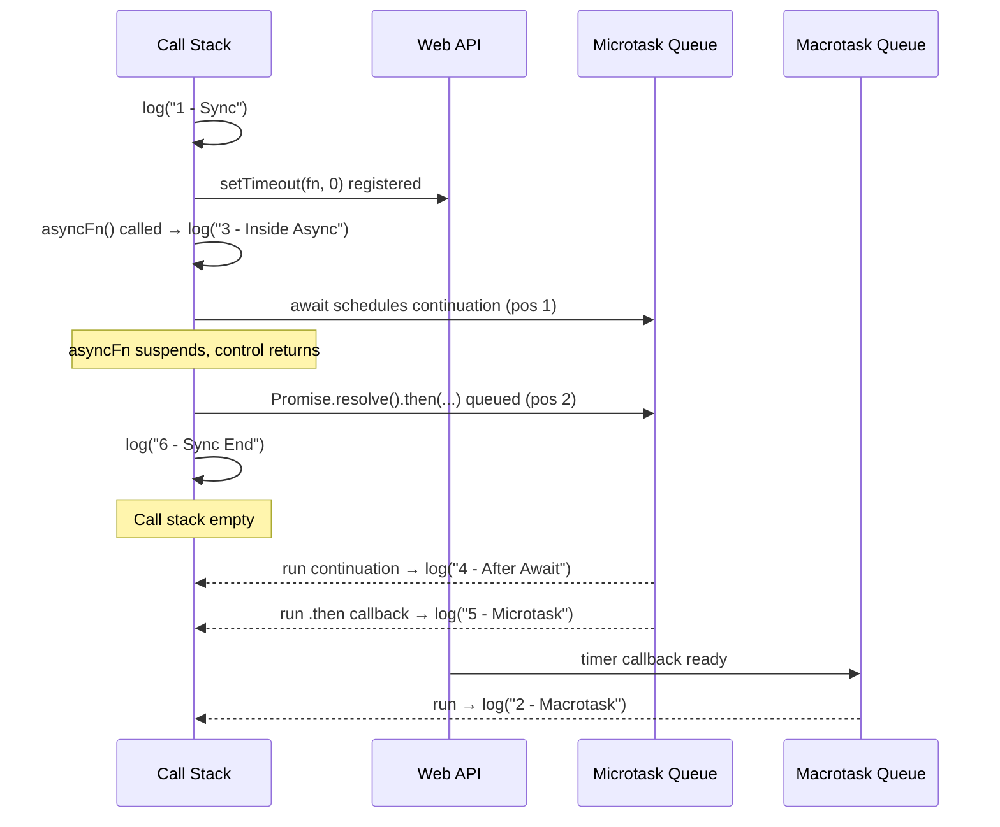

# Scenario-Based Interview Q&A
### Event Loop Microtask Priority · `this` Binding with `call` / `apply` / `bind`

> Source of truth: `microTaskPriorityRiddle.js` and `call-apply-bind.js`. Answered staff/senior-engineer style — exact traced output, the *why* behind each line, the production scenario this actually shows up in, edge cases that flip the answer, and how to reason about it live, under interview pressure.

---

## Section 1 — Event Loop / Microtask Priority
### Source file: `microTaskPriorityRiddle.js`

```js
console.log("1 - Sync");

setTimeout(() => {
  console.log("2 - Macrotask");
}, 0);

async function asyncFn() {
  console.log("3 - Inside Async");
  await Promise.resolve();
  console.log("4 - After Await");
}

asyncFn();

Promise.resolve().then(() => {
  console.log("5 - Microtask");
});

console.log("6 - Sync End");
```

---

### Q1. Trace the exact output of this file, line by line. Don't just give the answer — walk through *why* the engine produces that order.

**Output (verified in Node):**
```
1 - Sync
3 - Inside Async
6 - Sync End
4 - After Await
5 - Microtask
2 - Macrotask
```

**Staff-level trace, not just the final answer:**

| Step | Line | What happens | Queue effect |
|---|---|---|---|
| 1 | `console.log("1 - Sync")` | Runs immediately — synchronous | Prints `1` |
| 2 | `setTimeout(fn, 0)` | Evaluated on the call stack, then **offloaded to the Web API** (even with `0ms` delay, it never runs synchronously) | Callback queued to **macrotask queue** once the timer "expires" |
| 3 | `asyncFn()` is called | Function body starts running **synchronously** until the first `await` | — |
| 4 | `console.log("3 - Inside Async")` | Still synchronous, inside `asyncFn` | Prints `3` |
| 5 | `await Promise.resolve();` | `Promise.resolve()` is already-resolved. `await` internally does the equivalent of `.then(continuation)`. The **rest of `asyncFn` (everything after this line) is scheduled as a microtask**, and `asyncFn` **suspends and returns control to the caller immediately** — it does *not* block the main thread waiting. | Continuation (`console.log("4...")`) → **microtask queue, position 1** |
| 6 | Back in top-level code, `Promise.resolve().then(...)` | Schedules its callback as a microtask | `console.log("5...")` → **microtask queue, position 2** |
| 7 | `console.log("6 - Sync End")` | Synchronous | Prints `6` |
| 8 | **Call stack now empty** | Event loop checks: any microtasks? Yes → drain **all** of them, in FIFO order | |
| 9 | Microtask #1 runs | `asyncFn`'s continuation | Prints `4` |
| 10 | Microtask #2 runs | The explicit `.then()` | Prints `5` |
| 11 | Microtask queue empty → pull **one** macrotask | `setTimeout` callback | Prints `2` |



**The single line to say out loud in an interview:** *"`await` doesn't block anything — it splits the function at that point and schedules everything after it as a microtask, immediately handing control back to the caller. That's why the async function's synchronous prefix (`'3'`) runs before the rest of the script, but its post-await code (`'4'`) still has to wait behind whatever else is already queued as a microtask, and both `'4'` and `'5'` still beat the `setTimeout` because microtasks always fully drain before a single macrotask is taken."*

---

### Q2. **Scenario:** Your teammate swaps the order — they move the `Promise.resolve().then(...)` block to *before* the `asyncFn()` call. Does the output change?

```js
Promise.resolve().then(() => {
  console.log("5 - Microtask");
});

asyncFn(); // moved after
```

**Answer: Yes — the relative order of `4` and `5` flips.**

```
1 - Sync
5 - Microtask   ← now scheduled FIRST
3 - Inside Async
6 - Sync End
4 - After Await ← now scheduled SECOND
2 - Macrotask
```

**Why:** Microtasks execute in **strict FIFO order of when they were scheduled**, not by "type" (an explicit `.then()` has no inherent priority over an `await` continuation — they're the same queue). Whichever one gets pushed into the microtask queue first during the synchronous pass wins. This is exactly why **the physical order of your code** — not just "is it a promise or an await" — determines final output. A staff engineer should never say "promises always run before async/await continuations" — they're the *same mechanism*, just two different syntaxes for scheduling a microtask.

---

### Q3. **Scenario:** What if `asyncFn` had **two** `await`s back-to-back?

```js
async function asyncFn() {
  console.log("3 - Inside Async");
  await Promise.resolve();
  console.log("4 - After Await 1");
  await Promise.resolve();
  console.log("4b - After Await 2");
}
```

**Answer:** Each `await` is its own suspension point, and each schedules its *own* microtask **only once the previous one has actually run** — they don't all get queued upfront.

```
1 - Sync
3 - Inside Async
6 - Sync End
4 - After Await 1     ← microtask #1 runs, and only THEN does await #2 get scheduled
5 - Microtask         ← the already-queued explicit .then() runs next
4b - After Await 2     ← this was only enqueued once "4 - After Await 1" ran
2 - Macrotask
```

**Why this matters in production:** this is the exact mechanism behind a real bug category — *"my async function's logs interleave with other promises in an order I didn't expect."* Every `await` is a **new trip to the back of the microtask queue**, not a guaranteed "run immediately after the previous line." If another microtask (from anywhere else in your app — a different `.then()`, another component's effect, etc.) was already queued before your second `await` resolves, **it cuts in line**. This is a very real source of subtle ordering bugs in complex React apps with multiple concurrent async flows (e.g., two `useEffect`s each doing `await fetch(...)`).

---

### Q4. **Production scenario:** A user reports that your dashboard briefly flashes stale data before showing the fresh value, even though you "await the fetch before updating state." Using what you know about microtasks/macrotasks, how do you explain and debug this?

**How a staff engineer reasons through this out loud:**

1. **First, separate two different things that both look like "waiting":** a network request genuinely takes real time (it's a **macrotask**-adjacent operation, resolved via the Web API, not a microtask) — versus `await`ing an *already-resolved* value, which resolves on the **very next microtask tick**, with no real delay at all.
2. **The actual bug pattern:** something like this —
   ```js
   function loadDashboard() {
     setStaleData(cachedData);      // synchronous — paints stale data first
     fetchFreshData().then(data => {
       setStaleData(data);          // this update lands as a microtask/macrotask AFTER the first paint
     });
   }
   ```
3. **The fix isn't about the event loop at all** — it's about **not rendering the stale state in the first place** if you know a fresh fetch is already in flight (e.g., show a loading skeleton instead of stale cached data, or use `useDeferredValue`/`startTransition`-style prioritization discussed in the React sessions).
4. **The debugging technique:** add `console.log` with a label plus `performance.now()` timestamps at each step (state set, fetch start, fetch resolve, re-render) — this turns "the order feels wrong" into "here's the literal queued order," which is the only way to reason about this precisely rather than guessing.

**Why this is a strong staff-level answer:** it doesn't stop at "that's just how the event loop works" — it connects the *mechanism* (microtask vs macrotask, when each fires) to a *concrete, fixable product bug*, and gives a **debugging methodology**, not just a diagnosis.

---

### Q5. **Rapid-fire, under pressure:** If I change `setTimeout(fn, 0)` to `setTimeout(fn, 5000)`, does `"2 - Macrotask"` still print last?

**Answer: Yes — always, regardless of the delay value, as long as there's any synchronous code and any microtask at all.** A macrotask can **never** jump ahead of a pending microtask, no matter how small the timer delay is set to, because the event loop's rule is structural (drain *all* microtasks, *then* take one macrotask), not a race based on elapsed time. Even `setTimeout(fn, 0)` competing against a microtask that takes measurable real computation time will still lose — microtasks are drained to completion first, every single loop iteration, by design.

---

### Q6. **Debug-under-pressure scenario (live-coding style):** *"Without changing the `console.log` labels, add exactly one line so the printed order becomes `1, 3, 6, 5, 2, 4`."*

**Answer:** Make the `await`'s continuation resolve **later** than the explicit `.then()`, by giving it an *extra* microtask hop:

```js
async function asyncFn() {
  console.log("3 - Inside Async");
  await Promise.resolve().then(() => {});  // ⬅ added line: one extra microtask hop
  console.log("4 - After Await");
}
```

**Why this works:** `await Promise.resolve().then(() => {})` means the continuation now has to wait for **two** microtask cycles to elapse (the `.then(() => {})` itself, *then* the `await`'s own continuation) instead of one — pushing `"4 - After Await"` one microtask-cycle further back, letting the standalone `"5 - Microtask"` `.then()` (which only needed one hop) run first.

**This is a genuinely useful staff-level skill to demonstrate:** the ability to reason about "how many microtask hops does this chain need" is exactly what's needed to debug real race conditions between competing promise chains in production code (e.g., "why does my analytics event fire before my state update, even though I awaited the state update first").

---

## Section 2 — `this` Binding, `call`, `apply`, `bind`
### Source file: `call-apply-bind.js`

```js
const profile = {
  userName: "Abhijeet",
  greet: () => {
    console.log(`Hi, I'm ${this.userName}`);
  },
  welcome: function () {
    console.log(`Welcome, ${this.userName}`);
  },
};

const friend = { userName: "Candidate" };

profile.greet.call(friend);
profile.welcome.call(friend);
```

---

### Q1. Trace the exact output. Most candidates get one of these two lines wrong — explain precisely why.

**Output (verified in Node, CommonJS):**
```
Hi, I'm undefined
Welcome, Candidate
```

**The trap, explained precisely:**

| Method | Type | What `.call(friend)` does | Result |
|---|---|---|---|
| `greet` | **Arrow function** | **Nothing, with respect to `this`.** Arrow functions do not have their own `this` binding — they lexically capture `this` from the scope where they were *defined*, permanently, at creation time. `call`, `apply`, and `bind` **cannot override** an arrow function's `this` under any circumstances. | `this` still refers to whatever `this` was in the **surrounding scope where the object literal was written** — here, the top level of the module — **not** `friend`, and **not** `profile` either. |
| `welcome` | **Regular function expression** | `call(friend)` **explicitly sets `this` to `friend`** for this invocation, exactly as designed. | `this.userName` correctly resolves to `"Candidate"`. |

**Why `greet` prints `undefined` and not an error (in this file):** in a Node.js **CommonJS** module (the default for a plain `.js` file), top-level `this` is `module.exports`, an empty object `{}` — so `this.userName` is simply `undefined`, not a crash.

**Critical edge case — say this proactively in an interview, it signals real depth:**
> *"If this exact same file were loaded as an ES Module (`.mjs`, or `"type": "module"` in `package.json`), top-level `this` is `undefined` by spec — so `this.userName` would throw `TypeError: Cannot read properties of undefined (reading 'userName')` instead of silently printing `undefined`. In a browser `<script>` tag (non-module, non-strict), top-level `this` is `window`, so it would again silently print `undefined` unless a global `userName` happened to exist."*

*(Verified: CommonJS → `Hi, I'm undefined`; ESM → throws `TypeError`.)*

**The one-sentence rule to memorize:** *"`call`/`apply`/`bind` only affect functions that read `this` dynamically at call-time. Arrow functions read `this` lexically at definition-time, so they're immune to all three — permanently."*

---

### Q2. **Scenario:** Your interviewer says, *"Fix `greet` so that `profile.greet.call(friend)` correctly prints `Hi, I'm Candidate`, without changing the call site."* What are your options, and what's the trade-off of each?

**Option A — the only real fix: stop using an arrow function for a method that needs dynamic `this`.**
```js
const profile = {
  userName: "Abhijeet",
  greet: function () {                 // regular function expression
    console.log(`Hi, I'm ${this.userName}`);
  },
  // or shorthand method syntax, which is equivalent for this purpose:
  // greet() { console.log(`Hi, I'm ${this.userName}`); }
};
```
This is the **only** valid fix, because the root cause is structural (arrow functions can never be rebound), not a logic bug.

**Why you can't "fix" it any other way:** you might be tempted to try `profile.greet.bind(friend)` first — this **also fails**, for the identical reason: `bind` on an arrow function returns a new function that still ignores the bound `this` entirely.

```js
const bound = profile.greet.bind(friend);
bound(); // STILL "Hi, I'm undefined" — bind cannot touch an arrow function's this either
```

**Staff-level framing for the interviewer:** *"This isn't a 'which method do I call' question — it's recognizing that the bug is baked into how the function was declared. The fix has to happen at the declaration site, not the call site."*

---

### Q3. **Real production scenario:** In a React **class component**, an event handler logs `this.state` as `undefined` when a button is clicked, even though `this.state` works fine inside `render()`. Diagnose and fix, with multiple valid approaches.

```jsx
class Counter extends React.Component {
  state = { count: 0 };

  handleClick() {
    console.log(this.state.count); // ❌ TypeError: Cannot read properties of undefined
  }

  render() {
    return <button onClick={this.handleClick}>Click</button>;
  }
}
```

**Diagnosis:** `this.handleClick` is passed as a **bare function reference** to `onClick`. When React actually invokes it later (on the click event), it's called as `handleClick()` — a plain function call with **no receiver object** — so `this` inside it is `undefined` (in strict mode, which all ES module/class code runs in by default) rather than the component instance. This is the *exact same root mechanism* as `greet` losing `this` — a function's `this` is determined by **how it's called**, not where it's defined or which object it "belongs to" conceptually.

**Three valid production fixes, with trade-offs a staff engineer should articulate:**

| Fix | Code | Trade-off |
|---|---|---|
| **1. Bind in the constructor** | `this.handleClick = this.handleClick.bind(this);` in `constructor()` | Classic, explicit, but adds boilerplate for every handler; easy to forget one. |
| **2. Arrow function class field** | `handleClick = () => { console.log(this.state.count); }` | Arrow functions capture `this` lexically from the enclosing class instance at construction — no `.bind()` needed. **Most common modern fix.** Slight cost: creates a new function per instance (usually negligible). |
| **3. Inline arrow at the call site** | `onClick={() => this.handleClick()}` | Works, but creates a **new function on every render**, which can cause unnecessary re-renders in children relying on reference equality (`React.memo`, `PureComponent`) — this ties directly back to the diffing/memoization discussion in the React Fiber notes. |

**The answer that separates senior from staff:** *"I'd default to the arrow-function class field for most cases — it solves the `this` problem at the declaration site, the same way we'd fix the `greet` arrow-function bug, just in reverse: here we deliberately WANT lexical `this`, whereas in the `profile.greet` case, lexical `this` was the bug. Function components with hooks make this whole class of bug largely disappear, which is itself part of why hooks won out."*

---

### Q4. **Scenario:** A teammate asks, *"What's the actual difference between `call` and `apply` — isn't `bind` basically the same thing too?"* Give a production-grade answer with a concrete use case for each.

| Method | Signature | Invokes immediately? | Concrete production use case |
|---|---|---|---|
| `call` | `fn.call(thisArg, arg1, arg2, ...)` | **Yes**, immediately | Explicitly setting `this` for a one-off invocation — e.g., `profile.welcome.call(friend)` above, or invoking a "method borrowed" from another object. |
| `apply` | `fn.apply(thisArg, [argsArray])` | **Yes**, immediately | Identical to `call`, except arguments come as an **array** — historically essential for spreading an array of arguments into a function that doesn't accept an array, e.g. `Math.max.apply(null, arrayOfNumbers)` before the spread operator existed. Still relevant when the argument list is dynamically built as an array at runtime and you don't want to spread it yourself. |
| `bind` | `fn.bind(thisArg, arg1, ...)` | **No** — returns a **new function**, permanently bound, to be called later | **Partial application / currying-lite**, and fixing `this` for callbacks passed elsewhere (event handlers, `setTimeout`, array methods) *before* they're actually invoked. |

**Concrete `apply` example still seen in real (older or performance-sensitive) codebases:**
```js
const numbers = [4, 2, 9, 15, 7];
const max = Math.max.apply(null, numbers); // 15
// Modern equivalent: Math.max(...numbers)
```

**Concrete `bind` partial-application example (a genuinely useful, non-toy production pattern):**
```js
function logMessage(level, message) {
  console.log(`[${level}] ${message}`);
}
const logError = logMessage.bind(null, 'ERROR');
logError('Payment failed'); // "[ERROR] Payment failed"
```

**The one-line distinction to nail in an interview:** *"`call` and `apply` invoke the function right now, differing only in how you pass arguments; `bind` doesn't invoke anything — it hands you back a new function with `this` (and optionally some leading arguments) permanently locked in, for you to call whenever you're ready."*

---

### Q5. **Trick question, commonly asked to check real understanding, not memorization:** What does this print?

```js
function whoAmI() {
  console.log(this.name);
}

const objA = { name: 'A' };
const objB = { name: 'B' };

const boundToA = whoAmI.bind(objA);
const boundToAThenB = boundToA.bind(objB); // attempting to "re-bind"

boundToAThenB();
```

**Answer: `A`** — not `B`.

**Why:** `bind` is **permanent and non-overridable**. Once a function has been bound to `objA`, calling `.bind()` again on the *already-bound* function has **no effect** on its `this` — the new `bind` call is essentially a no-op with respect to `this` (it can still usefully prepend additional arguments, but it cannot change the `this` that was locked in by the first `bind`). This is a deliberate design decision, functionally identical in spirit to why arrow functions can't be rebound: once `this` is fixed (by `bind`, or lexically for arrow functions), no later mechanism can override it.

**Why this matters practically:** if you ever see a codebase chaining `.bind()` calls expecting the *last* one to "win," that's a latent bug waiting to surface — the *first* `bind` always wins for `this`.

---

### Q6. **Scenario — function borrowing in a production utility:** Before ES6 spread/rest existed, how would you convert the `arguments` object (which is array-*like*, not a real array) into a real array so you could call `.map()`/`.filter()` on it? What's the modern equivalent?

**The classic pattern (you'll still see this in older/legacy codebases, and it's a fair interview question about *why* it works):**
```js
function sumAll() {
  const args = Array.prototype.slice.call(arguments);
  return args.reduce((total, n) => total + n, 0);
}
sumAll(1, 2, 3); // 6
```

**Why this works — the actual mechanism, which is the point of the question:** `Array.prototype.slice` doesn't actually care what object it's called on — internally, it just needs something with a `.length` property and indexed elements. By using `.call(arguments)`, you're **borrowing** the `slice` method and forcing it to run with `this` set to the `arguments` object instead of a real array — `slice` happily treats it like one and returns a genuine `Array` as output. This is the essence of "function borrowing": using `call`/`apply` to run a method against an object it wasn't originally written for, purely because that object happens to satisfy the method's structural expectations.

**Modern equivalent (what you should actually write today):**
```js
function sumAll(...args) {           // rest parameters — already a real array
  return args.reduce((total, n) => total + n, 0);
}
// or, given an existing array-like:
const realArray = Array.from(arguments);
// or:
const realArray = [...arguments];
```

**Staff-level framing:** *"I wouldn't write the `.call()` version in new code today — rest parameters and `Array.from` make it unnecessary. But understanding why it worked is what tells me you actually understand `this` and method borrowing, not just that you've memorized 'use call for this.'"*

---

### Q7. **Debug-under-pressure, real incident scenario:** A production alert fires: a scheduled cleanup job stopped running. You find this code:

```js
class ResourceManager {
  constructor() {
    this.resources = [];
  }
  cleanup() {
    console.log(`Cleaning ${this.resources.length} resources`);
    this.resources = [];
  }
  scheduleCleanup() {
    setTimeout(this.cleanup, 5000); // 🔥 bug is here
  }
}

const manager = new ResourceManager();
manager.scheduleCleanup();
```

**What breaks, and why — trace it precisely:**

- `setTimeout(this.cleanup, 5000)` passes a **bare reference** to the `cleanup` **function**, completely detached from the `manager` instance.
- 5 seconds later, the browser/Node timer fires and calls it as a plain function call: `cleanup()` — with **no receiver**.
- Inside `cleanup`, `this` is now `undefined` (strict mode, which class bodies always run in) — so `this.resources.length` throws `TypeError: Cannot read properties of undefined (reading 'length')`, and the timer callback dies silently (uncaught in a timer callback typically just logs to console/crashes that async task — it does **not** crash the rest of your app, which is itself a debugging trap: the failure can be silent and easy to miss in production logs if you're not watching for unhandled exceptions in timers).

**Fix — same menu of options as the React handler bug (Q3), because it's the identical root cause:**
```js
// Option 1: bind at the call site
setTimeout(this.cleanup.bind(this), 5000);

// Option 2: wrap in an arrow function
setTimeout(() => this.cleanup(), 5000);

// Option 3 (most robust for a class with multiple such methods): 
// declare cleanup as an arrow function class field from the start
cleanup = () => {
  console.log(`Cleaning ${this.resources.length} resources`);
  this.resources = [];
};
```

**The incident-response answer a staff engineer gives, out loud, under pressure:**
> *"The root cause is that we passed a method reference into an API (`setTimeout`) that will call it without any receiver — this is the exact same class of bug as the `profile.greet` and the React class-handler examples: `this` is determined entirely by the call site, not by where or how the function was defined as a 'method.' The fastest safe fix is `.bind(this)` at the call site since it's a one-line, low-risk patch for a hotfix; the better long-term fix is converting `cleanup` to an arrow class field so this entire bug class becomes structurally impossible for every future caller, not just this one call site."*

---

## Quick-Reference Summary

| Concept | One-liner |
|---|---|
| `await` scheduling | Splits a function at the `await` point; everything after it becomes a microtask, scheduled the moment the awaited value resolves — the function does not block. |
| Microtask vs. macrotask priority | ALL pending microtasks drain completely before a single macrotask runs — this is a structural rule, not a timing race, and holds true regardless of a timer's delay value. |
| Microtask ordering | FIFO, and `await` continuations and explicit `.then()` callbacks share the **same queue** — physical code order determines who's scheduled first, not which syntax was used. |
| Arrow function `this` | Captured lexically at **definition time**, permanently. `call`/`apply`/`bind` have **zero effect** on it. |
| Regular function `this` | Determined dynamically at **call time**, by how the function was invoked (`obj.method()`, `fn.call(x)`, bare `fn()`, etc.). |
| `call` vs `apply` | Both invoke immediately; `call` takes args individually, `apply` takes them as an array. |
| `bind` | Returns a new function with `this` (and optionally leading args) **permanently** locked — later `.bind()` calls on that result cannot override the `this` already set. |
| The universal production bug pattern | Passing a bare method reference (`obj.method`, not `obj.method.bind(obj)` or an arrow wrapper) into any API that will later call it standalone — `setTimeout`, event handlers, array callbacks, etc. — silently strips its `this`. |

---

## Rapid-Fire Recap

**Q: Does a `0ms` `setTimeout` ever run before a pending microtask?**
A: Never. Microtasks always fully drain before any macrotask, regardless of the timer's delay value.

**Q: Do `await` continuations and `.then()` callbacks have different priority?**
A: No — they share one microtask queue; whichever was scheduled first in actual code execution order runs first.

**Q: Can `.bind()` change an arrow function's `this`?**
A: No, never — arrow functions have no own `this` to rebind; they always resolve `this` lexically from their defining scope.

**Q: If you `.bind()` an already-bound function to a different object, which `this` wins?**
A: The **first** bind — `bind` is permanent and cannot be overridden by a later bind.

**Q: What's the most common real-world bug caused by `this`?**
A: Passing a bare method reference (e.g., `setTimeout(obj.method, ms)`, `onClick={this.handleClick}`) into something that will invoke it without the original object as receiver, silently turning `this` into `undefined` or the wrong context.

**Q: What's the modern replacement for `Array.prototype.slice.call(arguments)`?**
A: Rest parameters (`function f(...args)`) or `Array.from(arguments)` / `[...arguments]`.
