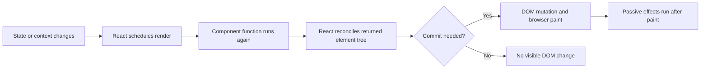
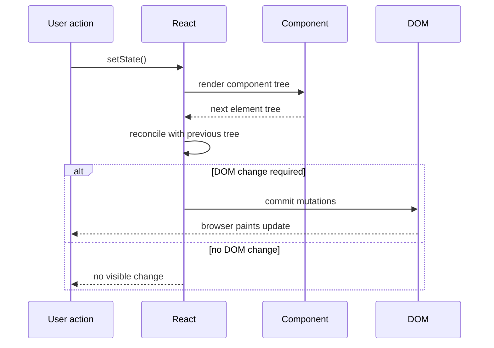
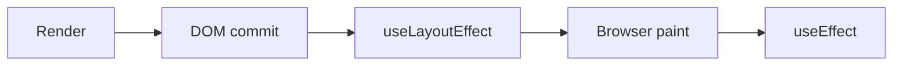

# React Hooks: Senior/Staff Interview Notes

> Source: recorded React Hooks session
>
> Goal: understand the mechanism, choose the smallest correct abstraction, and explain the product and system trade-offs in an interview.

## 1. The Staff-Level Mental Model

A React component function is re-executed when React renders it. Every render creates a new execution context. Ordinary local variables, object literals, arrays, and function expressions are therefore recreated during that execution.

React hooks let function components participate in React-managed state, effects, identity, context, and lifecycle behavior.



### Why this matters

At product scale, the question is not “How do I stop every render?” A render is usually a cheap calculation. The useful questions are:

- Is this computation expensive enough to cache?
- Is a child doing expensive work because its props appear to change?
- Does changing this value need to update the UI?
- Is this data global, shared, or merely being passed through a tree?
- Can the work be moved to the server, cached at a better boundary, paginated, virtualized, or avoided altogether?

A staff engineer optimizes the architecture and the user-visible bottleneck, not the number of hooks in the codebase.

## 2. Utility Function vs Hook vs Component

| Tool                   | Best for                                                         | Has React state/effects? | Produces UI? |
| ---------------------- | ---------------------------------------------------------------- | -----------------------: | -----------: |
| Utility function       | Pure reusable computation or transformation                      |                       No |           No |
| Custom hook            | Reusable stateful behavior and effects                           |                      Yes |  Normally no |
| Component              | Reusable UI structure and behavior                               |                      Yes |          Yes |
| Higher-order component | Enhancing or wrapping a component, especially legacy class trees |               Indirectly |          Yes |

### Choosing the boundary

Use a utility function when the logic is independent of rendering:

```ts
export function formatCurrency(amount: number, currency = "USD") {
  return new Intl.NumberFormat("en-US", {
    style: "currency",
    currency,
  }).format(amount);
}
```

Use a custom hook when the behavior needs React state, effects, refs, or context:

```tsx
function useOnlineStatus() {
  const [isOnline, setIsOnline] = useState(navigator.onLine);

  useEffect(() => {
    const goOnline = () => setIsOnline(true);
    const goOffline = () => setIsOnline(false);

    window.addEventListener("online", goOnline);
    window.addEventListener("offline", goOffline);
    return () => {
      window.removeEventListener("online", goOnline);
      window.removeEventListener("offline", goOffline);
    };
  }, []);

  return isOnline;
}
```

Use a component when the reusable concern is principally visual: for example, a `Button` with `variant="primary" | "secondary"`, not a hook that returns button markup.

## 3. `useState`: UI State and Lazy Initialization

`useState` returns a state value and a setter:

```tsx
const [count, setCount] = useState(0);
```

Calling the setter schedules a render when React determines that the state value changed. State is the right choice when the value affects what the user sees.

### Functional updates

Use the updater form when the next value depends on the previous value, especially for batched updates:

```tsx
setCount((previousCount) => previousCount + 1);
```

### Lazy initial state

Passing a function makes React call it to compute the initial state instead of treating the function as the state value:

```tsx
const [filters, setFilters] = useState(() => {
  const saved = localStorage.getItem("filters");
  return saved ? JSON.parse(saved) : { query: "", status: "all" };
});
```

Why: initialization may involve parsing, storage access, or another non-trivial operation. The initializer is used for initialization, not for recomputing state on every render. Development Strict Mode may invoke initialization more than once to detect impure code, so the initializer should be safe and free of side effects.

## 4. `useMemo`: Cache a Computed Value

`useMemo` returns a cached value:

```tsx
const visibleProducts = useMemo(
  () => filterProducts(products, searchTerm, selectedCategory),
  [products, searchTerm, selectedCategory],
);
```

Conceptually:

```text
if dependencies are equal to the previous render:
    return cached value
else:
    calculate value, cache it, and return it
```

### Why it exists

The component function runs again on every render. An expensive derived calculation, such as filtering a very large dataset, sorting complex records, or building a costly lookup structure, may otherwise repeat even when its inputs are unchanged.

### Referential equality is critical

Dependency comparison is based on identity for objects, arrays, and functions. This does not create a stable dependency:

```tsx
function ProductList({ products, searchTerm }: Props) {
  const options = { caseSensitive: false }; // new object every render

  const result = useMemo(
    () => searchProducts(products, searchTerm, options),
    [products, searchTerm, options],
  );

  return <Results items={result} />;
}
```

`options` has a new reference on every render, so the memo is invalidated every time. Prefer a primitive dependency, move the object into the memo callback, or memoize it only when that identity is genuinely needed:

```tsx
const result = useMemo(() => {
  const options = { caseSensitive: false };
  return searchProducts(products, searchTerm, options);
}, [products, searchTerm]);
```

### Good use cases

- Large filtering, sorting, grouping, or reduction operations.
- Expensive derived data used by a memoized child.
- Stable object values passed to consumers that compare by reference.
- A measured CPU bottleneck on a user-critical path.

### Poor use cases

- `a + b`, a boolean expression, or a small map.
- Wrapping every calculation “just in case.”
- Hiding a poor data model or missing pagination.
- Replacing server-side work with a large client computation.

Memoization has a cost: dependency tracking, retained memory, and additional code complexity. Measure before and after.

## 5. `useCallback`: Cache a Function Reference

`useCallback` caches a function identity, not the function's return value:

```tsx
const handleSelect = useCallback(
  (productId: string) => {
    selectProduct(productId);
  },
  [selectProduct],
);
```

The rough equivalence is:

```tsx
const handleSelect = useMemo(
  () => (productId: string) => selectProduct(productId),
  [selectProduct],
);
```

### The essential clarification

`useCallback` alone does **not** stop a child from rendering. It only keeps the callback reference stable while dependencies remain equal.

To skip a child render caused by unchanged props, the child generally also needs `memo`:

```tsx
const ProductRow = memo(function ProductRow({
  product,
  onSelect,
}: {
  product: Product;
  onSelect: (id: string) => void;
}) {
  return <button onClick={() => onSelect(product.id)}>{product.name}</button>;
});

function ProductTable({ products }: { products: Product[] }) {
  const [selectedId, setSelectedId] = useState<string | null>(null);

  const handleSelect = useCallback((id: string) => {
    setSelectedId(id);
  }, []);

  return products.map((product) => (
    <ProductRow key={product.id} product={product} onSelect={handleSelect} />
  ));
}
```

Without `useCallback`, `handleSelect` is a new function on every parent render. `memo` sees a changed function prop and renders the row again. With both, the row can skip work when `product` and `onSelect` are unchanged.

### When standalone `useCallback` is valid

It can be useful when a stable function identity is itself part of a contract, such as:

- A function is a dependency of an effect.
- A subscription API requires stable subscribe/unsubscribe references.
- A library or child compares callback identity.
- Recreating the closure is measurable or creates unwanted work.

## 6. `memo` / `React.memo`: Cache a Component Render

`memo` is a higher-order component, not a hook:

```tsx
const UserBadge = memo(function UserBadge({ name }: { name: string }) {
  return <span>{name}</span>;
});
```

It compares props, normally using shallow `Object.is` comparisons. It can skip rendering when the parent renders but the child props are equivalent.

### What breaks memoization

These props are new references on every render:

```tsx
<UserBadge style={{ color: "green" }} />
<UserBadge onClick={() => openUser(id)} />
<UserBadge permissions={user.permissions.map(permission => permission)} />
```

Possible solutions include:

- Pass primitive values.
- Move stable constants outside the component.
- Use `useMemo` for an expensive or identity-sensitive object.
- Use `useCallback` for an identity-sensitive function.
- Change the component boundary so it owns the state that changes.

Do not memoize every component. A comparison can cost more than rendering a small component, and memoization can make data flow harder to reason about.

## 7. `useRef`: Persistent Mutable Storage Without a Render

`useRef` returns a stable object whose `.current` value can change:

```tsx
const requestIdRef = useRef(0);
requestIdRef.current += 1;
```

The ref object survives renders, but changing `.current` does not schedule a render.

### Use `useRef` for

- A DOM node or imperative focus/scroll operation.
- A timer ID or subscription handle.
- The previous value of something.
- A mutable flag used internally.
- The latest value needed by an asynchronous callback.
- A stable instance-like value that should not appear directly in the UI.

```tsx
function SearchBox() {
  const inputRef = useRef<HTMLInputElement>(null);

  useEffect(() => {
    inputRef.current?.focus();
  }, []);

  return <input ref={inputRef} aria-label="Search" />;
}
```

### State versus ref

| Question                        | `useState`                              | `useRef`                           |
| ------------------------------- | --------------------------------------- | ---------------------------------- |
| Survives renders?               | Yes                                     | Yes                                |
| Changing it schedules a render? | Yes, through setter                     | No                                 |
| Intended for displayed UI?      | Yes                                     | Usually no                         |
| Directly mutable?               | No; use setter                          | Yes; use `.current`                |
| Typical values                  | Form value, selected tab, loading state | Timer ID, DOM node, previous value |

A common bug is using a ref for data that the UI must display. The value changes internally, but the screen does not update.

### Previous value pattern

```tsx
function Price({ price }: { price: number }) {
  const previousPrice = useRef<number | undefined>(undefined);

  useEffect(() => {
    previousPrice.current = price;
  }, [price]);

  const direction =
    previousPrice.current === undefined
      ? "initial"
      : price > previousPrice.current
        ? "up"
        : "down";

  return <span data-direction={direction}>{price}</span>;
}
```

Using state for `previousPrice` would cause another render after the effect updates it, even though the previous value is only internal information.

## 8. Rendering, Reconciliation, and Commit

A render is React calling component functions and calculating the next element tree. It is not necessarily a DOM update.



React may render work that is later abandoned or consolidated. Therefore, render functions should be pure: do not perform network requests, subscriptions, mutations, or logging that must happen exactly once during render.

## 9. `useEffect` and `useLayoutEffect`

`useEffect` synchronizes a component with an external system: network requests, subscriptions, timers, browser APIs, or imperative libraries.

```tsx
useEffect(() => {
  const connection = connect(roomId);
  return () => connection.disconnect();
}, [roomId]);
```

Effect dependency behavior:

- No dependency array: runs after every committed render.
- `[]`: runs after mount in production, with development Strict Mode caveats.
- `[a, b]`: runs after mount and when `a` or `b` changes.

Multiple effects run in declaration order after the commit. Always return cleanup for subscriptions, timers, observers, and in-flight work where appropriate.

`useLayoutEffect` runs synchronously after DOM mutations but before the browser paints. Use it for layout reads and synchronous visual corrections, such as measuring an element before positioning a tooltip. It can block paint, so prefer `useEffect` unless the pre-paint timing is required.



## 10. Stale Closures and Asynchronous Work

Each render creates a closure over that render's values. An asynchronous callback may later read an older value:

```tsx
function Counter() {
  const [count, setCount] = useState(0);

  useEffect(() => {
    const timer = setTimeout(() => {
      console.log(count);
    }, 3000);

    return () => clearTimeout(timer);
  }, []);

  return (
    <button onClick={() => setCount((value) => value + 1)}>{count}</button>
  );
}
```

The timeout logs the initial `count` because the effect with `[]` captured the initial render's value.

### Choosing the fix

There is no universal fix; it depends on semantics.

- Add the changing value to dependencies when a new timer/effect should be created for every value.
- Use a functional state update when calculating the next state from the previous state.
- Use a ref when one long-lived callback must read the latest value without recreating the callback.
- Cancel obsolete async work during cleanup.

Latest-value ref pattern:

```tsx
function useLatest<T>(value: T) {
  const ref = useRef(value);

  useEffect(() => {
    ref.current = value;
  }, [value]);

  return ref;
}
```

Use this deliberately. A ref bypasses React's reactive dependency model and can hide synchronization bugs if overused.

## 11. Context API and `useContext`

Context provides a value to descendants without explicitly threading props through every intermediate component.

```tsx
type Theme = "light" | "dark";
const ThemeContext = createContext<Theme>("light");

function App() {
  const [theme, setTheme] = useState<Theme>("light");

  return (
    <ThemeContext.Provider value={theme}>
      <Toolbar />
      <button onClick={() => setTheme("dark")}>Dark mode</button>
    </ThemeContext.Provider>
  );
}

function Toolbar() {
  const theme = useContext(ThemeContext);
  return <div data-theme={theme}>Toolbar</div>;
}
```

### Why Context exists

It solves implicit data propagation and prop drilling for values that are broadly relevant: theme, locale, current user, feature flags, or a stable service object.

It is not automatically a state-management library and is not automatically a performance optimization.

### Context re-render behavior

Consumers update when the provider's value changes by identity. This is unstable:

```tsx
<AuthContext.Provider value={{ user, signOut }}>
  {children}
</AuthContext.Provider>
```

The object is recreated on every provider render. If appropriate, stabilize the value:

```tsx
const contextValue = useMemo(() => ({ user, signOut }), [user, signOut]);

<AuthContext.Provider value={contextValue}>{children}</AuthContext.Provider>;
```

This is not a license to memoize all context values. First choose a good context boundary and split unrelated, high-frequency data into separate contexts.

### Context versus Redux or another store

| Concern             | Context                                      | Centralized store                               |
| ------------------- | -------------------------------------------- | ----------------------------------------------- |
| Primary purpose     | Avoid prop drilling and share a value        | Manage complex shared state and transitions     |
| Data flow           | Implicit to descendants                      | Explicit actions/selectors/subscriptions        |
| Performance control | Consumers react to provider value changes    | Fine-grained subscriptions/selectors are common |
| Debugging           | Can be harder across providers               | Often stronger tooling and event history        |
| Best fit            | Theme, locale, auth session, stable services | Large, frequently changing, cross-feature state |

For a small tree with a known depth, ordinary props are often clearer and cheaper than Context. Use Context when the value is cross-cutting or the component relationship is not a stable direct chain.

## 12. Custom Hooks

A custom hook is a function beginning with `use` that composes built-in hooks and encapsulates reusable stateful behavior.

```tsx
function useCounter(initialValue = 0) {
  const [count, setCount] = useState(initialValue);

  const increment = () => setCount((value) => value + 1);
  const decrement = () => setCount((value) => value - 1);

  return { count, increment, decrement };
}
```

Each call to `useCounter` has isolated hook state. Sharing the hook's code does not mean sharing its state.

```tsx
function CartSummary() {
  const cartCounter = useCounter(0);
  // independent state instance
  return <button onClick={cartCounter.increment}>{cartCounter.count}</button>;
}
```

### Why custom hooks exist

- Keep components focused on composition and UI.
- Group related state, effects, cleanup, and event handlers.
- Create a testable abstraction boundary.
- Make repeated behavior consistent across product surfaces.
- Reduce the risk that one screen implements loading, retry, cancellation, and error handling differently from another.

A custom hook can be worthwhile even when used once if it gives a large form or workflow a clear boundary. It is not automatically a performance optimization; extracting a function generally improves design and maintainability, not runtime speed.

### Rules of Hooks

- Call hooks only at the top level of a component or custom hook.
- Do not call hooks inside conditions, loops, nested functions, or event handlers.
- Keep hook order stable across renders.
- Name custom hooks with `use` so React's lint rules can analyze them.

Correct:

```tsx
function Panel({ enabled }: { enabled: boolean }) {
  const data = useData();

  useEffect(() => {
    if (enabled) {
      subscribe(data);
    }
  }, [enabled, data]);

  return <div />;
}
```

Incorrect:

```tsx
function Panel({ enabled }: { enabled: boolean }) {
  if (enabled) {
    const data = useData(); // hook order can change
  }

  return <div />;
}
```

## 13. Higher-Order Components and Render Props

A higher-order component takes a component and returns an enhanced component:

```tsx
function withLoading<P>(Component: ComponentType<P>) {
  return function LoadingBoundary(props: P & { isLoading: boolean }) {
    if (props.isLoading) return <Spinner />;
    return <Component {...props} />;
  };
}
```

Render props pass a function that determines what gets rendered. Both patterns were important before hooks and remain relevant in legacy code or library APIs.

In modern function-component code:

- Use a custom hook for reusable behavior.
- Use a component for reusable UI.
- Use an HOC when wrapping many existing components is the clearest compatibility strategy, especially for class components.

The main trade-offs are indirection, wrapper trees, prop naming collisions, and debugging complexity. Performance is determined by the implementation, not by the pattern's name.

## 14. Product-Based Engineering Perspective

### Example: large searchable catalog

A product catalog with 50,000 records should not be fixed by adding `useMemo` alone.

A stronger sequence of decisions is:

1. Filter and paginate on the server when the dataset is remote and large.
2. Cache query results and debounce user input.
3. Virtualize the visible list so the DOM contains only needed rows.
4. Keep row props stable and memoize rows only after measuring.
5. Use `useMemo` for genuinely expensive local derivations.
6. Use `useCallback` only where stable identity helps memoized rows or subscriptions.

### Example: notification center

A notification center may use:

- Context for a stable notification service or session identity.
- A centralized store for unread counts, optimistic updates, and cross-page synchronization.
- `useRef` for an observer, timer, or request cancellation handle.
- State for the selected notification and visible highlight.
- A DOM ref to scroll the selected comment into view.

A ref can focus or scroll an element, but the highlighted/unread visual state must still be represented by state or derived data.

### Example: form workflow

For a large form:

- Keep field values and validation state in state or a form library.
- Extract API calls, dirty tracking, debouncing, and submission behavior into a custom hook.
- Keep UI layout in components.
- Persist drafts deliberately and cancel stale requests.
- Do not hide UI state in refs merely to avoid renders.

## 15. Interview Answer Templates

### “When would you use `useMemo`?”

> I use it when a measured expensive derived computation repeats across renders while its inputs remain stable, such as filtering or grouping a large dataset. I verify that the dependency identities are stable and that the memory and comparison cost are justified. I would first consider server-side work, pagination, virtualization, or better state ownership.

### “Does `useCallback` prevent child re-renders?”

> No. It stabilizes a function reference. A child can still render because its parent rendered. To skip a child render, the child generally needs `memo`, and all relevant props, including callbacks and objects, must remain referentially stable.

### “When do you use `useRef` instead of state?”

> When a value must persist across renders but changing it must not update the UI: a timer ID, DOM node, previous value, latest async value, or mutable internal flag. If the user should see the change, I use state.

### “Is Context a replacement for Redux?”

> No. Context solves implicit value propagation and prop drilling. A centralized store is designed for complex shared state, explicit transitions, selectors, tooling, and fine-grained subscriptions. Context can support small application state, but that is not its primary purpose.

### “Why create a custom hook used by only one component?”

> Reuse is one reason, but not the only reason. A custom hook can isolate a complex stateful workflow, improve readability, testing, code review, and future refactoring. I would avoid it for trivial logic where the abstraction makes the flow harder to follow.

## 16. Output-Prediction Checklist

When reviewing a snippet, walk through this order:

1. What is the initial render value?
2. Which state setters are called, and are they direct or functional updates?
3. Which values are captured by each closure?
4. Which effects run after this commit?
5. What are each effect's dependencies?
6. Does cleanup run before the next effect or unmount?
7. Which object, array, or function references changed?
8. Which child components are memoized?
9. Is the code running in development Strict Mode?
10. Is the observed event a render, a DOM commit, a paint, or an effect?

### Compact comparison matrix

| Concept       | Returns/does                | Persists across renders |              Triggers render when changed | Primary reason                       |
| ------------- | --------------------------- | ----------------------: | ----------------------------------------: | ------------------------------------ |
| `useState`    | State and setter            |                     Yes |                                       Yes | UI state                             |
| `useRef`      | Stable `{ current }` object |                     Yes |                                        No | Mutable internal value or DOM access |
| `useMemo`     | Cached computed value       |         Yes, as a cache |                                        No | Avoid expensive recomputation        |
| `useCallback` | Cached function reference   |         Yes, as a cache |                                        No | Stable function identity             |
| `memo`        | Memoized component          |         Component-level |                              No by itself | Skip unchanged-prop child work       |
| `useContext`  | Nearest provider value      |        Through provider | Consumer reacts to value identity changes | Avoid prop drilling                  |
| Custom hook   | Reusable stateful behavior  |   Depends on hooks used |             Depends on its internal state | Logic composition                    |

## 17. Final Staff-Level Principles

- Prefer the simplest correct data flow.
- Keep render pure and move external synchronization into effects.
- Use state for UI truth and refs for non-visual mutable bookkeeping.
- Treat identity as a design concern for objects, arrays, functions, and context values.
- Do not confuse stable references with skipped renders.
- Measure before adding memoization.
- Fix data volume and ownership before optimizing local computation.
- Prefer server-side filtering, caching, pagination, and virtualization when the product scale requires them.
- Use Context for cross-cutting values, not as an automatic global store.
- Extract custom hooks for behavior and components for UI.
- Explain trade-offs in terms of CPU, memory, network cost, responsiveness, correctness, maintainability, and team velocity.
