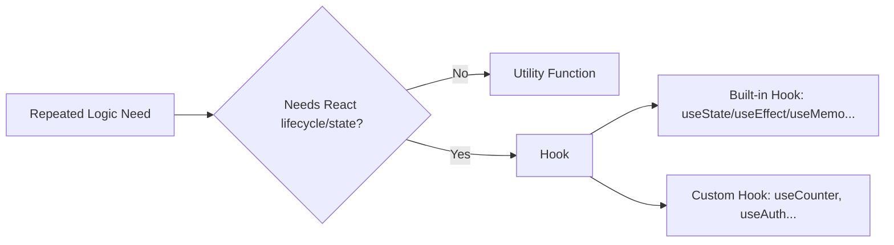
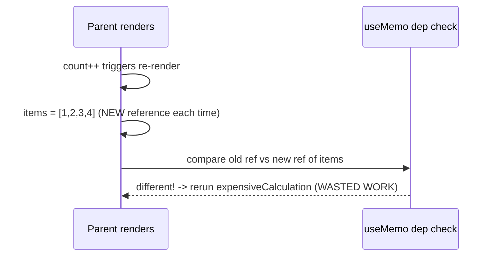
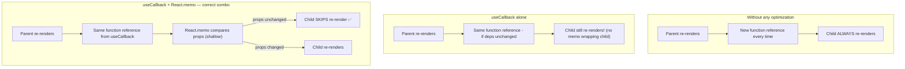
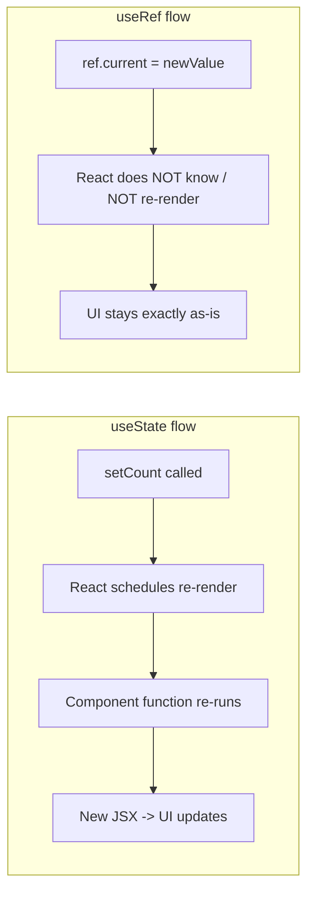
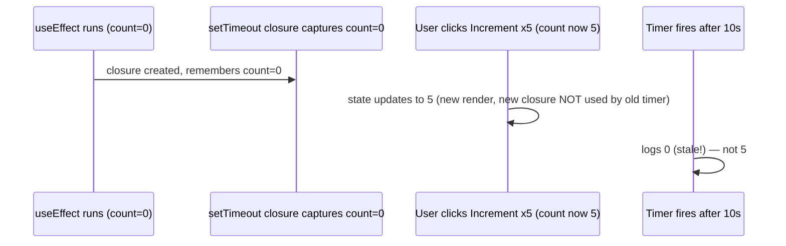
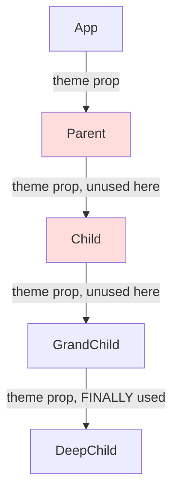
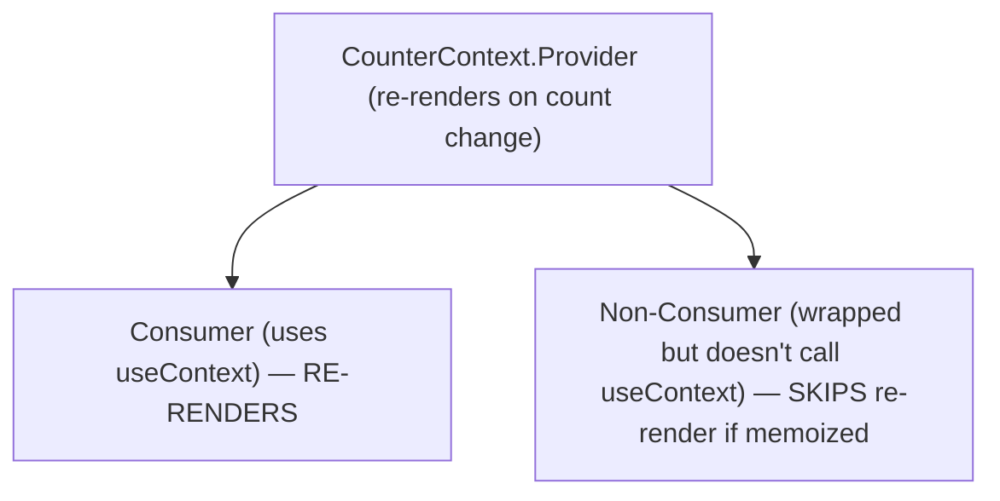
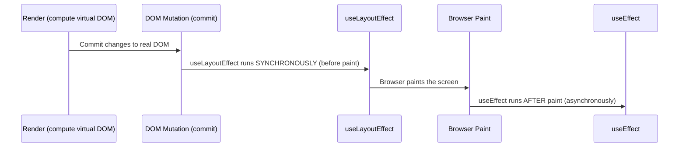

# React Hooks — Deep Dive Interview Notes
*(Staff/Senior Engineer perspective, product-company interview lens)*

---

## 0. The Big Picture: Why Hooks Exist at All

Before hooks, React had two ways to reuse logic:

| Approach | What it is | Limitation |
|---|---|---|
| **Utility functions** | Plain JS/TS functions that take input, perform an action, return output (e.g. `add(a, b)`) | No access to React's lifecycle, state, or re-render system. They are "React-blind." |
| **Class components + lifecycle methods / HOCs / render props** | Reuse via inheritance-like patterns | Verbose, causes "wrapper hell," indirection, hard to trace |

**Why hooks were introduced:** to let plain functions "hook into" React's rendering and state system — i.e., get access to state, lifecycle, context, refs — *without* needing a class.

> **Decision rule (interview-ready):** If your repeated logic only needs plain computation → **utility function**. If it needs React's lifecycle/state/rendering capabilities → **hook**.

**Four defining properties of hooks** (a very common opener in interviews):
- **Reusable** – logic can be shared across components
- **Composable** – hooks can call other hooks (you already do this: `useEffect` + `useState` together)
- **Testable** – isolated logic is easier to unit test
- **Explicit** – dependencies and data flow are visible in code, not hidden in a class hierarchy



---

## 1. `useMemo` — Memoizing a **Value**

### Why it exists
Every re-render **re-runs the entire component function**. If a component does an expensive computation inline, that computation reruns on *every* render — even if the inputs to that computation never changed.

```js
function expensiveCalculation(items) {
  console.log("running expensive calc");
  let total = 0;
  for (let i = 0; i < 1000; i++) {
    total += items.length;
  }
  return total;
}
```

### The trap almost everyone falls into (asked deliberately in interviews)
```js
// ❌ BAD - looks memoized but isn't really protected
const items = [1, 2, 3, 4];                 // new array reference every render
const total = useMemo(() => expensiveCalculation(items), [items]);
```
**Why this still re-runs the calculation on every click:** Arrays, objects, and functions are **reference types**. On every re-render, `items = [1,2,3,4]` creates a **brand-new array in memory** (different reference), even though the *values* look identical. `useMemo`'s dependency check compares by **reference**, not deep value — so it thinks `items` changed, and reruns the callback.



### The correct fix
Stabilize the reference of `items` itself, either with `useState`/`useMemo`:
```js
// ✅ Option A — useState gives one stable reference for the component's lifetime
const [items] = useState([1, 2, 3, 4]);

// ✅ Option B — memoize the array creation itself, empty dep array = created once
const items = useMemo(() => [1, 2, 3, 4], []);

const total = useMemo(() => expensiveCalculation(items), [items]);
```

### How dependency comparison actually works
`useMemo` keeps the **last** dependency array in memory and does a shallow (`Object.is`) comparison against the **new** one on every render:
- If **every** entry is reference-equal (same primitive value, or same object/array/function reference) → return the **cached** value, skip the callback.
- If **any** entry differs → re-run the callback, cache the new result.

> **This comparison itself costs memory and CPU.** `useMemo` is not free — you're trading computation for memory. Overusing it can make an app *slower*, not faster.

### `useMemo` signature
```js
const memoizedValue = useMemo(() => computeExpensiveValue(a, b), [a, b]);
```
| Argument | Purpose |
|---|---|
| 1st: callback | Computes and **returns** the value to cache (don't forget `return`!) |
| 2nd: dependency array | List of values that, when changed by reference/value, trigger recomputation |

### When to use
- Genuinely expensive computation: large-array filter/reduce/sort, derived data from big datasets
- Preventing an object/array from getting a new reference every render (so it doesn't cascade re-renders to memoized children or trigger other hooks' dependency arrays)

### When NOT to use
- Cheap/simple expressions (`a + b`, string concatenation) — the memoization bookkeeping costs *more* than just recomputing
- "Just in case" / blanket wrapping everything

### Why (product-company angle)
> **Senior engineer framing:** Don't *architect* around `useMemo`. If your component design requires heavy client-side computation to begin with, that's usually a sign the computation belongs on the backend, or your architecture is too complex. `useMemo` is a **targeted fix for a measured problem**, not a default coding habit. Also flagged in the session: GenAI code-gen tools (Copilot/Cursor/etc.) have a habit of sprinkling `useMemo`/`useCallback` everywhere — a senior reviewer should push back and ask "is this actually needed?"

---

## 2. `useCallback` — Memoizing a **Function Reference**

### Why it exists
Functions are reference types too. Every re-render creates a **new function object**, even if the function's logic is identical.

```js
function Parent() {
  const [count, setCount] = useState(0);

  // ❌ New function reference on every Parent render
  const handleClick = () => console.log("clicked");

  return <Child onClick={handleClick} />;
}
```

`useCallback` caches the function **reference** itself:
```js
const handleClick = useCallback(() => {
  console.log("clicked");
}, [dependencies]);
```
Same two-argument shape as `useMemo`: `(callback, dependencyArray)`.

### The critical interview trap: `useCallback` alone does NOT stop re-renders
This is one of the most commonly *mis-answered* interview questions.

> **"By default, whenever a parent re-renders, the child re-renders too — no matter what prop it receives."** This is React's default behavior regardless of `useCallback`.

`useCallback` only guarantees: *"as long as dependencies don't change, you get back the same function reference."* It does **nothing** to stop the child from re-rendering by itself.

**To actually prevent unnecessary child re-renders, you need the *combination*:**



```js
const Child = React.memo(function Child({ onClick }) {
  console.log("child rendered");
  return <button onClick={onClick}>Click</button>;
});

function Parent() {
  const [count, setCount] = useState(0);
  const handleClick = useCallback(() => console.log("clicked"), []); // stable ref
  return (
    <>
      <button onClick={() => setCount(c => c + 1)}>Increment</button>
      <Child onClick={handleClick} /> {/* now SKIPS re-render on count change */}
    </>
  );
}
```

> **Interview gold line:** *"`useCallback` stabilizes the function reference; it does not prevent re-rendering by itself. Re-rendering prevention happens because `React.memo` on the child sees that its props (including the now-stable function reference) haven't changed."*

### `useCallback` vs `useMemo` — the classic confusion
| | `useMemo` | `useCallback` |
|---|---|---|
| Returns | A **memoized value** (result of calling the function) | A **memoized function reference** (the function itself, uncalled) |
| Mental model | "Cache what this computation returns" | "Cache this function so it doesn't get recreated" |
| Typical use | Expensive derived data | Stable callbacks passed to memoized children |

> `useCallback(fn, deps)` is essentially equivalent to `useMemo(() => fn, deps)`.

### Legitimate standalone use of `useCallback` (without `React.memo`)
Asked in the session: *"Is there ever a reason to use `useCallback` without pairing it with `React.memo`?"*
**Yes** — if a function reference is used inside **another hook's dependency array** (e.g. a `useEffect` that depends on this function), an unintentionally-changing reference will cause that effect to re-run every render. Stabilizing the reference here has value even with no child component involved.

### `React.memo` — needed to complete the picture
- `React.memo` is a **Higher-Order Component (HOC)**, **not a hook**. (Frequently mixed up with `useMemo` — a favorite "gotcha" interview question.)
- It wraps an **entire component** and skips re-rendering unless the **props** (shallow-compared) have changed.

| | `useMemo` | `React.memo` |
|---|---|---|
| What it memoizes | A value | A component |
| Type | Hook | Higher-order component |
| Prevents | Expensive recalculation | Unnecessary component re-render |

### When to actually use `React.memo`
- Prop is a **large/heavy object**, or expensive to construct
- The component itself does non-trivial rendering work
- **Not** worth it for trivial props (e.g., just logging a primitive value) — the memo comparison overhead can exceed the savings

### Why (judicious use — repeated theme in the session)
> Re-rendering is *not* the same as updating the real DOM. Re-rendering only builds a **virtual DOM** — React's diffing/reconciliation (and the Fiber architecture) decides what actually needs to touch the real DOM, and can batch/pause/resume this work. **Re-rendering is comparatively cheap; memoization is comparatively expensive** (it consumes memory to store previous references/values for comparison). So: *optimize only measured, real bottlenecks* — don't sprinkle `useMemo`/`useCallback`/`React.memo` defensively.

---

## 3. `useRef` — Persistent, Mutable, Non-Rendering Storage

### Why it exists
Sometimes you need a value that:
1. **Persists** across re-renders (unlike a normal `let x = ...` inside the component, which resets every render), **and**
2. **Does NOT** need to trigger a re-render when it changes.

```js
function Demo() {
  const normalValue = Math.random();          // ❌ new value every render
  const refValue = useRef(Math.random());      // ✅ same value across renders
}
```

### `useRef` vs `useState` — the core distinction (very high-frequency interview question)

| | `useState` | `useRef` |
|---|---|---|
| Triggers re-render on update? | ✅ Yes | ❌ No |
| Persists value across renders? | ✅ Yes | ✅ Yes |
| Mutation style | Immutable-ish; must go through setter | Directly mutable: `ref.current = x` |
| Primary purpose | Drive the UI | Internal bookkeeping / imperative access |



### Classic proof-by-demo (asked as a code-trace question)
```js
const refCount = useRef(0);
const [stateCount, setStateCount] = useState(0);

const incrementRef = () => { refCount.current += 1; };     // UI doesn't change
const incrementState = () => { setStateCount(c => c + 1); }; // UI updates
```
Clicking "increment ref" silently updates `refCount.current` (verifiable only via `console.log`), while clicking "increment state" visibly updates the UI.

> **Why `useRef` is "mutable" and `useState` "isn't":** `useState`'s value can only safely change through its setter (which also triggers a re-render). `useRef.current` can be reassigned directly at any time with zero React involvement — because React was never asked to "watch" it.

### When to use `useRef`
- Storing **mutable values** that shouldn't affect rendering: timers/interval IDs, flags (e.g., "has this API call already fired?"), counters used only internally
- Storing the **previous value** of a prop/state (common pattern combined with `useEffect`)
- **DOM access** — e.g., auto-focusing an input field when a form opens (a very common but *secondary* use case; DOM access is not *why* `useRef` was invented, it's just its most visible everyday use)

### When NOT to use `useRef`
- Anything that should visibly affect the UI on change → use `useState`
- Replacing `useState` "just because it avoids re-renders" — if the UI needs to reflect the value, you *need* the re-render

### Common mistake (interview red flag)
```js
ref.current = newValue;   // React has no idea this happened.
// No re-render, no effect triggered — do NOT expect the UI to update.
```

### Why not use `useState` for "previous value" tracking?
This is a subtle but important design question from the session:

```js
// Naive attempt using useState for "previous value"
useEffect(() => {
  setPreviousCount(count);   // ❌ causes an EXTRA re-render every time count changes
}, [count]);
```
Flow: `count changes → re-render → useEffect runs → setPreviousCount → re-render AGAIN`.

```js
// Correct: useRef, no extra re-render
const previousCountRef = useRef(null);
useEffect(() => {
  previousCountRef.current = count;   // updates silently, no re-render
}, [count]);
```
Flow: `count changes → re-render → useEffect runs → ref updated → done (no extra render)`.

> **Why this matters:** if the "previous value" is purely for internal computation and not meant to independently drive the UI, forcing a second render via `useState` is wasted work.

---

## 4. `useRef` and the "Stale Closure" Problem

### The problem
```js
useEffect(() => {
  const timer = setTimeout(() => {
    console.log(count); // will log the count value AT THE TIME the effect ran, not the latest one!
  }, 10000);
}, []);
```
**Why:** `setTimeout`'s callback forms a **closure** over `count` as it existed at the moment `useEffect` ran (e.g., `count === 0`). Even if the user clicks "increment" ten times during those 10 seconds, the closure still references the old, stale `count = 0` — because a *new* closure (with an updated `count`) is never created; the old one is just waiting to fire.



### The fix using `useRef`
```js
const countRef = useRef(count);

useEffect(() => {
  countRef.current = count;   // ref is kept "live" / always up to date
}, [count]);

useEffect(() => {
  const timer = setTimeout(() => {
    console.log(countRef.current); // ✅ always reads the LATEST value
  }, 10000);
}, []);
```
**Why this works:** instead of closing over a primitive value (which is frozen at closure-creation time), the timer closes over the **ref object** (whose `.current` property can keep changing). The reference to the ref object never changes, but what it *points to* does.

> **Interview framing:** "This is a stale-closure bug. Fixing it by adding `count` to the effect's dependency array works but creates a **new timer on every render** (multiple stray timers). The idiomatic fix is a `useRef` that's kept in sync, so the async callback always reads the latest value through one stable reference."

---

## 5. `useContext` — Avoiding Prop Drilling

### The problem it solves: prop drilling
```
App → Parent → Child → GrandChild → DeepChild (needs `theme`)
```
Without context, `theme` must be manually passed as a prop through **every intermediate component**, even ones that don't use it themselves — just to relay it downward.



### Mental model
Context = a **Provider/Consumer** value channel — think of it like a shared pipe/PubSub: a **Provider** publishes a value; any **Consumer** nested underneath can subscribe to and read it, without any explicit prop passing at each level.

```js
const CounterContext = React.createContext();

function App() {
  const [count, setCount] = useState(0);
  return (
    <CounterContext.Provider value={count}>
      <Display />                {/* has access, whether it uses it or not */}
    </CounterContext.Provider>
  );
}

function Display() {
  const count = useContext(CounterContext); // consumes the value
  return <div>{count}</div>;
}
```

**Important nuance:** being *inside* a Provider doesn't force a component to *consume* the value — access and consumption are different things. Only components that actually call `useContext(...)` re-render when the value changes.

### The re-render gotcha (heavily emphasized in the session)
> **"Every consumer re-renders when the context value reference changes — even if the specific piece of data they care about didn't actually change for them."**

```js
// ❌ New object reference every render — even if the values look the same
<ThemeContext.Provider value={{ theme: "dark" }}>
```
Every render of the Provider creates a **new object literal**, so all consumers re-render, regardless of whether `theme` actually changed.

**Fix:** memoize the value passed to the Provider.
```js
const themeValue = useMemo(() => ({ theme: "dark" }), []);
<ThemeContext.Provider value={themeValue}>
```

### Consumer vs Non-consumer re-render behavior

- A component that is *inside* the Provider tree but does **not** call `useContext` is unaffected by context value changes (assuming it's otherwise memoized/doesn't depend on re-rendering parent).
- A component that **does** consume the context value will re-render **every time that value's reference changes** — even for context data it doesn't functionally care about, if the whole context object changes together.

### Why context is "reactive"
> **Reactive = automatically responds when something changes**, without explicit instruction each time (unlike props, which are explicitly passed by the parent every render). If you don't want that automatic/implicit re-render propagation, `useContext` is the wrong tool.

### `useContext` vs Redux / centralized state management (top-tier interview question)
| | `useContext` | Redux / centralized store |
|---|---|---|
| Purpose | Avoid prop drilling | Centralized, scalable state management |
| Re-render granularity | **All consumers** re-render when value changes | **Only components subscribed to the specific changed slice** re-render |
| Suited for | Small, mostly-static shared data (theme, locale, auth user) | Large-scale, high-frequency, complex state |
| Debuggability | Harder — value can be provided from many places | Easier — single source of truth, predictable dispatch flow |

> **The single most important line to remember:** *"`useContext` is not a replacement for a state management library. It exists purely to solve prop drilling — passing values down efficiently. It is not a performance optimization; it's a data-access simplification."*

### When to use `useContext`
- App-wide, relatively static values: theme, locale/language, authenticated user info
- You genuinely don't know how deep the consuming component might be, or expect the tree to grow

### When NOT to use `useContext`
- Frequently-changing / high-frequency-update state
- Large, complex, deeply interrelated state
- Performance-critical state where fine-grained re-render control matters

### The "should I use Context here?" architecture question
Given a shallow tree (e.g., only 4 levels deep) needing one value:
> **If you know the depth and it's shallow, prop drilling is often *fine* and actually **cheaper** than setting up a Context (Provider/Consumer, PubSub machinery) — reserve Context for cases where the depth is unknown/variable or the value needs to reach many unrelated branches of the tree.**

---

## 6. Custom Hooks

### Definition
> A custom hook is a **plain JavaScript function** that uses one or more built-in React hooks to **encapsulate reusable stateful logic**.

### What a custom hook is NOT
- Not a component (though technically you *can* return JSX from one — not recommended; it blurs "logic" vs "UI" responsibilities)
- Not primarily meant for rendering UI — its job is behavior/logic extraction

### Why custom hooks exist
Before hooks, sharing stateful logic across components required **Higher-Order Components** or **render props**, both of which, at scale, caused:
- **"Wrapper hell"** — deeply nested component trees just for logic composition
- **Indirection** — hard to trace where a prop/behavior actually comes from

### The naming rule: must start with `use`
```js
function useCounter(initialValue = 0) { ... }   // ✅
function counterLogic(initialValue = 0) { ... } // ❌ works technically, but breaks tooling
```
**Why this matters (not just style):** React's **ESLint rules for hooks** (`eslint-plugin-react-hooks`) detect hook usage *by the `use` prefix*. If you don't prefix with `use`, the linter can't identify your function as a hook and won't enforce the **Rules of Hooks** (no hooks in loops/conditions/nested functions) on it — silently allowing bugs that the linter would otherwise catch.

### Example: `useCounter`
```js
function useCounter(initialValue = 0) {
  const [count, setCount] = useState(initialValue);
  const increment = () => setCount(c => c + 1);
  const decrement = () => setCount(c => c - 1);
  return { count, increment, decrement };
}

function CounterComponent() {
  const { count, increment, decrement } = useCounter(0);
  return (
    <>
      <button onClick={decrement}>-</button>
      {count}
      <button onClick={increment}>+</button>
    </>
  );
}
```
> **State isolation:** think of a custom hook conceptually like a class — each component that calls `useCounter()` gets its **own independent instance/state**, exactly like instantiating a new object from a class. Four components each calling `useCounter()` get four completely separate counters.

### When to create a custom hook
- Logic is **shared** across 2+ components
- Complex state/side-effect management that clutters a component
- You want an **abstraction boundary** (e.g., isolate all form logic, all API-fetching logic)

### When NOT to
- Logic used in **exactly one place** with no reuse need → keep it inline; extracting it can actually make the code *harder* to follow for no benefit
  - **Caveat discussed in session:** even single-use extraction *can* be justified for **readability/maintainability** in a large, complex component (e.g., a huge form with API calls) — this is a legitimate design trade-off, not a strict rule. It doesn't meaningfully improve *performance*, but it **does** improve code review speed, onboarding, and modularity.

### Does extracting logic into a custom hook improve performance?
> **Mostly no — it's a code-organization win, not a runtime-performance win.** Marginal exception: if the same logic used to be duplicated inline across N components, consolidating into one hook can slightly reduce the number of separate function allocations React needs to track — a very minor benefit, not the primary reason to do it.

---

## 7. Higher-Order Components (HOC) vs Hooks

### Definition
> A **Higher-Order Component** is a function that **accepts a component as input** and **returns an enhanced component as output.**

```js
function withEnhancement(WrappedComponent) {
  return function Enhanced(props) {
    return <WrappedComponent {...props} extraProp="value" />;
  };
}
```

### Why this mattered historically
In **class-based components**, HOCs were the *only* mechanism available for sharing cross-cutting logic/behavior (there was no hook system yet).

### HOC vs Hook — the fundamental difference
| | HOC | Hook |
|---|---|---|
| Usable in class components? | ✅ Yes | ❌ No (hooks require function components) |
| Usable in function components? | ✅ Yes (technically, but often overkill) | ✅ Yes (the modern, recommended default) |
| Pattern | Wraps a component, returns a new component | Plain function calling other hooks |
| Common pitfall | Wrapper hell, indirection | Rules-of-hooks violations if misused |

### Decision rule
> - **Function components (modern default):** prefer hooks. There is rarely a reason to reach for a HOC.
> - **Class components (legacy code):** HOC is your only option.
> - **Technically interchangeable** in function components — React imposes no hard constraint — but hooks are the cleaner, more idiomatic choice today.
> - **If your goal is pure logic reuse** → custom hook.
> - **If your goal is more about component-level UI variation** (e.g., a Button with primary/secondary/tertiary variants) → often a plain component with a `variant` prop (internal `switch`/conditional styling) is simpler than either a HOC or a hook.

### Performance difference between HOC and Hooks?
> **No significant performance difference.** Both ultimately end up passing references around similarly. The real trade-off is code maintainability and clarity, not raw performance — akin to `for` loop vs `.reduce()`: neither is inherently "faster/better," it is a style and readability choice specific to context.

---

## 8. `useEffect` vs `useLayoutEffect` (Timing / Ordering)

### Rendering pipeline order


| | `useEffect` | `useLayoutEffect` |
|---|---|---|
| Timing | Runs **after** the browser paints | Runs **synchronously**, right after DOM mutation, **before** paint |
| Blocking? | Non-blocking (doesn't delay paint) | Blocking (delays paint until it finishes) |
| Use case | Data fetching, subscriptions, logging, most side effects | Measuring layout/DOM dimensions and synchronously adjusting before the user sees a flicker |

> **Why it matters:** if you need to measure something about the DOM (e.g., an element's size) and immediately apply a style change *before the user ever sees the unstyled version*, `useEffect` would let that unstyled frame flash on screen first (visible flicker) because it fires after paint. `useLayoutEffect` prevents that flicker by running before paint.

### Multiple `useEffect`s with the same dependency
```js
useEffect(() => { console.log("effect 1"); }, [count]);
useEffect(() => { console.log("effect 2"); }, [count]);
```
**Order guarantee:** effects run **in the order they're declared** in the component — `effect 1` always logs before `effect 2`, on every dependency change, even though effects are conceptually asynchronous relative to rendering.

---

## 9. `useState` Lazy Initializer (a genuinely tricky interview snippet)

```js
const [data, setData] = useState(() => {
  const stored = localStorage.getItem("data");
  return stored ? JSON.parse(stored) : [];
});
```

### Why pass a **function** instead of just a value?
```js
// ❌ Naive version — reads localStorage on EVERY render (wasteful),
// even though only the FIRST render's value is ever actually used as the initial state.
const [data, setData] = useState(JSON.parse(localStorage.getItem("data") || "[]"));

// ✅ Lazy initializer — the function only executes ONCE, on the initial mount.
const [data, setData] = useState(() => JSON.parse(localStorage.getItem("data") || "[]"));
```
**Why:** In the non-lazy version, the expression `JSON.parse(localStorage.getItem(...))` is evaluated on **every render** (because it's just a normal argument expression), even though React only *uses* that value on the very first render. Passing a **function** defers execution — React calls it exactly once, during initialization, and ignores it on subsequent renders.

### Is this pattern commonly used in real projects?
Discussed candidly in the session: **not very common in everyday code**, but it's a favorite "do you actually understand `useState` internals" interview trick. Equivalent, arguably simpler alternatives:
- A one-time `useEffect(() => { ... }, [])` to read and set the value once
- A module-level/global constant read once outside the component

---

## 10. Quick-Reference Comparison Tables

### Core Hooks at a Glance
| Hook | Memoizes | Triggers re-render on update? | Typical trigger for using it |
|---|---|---|---|
| `useState` | — | ✅ Yes | Value that should visibly drive UI |
| `useRef` | — | ❌ No | Value to persist without re-rendering (timers, previous values, DOM refs) |
| `useMemo` | A **value** | N/A (prevents unnecessary recompute) | Expensive derived computation |
| `useCallback` | A **function reference** | N/A (prevents unnecessary recreation) | Stable callback for memoized children / effect deps |
| `useContext` | — | ✅ Yes, for every consumer, on value change | Avoiding prop drilling for shared, relatively static data |
| `React.memo` | An entire **component** (HOC, not a hook) | Skips re-render if props unchanged | Expensive child component receiving stable/heavy props |

### "When NOT to use" cheat sheet
- **`useMemo`/`useCallback`/`React.memo`:** cheap computations, trivial props, "just in case" — all memoization has a real memory/CPU cost.
- **`useContext`:** high-frequency updates, large/complex state, perf-critical state.
- **`useRef`:** anything that must visibly update the UI.
- **Custom hooks:** logic used in exactly one place with no complexity payoff.

---

## 11. Interview Answer Templates (What a Strong Candidate Says)

**Q: "Where have you used `useMemo` in a real project?"**
> "I had a [derived list/expensive filter/aggregation] computed from a large dataset on every render. I memoized it with `useMemo`, keyed on the dataset reference, so it only recomputes when the underlying data actually changes."

**Q: "Where have you used `useCallback`?"**
> "I had a child component re-rendering unnecessarily on every parent update, which was adding noticeable overhead / increasing load time. I wrapped the child in `React.memo` and stabilized the callback prop with `useCallback` so the child only re-renders when its actual dependencies change."

**Q: "Where have you used `useRef`?"**
> "To store the previous value of a piece of state for comparison, and for focusing an input on mount — both cases where the value itself shouldn't trigger a re-render."

**Q: "Does `useCallback` prevent re-rendering?"**
> "No — by itself it only stabilizes the function reference. Re-render prevention requires pairing it with `React.memo` on the receiving child."

**Q: "Difference between `useMemo` and `React.memo`?"**
> "`useMemo` is a **hook** that memoizes a **value**. `React.memo` is a **Higher-Order Component** that memoizes an entire **component**, skipping re-render when props are unchanged (shallow comparison)."

**Q: "Is `useContext` a replacement for Redux?"**
> "No. `useContext` solves prop drilling — passing data down efficiently. Redux (or similar) is centralized state management with fine-grained subscription: only components that depend on the *specific changed slice* re-render. With Context, **every consumer of that context value re-renders** whenever the value's reference changes, regardless of whether that consumer cares about the specific part that changed."

---

## 12. Core Engineering Philosophy (repeated theme — worth internalizing)

> **"Every optimization technique comes at a cost. Use them only when they're actually needed."**

- Don't **architect** around optimization hooks — design simple, correct components first; add `useMemo`/`useCallback`/`React.memo`/`useContext` only in response to a **measured** problem.
- **Re-rendering ≠ DOM update.** React's rendering just builds a virtual DOM; the reconciler (Fiber) decides what actually needs to touch the real DOM, and can batch/interrupt/resume this work. Re-rendering is comparatively cheap — **memoization is comparatively expensive** (extra memory to store previous values/references for comparison).
- Be skeptical of AI code-generation tools defaulting to `useMemo`/`useCallback` everywhere — as a reviewer, always ask **"is this solving a real, measured problem?"**
- In interviews: **don't just demonstrate that a hook caches something.** Explain *why* it's needed, what problem it solves, and the trade-off it introduces. That's what differentiates a senior-level answer from a junior one.

---

## 13. Things Explicitly Marked "Lower Priority" for Interviews (React 19+ hooks)

Mentioned but *not* covered in depth, and explicitly called out as **rarely asked** in recent interview experience at the time of this session:
- `useActionState`
- `useTransition`
- `useFormStatus`
- `forwardRef` (not covered — flagged as a gap to explore separately)

> Worth a light read-through of the official React docs, but don't over-invest prep time here relative to the core four (`useMemo`, `useCallback`, `useRef`, `useContext`) plus custom hooks — those remain the highest-frequency interview topics.
